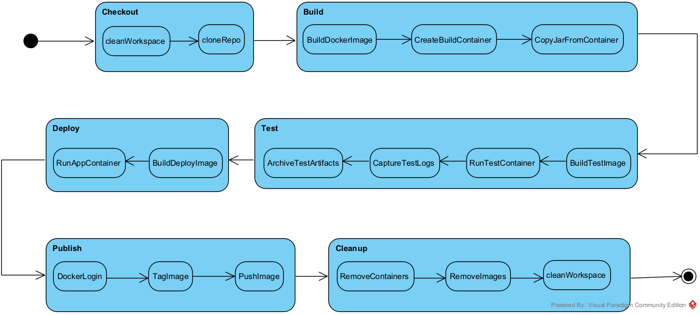
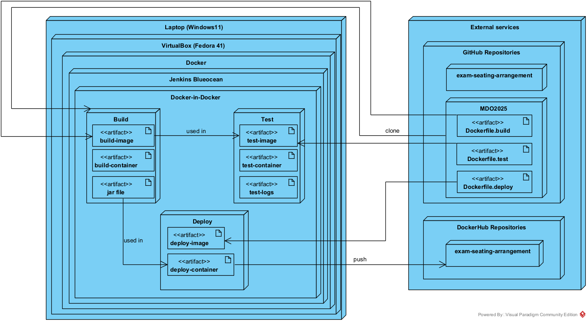
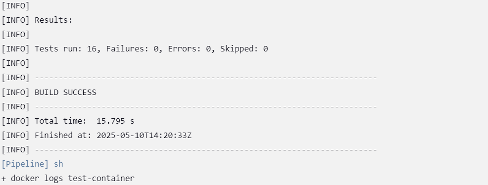
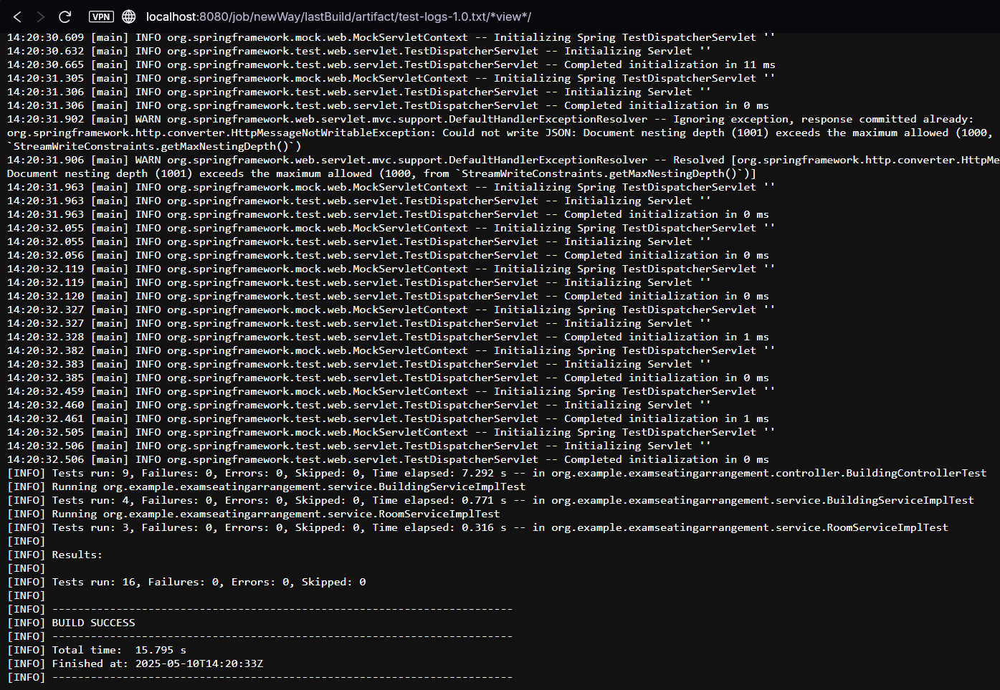
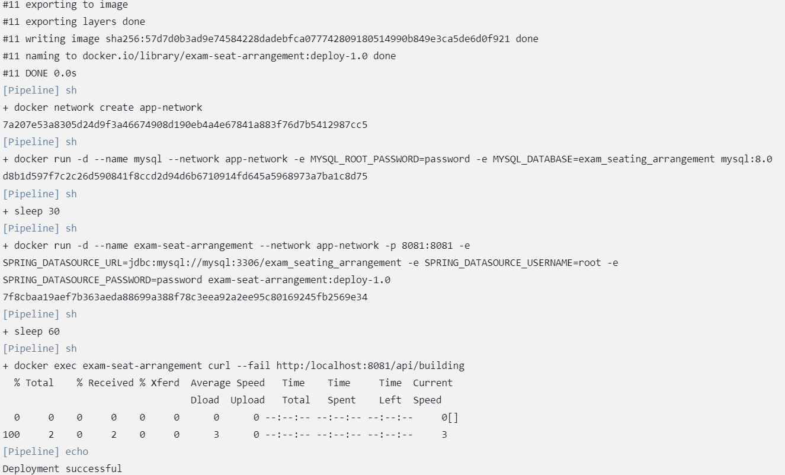
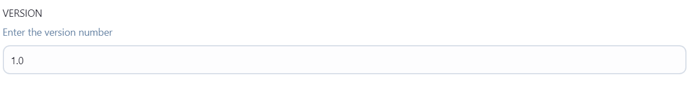

# Sprawozdanie 2
|Imię | Nazwisko | Numer indeksu | Kierunek | Grupa | Data |
| --------| -----| -----| ------| -----| ------|
|Szczepan | Kwaśny | 417309 | ITE | 4 | 31.03.2025|
## Lab 5
### Przygotowanie Jenkinsa
Po zapoznaniu się z dokumentacją Jenkinsa stworzyłem sieć 'jenkins' do komunikacji i przygotowałem obraz Blueocean na podstawie Jenkinsa oraz Docker-In-Docker, za pomocą komend zdefiniowanych w dokumentacji. Do utworzenia obrazu Blueocean, najpierw utworzyłem plik Dockerfile:
```
FROM jenkins/jenkins:2.492.3-jdk21
USER root
RUN apt-get update && apt-get install -y lsb-release ca-certificates curl && \
    install -m 0755 -d /etc/apt/keyrings && \
    curl -fsSL https://download.docker.com/linux/debian/gpg -o /etc/apt/keyrings/docker.asc && \
    chmod a+r /etc/apt/keyrings/docker.asc && \
    echo "deb [arch=$(dpkg --print-architecture) signed-by=/etc/apt/keyrings/docker.asc] \
    https://download.docker.com/linux/debian $(. /etc/os-release && echo \"$VERSION_CODENAME\") stable" \
    | tee /etc/apt/sources.list.d/docker.list > /dev/null && \
    apt-get update && apt-get install -y docker-ce-cli && \
    apt-get clean && rm -rf /var/lib/apt/lists/*
USER jenkins
RUN jenkins-plugin-cli --plugins "blueocean docker-workflow"
```
A następnie zbudowałem go komendą:
```
docker run \
  --name jenkins-blueocean \
  --restart=on-failure \
  --detach \
  --network jenkins \
  --env DOCKER_HOST=tcp://docker:2376 \
  --env DOCKER_CERT_PATH=/certs/client \
  --env DOCKER_TLS_VERIFY=1 \
  --publish 8080:8080 \
  --publish 50000:50000 \
  --volume jenkins-data:/var/jenkins_home \
  --volume jenkins-docker-certs:/certs/client:ro \
  myjenkins-blueocean:2.492.3-1 
```
* --name jenkins-blueocean  
Nadaje kontenerowi  nazwę, dzięki czemu łatwiej będzie nim zarządzać (start/stop/logs).

* --restart=on-failure  
Automatycznie restartuje kontener tylko w przypadku awarii (wyjście z kodem różnym od zera).

* --detach (-d)  
Uruchamia kontener w tle, zwracając od razu kontrolę nad terminalem.

* --network jenkins  
Dołącza kontener do stworzonej wcześniej sieci "jenkins", co umożliwia mu komunikację z kontenerem DIND.

* --env DOCKER_HOST=tcp://docker:2376  
Ustawia zmienną środowiskową wskazującą na adres demona Docker (w naszym przypadku kontener „docker” w sieci jenkins).

* --env DOCKER_CERT_PATH=/certs/client  
Wskazuje ścieżkę w kontenerze do certyfikatów TLS, używanych do bezpiecznego połączenia z demonem.

* --env DOCKER_TLS_VERIFY=1  
Włącza weryfikację certyfikatów TLS przy łączeniu z demona Dockera.

* --publish 8080:8080 (-p)  
Mapuje port 8080 wewnątrz kontenera (interfejs webowy Jenkins) na port 8080 hosta.

* --publish 50000:50000  
Mapuje port 50000 wewnątrz kontenera (port komunikacji z agentami Jenkins) na port 50000 hosta.

* --volume jenkins-data:/var/jenkins_home  
Tworzy trwały wolumen jenkins-data i montuje go jako katalog domowy Jenkins (/var/jenkins_home), co zabezpiecza dane przed utratą po restarcie kontenera.

* --volume jenkins-docker-certs:/certs/client:ro  
Montuje wolumen z certyfikatami TLS w trybie tylko do odczytu (ro), potrzebnymi do zabezpieczenia połączenia z demonem Docker.

* myjenkins-blueocean:2.492.3-1  
Nazwa obrazu, na podstawie którego uruchamiamy kontener (nasz własny build Jenkins + Blue Ocean + Docker‑in‑Docker CLI).

Kontener DIND uruchomiłem za pomocą komendy z dokumentacji:
```
docker run \
  --name jenkins-docker \
  --rm \
  --detach \
  --privileged \
  --network jenkins \
  --network-alias docker \
  --env DOCKER_TLS_CERTDIR=/certs \
  --volume jenkins-docker-certs:/certs/client \
  --volume jenkins-data:/var/jenkins_home \
  --publish 2376:2376 \
  docker:dind \
  --storage-driver overlay2
  ```
  * --publish 2376:2376  
   Mapuje port na wcześniej zdefiniowany do komunikacji z kontenerem Jenkinsa

   Po włączeniu obu kontenerów wszedłem na interfejs webowy Jenkinsa na porcie 8080:
   
   Aby się zalogować, znalazłem w logach hasło za pomocą `docker logs jenkins | grep "Initial Admin Password"`. Następnie przeprowadziłem instalację odpowiednich wtyczek i utworzyłem użytkownika.
   
   ### Zadania wstępne
   * Projekt z `uname`
    
    
   * Skrypt do zwracania błędu, jeśli godzina jest nieparzysta:
   
   
   
   * Obiektu typu pipeline bez SCM, który miał sklonować repozytorium przedmiotowe, a następnie przeprowadzić checkout do mojego pliku Dockerfile na własnej gałęzi:
   ```
   pipeline {
    agent any

    stages {
        stage('clone') {
            steps {
                sh 'rm -rf MDO2025_INO'
                sh 'git clone https://github.com/InzynieriaOprogramowaniaAGH/MDO2025_INO.git MDO2025_INO'
            }
        }
        stage('checkout') {
            steps {
                sh '''
                    cd MDO2025_INO
                    git checkout SK417309
                    cd ITE/GCL04/SK417309
                '''
            }
        }
        stage('build docker') {
            steps {
                sh '''
                    cd MDO2025_INO/ITE/GCL04/SK417309
                    docker build -f Dockerfile.build -t moj-builder .
                '''
            }
        }
    }
}
```
Aby zagwarantować czyste środowisko i powtarzalność dla tego pipeline'a, trzebo go rozpocząć od wyczyszczenia ewentualnych pozostałości w folderze, do którego pozniej kopiuje repozytorium. Następnie przeprowadzam w jednym bloku checkout na moją gałąź `SK417309` i przechodzę do folderu z Dockerfile'm do budowy mojego projektu. 


### Jenkinsfile do projektu
Następnym zadanie było przygotowanie pipeline'u do wybranego projektu. Do tego kroku wybrałem swoją aplikację napisaną w Javie (wersja 17+). Do omówienie tego puntku posłużę się listą kontrolną przygotowaną przez prowadzącego przedmiot:
* Licencja, jako iż to moja aplikacja, zezwala na korzystanie w dowolny sposób.
* Program wybrany przeze mnie buduje się, co potwierdza screen użyty w poprzednim sprawozdaniu:
  
* Przechodzą dołączone do niego testy:

* Fork w tym przypadku nie jest potrzebny, ponieważ pracuję nad własnym projektem, w osobnej gałęzi, bezpośrednio na oryginalnym repo (SK417309), zamiast kopi w innym miejscu.
* Do przedstawienia procesu CI/CD przygotowałem dwa diagramy UML - aktywności, pokazujący kolejne etapy (checkout, build, test, deploy, publish) i wdrożenia, opisujący relacje między składnikami, zasobami i artefaktami. 


* Wybrałem odpowiedni kontener bazowy zawierający wszystkie potrzebne zależności do zbudowania aplikacji - eclipse-temurin. 
* Wykonałem build wewnątrz wersjonowanego kontenera zdefiniowanego na podstawie `Dockerfile.build`. 
* Następnie w kolejnym kontenerze zbudowanym za pomocą kolejnego `Dockerfile.test`, wykonałem testy, od razu przy budowaniu dzięki wykorzystaniu komendy `RUN mvn test -B`. Początkowo, aby odseparować te dwa kontenery, w obu klonowałem repozytorium mojej aplikacji, ale to rozwiązanie zastąpiłem później bazowaniem kontenera testowego na kontenerze buildowym. Dzięki temu unika się kilkukrotnego ściągania tych samych plików.  

* Zapisywałem logi z testów w wersjonowanym artefakcie:

Dwa pierwsze etapy (build i test) przebiegały bardzo dobrze i szybko, ale problemy zaczęły się pojawiać przy próbie deploy'owania aplikacji. Moja aplikacja zawierała komunikację z bazą danych, więc w etapie deploy'u dodałem budowanie kolejnego kontenera z bazą danych na podstawie obrazu `mysql`. Zdefiniwałem do niego zmienne środowiskowe, takie jak hasło i nazwę bazy. 
* Następnie użyłem ich w budowie kontenera z gotową aplikacją. Ten kontener bazował na obrazie `eclipse-temurin:17-jre-alpine`, który jest lekką wersją wcześniej używanego kontenera i zawiera tylko podstawowe pakiety oraz Java Runtime Environment potrzebne do włączenia aplikacji opartej na JVM.   
* Aby wykonać "smoke-test" w tym kontenerze doinstowałem do niego również `curl`, które jest później używane do sprawdzenia jednego z endpoint'ów. 

* Następnym krokiem jest publikacja mojej aplikacji. By konteneryzacja przyniosła największe korzyści, zdecydowałem się na opublikowanie kontenera z aplikacją głównie w celu zapewnienia spójnego środowiska uruchomieniowego i łatwiejszej skalowalności. Dzięki wykorzystaniu kontenerów mogłem szybko przenosić działający kod między różnymi środowiskami, bez ryzyka konfliktów konfiguracyjnych. Kontenery oferują także wyraźną izolację zasobów i prostą integrację z innymi usługami, takimi jak bazy danych czy serwisy składujące logi, co znacznie ułatwia proces wdrażania i utrzymania aplikacji.

* Do wersjonowania użyłem parametru "VERSION", który wpisywałem podczas uruchomienia pipeline'a. Dzięki temu w każdej iteracji projektu jednoznacznie rozróżniane są kolejne wersje kontenera poprzez dodanie go do każdej komendy budowania obrazu, np.:   
`sh "docker build --build-arg BUILD_IMAGE=${APP_NAME}:build-${params.VERSION} -t ${APP_NAME}:test-${params.VERSION} -f Dockerfile.test . "`
* Cały pipeline:
```
pipeline {
    agent any
    
    parameters {
        booleanParam(name: 'PUBLISH', defaultValue: false, description: 'Push built image to Docker Hub')
        string(name: 'VERSION', defaultValue: '1.0', description: 'Enter the version number')
    }

    environment {
        APP_NAME = 'exam-seat-arrangement'
        BRANCH_NAME = 'SK417309'
        REPO_URL = 'https://github.com/InzynieriaOprogramowaniaAGH/MDO2025_INO.git'
        APP_REPO = 'https://github.com/sauer515/exam-seat-arrangement.git'
        DOCKER_CONTEXT ='ITE/GCL04/SK417309/Sprawozdanie2'
        DOCKER_HUB_USERNAME = 'sauer88'
    }
    
    stages {
        stage('Checkout') {
            steps {
                cleanWs()
                
                sh "git clone --single-branch --branch ${BRANCH_NAME} ${REPO_URL} ."
                
                sh 'ls -la'
                sh 'pwd'
                
                sh """
                    cd ${DOCKER_CONTEXT}
                    touch test-logs-${params.VERSION}.txt
                """
            }
        }
        
        stage('Build') {
            steps {
                dir(env.DOCKER_CONTEXT) {
                    //sh 'docker rm build-container'
                    
                    sh 'ls -la'
                    
                    sh "docker build -t ${APP_NAME}:build-${params.VERSION} -f Dockerfile.build . "
                    
                    sh "docker create --name build-container ${APP_NAME}:build-${params.VERSION}"
                    
                    sh 'docker exec build-container ls -la /app/target/ || true'
                    
                    sh 'docker cp build-container:/app/target/exam-seating-arrangement-0.0.1-SNAPSHOT.jar app.jar'
                    
                    // Verify the JAR exists
                    sh 'ls -la app.jar'
                }
            }
        }
        
        stage('Test') {
            steps {
                dir(env.DOCKER_CONTEXT) {
                    // Run tests in a container
                    sh "docker build --build-arg BUILD_IMAGE=${APP_NAME}:build-${params.VERSION} -t ${APP_NAME}:test-${params.VERSION} -f Dockerfile.test . "
                    sh "docker run --name test-container ${APP_NAME}:test-${params.VERSION}"
                    
                    // Get the logs from test container
                    sh "docker logs test-container > test-logs-${params.VERSION}.txt"
                    
                    // Archive test logs as artifacts
                    archiveArtifacts artifacts: "test-logs-${params.VERSION}.txt", allowEmptyArchive: true
                    
                    // Clean up container
                    sh 'docker rm test-container'
                }
            }
        }
        
        stage('Deploy') {
            steps {
                dir(env.DOCKER_CONTEXT) {
                    writeFile file: 'health-check.sh', text: readFile('health-check.sh')
                    sh 'chmod +x health-check.sh'
                    
                    sh "docker build -t ${APP_NAME}:deploy-${params.VERSION} -f Dockerfile.deploy ."
                    
                    // Set up the MySQL database container
                    sh 'docker network create app-network || true'
                    sh 'docker run -d --name mysql --network app-network -e MYSQL_ROOT_PASSWORD=password -e MYSQL_DATABASE=exam_seating_arrangement mysql:8.0'
                    
                    sh 'sleep 30'
                    
                    // Run the application container
                    sh "docker run -d --name ${APP_NAME} --network app-network -p 8081:8081 -e SPRING_DATASOURCE_URL=jdbc:mysql://mysql:3306/exam_seating_arrangement -e SPRING_DATASOURCE_USERNAME=root -e SPRING_DATASOURCE_PASSWORD=password ${APP_NAME}:deploy-${params.VERSION}"
                    
                    sh 'sleep 60'
                    
                    sh 'docker exec ${APP_NAME} curl --fail http:/localhost:8081/api/building || (docker logs ${APP_NAME} && exit 1)'
                    
                    echo "Deployment successful"
                }
            }
        }
        
        stage('Publish') {
            when { expression { params.PUBLISH } }
            steps {
                script {
                    withCredentials([usernamePassword(credentialsId: 'docker_hub', usernameVariable: 'DOCKER_HUB_USERNAME', passwordVariable: 'DOCKER_HUB_PASSWORD')]) {
                        sh 'echo "$DOCKER_HUB_PASSWORD" | docker login -u "$DOCKER_HUB_USERNAME" --password-stdin'
                
                        sh "docker tag ${APP_NAME}:deploy-${params.VERSION} $DOCKER_HUB_USERNAME/${APP_NAME}:latest"
                        sh "docker push $DOCKER_HUB_USERNAME/${APP_NAME}:latest"
                    }
                }
            }
        }
    }
    
    post {
        always {
            // Clean up containers
            sh 'docker rm -f ${APP_NAME} mysql || true'
            sh 'docker rm build-container'
            sh 'docker network rm app-network || true'
            
            // Clean up images
            sh "docker rmi ${APP_NAME}:build-${params.VERSION} ${APP_NAME}:test-${params.VERSION} ${APP_NAME}:deploy-${params.VERSION} ${DOCKER_HUB_USERNAME}/${APP_NAME}:latest || true"
            
            // Clean workspace
            cleanWs()
        }
    }
}
```
Porównując końcowy proces CI/CD, największą różnicą jest dodanie całkowicie nowego kontenera z bazą danych, którego nie zakładałem podczas przygotowywania diagramów, ze względu na błędne zdefiniowanie działającej aplikacji do deploya. Oprócz tego dodałem również warunek na podstawie "boolean parameter", który ustala się przed rozpoczęciem pipeline'a. Na diagramie aktywności przed etapem "publish" powininen znaleźć się węzeł decyzyjny, który określa jak zachowa się pipeline.
