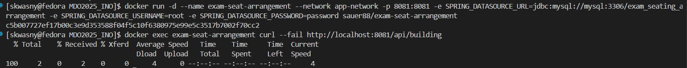

# Sprawozdanie 3
|Imię | Nazwisko | Numer indeksu | Kierunek | Grupa | Data |
| --------| -----| -----| ------| -----| ------|
|Szczepan | Kwaśny | 417309 | ITE | 4 | 30.05.2025|
# Lab 8
## Utworzenie maszyny docelowej
W pierwszym kroku utworzyłem drugą maszynę wirtualną, której celem będzie pełnienie roli zdalnego węzła (tzw. endpointu) w środowisku orkiestracyjnym. W celu zmniejszenia zużycia zasobów, maszyna została zainstalowana z minimalnym zestawem oprogramowania, ograniczając się jedynie do niezbędnych składników takich jak tar oraz openssh-server (sshd).

Podczas instalacji ustawiłem nazwę hosta maszyny jako ansible-target, a także utworzyłem użytkownika o nazwie ansible, który będzie wykorzystywany przez Ansible do nawiązywania połączeń i wykonywania zadań na tej maszynie.

Po zakończeniu instalacji wykonałem migawkę maszyny, co stanowi dobrą praktykę umożliwiającą szybki powrót do stabilnego stanu systemu w przypadku niepowodzenia dalszych kroków.
## Przygotowanie środowiska
Na maszynie pełniącej rolę „dyrygenta” zainstalowałem oprogramowanie Ansible. Instalacja została wykonana za pomocą menedżera pakietów systemu operacyjnego, co gwarantuje stabilność i kompatybilność pakietów z aktualną wersją systemu.

## Wymiana kluczy SSH
Aby umożliwić Ansible logowanie się na maszynę ansible-target, dokonałem wymiany kluczy SSH. Dzięki temu możliwe jest nawiązywanie połączenia SSH z użytkownikiem ansible bez potrzeby wpisywania hasła, co jest kluczowe w kontekście automatyzacji zadań.

## Komunikacja między maszynami
Aby uniknąć używania adresów IP do komunikacji między maszynami, skonfigurowałem odpowiednie wpisy w pliku /etc/hosts. Dzięki temu możliwe jest stosowanie czytelnych nazw zamiast numerów IP w playbookach i inwentaryzacji.


## Tworzenie inventory
Następnie przygotowałem plik inwentaryzacji Ansible (inventory.ini), który definiuje strukturę środowiska. Plik zawiera dwie grupy: Orchestrators, w której znajduje się maszyna główna (dyrygent), oraz Endpoints, zawierającą zdalne maszyny.

## Testowanie łączności – komenda ping
Aby upewnić się, że Ansible może poprawnie komunikować się ze wszystkimi maszynami, wykonałem polecenie ping w kontekście Ansible:
ansible Endpoints -i inventory.ini -m ping
Polecenie to nie jest tradycyjnym „pingiem” ICMP, ale wykorzystuje SSH do nawiązania połączenia i uruchomienia na zdalnej maszynie modułu ping, który zwraca "pong" w przypadku sukcesu.

## Ansible Playbook
Następnie rozpocząłem przygotowanie playbook'ów, do wykonania podanych zadań, które podzieliłem następująco:
### Ping and Copy Playbook
Pierwszy z nich wykonuje ping do wszystkich zdalnych maszyn oraz kopiuje do nich plik inwentaryzacyjny.
```
---
- name: Ping all hosts and copy inventory
  hosts: Endpoints
  become: yes

  tasks:
    - name: Test SSH connectivity with ping
      ansible.builtin.ping:

    - name: Copy inventory file to remote hosts
      ansible.builtin.copy:
        src: ./inventory.ini
        dest: /home/ansible/inventory.ini
        owner: ansible
        group: ansible
        mode: '0644'

```
 
Przy próbie wykonania playbook'ów dostałem błędy, które informowały, że playbook próbuje użyć sudo do operacji takich jak np. `dnf update`. Aby naprawić ten problem dodałem użytkownika `ansible` do grupy `sudoers` z opcją `NOPASSWD`, co w środowisku produkcyjnym bardzo zwiększałoby ryzyko bezpieczeństwa, ale zdecydowałem się na to, żeby przyspieszyć naukę i realizację zadań. W normalnych warunkach wybrałbym użycie `become` z hasłem przechowywanym w `ansible-vault` lub ograniczył uprawnienia użytkownika `ansible` na takie, które są potrzebne.
### Update and Restart Playbook
Kolejny playbook aktualizuje pakiety i restartuje usługi: `ssh` oraz `rngd`. Aby zaaktulizować pakiety, zapytałem ChatGPT jak wygląda składnia do wbudowanego pakietu ansible'a `dnf` i dowiedziałem się, że aby zrobić to odpowiednio, taki playbook musi również najpierw wyczyścić cache, później zainstalować pakiety i usunąć stare, więc zawarłem takie kroki w playbook'u. Początkowo nie miałem zainstalowanych serwisów `rngd` w moich zdalnych maszynach, więc je doinstalowałem.
```
---
- name: Update packages and restart services
  hosts: Endpoints
  become: yes

  tasks:
    - name: Clean dnf cache
      ansible.builtin.dnf:
        update_cache: yes

    - name: Update all packages
      ansible.builtin.dnf:
        name: '*'
        state: latest

    - name: Remove unnecessary packages
      ansible.builtin.dnf:
        autoremove: yes

    - name: Ensure sshd is running
      ansible.builtin.service:
        name: sshd
        state: restarted
        enabled: true

    - name: Ensure rngd is running
      ansible.builtin.service:
        name: rngd
        state: restarted
        enabled: true
      ignore_errors: yes

```

### Deploy Container Playbook
Następny playbook miał za zadanie uruchomić opublikowany przeze mnie artefakt, który powstał przy użyciu `pipeline'a` z poprzednich zajęć. W moim przypadku była to aplikacja Springowa napisana w Javie, która potrzebuje dostępu do bazy danych MySQL, aby poprawnie się uruchomić. Poniżej przedstawiam komplenty playbook do uruchomienia mojego kontenera.
```
---
- name: Deploy Spring Boot App with MySQL using Docker
  hosts: Endpoints
  become: yes
  vars:
    app_image: "sauer88/exam-seat-arrangement"
    mysql_root_password: "rootpassword123"
    mysql_database: "exam_db"
    mysql_user: "app_user"
    mysql_password: "app_password123"
    app_port: "8080"
    mysql_port: "3306"
    docker_network: "app-network"

  tasks:
    - name: Update dnf package index
      dnf:
        update_cache: yes

    - name: Install required packages for Docker
      dnf:
        name:
          - dnf-plugins-core
          - curl
          - ca-certificates
        state: present

    - name: Add Docker repository
      yum_repository:
        name: docker-ce
        description: Docker CE Stable - $basearch
        baseurl: https://download.docker.com/linux/fedora/$releasever/$basearch/stable
        enabled: yes
        gpgcheck: yes
        gpgkey: https://download.docker.com/linux/fedora/gpg

    - name: Install Docker
      dnf:
        name:
          - docker-ce
          - docker-ce-cli
          - containerd.io
          - docker-compose-plugin
        state: present

    - name: Start and enable Docker service
      systemd:
        name: docker
        state: started
        enabled: yes

    - name: Install Python Docker library
      dnf:
        name: 
          - python3-pip
        state: present

    - name: Create Docker network
      docker_network:
        name: "{{ docker_network }}"
        state: present

    - name: Pull MySQL Docker image
      docker_image:
        name: mysql:8.0
        source: pull

    - name: Pull Spring Boot application image
      docker_image:
        name: "{{ app_image }}"
        source: pull

    - name: Create MySQL container
      docker_container:
        name: mysql-db
        image: mysql:8.0
        state: started
        restart_policy: always
        networks:
          - name: "{{ docker_network }}"
        ports:
          - "{{ mysql_port }}:3306"
        env:
          MYSQL_ROOT_PASSWORD: "{{ mysql_root_password }}"
          MYSQL_DATABASE: "{{ mysql_database }}"
          MYSQL_USER: "{{ mysql_user }}"
          MYSQL_PASSWORD: "{{ mysql_password }}"
        volumes:
          - mysql_data:/var/lib/mysql

    - name: Wait for MySQL to be ready
      wait_for:
        port: "{{ mysql_port }}"
        host: localhost
        delay: 30
        timeout: 60

    - name: Create Spring Boot application container
      docker_container:
        name: spring-app
        image: "{{ app_image }}"
        state: started
        restart_policy: always
        networks:
          - name: "{{ docker_network }}"
        ports:
          - "{{ app_port }}:8080"
        env:
          SPRING_DATASOURCE_URL: "jdbc:mysql://mysql-db:3306/{{ mysql_database }}"
          SPRING_DATASOURCE_USERNAME: "{{ mysql_user }}"
          SPRING_DATASOURCE_PASSWORD: "{{ mysql_password }}"
          SPRING_JPA_HIBERNATE_DDL_AUTO: "update"
          SPRING_JPA_DATABASE_PLATFORM: "org.hibernate.dialect.MySQL8Dialect"

    - name: Create Docker volume for MySQL data persistence
      docker_volume:
        name: mysql_data
        state: present

    - name: Display application status
      debug:
        msg: 
          - "Spring Boot application is running on port {{ app_port }}"
          - "MySQL database is running on port {{ mysql_port }}"
          - "Application URL: http://{{ ansible_default_ipv4.address }}:{{ app_port }}"

  handlers:
    - name: restart docker
      systemd:
        name: docker
        state: restarted
```
Podczas uruchamiania tego playbook'u, napotkałem wiele różnych problemów, przez co musiałem uruchomić go kilka razy. Aby pokazać, że sam playbook instalował pakiety i Docker'a na zdalnych maszynach podzieliłem zrzut ekranu z rezultatu na 3 części:


### Galaxy Roles
Ostatnim puntkem do zreazlizowania było użycie `galaxy roles` do zarządzania playbook'iem. Aby to osiągnąć podzieliłem przygotowanie mojej aplikacji na 3 kroki - `docker setup`, `mysql container` i `spring-app`. Każdy z tych 3 kroków został rolą w playbook'u. Przygotowałem 3 foldery dla każdej z ról i ich części zostały wrzucone do folderu `tasks`, a informacje o roli do folderu `meta`. W roli `docker setup` dodałem również `handlers`, który restartuje dockera. Samą strukturę folderów skopiowałem z dokumentacji ansible'a, ale nie do końca wiedziałem jak je dobrze wykorzystać oprócz zastosowań tasks, meta i handlers, więc zostawiłem tylko te, które uznałem za potrzebne.


# Lab 9
## Przygotowanie pliku odpowiedzi
Z maszyny wirtualnej z poprzednich zajęć zlokalizowałem i skopiowałem jako administrator plik odpowiedzi `anaconda-ks.cfg`, który powstaje przy konfigurowaniu systemu Fedora. W pliku dodałem repozytoria, które będą używane do wskazania instalatorowi skąd ma pobierać dodatkowe składniki systemowe. Zmieniłem również domyślny `hostname` na `kickstart`. Gotowy plik `anaconda-ks.cfg` wykorzystany do pierwszej instalacji:
```
# Generated by Anaconda 41.35
# Generated by pykickstart v3.58
#version=DEVEL

# Keyboard layouts
keyboard --vckeymap=pl --xlayouts='pl'
# System language
lang pl_PL.UTF-8

# Repository
url --mirrorlist=http://mirrors.fedoraproject.org/mirrorlist?repo=fedora-39&arch=x86_64
repo --name=update --mirrorlist=http://mirrors.fedoraproject.org/mirrorlist?repo=updates-released-f39&arch=x86_64

%packages
@^custom-environment

%end

# Run the Setup Agent on first boot
firstboot --enable

# Generated using Blivet version 3.11.0
ignoredisk --only-use=sda
autopart
# Partition clearing information
clearpart --none --initlabel

# System timezone
timezone Europe/Warsaw --utc

# Root password
rootpw --iscrypted --allow-ssh $y$j9T$askU93gHDIYO2y8RyB.MKPPD$W7JpUDFHWnktkWJWjUrmPSqvZ0HS1Aw6fdO/.fIqz55
user --groups=wheel --name=skwasny --password=$y$j9T$y/ljs73eWbJeYh62swN9.Pbt$/axoHX56WzlN.j7Vq1J8Vz.hkyO2X87s1Ct47/32USB --iscrypted --gecos="Szczepan Kwaśny"
```
Ten plik dodałem na swojego GitHub'a i skopiowałem link do czystej wersji tesktu, który następnie skróciłem przy użyciu TinyUrl.   
Podczas instalacji systemu na nowej maszynie, w menu instalacyjnym edytowałem parametry instalatora GRUB:

Następnie dostałem ekran z potwierdzenia wykorzystania pliku odpowiedzi:


## Rozszerzenie pliku odpowiedzi
W kolejnym kroku rozszerzyłem plik anaconda-ks.cfg, dodając `reboot` — aby system automatycznie uruchomił się ponownie po zakończeniu instalacji. Drugim etapem tego kroku było uruchomienie aplikacji, która powstała przy użyciu pipeline'a. W moim przypadku to obraz aplikacji Springowej (REST API) napisanej w Javie, która potrzebuje dostępu do bazy danych. Aby móc wdrożyć ją na nowej instalacji, w pliku odpowiedzi dodałem składniki dla `docker'a` oraz `curl` do sprawdzenia działania aplikacji. Cały proces uruchomienia kontenerów ubrałem w `docker-compose`, więc to również dodałem do składników. W pliku odpowiedzi dodałem pobranie obrazów dla bazy danych MySQL oraz obrazu mojej aplikacji oraz zdefiniowałem skrypty: do poczekania na przygotowanie bazy danych i do zarządzania każdym procesem, który uruchamia się podczas instalacji systemu. Aby upewnić się, że aplikacja uruchomi się po pierwszym boot'cie, zarajestrowałem usługę systemd, która uruchamia kontner. Takie rozwiązanie podpowiedział mi Chat GPT.


# Lab 10
## Przygotowanie minikube'a
Pobrałem na głównej maszynie implementacje stosu Kubernetes - `minikube` i go uruchomiłem.

Następnie zaopatrzyłem się w alias `kubectl`, który skracał zapis `minikube kubectl --` za pomocą komendy: `alias kubectl="minikube kubectl --"`.
Uruchomiłem dashboard lokalnie przez tunel SSH z automatycznie otwartą przeglądarką. Dashboard graficznie pokazuje stan węzła i działających zasobów.


## Przygotowanie kontenera
Następnym krokiem było przygotowanie mojej aplikajci, która powstała przy użyciu pipeline'a do wdrożenia w chmurze. Pobrałem lokalnie obraz swojej aplikacji z DockerHuba. Aby moja aplikacja uruchomiła się bez błędu, musiałem najpierw przygotować bazę danych MySQL. Sprawdziłem czy kontener działa poprawnie:

## Uruchomienie kontenera w chmurze
Dla wygody do uruchomienia podów z aplikacją i bazą danych, przygotowałem pliki wdrożeniowe .yaml, w których mogłem spokojnie wpisać wszystkie zmienne środowiskowe do uruchomienia aplikacji oraz zdefiniować `service`, do którego podłącza się moja aplikacja. Następnie uruchomiłem oba `deploymenty` i sprawdziłem czy działają w dashboardzie oraz za pomocą komendy.


Kolejnym krokiem było wystawienie portu mojej aplikacji, abym mógł się z nią połączyć przez zewnętrzną przeglądarkę na hoście. Zrobiłem to za pomocą komendy podanej przez prowadzącego: `kubectl port-forward`, w moim przypadku musiałem wystawić na zewnątrz cały serwis aplikacji.


Ostatni krok, który był przedstawiony w zadaniu wykonałem pośrednio przez podejście do deplyoment'u mojej aplikacji. Poniżej przedstawiam wzbogacenie o 4 repliki oraz badanie stanu:


# Lab 11
## Przygotowanie nowego obrazu
Aby przeprowadzić kolejną analizę działania Minikube'a, musiałem przygotować dwie nowe wersję obrazu mojej aplikacji. Pierwszy nazywany `v2` miał mieć niewielkie różnice w porównaniu do wcześniejszej wersji, w moim przypadku to jeden nowy endpoint w API. Drugi miał kończyć swoje działanie zwróceniem błędu, co osiągnąłem przez rzucenie nieobsługiwanego `runtime exception` w trakcie działania programu. Obie wersje korzystały z przygotowanych gałęzi na repozytorium mojej aplikacji. Następnie przeszły przez pipeline i oba obrazy wrzuciłem na DockerHub.


Następnie przeprowadzone zostały obserwacje zmian przy wykonaniu poleceń zadanych przez prowadzącego:
* zwiększenie replik np. do 8:
```
apiVersion: apps/v1
kind: Deployment
metadata:
  name: exam-seat-arrangement
  labels:
    app: exam-seat-arrangement
spec:
  replicas: 8
...
```

* zmniejszenie liczby replik do 1
```
apiVersion: apps/v1
kind: Deployment
metadata:
  name: exam-seat-arrangement
  labels:
    app: exam-seat-arrangement
spec:
  replicas: 1
...
```

* zmniejszenie liczby replik do 0:
```
apiVersion: apps/v1
kind: Deployment
metadata:
  name: exam-seat-arrangement
  labels:
    app: exam-seat-arrangement
spec:
  replicas: 0
...
```

* ponowne przeskalowanie w górę do 4 replik (co najmniej):
```
apiVersion: apps/v1
kind: Deployment
metadata:
  name: exam-seat-arrangement
  labels:
    app: exam-seat-arrangement
spec:
  replicas: 4
...
```

Takie skalowanie replik jest wykorzystwane, aby dynamicznie dostosować się do obciążenia aplikacji. Skalowanie do 0 replik jest stosowane w sytuacjach, gdy aplikacja nie jest chwilowo potrzebna, a celem jest oszczędność zasobów lub np. podczas wykrycia krytycznego błędu.
* Zastosowanie nowej wersji obrazu  
```
...
spec:
      containers:
      - name: exam-seat-arrangement
        image: sauer88/exam-seat-arrangement:v2
...
```
Kubernetes automatycznie zarządza procesem wdrażania nowej wersji, tworząc nowe pody z nowym obrazem i usuwając stare, zgodnie z wybraną strategią wdrażania. Domyślnie stosowaną strategią podczas tego procesu jest Rolling Update, tak jak w moim przypadku, który stopniowo tworzy nowe pody z nową wersją systemu i gdy te są gotowe, usuwa stare. Parametry, takie jak maxUnavailable i maxSurge, pozwalają kontrolować liczbę podów usuwanych i tworzonych jednocześnie. W przypadku zdefiniowanego przeze mnie deploymentu, nie ustawiałem w ogóle sekcji `strategy`, co znaczy, że zastosowane będzie Rolling Update z parametrami równymi 25%. Przy przystąpieniu do tego kroku w ramach deploymentu miałem 4 repliki, czyli usuwane i tworzone będzie po 1 podzie, co jest widoczne na poniższym screenie:

Po jakimś czasie wszystkie zostały zastąpione i działają już 4 pody oparte na obrazie `v2`:

* Zastosowanie starszej wersji obrazu
Powrócenie do starszej wersji obrazu następuje w dokładnie ten sam sposób, ale tym razem zmianę wprowadziłem poprzez komendę `kubectl rollout undo`.


* Zastosowanie "wadliwego" obrazu
Przy próbie wdrożenie obrazu, który kończy się błędem, Kubernetes próbuje w taki sam sposób tworzyć nowe pody i zatrzymywać stare, ale uruchamianie nowych kontenerów się nie powodzi, przez co nie dostają one stanu `Running` i Kubernetes nie przechodzi do kolejnego etapu wymiany podów, aż nowa wersja nie wykaże, że jest w stanie się poprawnie uruchomić.

## Kontrola wdrożenia
Przygotowałem skrypt, który weryfikuje moje wdrożenie po 60 sekundach. Skrypt najpierw sprawdza czy pody są w stanie `Running`, następnie sprawdza czy service aplikacji jest uruchomiony, a na końcu sprawdza status `HTTP` jednogo z zapytań `get` mojego REST API.
```
#!/bin/bash

MYSQL_POD_NAME="mysql"
SPRING_POD_NAME="exam-seat-arrangement"

SPRING_SERVICE_NAME="exam-seat-arrangement" 

echo "Czekam 60 sekund na uruchomienie zasobów w Minikube..."
sleep 60

echo "Sprawdzanie statusu podów..."

MYSQL_RUNNING=$(minikube kubectl -- get pods --no-headers | grep "$MYSQL_POD_NAME" | grep Running | wc -l)
SPRING_RUNNING=$(minikube kubectl -- get pods --no-headers | grep "$SPRING_POD_NAME" | grep Running | wc -l)

if [[ "$MYSQL_RUNNING" -eq 0 ]]; then
  echo "Pod MySQL nie działa poprawnie."
  exit 1
fi

if [[ "$SPRING_RUNNING" -eq 0 ]]; then
  echo "Pod Spring Boot nie działa poprawnie."
  exit 1
fi

echo "Oba Pody działają."

echo "Sprawdzanie działania endpointu HTTP aplikacji Spring..."

SPRING_URL=$(minikube service "$SPRING_SERVICE_NAME" --url)

if [[ -z "$SPRING_URL" ]]; then
  echo "Nie udało się uzyskać adresu URL usługi Spring z Minikube."
  exit 1
fi

HEALTH_URL="$SPRING_URL/api/building"
HTTP_CODE=$(curl -s -o /dev/null -w "%{http_code}" "$HEALTH_URL")

if [[ "$HTTP_CODE" == "200" ]]; then
  echo "Aplikacja Spring Boot działa poprawnie (HTTP 200)."
  exit 0
else
  echo "Aplikacja nie odpowiada poprawnie (HTTP $HTTP_CODE)."
  exit 1
fi
```

Następnie przeprowadziłem analizę innych strategii wymiany podów podczas zmiany źródła obrazu.
* Recreate  
```
apiVersion: apps/v1
kind: Deployment
metadata:
  name: exam-seat-arrangement
spec:
  replicas: 4
  strategy:
    type: Recreate
...
```


Ta strategia kończy pracę wszystkich podów na raz, zanim przejdzie do stworzenia nowych opartych na zmodyfikowanym obrazie.
* Rolling Update (z parametrami maxUnavailable > 1, maxSurge > 20%)
```
apiVersion: apps/v1
kind: Deployment
metadata:
  name: exam-seat-arrangement
  labels:
    app: exam-seat-arrangement
spec:
  replicas: 4
  selector:
    matchLabels:
      app: exam-seat-arrangement
  strategy:
    type: RollingUpdate
    rollingUpdate:
      maxSurge: 50%
      maxUnavailable: 2
...
```
Domyślna strategia wymiany podów, ale tym razem zamiast bazowych 25%/25%, ustawiłem na 50% nowych podów, czyli w moim przypadku 2, oraz 2 niedostępne pody na raz.


* Canary Deployment workload
Canary Deployment to strategia, która pozwala na stopniowe wprowadzanie nowej wersji aplikacji do produkcji poprzez kierowanie tylko części ruchu użytkowników na nową wersję. Implementacje wprowadziłem poprzez zdefiniowanie dwóch deploymentów - głównego i "kanarkowego", który jest dokładną kopią głównego z mniejszą ilością podów. Podziełiłem je w stosunku 4:1.
```
apiVersion: apps/v1
kind: Deployment
metadata:
  name: exam-seat-arrangement-main
  labels:
    app: exam-seat-arrangement
spec:
  replicas: 4
  selector:
    matchLabels:
      app: exam-seat-arrangement
  strategy:
    type: RollingUpdate
    rollingUpdate:
      maxSurge: 50%
      maxUnavailable: 2
  template:
    metadata:
      labels:
        app: exam-seat-arrangement
    spec:
      containers:
      - name: exam-seat-arrangement
        image: sauer88/exam-seat-arrangement:v2
        ports:
        - containerPort: 8081
        env:
        - name: SPRING_DATASOURCE_URL
          value: jdbc:mysql://mysql:3306/examseatdb
        - name: SPRING_DATASOURCE_USERNAME
          value: root
        - name: SPRING_DATASOURCE_PASSWORD
          value: rootpassword
        resources:
          limits:
            cpu: "500m"
            memory: "512Mi"
          requests:
            cpu: "200m"
            memory: "256Mi"
# Canary Deployment
---
apiVersion: apps/v1
kind: Deployment
metadata:
  name: exam-seat-arrangement-main
  labels:
    app: exam-seat-arrangement
spec:
  replicas: 1
  selector:
    matchLabels:
      app: exam-seat-arrangement
  strategy:
    type: RollingUpdate
    rollingUpdate:
      maxSurge: 50%
      maxUnavailable: 2
  template:
    metadata:
      labels:
        app: exam-seat-arrangement
    spec:
      containers:
      - name: exam-seat-arrangement
        image: sauer88/exam-seat-arrangement:v2
        ports:
        - containerPort: 8081
        env:
        - name: SPRING_DATASOURCE_URL
          value: jdbc:mysql://mysql:3306/examseatdb
        - name: SPRING_DATASOURCE_USERNAME
          value: root
        - name: SPRING_DATASOURCE_PASSWORD
          value: rootpassword
        resources:
          limits:
            cpu: "500m"
            memory: "512Mi"
          requests:
            cpu: "200m"
            memory: "256Mi"
```
W takiej sytuacji najpierw zmienia się mniejszy deployment, żeby sprawdzić działanie nowej wersji. Jeśli jest stabline to stopniowo zwiększa się ilość podów z nową wersją.

