# Sprawozdanie 1 - Tomasz Kurowski

# LAB 1

1. Zainstalowano klienta Git i obsługę kluczy SSH

   
   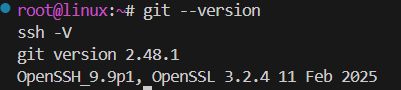

2. Sklonowano [repozytorium przedmiotowe](https://github.com/InzynieriaOprogramowaniaAGH/MDO2025_INO) za pomocą HTTPS i [*personal access token*](https://docs.github.com/en/authentication/keeping-your-account-and-data-secure/managing-your-personal-access-tokens)

   
   

3. Sklonowano repozytorium za pomocą utworzonego klucza SSH.
   - Utworzono dwa klucze SSH, inne niż RSA, oba zabezpieczone hasłem
   
      
      
   
   - Skonfigurowano klucz SSH jako metodę dostępu do GitHuba
   
      
      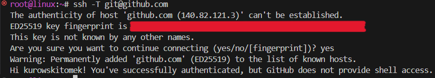
   
   - Sklonowano repozytorium z wykorzystaniem protokołu SSH
   
      
   
   - Skonfigurowano 2FA
   
      

4. Przełączono się na gałąź ```main```, a potem na gałąź swojej grupy (GCL04)

   
   

5. Utwórzono gałąź o nazwie "TK414543".

   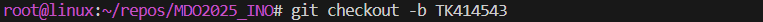
   

6. Rozpoczęto pracę na nowej gałęzi
   - W katalogu GCL04 utwórzono nowy katalog TK414543
   
      
   
   - Napisano [Git hooka](https://git-scm.com/book/en/v2/Customizing-Git-Git-Hooks) - weryfikującego, że każdy "commit message" zaczyna się od "TK414543".

   - Treść git hooke'a:
   
      ```bash
      #!/bin/bash
      COMMIT_MSG_FILE=$1
      PREFIX="TK414543"

      if ! grep -q "^$PREFIX" "$COMMIT_MSG_FILE"; then
         echo "Commit message must start from $PREFIX"
         exit 1
      fi
      ```

   - Dodano ten skrypt do stworzonego wcześniej TK414543.
   
      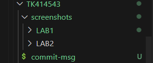
   
   - Skopiowano go do katalogu ".git/hooks, tak by uruchamiał się za każdym razem przy wykonywaniu commita.
  
      
      

   - W katalogu TK414543 dodano plik ze sprawozdaniem
   
      
   
   - Wysłano zmiany do zdalnego źródła

      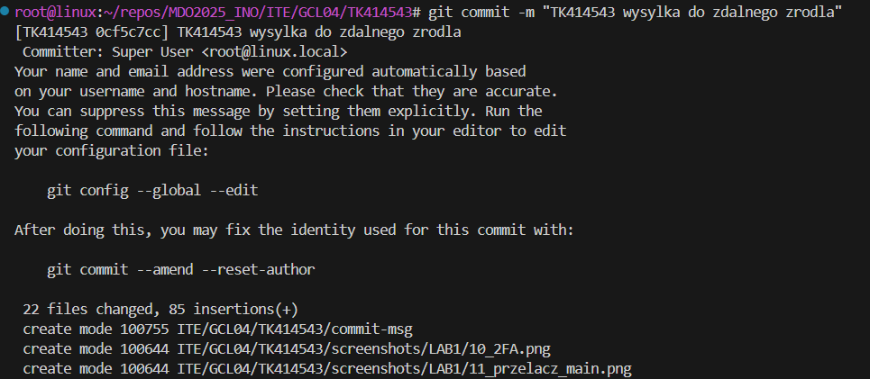
      
      

   - Wciągnięto swoją gałąź do gałęzi grupowej

      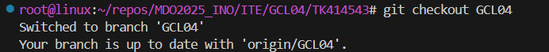
      
      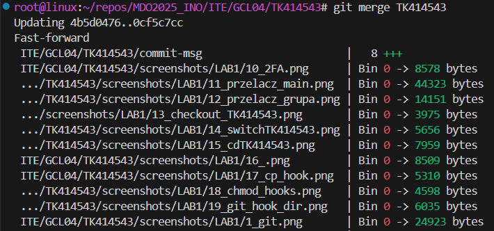


   - Wysłano aktualizację do zdalnego źródła (na swojej gałęzi)

      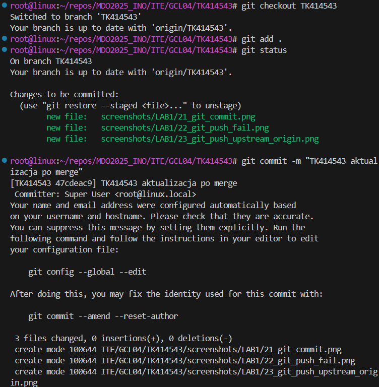
      

# LAB 2

1. Zainstalowano Docker w systemie linuksowym
   
   

3. Zarejestrowano w [Docker Hub](https://hub.docker.com/)

   - Konto DockerHub:
      
      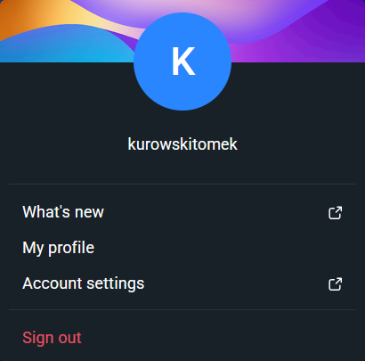

   - Logowanie do DockerHub:
      
      

4. Pobierz obrazy `hello-world`, `busybox`,`fedora`, `mysql`

   

5. Uruchomiono kontener z obrazu `busybox`
   - Efekt uruchomienia kontenera:

      

   - Podłączono się do kontenera **interaktywnie** i wywołano numer wersji

      

6. Uruchomiono "system w kontenerze" (kontener z obrazu `fedora`)
   - Zainstalowano procps-ng

      

   - `PID1` w kontenerze:

      
      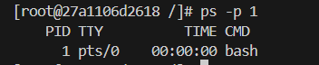

   - Procesy dockera na hoście:

      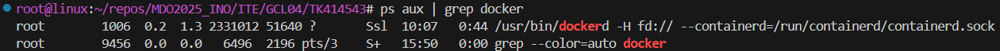

   - Zaktualizowano pakiety

      

   - Wyjdź

7. Stworzono, zbudowano i uruchomiono prosty plik `Dockerfile` bazujący na Fedorze i sklonowano repozytorium przedmiotu.

   - Zawartość Dockerfile:

   ```dockerfile

   FROM fedora:latest

   RUN dnf update -y && \
      dnf install -y git

   RUN git clone https://github.com/InzynieriaOprogramowaniaAGH/MDO2025_INO.git /repo
   
   CMD ["/bin/bash"]

   ```

   - Uruchomienie

      

   - Obraz będzie miał `git`-a:

   ```dockerfile
   dnf install -y git
   ```

   - Uruchomiono w trybie interaktywnym oraz zweryfikowano pobranie repozytorium przedmiotowego:

      

8. Uruchomione kontenery:

   

9. Wyczyszczono kontenery:

   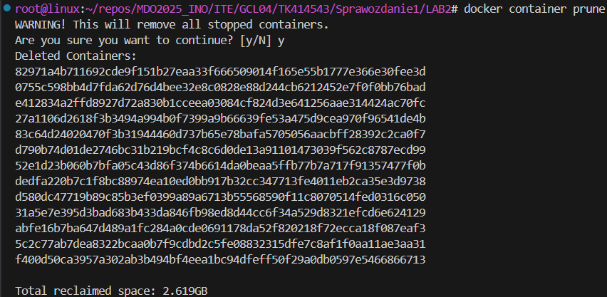

10. Wyczyszczono obrazy:

      

# LAB 3

* Znaleziono repozytorium zdatne do użycia w tym laboratorium, jest to mój własny projekt z pierwszego roku, OceanBattle, które:
	* dysponuje otwartą licencją
	* jest umieszczone wraz ze swoimi narzędziami tak, że możliwe jest uruchomienie w repozytorium ```dotnet build``` oraz ```dotnet test```.
	* Zawiera zdefiniowane i obecne w repozytorium testy. Testy muszą jednoznacznie formułują swój raport końcowy.
* Sklonowano niniejsze repozytorium, i przeprowadzono build programu po uwczesnym doinstalowaniu wymaganych zależności

   
   
   

* Uruchomiono testy jednostkowe dołączone do repozytorium

   

### Przeprowadzenie buildu w kontenerze
Ponowiono wyżej wymieniony  proces w kontenerze, interaktywnie.

1. Wykonano kroki `build` i `test` wewnątrz wybranego kontenera bazowego. Wybrano "wystarczający" kontener, dostępny obraz dotnet dla Dockera, mcr.microsoft.com/dotnet/sdk:7.0
	* uruchomiono kontener i rozpoczęto interaktywną pracę

   

	* zaopatrzono kontener w wymagania wstępne (zainstalowano git)

   

	* sklonowano repozytorium

   
   

	* Skonfigurowano środowisko i uruchomiono *build*

   
   

	* uruchomiono testy

   

2. Stworzono dwa pliki `Dockerfile` automatyzujące kroki powyżej, z uwzględnieniem następujących kwestii:

	* Kontener pierwszy przeprowadza wszystkie kroki aż do *builda*

      ```dockerfile
      FROM mcr.microsoft.com/dotnet/sdk:7.0 AS build

      WORKDIR /app
      RUN apt update && apt install -y git

      RUN git clone --recurse-submodules -j8 https://github.com/OceanBattle/OceanBattle.WebAPI.git .
      RUN dotnet restore
      RUN dotnet build
      ```

	* Kontener drugi bazuje na pierwszym i wykonuje testy, nie robiąc *builda*

      ```dockerfile
      FROM oceanbattle-build AS test

      WORKDIR /app

      CMD ["dotnet", "test"]
      ```

3. Kontener wdraża się i pracuje poprawnie. 

   
   
   


   * Co pracuje w takim kontenerze?

   Kontener pracuje tymczasowo, uruchamiając proces `dotnet test`, który wykonuje testy jednostkowe aplikacji z repozytorium OceanBattle.WebAPI. Po zakończeniu działania testów, kontener się zamyka. Nie działa w tle jako serwer, tylko jako **jednorazowe środowisko testowe**. W tym scenariuszu kontener jest użyty jako etap CI/CD, a nie jako produkt końcowy.


### Zachowywanie stanu
* Zapoznaj się z dokumentacją:
  * https://docs.docker.com/storage/volumes/
  * https://docs.docker.com/engine/storage/bind-mounts/
  * https://docs.docker.com/engine/storage/volumes/
  * https://docs.docker.com/reference/dockerfile/#volume
  * https://docs.docker.com/reference/dockerfile/#run---mount
* Przygotuj woluminy wejściowy i wyjściowy, o dowolnych nazwach, i podłącz je do kontenera bazowego (np. tego, z którego rozpoczynano poprzednio pracę). Kontener bazowy to ten, który umie budować nasz projekt (ma zainstalowane wszystkie dependencje, `git` nią nie jest)
* Uruchom kontener, zainstaluj/upewnij się że istnieją niezbędne wymagania wstępne (jeżeli istnieją), ale *bez gita*
* Sklonuj repozytorium na wolumin wejściowy
  * Opisz dokładnie, jak zostało to zrobione
    * Wolumin/kontener pomocniczy?
    * *Bind mount* z lokalnym katalogiem?
    * Kopiowanie do katalogu z woluminem na hoście (`/var/lib/docker`)?
* Uruchom build w kontenerze - rozważ skopiowanie repozytorium do wewnątrz kontenera
* Zapisz powstałe/zbudowane pliki na woluminie wyjściowym, tak by były dostępne po wyłączniu kontenera.
* Pamiętaj udokumentować wyniki.
* Ponów operację, ale klonowanie na wolumin wejściowy przeprowadź wewnątrz kontenera (użyj gita w kontenerze)
* Przedyskutuj możliwość wykonania ww. kroków za pomocą `docker build` i pliku `Dockerfile`. (podpowiedź: `RUN --mount`)

### Eksponowanie portu
* Zapoznaj się z dokumentacją https://iperf.fr/
* Uruchom wewnątrz kontenera serwer iperf (iperf3)
* Połącz się z nim z drugiego kontenera, zbadaj ruch
* Zapoznaj się z dokumentacją `network create` : https://docs.docker.com/engine/reference/commandline/network_create/
* Ponów ten krok, ale wykorzystaj własną dedykowaną sieć mostkową (zamiast domyślnej). Spróbuj użyć rozwiązywania nazw
* Połącz się spoza kontenera (z hosta i spoza hosta)
* Przedstaw przepustowość komunikacji lub problem z jej zmierzeniem (wyciągnij log z kontenera, woluminy mogą pomóc)
* Opcjonalnie: odwołuj się do kontenera serwerowego za pomocą nazw, a nie adresów IP

### Instancja Jenkins
* Zapoznaj się z dokumentacją  https://www.jenkins.io/doc/book/installing/docker/
* Przeprowadź instalację skonteneryzowanej instancji Jenkinsa z pomocnikiem DIND
* Zainicjalizuj instację, wykaż działające kontenery, pokaż ekran logowania
