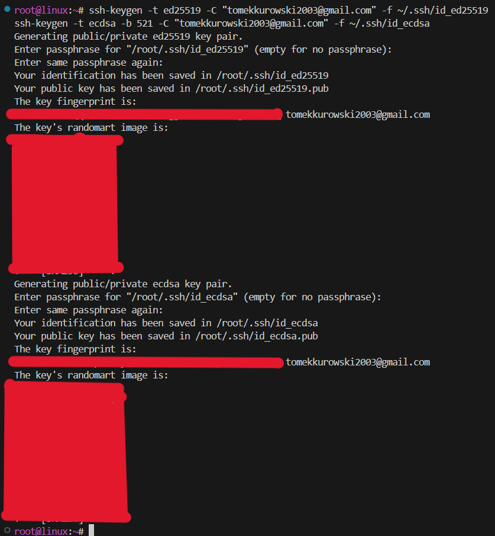
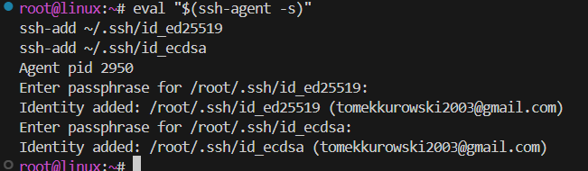
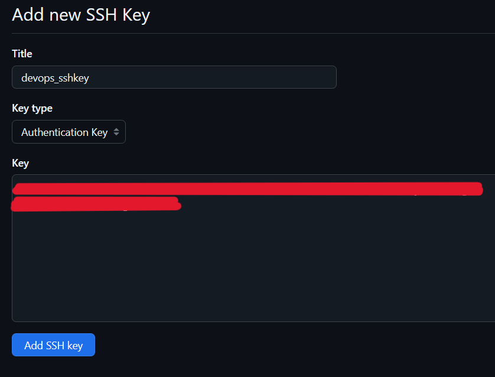
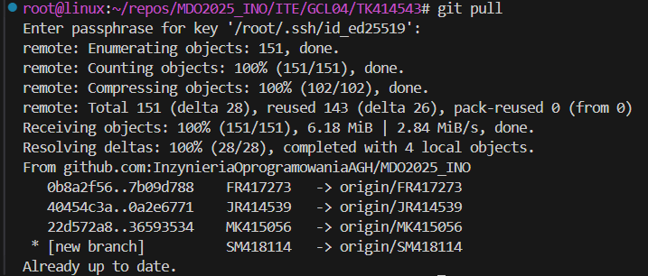
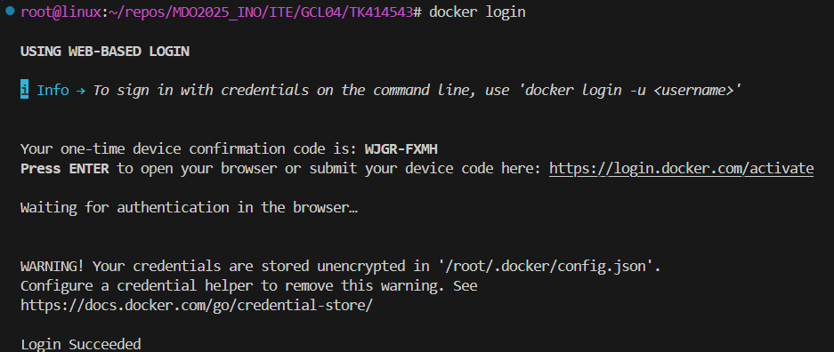
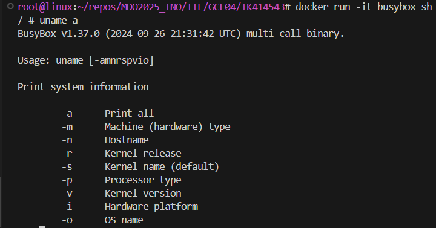
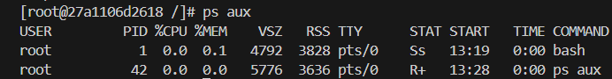
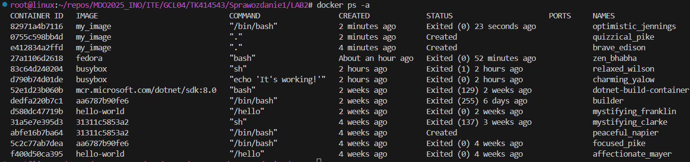
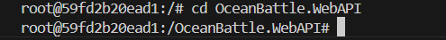

# Sprawozdanie 1 - Tomasz Kurowski

# LAB 1

1. Zainstalowano klienta Git i obsługę kluczy SSH

```
sudo dnf install git openssh
```

   

```
git --version
```

   

2. Sklonowano [repozytorium przedmiotowe](https://github.com/InzynieriaOprogramowaniaAGH/MDO2025_INO) za pomocą HTTPS i [*personal access token*](https://docs.github.com/en/authentication/keeping-your-account-and-data-secure/managing-your-personal-access-tokens)

   

```
git clone https://github.com/InzynieriaOprogramowaniaAGH/MDO2025_INO.git
```

   

3. Sklonowano repozytorium za pomocą utworzonego klucza SSH.
   - Utworzono dwa klucze SSH, inne niż RSA, oba zabezpieczone hasłem

      ```      
      ssh-keygen -t ed25519 -C "tomekkurowski2003@gmail.com" -f ~/.ssh/id_ed25519
      ssh-keygen -t ecdsa -b 521 -C "tomekkurowski2003@gmail.com" -f ~/.ssh/id_ecdsa
      ```

      

      ```
      eval "$(ssh-agent -s)"
      ```

      
   
   - Skonfigurowano klucz SSH jako metodę dostępu do GitHuba
   
      

      ```
      ssh -T git@github.com
      ```

      
   
   - Sklonowano repozytorium z wykorzystaniem protokołu SSH
   
      
   
   - Skonfigurowano 2FA
   
      

4. Przełączono się na gałąź ```main```, a potem na gałąź swojej grupy (GCL04)

   ```
   git checkout main
   ```
   ```
   git pull
   ```
   
   ```
   git checkout GCL04
   ```
   ```
   git pull
   ```
   

5. Utwórzono gałąź o nazwie "TK414543".

   ```
   git checkout -b TK414543   
   ```
   
   ```
   git switch TK414543
   ```
   

6. Rozpoczęto pracę na nowej gałęzi
   - W katalogu GCL04 utwórzono nowy katalog TK414543

      Przejście do katalogu:
      
   
   - Napisano [Git hooka](https://git-scm.com/book/en/v2/Customizing-Git-Git-Hooks) - weryfikującego, że każdy "commit message" zaczyna się od "TK414543".

   - Treść git hooke'a:
   
      ```bash
      #!/bin/bash
      COMMIT_MSG_FILE=$1
      PREFIX="TK414543"

      if ! grep -q "^$PREFIX" "$COMMIT_MSG_FILE"; then
         echo "Commit message must start from $PREFIX"
         exit 1
      fi
      ```

   - Dodano ten skrypt do stworzonego wcześniej TK414543.
   
      
   
   - Skopiowano go do katalogu ".git/hooks, tak by uruchamiał się za każdym razem przy wykonywaniu commita.
  
      
      

   - W katalogu TK414543 dodano plik ze sprawozdaniem
   
      
   
   - Wysłano zmiany do zdalnego źródła

      
      
      

   - Wciągnięto swoją gałąź do gałęzi grupowej

      
      
      


   - Wysłano aktualizację do zdalnego źródła (na swojej gałęzi)

      
      

# LAB 2

1. Zainstalowano Docker w systemie linuksowym
   
   

3. Zarejestrowano w [Docker Hub](https://hub.docker.com/)

   - Konto DockerHub:
      
      

   - Logowanie do DockerHub:
      
      

4. Pobierz obrazy `hello-world`, `busybox`,`fedora`, `mysql`

   

5. Uruchomiono kontener z obrazu `busybox`
   - Efekt uruchomienia kontenera:

      

   - Podłączono się do kontenera **interaktywnie** i wywołano numer wersji

      

6. Uruchomiono "system w kontenerze" (kontener z obrazu `fedora`)
   - Zainstalowano procps-ng

      

   - `PID1` w kontenerze:

      
      

   - Procesy dockera na hoście:

      

   - Zaktualizowano pakiety

      

   - Wyjdź

7. Stworzono, zbudowano i uruchomiono prosty plik `Dockerfile` bazujący na Fedorze i sklonowano repozytorium przedmiotu.

   - Zawartość Dockerfile:

      ```dockerfile

      FROM fedora:latest

      RUN dnf update -y && \
      dnf install -y git

      RUN git clone https://github.com/InzynieriaOprogramowaniaAGH/MDO2025_INO.git /repo
   
      CMD ["/bin/bash"]

      ```

   - Uruchomienie

      

   - Obraz będzie miał `git`-a:

      ```dockerfile
      dnf install -y git
      ```

   - Uruchomiono w trybie interaktywnym oraz zweryfikowano pobranie repozytorium przedmiotowego:

      

8. Uruchomione kontenery:

   

9. Wyczyszczono kontenery:

   

10. Wyczyszczono obrazy:

      

# LAB 3

* Znaleziono repozytorium zdatne do użycia w tym laboratorium, jest to mój własny projekt z pierwszego roku, OceanBattle, które:
	* dysponuje otwartą licencją
	* jest umieszczone wraz ze swoimi narzędziami tak, że możliwe jest uruchomienie w repozytorium ```dotnet build``` oraz ```dotnet test```.
	* Zawiera zdefiniowane i obecne w repozytorium testy. Testy muszą jednoznacznie formułują swój raport końcowy.
* Sklonowano niniejsze repozytorium, i przeprowadzono build programu po uwczesnym doinstalowaniu wymaganych zależności

   
   
   

* Uruchomiono testy jednostkowe dołączone do repozytorium

   

### Przeprowadzenie buildu w kontenerze
Ponowiono wyżej wymieniony  proces w kontenerze, interaktywnie.

1. Wykonano kroki `build` i `test` wewnątrz wybranego kontenera bazowego. Wybrano "wystarczający" kontener, dostępny obraz dotnet dla Dockera, mcr.microsoft.com/dotnet/sdk:7.0
	* uruchomiono kontener i rozpoczęto interaktywną pracę

      

	* zaopatrzono kontener w wymagania wstępne (zainstalowano git)

      

	* sklonowano repozytorium

      
      

	* Skonfigurowano środowisko i uruchomiono *build*

      
      

	* uruchomiono testy

      

2. Stworzono dwa pliki `Dockerfile` automatyzujące kroki powyżej, z uwzględnieniem następujących kwestii:

	* Kontener pierwszy przeprowadza wszystkie kroki aż do *builda*

      ```dockerfile
      FROM mcr.microsoft.com/dotnet/sdk:7.0 AS build

      WORKDIR /app
      RUN apt update && apt install -y git

      RUN git clone --recurse-submodules -j8 https://github.com/OceanBattle/OceanBattle.WebAPI.git .
      RUN dotnet restore
      RUN dotnet build
      ```

	* Kontener drugi bazuje na pierwszym i wykonuje testy, nie robiąc *builda*

      ```dockerfile
      FROM oceanbattle-build AS test

      WORKDIR /app

      CMD ["dotnet", "test"]
      ```

3. Kontener wdraża się i pracuje poprawnie. 

   
   
   


   * Co pracuje w takim kontenerze?

   Kontener pracuje tymczasowo, uruchamiając proces `dotnet test`, który wykonuje testy jednostkowe aplikacji z repozytorium OceanBattle.WebAPI. Po zakończeniu działania testów, kontener się zamyka. Nie działa w tle jako serwer, tylko jako **jednorazowe środowisko testowe**. W tym scenariuszu kontener jest użyty jako etap CI/CD, a nie jako produkt końcowy.


### Zachowywanie stanu

* Przygotowano woluminy wejściowy (input) i wyjściowy (output) i podłączono je do kontenera bazowego, nie zawierającego gita.

   ```
   docker volume create ocean-input
   docker volume create ocean-output
   ```
   

* Uruchomiono kontener, zawierający dotnet SDK

   ```
   docker run -it --rm mcr.microsoft.com/dotnet/sdk:7.0 bash
   ```
   

* Sklonowano repozytorium na wolumin wejściowy, wykorzystano Docker copy (docker cp), kopiując istniejące repozytorium z hosta do wejścia kontenera.

   

* Uruchomiono build w kontenerze.

   ```
   dotnet restore
   ```
   
   ```
   dotnet build -o /data/output/build
   ```
   

* Zapisano powstałe/zbudowane pliki na woluminie wyjściowym, tak by były dostępne po wyłączniu kontenera.

   
   

* Ponowiono operację, ale klonowanie na wolumin wejściowy przeprowadzono wewnątrz kontenera, używając gita w kontenerze

   ```
   docker run -it --rm mcr.microsoft.com/dotnet/sdk:7.0 bash
   ```
   
   ```
   apt update && apt install -y git
   ```
   
   ```
   git clone --recurse-submodules -j8 https://github.com/OceanBattle/OceanBattle.WebAPI.git
   ```
   
   ```
   dotnet restore
   dotnet build -o /data/output/build
   ```
   

   

* Przedyskutuj możliwość wykonania ww. kroków za pomocą `docker build` i pliku `Dockerfile`.

Tak, istnieje taka możliwość, ponieważ – od Dockera 20.10+ można użyć polecenia:
```dockerfile
RUN --mount=type=bind,target=/src git clone ...
```
Ale: *RUN --mount* działa tylko w docker build z opcją *--mount*, więc trzeba uruchomiony BuildKit *(DOCKER_BUILDKIT=1)*.

### Eksponowanie portu
* Uruchomiono wewnątrz kontenera serwer iperf (iperf3)

```
docker run -it --rm --name iperf-server -p 5201:5201 networkstatic/iperf3 -s
```


* Połączono się z nim z drugiego kontenera i zbadano ruch

   Sprawdzenie adresu ip:
   

   ```
   docker run --rm networkstatic/iperf3 -c 172.17.0.3
   ```
   

* Ponowiono ten krok, wykorzystując własną dedykowaną sieć mostkową (zamiast domyślnej).

   
   
   

* Połączono się spoza kontenera
   - Z hosta
   

   - Z poza hosta
   

* Wyciągnięto log z kontenera
   ```
   docker logs iperf-server2 > iperf_log.txt
   ```

   ```
   -----------------------------------------------------------
   Server listening on 5201 (test #1)
   -----------------------------------------------------------
   Accepted connection from 172.18.0.3, port 48186
   [  5] local 172.18.0.2 port 5201 connected to 172.18.0.3 port 48198
   [ ID] Interval           Transfer     Bitrate
   [  5]   0.00-1.00   sec  3.83 GBytes  32.9 Gbits/sec                  
   [  5]   1.00-2.00   sec  3.95 GBytes  33.9 Gbits/sec                  
   [  5]   2.00-3.00   sec  3.67 GBytes  31.5 Gbits/sec                  
   [  5]   3.00-4.00   sec  3.98 GBytes  34.2 Gbits/sec                  
   [  5]   4.00-5.00   sec  3.65 GBytes  31.3 Gbits/sec                  
   [  5]   5.00-6.00   sec  3.76 GBytes  32.3 Gbits/sec                  
   [  5]   6.00-7.00   sec  3.53 GBytes  30.3 Gbits/sec                  
   [  5]   7.00-8.00   sec  3.21 GBytes  27.5 Gbits/sec                  
   [  5]   8.00-9.00   sec  2.95 GBytes  25.4 Gbits/sec                  
   [  5]   9.00-10.00  sec  2.82 GBytes  24.2 Gbits/sec                  
   - - - - - - - - - - - - - - - - - - - - - - - - -
   [ ID] Interval           Transfer     Bitrate
   [  5]   0.00-10.00  sec  35.3 GBytes  30.4 Gbits/sec                  receiver
   -----------------------------------------------------------
   Server listening on 5201 (test #2)
   -----------------------------------------------------------
   ```

### Instancja Jenkins
* Przeprowadzono instalację skonteneryzowanej instancji Jenkinsa z pomocnikiem DIND

   ```
   docker network create jenkins-net
   ```
   
   ```
   docker run -d --rm --name jenkins-docker \
  --network jenkins-net --privileged \
  -v jenkins-docker-certs:/certs/client \
  -v jenkins-docker-data:/var/lib/docker \
  -e DOCKER_TLS_CERTDIR=/certs \
  docker:dind
   ```
   

* Zainicjalizowano instację, i zalogowano z hasłem admina

   ```
   docker run -d --rm --name jenkins \
  --network jenkins-net \
  -p 8080:8080 -p 50000:50000 \
  -v jenkins-data:/var/jenkins_home \
  -v jenkins-docker-certs:/certs/client:ro \
  -e DOCKER_HOST=tcp://jenkins-docker:2376 \
  -e DOCKER_CERT_PATH=/certs/client \
  -e DOCKER_TLS_VERIFY=1 \
  jenkins/jenkins:lts
   ```
   
   ```
   docker exec jenkins cat /var/jenkins/secrets/initialAdminPassword
   ```
   

   Otwarto w przeglądarcę stronę logowania Jenkins'a i zalogowano się z użyciem hasła:
   
