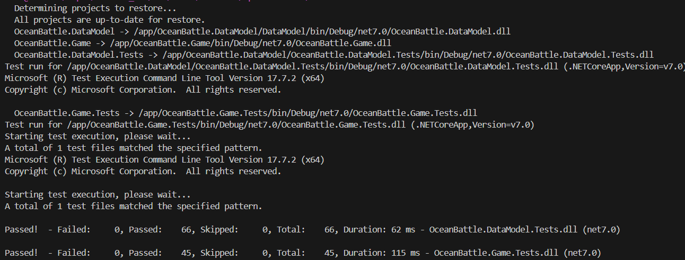
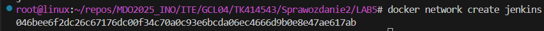
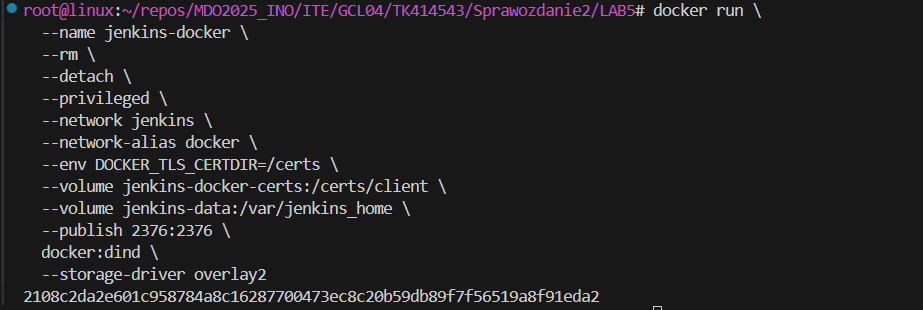
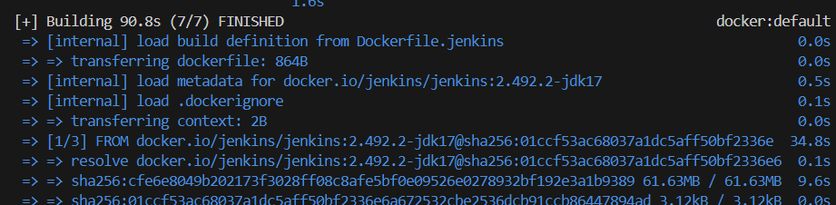
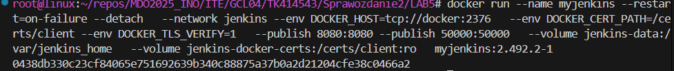
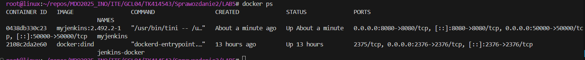
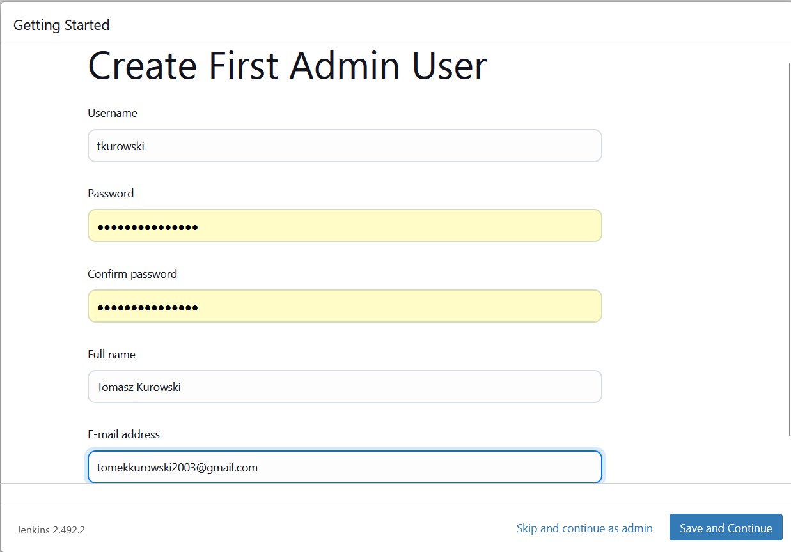
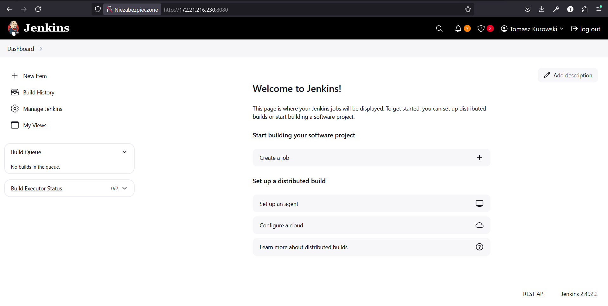
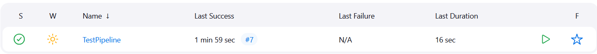

# Sprawozdanie 2 - Tomasz Kurowski
# LAB 5

## Pipeline, Jenkins, izolacja etapów

### Przygotowanie
🌵 Utwórz instancję Jenkins
* Upewniono się, że na pewno działają kontenery budujące i testujące, stworzone na poprzednich zajęciach

```
docker run --rm oceanbattle-build
docker run --rm oceanbattle-test
```


* Zapoznano się z instrukcją instalacji Jenkinsa: https://www.jenkins.io/doc/book/installing/docker/

```
docker network create jenkins
```


```
docker run \
  --name jenkins-docker \
  --rm \
  --detach \
  --privileged \
  --network jenkins \
  --network-alias docker \
  --env DOCKER_TLS_CERTDIR=/certs \
  --volume jenkins-docker-certs:/certs/client \
  --volume jenkins-data:/var/jenkins_home \
  --publish 2376:2376 \
  docker:dind \
  --storage-driver overlay2
```


```Dockerfile
FROM jenkins/jenkins:2.492.2-jdk17
USER root
RUN apt-get update && apt-get install -y lsb-release ca-certificates curl && \
    install -m 0755 -d /etc/apt/keyrings && \
    curl -fsSL https://download.docker.com/linux/debian/gpg -o /etc/apt/keyrings/docker.asc && \
    chmod a+r /etc/apt/keyrings/docker.asc && \
    echo "deb [arch=$(dpkg --print-architecture) signed-by=/etc/apt/keyrings/docker.asc] \
    https://download.docker.com/linux/debian $(. /etc/os-release && echo \"$VERSION_CODENAME\") stable" \
    | tee /etc/apt/sources.list.d/docker.list > /dev/null && \
    apt-get update && apt-get install -y docker-ce-cli && \
    apt-get clean && rm -rf /var/lib/apt/lists/*
USER jenkins
RUN jenkins-plugin-cli --plugins "blueocean docker-workflow"
```

```
docker build -f Dockerfile.jenkins -t myjenkins:2.492.2-1 .
```


```
docker run --name myjenkins --restart=on-failure --detach   --network jenkins --env DOCKER_HOST=tcp://docker:2376   --env DOCKER_CERT_PATH=/certs/client --env DOCKER_TLS_VERIFY=1   --publish 8080:8080 --publish 50000:50000   --volume jenkins-data:/var/jenkins_home   --volume jenkins-docker-certs:/certs/client:ro   myjenkins:2.492.2-1
```


```
docker ps
```


```
docker exec myjenkins cat /var/jenkins_home/secrets/initialAdminPassword
```
9b4a5c6d7f8d45acbf0500f0bce0e17d


tkurowski
.8La=&bZdw5!krd



http://172.21.216.230:8080/



```Groovy
pipeline {
    agent any
    stages {
        stage('Pull Docker image') {
            steps {
                script {
                    docker.image('fedora').pull()
                }
            }
        }
    }
}
```



```Groovy
        stage('Checkout'){
            steps{
                git branch: 'TK414543',
                    url: 'https://github.com/InzynieriaOprogramowaniaAGH/MDO2025_INO'
            }
        }
```

```Groovy
        stage('Build') {
            steps {
                dir('ITE/GCL04/TK414543/Sprawozdanie1/LAB3') {
                    sh 'docker build -f Dockerfile.build -t oceanbattle-build .'
                    sh 'docker run --rm oceanbattle-build'
                }
            }
        }
```

```Groovy
        stage('Test') {
            steps {
                dir('ITE/GCL04/TK414543/Sprawozdanie1/LAB3') {
                    sh 'docker build -f Dockerfile.test -t oceanbattle-test .'
                    sh 'docker run --rm oceanbattle-test'
                }
            }
        }
```


publish -c Release \
  -p:PublishSingleFile=true \
  -p:UseAppHost=true \
  -p:IncludeNativeLibrariesForSelfExtract=true \
  -p:PublishTrimmed=false \
  -p:DebugType=None \
  -p:DebugSymbols=false \
  --self-contained true \
  -o /app/publish


  * Uruchomiono obraz Dockera który eksponuje środowisko zagnieżdżone
  * Przygotowano obraz blueocean na podstawie obrazu Jenkinsa (czym się różnią?)
  * Uruchomiono Blueocean
  * Zalogowano się i skonfigurowano Jenkins
  * Zadbano o archiwizację i zabezpieczenie logów
  
### Zadanie wstępne: uruchomienie
🌵 Zadanie do wykonania na ćwiczeniach
* Konfiguracja wstępna i pierwsze uruchomienie
  * Utwórz projekt, który wyświetla `uname`
  * Utwórz projekt, który zwraca błąd, gdy... godzina jest nieparzysta
  * Pobierz w projekcie obraz kontenera `ubuntu` (stosując `docker pull`)

### Zadanie wstępne: obiekt typu pipeline
🌵 Ciąg dalszy sprawozdania - zadanie do wykonania po wykazaniu działania Jenkinsa
* Utwórz nowy obiekt typu `pipeline`
* Wpisz treść *pipeline'u* bezpośrednio do obiektu (nie z SCM - jeszcze!)
  * https://www.jenkins.io/doc/book/pipeline/syntax/
  * https://www.jenkins.io/doc/pipeline/steps/git/
  * https://www.jenkins.io/doc/pipeline/examples/#unstash-different-dir
  * [https://www.jenkins.io/doc/book/pipeline/docker/](https://www.jenkins.io/doc/book/pipeline/docker/#building-containers)
* Spróbuj sklonować repo przedmiotowe (`MDO2025_INO`)
* Zrób *checkout* do swojego pliku Dockerfile (na osobistej gałęzi) właściwego dla *buildera* wybranego w poprzednim sprawozdaniu programu
* Zbuduj Dockerfile
* Uruchom stworzony *pipeline* drugi raz
 
### Opis celu
Dla osób z wybranym projektem
* Opracuj dokument z diagramami UML, opisującymi proces CI. Opisz:
  * Wymagania wstępne środowiska
  * Diagram aktywności, pokazujący kolejne etapy (collect, build, test, report)
  * Diagram wdrożeniowy, opisujący relacje między składnikami, zasobami i artefaktami
* Diagram będzie naszym wzrocem do porównania w przyszłości

### Pipeline: składnia
Zadanie do wykonania, jeżeli poprawnie działa obiekt *pipeline* i udało się odnaleźć dostęp do plików Dockerfile
* Definiuj pipeline korzystający z kontenerów celem realizacji kroków `build -> test`
* Może, ale nie musi, budować się na dedykowanym DIND, ale może się to dziać od razu na kontenerze CI. Należy udokumentować funkcjonalną różnicę między niniejszymi podejściami
* Docelowo, `Jenkinsfile` definiujący *pipeline* powinien być umieszczony w repozytorium. Optymalnie: w *sforkowanym* repozytorium wybranego oprogramowania

### Kompletny pipeline: wymagane składniki
Kompletny *pipeline* (wprowadzenie) - do wykonania po ustaleniu kształu kroków `deploy` i `publish`
*  Kontener Jenkins i DIND skonfigurowany według instrukcji dostawcy oprogramowania
*  Pliki `Dockerfile` wdrażające instancję Jenkinsa załączone w repozytorium przedmiotowym pod ścieżką i na gałęzi według opisu z poleceń README
*  Zdefiniowany wewnątrz Jenkinsa obiekt projektowy *pipeline*, realizujący następujące kroki:
  * Kontener `Builder`, który powinien bazować na obrazie zawierającym dependencje (`Dependencies`), o ile stworzenie takiego kontenera miało uzasadnienie. Obrazem tym może być np. baza pobrana z Docker Hub (jak obraz node lub 
dotnet) lub obraz stworzony samodzielnie i zarejestrowany/widoczny w DIND (jak np. obraz oparty o Fedorę, doinstalowujący niezbędne zależności, nazwany Dependencies). Jeżeli, jak często w przypadku Node, nie ma różnicy między runtimowym obrazem a obrazem z dependencjami, proszę budować się w oparciu nie o latest, ale o **świadomie wybrany tag z konkretną wersją**
  * Obraz testujący, w ramach kontenera `Tester`
    * budowany przy użyciu ww. kontenera kod, wykorzystujący w tym celu testy obecne w repozytorium programu
    * Zadbaj o dostępność logów i możliwość wnioskowania jakie testy nie przechodzą
  * `Deploy`
    *  Krok uruchamiający aplikację na kontenerze docelowym
    *  Jeżeli kontener buildowy i docelowy **wydają się być te same** - być może warto zacząć od kroku `Publish` poniżej
    *  Jeżeli to kontener buildowy ma być wdrażany - czy na pewno nie trzeba go przypadkiem posprzątać?
    *  Przeprowadź dyskusję dotyczącą tego, jak powinno wyglądać wdrożenie docelowe wybranej aplikacji. Odpowiedz (z uzasadnieniem i dowodem) na następujące kwestie:
        * czy program powinien zostać *„zapakowany”* do jakiegoś przenośnego pliku-formatu (DEB/RPM/TAR/JAR/ZIP/NUPKG)
        * czy program powinien być dystrybuowany jako obraz Docker? Jeżeli tak – czy powinien zawierać zawartość sklonowanego repozytorium, logi i artefakty z *builda*?
        * Przypomnienie: czym się różni (i jakie ma zastosowanie) obraz `node` od `node-slim`
    *  Proszę opisać szczegółowo proces który zostanie opisany jako `Deploy`, ze względu na mnogość podejść
  * `Publish`
    * Przygotowanie wersjonowanego artefaktu, na przykład:
      * Instalator
      * NuGet/Maven/NPM/JAR
      * ZIP ze zbudowanym runtimem
    * Opracuj odpowiednią postać redystrybucyjną swojego artefaktu i/lub obrazu (przygotuj instalator i/lub pakiet, ewentualnie odpowiednio uporządkowany obraz kontenera Docker)
      * Musi powstać co najmniej jeden z tych elementów
      * Jeżeli ma powstać artefakt, dodaj go jako pobieralny obiekt do rezultatów „przejścia” *pipeline’u* Jenkins (https://www.jenkins.io/doc/pipeline/steps/core/).
    * Opcjonalnie, krok `Publish` (w przypadku podania parametru) może dokonywać promocji artefaktu na zewnętrzne *registry*
#### Wskazówka
Po opracowaniu formy redystrybucyjnej, stwórz obraz runtime’owy (bez dependencji potrzebnych wyłącznie do builda!), zasilony artefaktem, zainstaluj w nim program z niego i uruchom. Jeżeli formą redystrybucyjną jest kontener, uruchom kontener – w sposób nieblokujący: pozwól pipeline’owi kontynuować po uruchomieniu, ale wykaż, że program uruchomiony w owym kontenerze działa.


# LAB 6
# LAB 7
# LAB 8