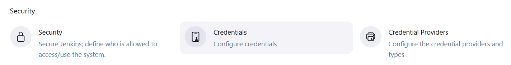
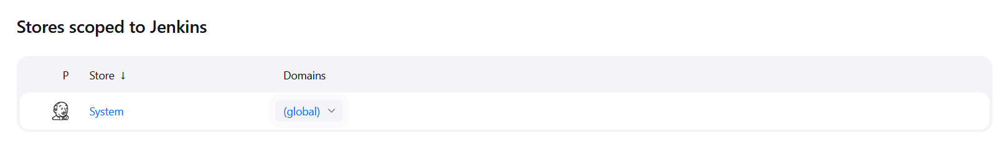
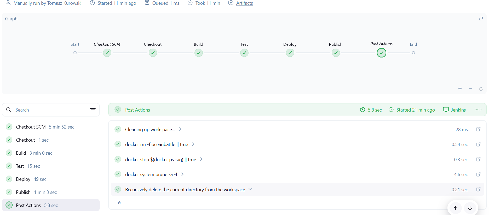
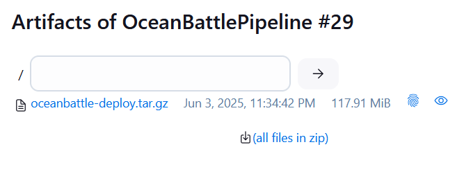
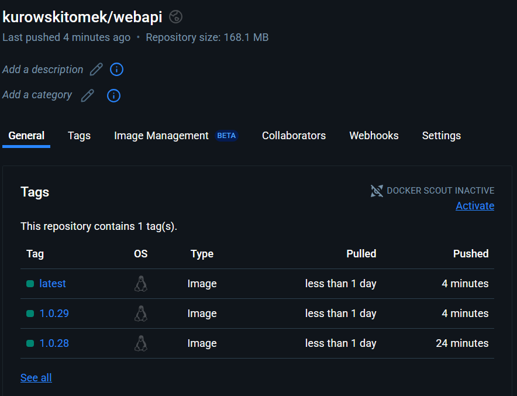
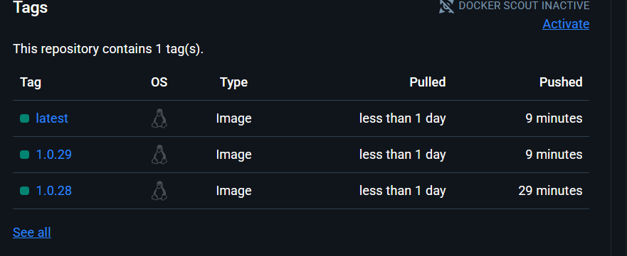

# Sprawozdanie 2 - Tomasz Kurowski

## 🌵 Utworzenie instancji Jenkinsa
* Upewniono się, że na pewno działają kontenery budujące i testujące, stworzone na poprzednich zajęciach

```
docker run --rm oceanbattle-build
docker run --rm oceanbattle-test
```


* Zapoznano się z instrukcją instalacji Jenkinsa: https://www.jenkins.io/doc/book/installing/docker/


* Utworzono nową sięć Docker o nazwie jenkins

```
docker network create jenkins
```


* Uruchomiono kontener Docker-In-Docker, który będzie w poźniejszych etapach uzywany przez Jenkinsa w celu uruchamiania jego własnych podkontenerów.

```
docker run \
  --name jenkins-docker \
  --rm \
  --detach \
  --privileged \
  --network jenkins \
  --network-alias docker \
  --env DOCKER_TLS_CERTDIR=/certs \
  --volume jenkins-docker-certs:/certs/client \
  --volume jenkins-data:/var/jenkins_home \
  --publish 2376:2376 \
  docker:dind \
  --storage-driver overlay2
```


* Stworzono [`Dockerfile.jenkins`](./LAB5/Dockerfile.jenkins) w celu uruchomienia Jenkinsa w kontenerze.

```Dockerfile
FROM jenkins/jenkins:2.492.2-jdk17
USER root
RUN apt-get update && apt-get install -y lsb-release ca-certificates curl && \
    install -m 0755 -d /etc/apt/keyrings && \
    curl -fsSL https://download.docker.com/linux/debian/gpg -o /etc/apt/keyrings/docker.asc && \
    chmod a+r /etc/apt/keyrings/docker.asc && \
    echo "deb [arch=$(dpkg --print-architecture) signed-by=/etc/apt/keyrings/docker.asc] \
    https://download.docker.com/linux/debian $(. /etc/os-release && echo \"$VERSION_CODENAME\") stable" \
    | tee /etc/apt/sources.list.d/docker.list > /dev/null && \
    apt-get update && apt-get install -y docker-ce-cli && \
    apt-get clean && rm -rf /var/lib/apt/lists/*
USER jenkins
RUN jenkins-plugin-cli --plugins "blueocean docker-workflow"
```

* Zbudowano obraz Dockera dla jenkinsa. Wykorzystano do tego umieszczony powyżej Dockerfile.jenkins

```
docker build -f Dockerfile.jenkins -t myjenkins:2.492.2-1 .
```


* Uruchomiono obraz Dockera który eksponuje środowisko zagnieżdżone. 

```
docker run --name myjenkins --restart=on-failure --detach   --network jenkins --env DOCKER_HOST=tcp://docker:2376   --env DOCKER_CERT_PATH=/certs/client --env DOCKER_TLS_VERIFY=1   --publish 8080:8080 --publish 50000:50000   --volume jenkins-data:/var/jenkins_home   --volume jenkins-docker-certs:/certs/client:ro   myjenkins:2.492.2-1
```


* Rezultatem powyższych działań są 2 działające kontenery.
```
docker ps
```


* Hasło do wstępnego zalogowania sie do Jenkinsa pobrano z logów kontenera.

```
docker exec myjenkins cat /var/jenkins_home/secrets/initialAdminPassword
```
```
> 9b4a5c6d7f8d45acbf0500f0bce0e17d
```

* Otworzono stronę http://172.21.216.230:8080 w celu wyświetlenia panelu, a następnie zalogowano się i skonfigurowano Jenkinsa. Nastęnie stworzone zostało również nowe konto admina.


* W celach testowych stworzono bardzo prosty pipeline którego jedynym zadaniem jest zaciąganie Dockerowego obrazu Fedory. Treść pipeline'u została wpisana bezpośrednio do obiektu, nie wykorzystano SCM.

```Groovy
pipeline {
    agent any
    stages {
        stage('Pull Docker image') {
            steps {
                script {
                    docker.image('fedora').pull()
                }
            }
        }
    }
}
```


## 🌵 Utworzenie Pipeline'u

Stworzono pipeline o nazwie OceanBattlePipeline, jego zadaniem będzie przeprowadzenie procesu budującego, testującego a w kolejnych krokach także wdrażającego aplikację ASP .NET Core będącą backendem gry multiplayer. W ostanim kroku pipeline opublikuje artefakt w postaci obrazu Dockera na DockerHub oraz udostępni jego spakowaną formę w panelu Jenkinsa.

Pierwszyn etapem pracy Pipeline'u będzie pobranie repozytorium przedmiotowego aby mieć dostęp do wymaganych plików Dockerfile. Następnie będzie on kolejno uruchamiał Dockerfile od Builda, Testów oraz Deploy. 
Etap Deploy będzie polegał na stworzeniu pojedynczej binarki zawierającej od razu .net, wykorzystany zostanie do tego celu dotnet publish z opcjami single file oraz self contained. Zostanie ona ruchomiona w kontenerze i do jednego z jej endpointów zostanie wysłany HTTP Get request w celu sprawdzenia poprawnosci uruchomienia i działania.
Ostatecznie w etapie Publish artefakt w postaci obrazu Dockera będzie udostępniony na Docker Hub oraz spakowany w panelu Jenkinsa.

- ### Zastosowane Dockerfile:

1. #### [`Dockerfile.build`](../Sprawozdanie1/LAB3/Dockerfile.build)
```Dockerfile
FROM mcr.microsoft.com/dotnet/sdk:7.0 AS build

WORKDIR /app
RUN apt update && apt install -y git

RUN git clone --recurse-submodules -j8 https://github.com/OceanBattle/OceanBattle.WebAPI.git .
RUN dotnet restore
RUN dotnet build -c Debug
RUN dotnet build -c Release -p:DebugType=None -p:DebugSymbols=false
```
Jego celem jest przygotowanie kontenera (pobranie git'a i sklonowanie repo) a następnie zbudowanie aplikacji. Budujemy od razu konfiguracje Debug (do użycia przy testach) oraz Release (te biblioteki wykorzysta dotnet publish w kroku Deploy).

2. #### [`Dockerfile.test`](../Sprawozdanie1/LAB3/Dockerfile.test)
```Dockerfile
FROM oceanbattle-build AS test

WORKDIR /app

CMD ["dotnet", "test"]
```
Jego celem jest przeprowadzenie testów zawartych w projekcie.

3. #### [`Dockerfile.deploy`](./LAB6/Dockerfile.deploy)
```Dockerfile
FROM oceanbattle-build AS build

WORKDIR /app

RUN dotnet publish OceanBattle.WebAPI/OceanBattle.WebAPI.csproj \ 
  -c Release \
  -p:PublishSingleFile=true \
  -p:UseAppHost=true \
  -p:IncludeNativeLibrariesForSelfExtract=true \
  -p:PublishTrimmed=false \
  -p:DebugType=None \
  -p:DebugSymbols=false \
  --self-contained true \
  -o /app/publish

FROM mcr.microsoft.com/dotnet/runtime:7.0 AS runtime

WORKDIR /app

COPY --from=build /app/publish .
ENTRYPOINT ["./OceanBattle.WebAPI"]

EXPOSE 80
```
Przeprowadza on dwustopniowy proces który najpierw wykonuje dotnet publish w celu uzyskania pojedynczej, self-contained binarki a następnie kopiuje ją do finalnego runtimeowego kroku gdzie jest ona wystawiana na porcie 80. Dzięki temu w ostatecznym obrazie będącym artefaktem znajduje sie tylko binarka bez zbędnych narzędzi.

- ### [`Jenkinsfile`](./LAB5/Jenkinsfile)

1. #### Checkout
```Groovy
        stage('Checkout'){
            steps{
                git branch: 'TK414543',
                    url: 'https://github.com/InzynieriaOprogramowaniaAGH/MDO2025_INO'
            }
        }
```
Ten krok odpowiada za pobranie repozytorium przedmiotowego na mojej gałęzi w celu uzyskania dostępu do wymaganych przez Pipeline plików.

2. #### Build
```Groovy
        stage('Build') {
            steps {
                dir('ITE/GCL04/TK414543/Sprawozdanie1/LAB3') {
                    sh 'docker build -f Dockerfile.build -t oceanbattle-build .'
                    sh 'docker run --rm oceanbattle-build'
                }
            }
        }
```
Ten krok buduje obraz z dostarczonego buildowego Dockerfile'a i uruchamia kontener.

3. #### Test
```Groovy
        stage('Test') {
            steps {
                dir('ITE/GCL04/TK414543/Sprawozdanie1/LAB3') {
                    sh 'docker build -f Dockerfile.test -t oceanbattle-test .'
                    sh 'docker run --rm oceanbattle-test'
                }
            }
        }
```
Ten krok buduje obraz z dostarczonego testowego Dockerfile'a i uruchamia kontener.

4. #### Deploy
```Groovy
        stage('Deploy') {
            steps {
                dir('ITE/GCL04/TK414543/Sprawozdanie2/LAB6') {
                    sh 'docker build -f Dockerfile.deploy -t ${IMAGE_NAME}:${VERSION} -t oceanbattle-deploy .'
                    sh 'docker run --rm -d --name oceanbattle --network jenkins oceanbattle-deploy'

                    script {
                        def maxRetries = 20
                        def delaySeconds = 5
                        def success = false
                        
                        sleep delaySeconds

                        for (int i = 0; i < maxRetries; i++) {
                            def result = sh(
                                script: 'docker run --rm --network jenkins curlimages/curl:8.8.0 -s -o /dev/null -w "%{http_code}" http://oceanbattle:80/api/auth/.well-known',
                                returnStdout: true
                                ).trim()
                                
                            if (result == '200') {
                                echo "Container is responding with HTTP 200"
                                success = true
                                break
                            }
                                
                            echo "Waiting for container... (attempt ${i + 1})"
                            sleep delaySeconds                    
                        }
                        
                        if (!success) {
                            error("Container did not become healthy in time")
                        }
                    }
                }
            }
        }
```
Ten etap jest najbardziej skomplikowany - najpierw buduje obraz z dostarczonego pliku Dockerfile.deploy, następnie uruchamia kontener z użyciem curl wykonuje HTTP request na jeden z endpointów aplikacji aby sprawdzić czy jest poprawnie uruchomiona i gotowa do działania.


Aby wykonać ostatni krok - Publish, należy umożliwić Jenkisowi zalogowanie się do DockerHub. W tym celu dodano dane logowania w przedstawiony poniżej sposób.





5. #### Publish
```Groovy
        stage('Publish') {
            steps {
                script {
                    withCredentials([usernamePassword(credentialsId: 'dockerhub-creds', usernameVariable: 'DOCKER_USERNAME', passwordVariable: 'DOCKER_PASSWORD')]) {
                        def versionTag = "${IMAGE_NAME}:${VERSION}"
                        def latestTag = "${IMAGE_NAME}:latest"
                        def builtImage = "oceanbattle-deploy"

                        sh "docker tag ${builtImage} ${versionTag}"
                        sh "docker tag ${builtImage} ${latestTag}"
                    
                        sh 'echo $DOCKER_PASSWORD | docker login -u $DOCKER_USERNAME --password-stdin'
                        
                        sh "docker push ${versionTag}"
                        sh "docker push ${latestTag}"

                        sh 'docker save oceanbattle-deploy | gzip > oceanbattle-deploy.tar.gz'
                        archiveArtifacts artifacts: 'oceanbattle-deploy.tar.gz', fingerprint: true
                    }
                }
            }
        }
```
Ten krok wykorzystuje zapisane w Jenkinsie dane logowania do DockerHub i udostępnia tam obraz kontenera Docker, a także pakuje go i umożliwia jego pobranie z panelu Jenkinsa.


Cały pipeline wykonuje się poprawnie, potwierdza to [log z konsoli Jenkinsa](./LAB7/#31.txt).


W panelu Jenkinsa dostępny jest do pobrania spakowany obraz kontenera Docker.


Także w DockerHub można zobaczyć udostępnione tam obrazy.

6. #### Czyszczenie
```Groovy
    post {
        always {
                echo 'Cleaning up workspace...'
                sh 'docker rm -f oceanbattle || true'
                sh 'docker stop $(docker ps -aq) || true'
                sh 'docker system prune -a -f'
                deleteDir() 
        }
    }
```
Ostatnim końcowym elementem Pipeline'u jest usunięcie kontenerów oraz plików tak aby bezproblemowo można go było uruchomić ponownie.


Pipeline wykonuje się powtarzalnie, można uruchomić go kilkukrotnie, za każdym razem pobiera najnowsze repozytorium i nie wykorzystuje cache'u.