LAB8
sudo dnf install ansible -y

ansible --version

ssh-keygen -t ed25519 -C "ansible@orchestrator"

mkdir -p ./ansible-project/{inventories,playb
ooks,roles}

sudo hostnamectl set-hostname orchestrator
hostnamectl

root
root_pass

ansible
my_pass

ip a

hostname: ansible-target
ip: 172.20.10.12

ip a

hostname: orchestrator
ip: 172.31.116.202

hostnamectl

sudo nano /etc/hosts

wymiana kluczy ssh
ssh-copy-id ansible@ansible-target

ansible@ansible-target

ansible -i inventories/hosts all -m ping

ansible-playbook -i inventories/hosts playbooks/copy_inventory.yml

na zdalnej maszynie

echo 'ansible ALL=(ALL) NOPASSWD: ALL' | sudo tee /etc/sudoers.d/ansible
chmod 440 /etc/sudoers.d/ansible

ansible-galaxy collection install community.docker

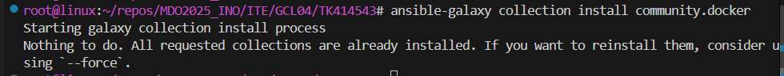

ansible-playbook -i inventories/hosts playbooks/deploy_container.yml

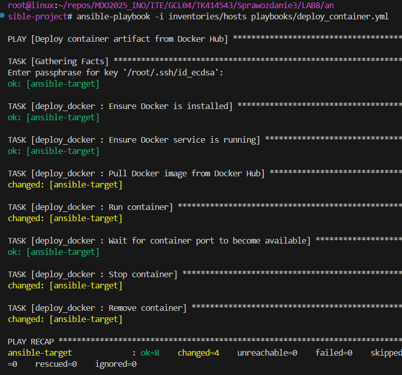

LAB9

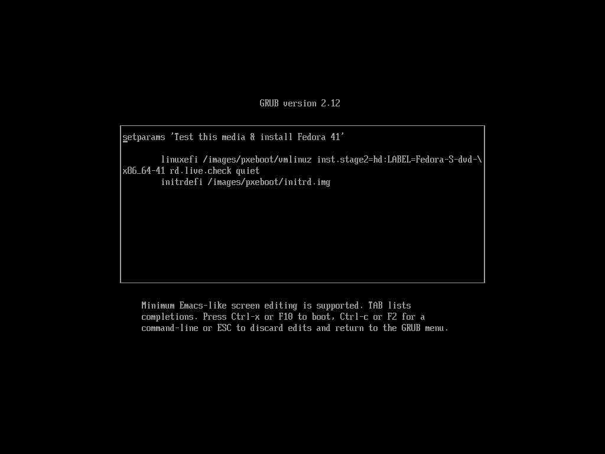

[text](https://raw.githubusercontent.com/InzynieriaOprogramowaniaAGH/MDO2025_INO/TK414543/ITE/GCL04/TK414543/Sprawozdanie3/LAB9/anaconda-ks.cfg
)

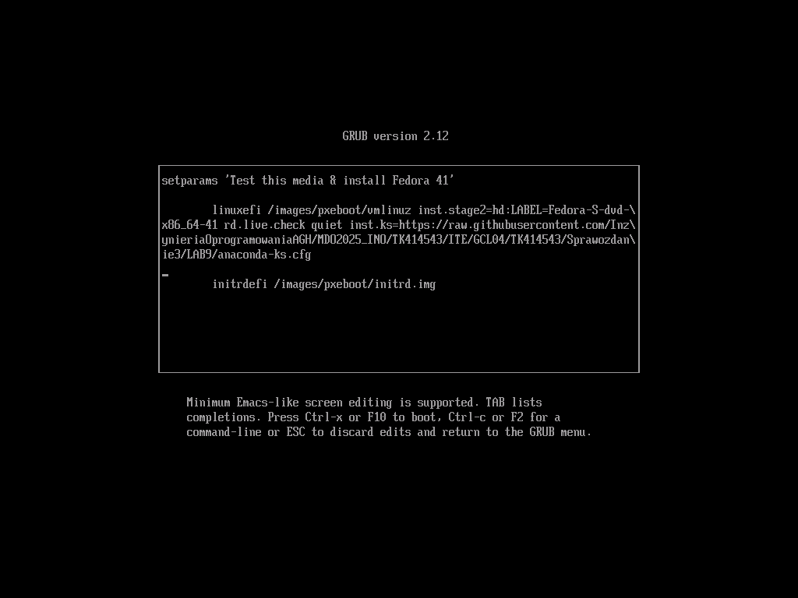

inst.ks=https://raw.githubusercontent.com/InzynieriaOprogramowaniaAGH/MDO2025_INO/TK414543/ITE/GCL04/TK414543/Sprawozdanie3/LAB9/anaconda-ks.cfg

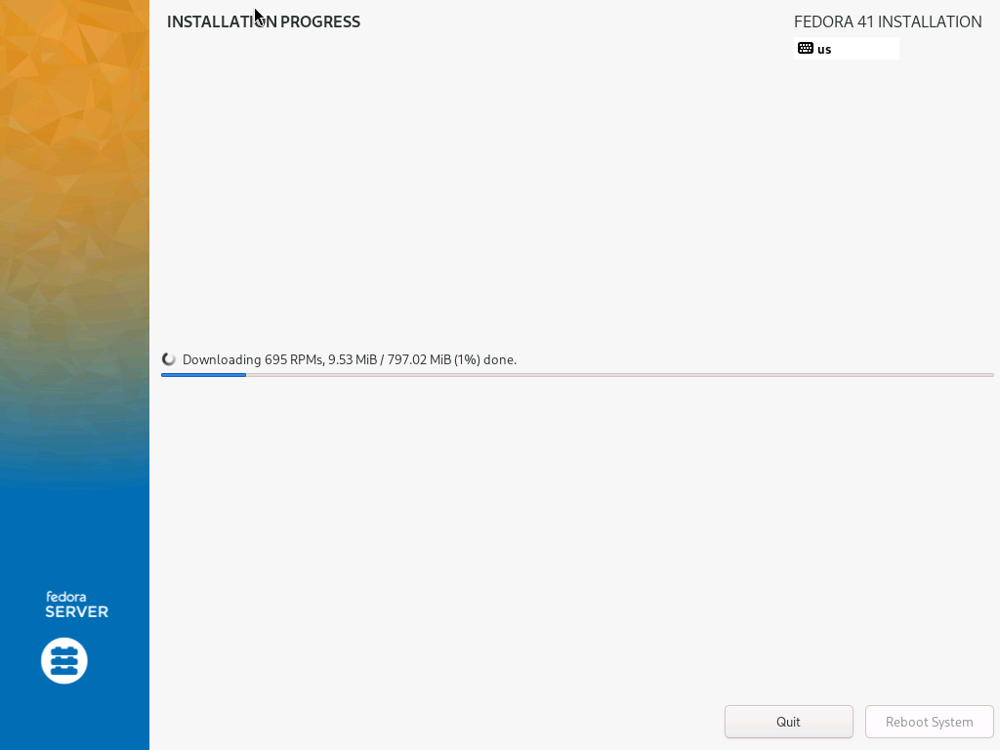

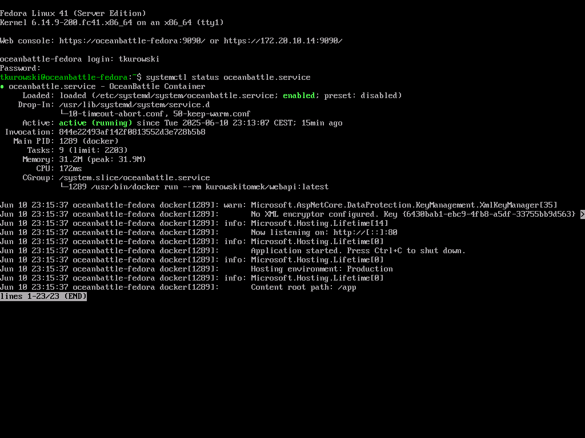

LAB10

sudo dnf install -y conntrack

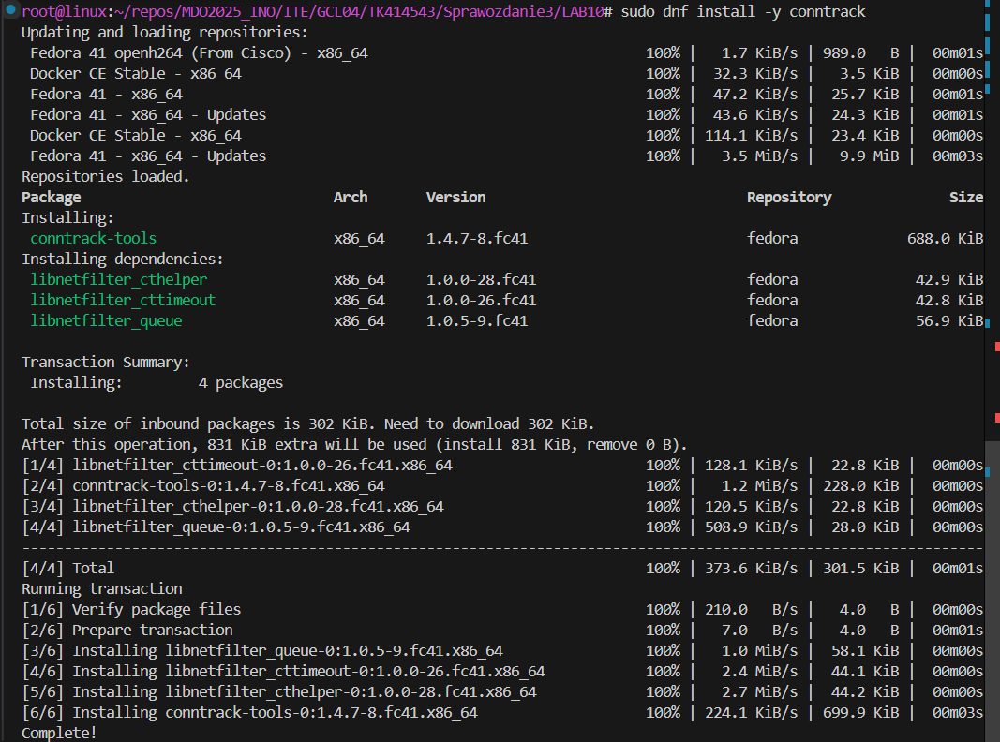

curl -LO https://storage.googleapis.com/minikube/releases/latest/minikube-latest.x86_64.rpm

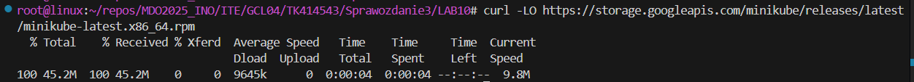

sudo rpm -Uvh minikube-latest.x86_64.rpm

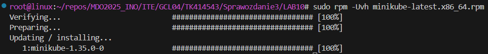

minikube start --driver=docker --force

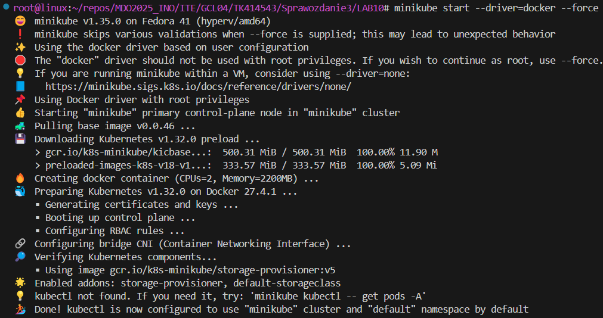

minikube kubectl -- get nodes

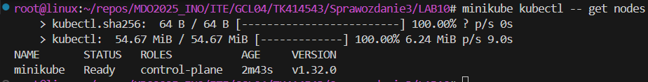

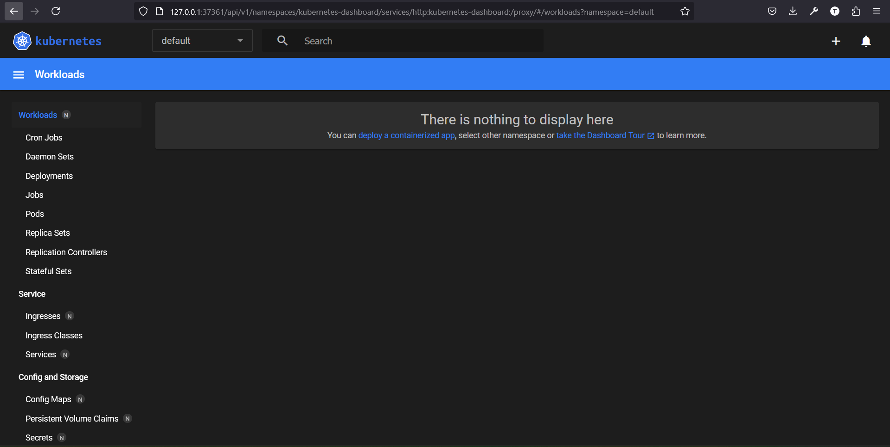

minikube dashboard

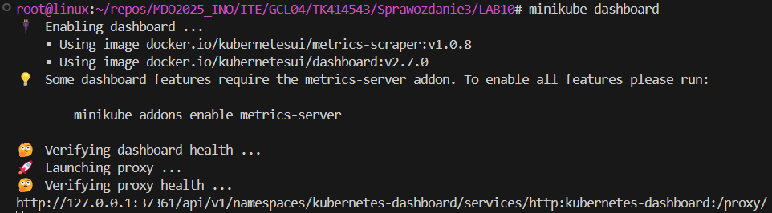

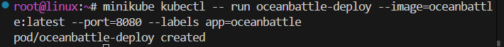

minikube kubectl -- run oceanbattle-webapi --image=docker.io/kurowskitomek/webapi:latest --port=80 --labels app=oceanbattle-webapi

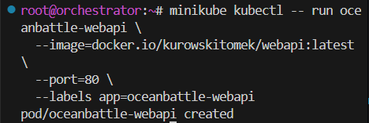

minikube kubectl -- get pods

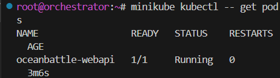

minikube kubectl -- describe pod oceanbattle-webapi

minikube kubectl port-forward pod/oceanbattle-webapi 8083:80
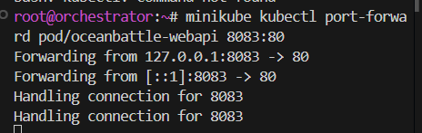

http://localhost:8083/api/auth/.well-known

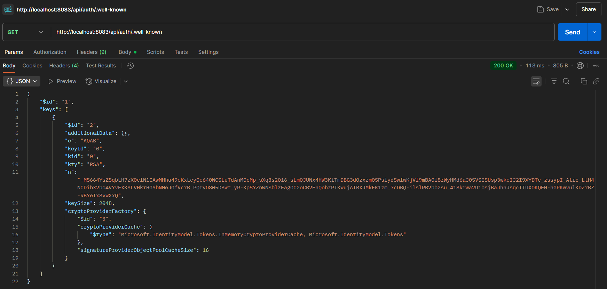

minikube kubectl -- apply -f oceanbattle-deployment.yaml

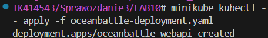

minikube kubectl rollout status deployment/oceanbattle-webapi

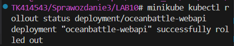
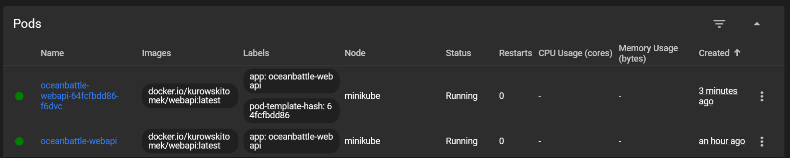

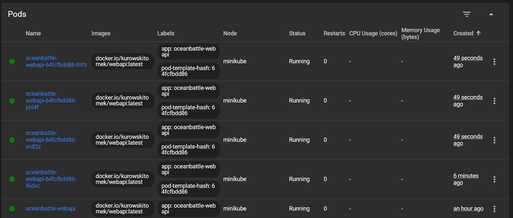

LAB11

