LAB8
sudo dnf install ansible -y
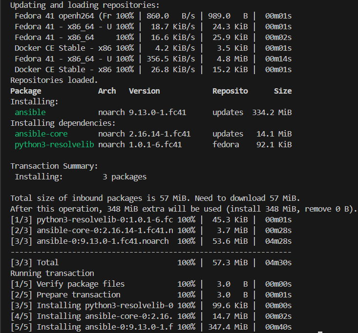

ansible --version
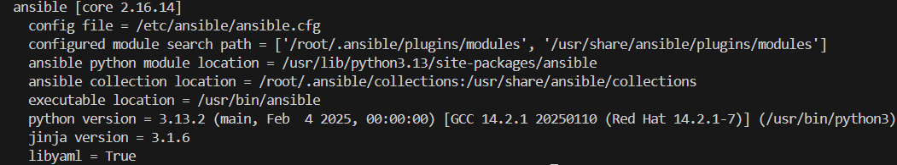

ssh-keygen -t ed25519 -C "ansible@orchestrator"

mkdir -p ./ansible-project/{inventories,playb
ooks,roles}

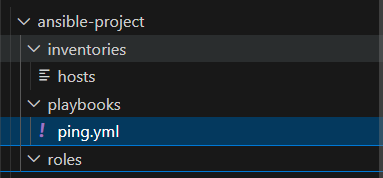

sudo hostnamectl set-hostname orchestrator
hostnamectl

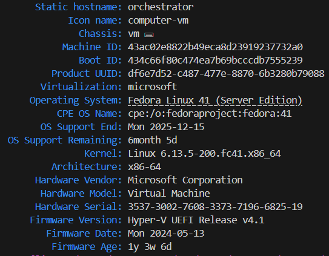

root
root_pass

ansible
my_pass

ip a

hostname: ansible-target
ip: 172.20.10.12

ip a

hostname: orchestrator
ip: 172.31.116.202

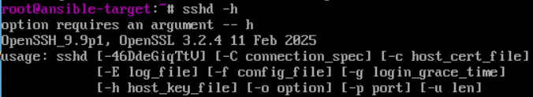
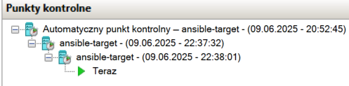

hostnamectl

sudo nano /etc/hosts
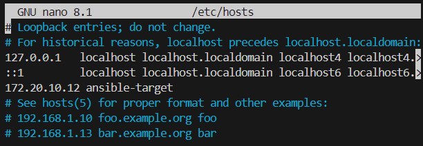

wymiana kluczy ssh
ssh-copy-id ansible@ansible-target
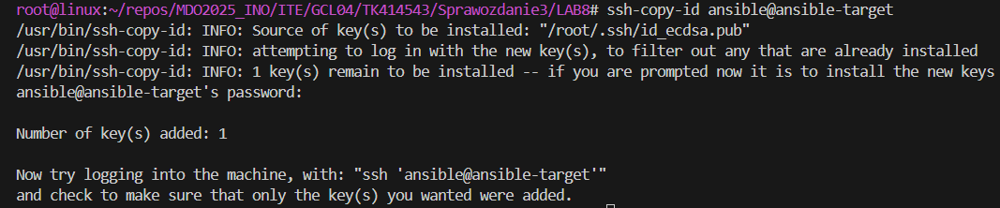

ansible@ansible-target
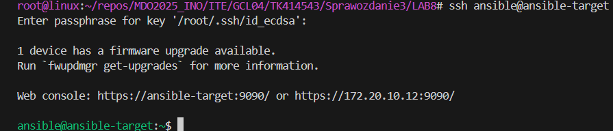

ansible -i inventories/hosts all -m ping
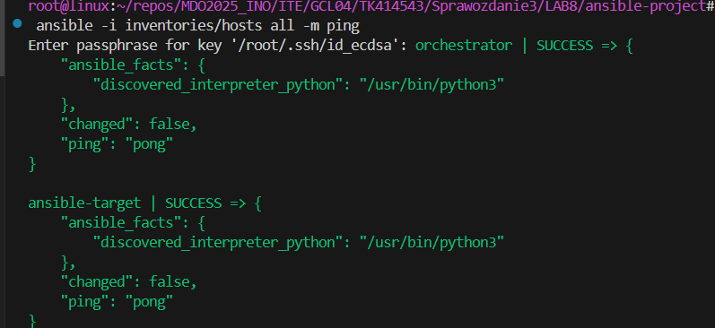

ansible-playbook -i inventories/hosts playbooks/copy_inventory.yml

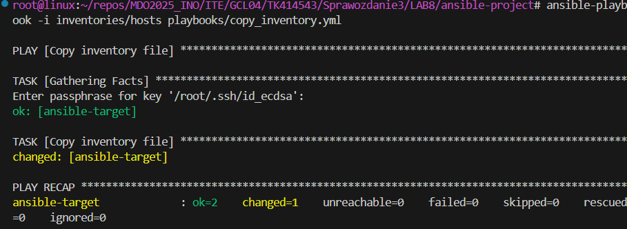

na zdalnej maszynie

echo 'ansible ALL=(ALL) NOPASSWD: ALL' | sudo tee /etc/sudoers.d/ansible
chmod 440 /etc/sudoers.d/ansible

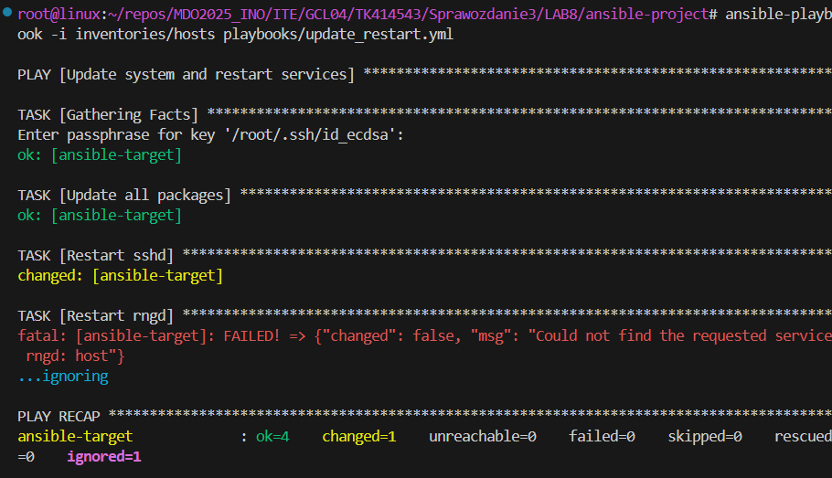

LAB9

LAB10

LAB11