# Sprawozdanie 3 - Tomasz Kurowski

## Laboratorium 8 - Automatyzacja i zdalne wykonywanie poleceń za pomocą Ansible

### Instalacja zarządcy Ansible

Utworzono drugą maszynę wirtualną z Fedorą 41 Server z minimalnym zbiorem oprogramowania, zapewniono obecność programu tar i serwera OpenSSH (sshd). 


W trakcie instalacji nadano hostname ansible-target oraz utworzono użytkownika ansible.
Na koniec stworzono migawkę maszyny.


Na pierwotnej maszynie zainstalowano ansible.

```
sudo dnf install ansible -y
```


Sprawdzono wersję ansible:

```
ansible --version
```


Ustawiono hostname pierwotnej maszyny na orchestrator.

```
sudo hostnamectl set-hostname orchestrator
hostnamectl
```


### Inwentaryzacja

Sprawdzono adersy orchestratora i ansible-target:

hostname: ansible-target
ip: 172.20.10.12

hostname: orchestrator
ip: 172.31.116.202

Wprowadzono nazwy DNS dla maszyn wirtualnych tak aby możliwe było ich wywoływanie za pomocą nazw:

```
hostnamectl
sudo nano /etc/hosts
```


Dokonano wymiany kluczy SSH między użytkownikiem w głównej maszynie wirtualnej, a użytkownikiem ansible z nowej tak, by logowanie nie wymagało podania hasła.

```
ssh-keygen -t ed25519 -C "ansible@orchestrator"
mkdir -p ./ansible-project/{inventories,playbooks,roles}
```


Wymiana kluczy ssh:

```
ssh-copy-id ansible@ansible-target
```


```
ansible@ansible-target
```


Stworzono [`plik`](./LAB8/ansible-project/inventories/hosts) inwentaryzacji:

```
[Orchestrators]
orchestrator ansible_connection=local

[Endpoints]
ansible-target ansible_user=ansible
```

Wysłano żądanie ping do wszystkich maszyn:

```
ansible -i inventories/hosts all -m ping
```


### Zdalne wywoływanie procedur

Utworzono [`playbook`](./LAB8/ansible-project/playbooks/copy_inventory.yml) i skopiowano z jego pomocą plik inwentaryzacji na maszynę.

```yaml
# playbooks/copy_inventory.yml
- name: Copy inventory file
  hosts: Endpoints
  tasks:
    - name: Copy inventory file
      copy:
        src: ../inventories/hosts
        dest: /home/ansible/hosts
        owner: ansible
        group: ansible
        mode: '0644'
```

```
ansible-playbook -i inventories/hosts playbooks/copy_inventory.yml
```


Na zdalnej maszynie:

Za pomocą [`playbooka`](./LAB8/ansible-project/playbooks/update_restart.yml) ansible wykonano próbę aktualizacji pakietów w systemie oraz restartu usłyg sshd i rngd.

```yaml
# playbooks/update_restart.yml
- name: Update system and restart services
  hosts: Endpoints
  become: yes
  tasks:
    - name: Update all packages
      dnf:
        name: "*"
        state: latest
    - name: Restart sshd
      service:
        name: sshd
        state: restarted
    - name: Restart rngd
      service:
        name: rngd
        state: restarted
      ignore_errors: yes 
```

```
echo 'ansible ALL=(ALL) NOPASSWD: ALL' | sudo tee /etc/sudoers.d/ansible
chmod 440 /etc/sudoers.d/ansible
```
```
ansible-playbook -i inventories/hosts playbooks/update_restart.yml
```


### Zarządzanie stworzonym artefaktem 

```
ansible-galaxy collection install community.docker
```


Za pomocą [`taska`](./LAB8/ansible-project/roles/deploy_docker/main.yml) ansible pobrano z Docker Hub aplikację oraz uruchomiono kontener.
Następnie zweryfikowano łączność i zatrzymano a potem usunięto kontener.

```yaml
- name: Ensure Docker is installed
  package:
    name: docker
    state: present
  become: true

- name: Ensure Docker service is running
  service:
    name: docker
    state: started
    enabled: true
  become: true

- name: Pull Docker image from Docker Hub
  community.docker.docker_image:
    name: "{{ docker_image }}"
    source: pull
    state: present

- name: Run container
  community.docker.docker_container:
    name: "{{ container_name }}"
    image: "{{ docker_image }}"
    state: started
    ports:
      - "8080:{{ container_port }}"

- name: Wait for container port to become available
  wait_for:
    port: 8080
    host: 127.0.0.1
    delay: 3
    timeout: 30

- name: Stop container
  community.docker.docker_container:
    name: "{{ container_name }}"
    state: stopped

- name: Remove container
  community.docker.docker_container:
    name: "{{ container_name }}"
    state: absent
```

Wykorzystano [`playbook`](./LAB8/ansible-project/playbooks/deploy_container.yml).

```yaml
- name: Deploy container artifact from Docker Hub
  hosts: Endpoints
  become: true
  roles:
    - deploy_docker
```

```
ansible-playbook -i inventories/hosts playbooks/deploy_container.yml
```


## Laboratorium 9 - Pliki odpowiedzi dla wdrożeń nienadzorowanych

Zainstalowano system Fedora używając wariantu Server i pobrano ['plik odpowiedzi'](.LAB9/anaconda-ks.cfg).

Zmodyfikowano plik tak aby zawsze formatował dysk, zawierał wzmiankę o wymaganych repozytoriach potrzebnych do uruchomienia programu zbudowanego w ramach pipeline'u. Program pracuje w kontenerze wiec konieczny jest Docker.

### plik instalacji nienadzorowanej

```anaconda
# Generated by Anaconda 41.35
# Generated by pykickstart v3.58
#version=DEVEL

url --mirrorlist=https://mirrors.fedoraproject.org/mirrorlist?repo=fedora-41&arch=x86_64
repo --name=updates --mirrorlist=https://mirrors.fedoraproject.org/mirrorlist?repo=updates-released-f41&arch=x86_64

# Keyboard layouts
keyboard --vckeymap=us --xlayouts='us'
# System language
lang en_US.UTF-8

# Network information
network --hostname=oceanbattle-fedora  --bootproto=dhcp --device=eth0 --ipv6=auto --activate

%packages
@^server-product-environment
docker
wget

%end


# Run the Setup Agent on first boot
firstboot --enable

# Generated using Blivet version 3.11.0
ignoredisk --only-use=sda

# Partition clearing information
clearpart --all --initlabel
autopart

# System timezone
timezone Europe/Warsaw --utc

# Root password
rootpw --iscrypted --allow-ssh $y$j9T$cMHNwX8ZrzXHLANmT6O3z3Ix$gFdmW7lGXR/iZjvrsxPgpExtHrX2Xt.U4uic.q79ro3
user --groups=wheel --name=tkurowski --password=$y$j9T$kp1.5QeZm4CD/3Vrle2mrMxm$6yO74KXCOy6tseAQ9SrQq3KxDSNuz0f1ucOQcogFYy8 --iscrypted --gecos="Tomasz Kurowski"


%post --log=/root/post-install.log
systemctl enable docker

# Pobierz obraz i uruchom po starcie (utwórz plik usługi)
cat > /etc/systemd/system/oceanbattle.service << EOF
[Unit]
Description=OceanBattle Container
After=docker.service
Requires=docker.service

[Service]
Restart=always
ExecStart=/usr/bin/docker run --rm kurowskitomek/webapi:latest
ExecStop=/usr/bin/docker stop webapi

[Install]
WantedBy=multi-user.target
EOF

systemctl enable oceanbattle.service
%end

```

Uruchomiono instalację systemu i wciśnięto przycisk "e" aby przejść do ekranu konfiguracji.


Wprowadzono adres do pobrania pliku instalacji nienadzorowanej.

```
inst.ks=https://raw.githubusercontent.com/InzynieriaOprogramowaniaAGH/MDO2025_INO/TK414543/ITE/GCL04/TK414543/Sprawozdanie3/LAB9/anaconda-ks.cfg
```


Instalacja uruchomiła się pomyślnie.


Instalacja zakończyła sie pomyślnie.


## Laboratorium 10 - Wdrażanie na zarządzalne kontenery: Kubernetes (1)

Zaopatrzono się w implementację stosu minikube i przerowadzono instalację.

```
sudo dnf install -y conntrack
```


```
curl -LO https://storage.googleapis.com/minikube/releases/latest/minikube-latest.x86_64.rpm
```


```
sudo rpm -Uvh minikube-latest.x86_64.rpm
```


```
minikube start --driver=docker --force
```


```
minikube kubectl -- get nodes
```


Uruchomiono Dashboard.

```
minikube dashboard
```


### Uruchamianie oprogramowania

Uruchomiono kontener z aplikacją na stosie k8s.
Pod działa co widać na screenach z Dashboardu oraz terminala.

```
minikube kubectl -- run oceanbattle-webapi --image=docker.io/kurowskitomek/webapi:latest --port=80 --labels app=oceanbattle-webapi
```


```
minikube kubectl -- get pods
```


Aby dotrzeć do eksponowanej funkcjonalności, wyprowadzono port.

```
minikube kubectl -- describe pod oceanbattle-webapi
minikube kubectl port-forward pod/oceanbattle-webapi 8083:80
```


Komunikacja z eksponowaną funkcjonalnością zadziałała prawidłowo.

```
http://localhost:8083/api/auth/.well-known
```

### Przekucie wdrożenia manualnego w plik wdrożenia

Wdrożenie zapisano jako ['plik yaml']("./LAB10/oceanbattle-deployment.yaml").

```yaml
apiVersion: apps/v1
kind: Deployment
metadata:
  name: oceanbattle-webapi
spec:
  replicas: 4
  selector:
    matchLabels:
      app: oceanbattle-webapi
  template:
    metadata:
      labels:
        app: oceanbattle-webapi
    spec:
      containers:
      - name: moja-apka
        image: docker.io/kurowskitomek/webapi:latest
        ports:
        - containerPort: 80
```


Przeprowadzono próbne wdrożenie deploymentu.
Wykonano kubectl apply na pliku.

```
minikube kubectl -- apply -f oceanbattle-deployment.yaml
```


```
minikube kubectl rollout status deployment/oceanbattle-webapi
```


Wzbogacono deployment o 4 repliki.

```
minikube kubectl --  apply -f oceanbattle-service.yaml
```

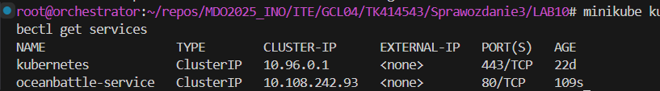

wyeksportowano wdrożenie jako ['serwis'](./LAB10/oceanbattle-service.yaml).

Przekierowano także port serwisu.

```yaml
apiVersion: v1
kind: Service
metadata:
  name: oceanbattle-service
spec:
  selector:
    app: oceanbattle-webapi
  ports:
    - protocol: TCP
      port: 80
      targetPort: 80 
  type: ClusterIP
```

```
minikube kubectl port-forward service/oceanbattle-service 8084:80
```

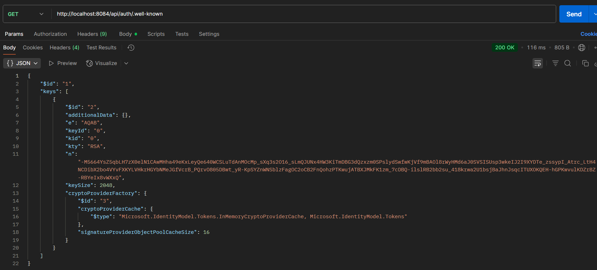

## Laboratorium 11 - Wdrażanie na zarządzalne kontenery: Kubernetes (2)

### Przygotowanie nowego obrazu

Zarejestrowno nową wersję obrazu Deploy w Docker Hub.

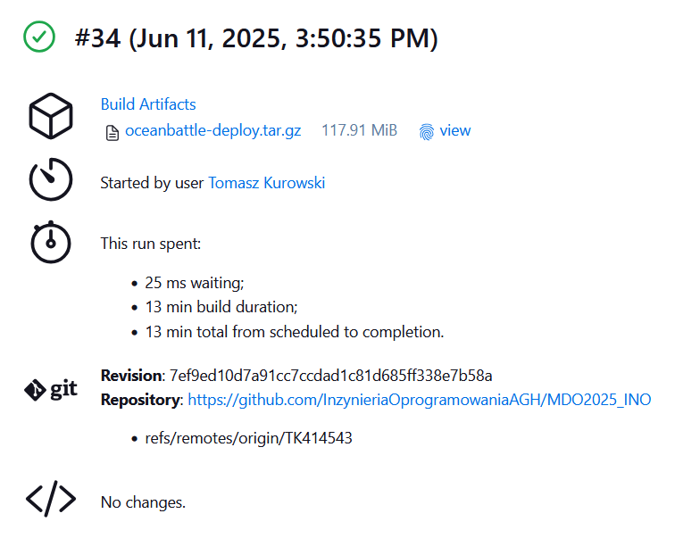

```
docker build -f Dockerfile.deploy -t oceanbattle-deploy .
docker run --rm oceanbattle-deploy
```

Stworzono kontener generujący błąd

Zwiększono liczbę replik do 8


Zmniejszono liczbę replik do 1

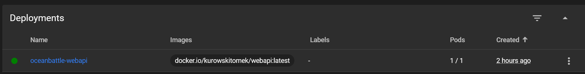

Zmniejszono liczbę replik do 0

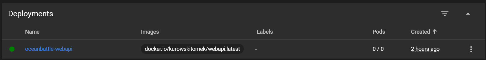

Przeskalowano liczbę replik w górę do 4

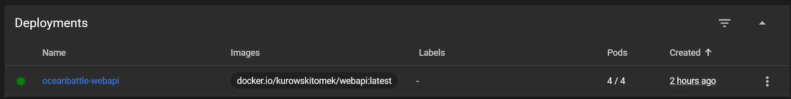

Zmieniono z nowej wersji na starą

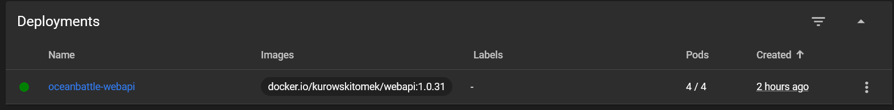

Wykonano powrót do najnowszej wersji:

```
minikube kubectl rollout history deployment oceanbattle-webapi
minikube kubectl -- rollout undo deployment/oceanbattle-webapi --to-revision=1
```

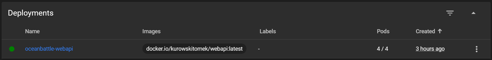


Napisano [`skrypt`](./LAB11/verify-rollout.sh) sprawdzający czy wdrożenie zdążyło się wykonać.

```bash
#!/bin/bash
deployment_name="oceanbattle-webapi"
timeout=60
interval=5
elapsed=0

while [ $elapsed -lt $timeout ]; do
  status=$(minikube kubectl -- rollout status deployment/$deployment_name)
  echo "$status"
  if [[ "$status" == *"successfully rolled out"* ]]; then
    echo "Deployment successful"
    exit 0
  fi
  sleep $interval
  elapsed=$((elapsed + interval))
done

echo "Deployment did not finish in time"
exit 1
```

Nadano uprawnienia dla skryptu:

```
chmod +x verify-rollout.sh
```

Zastosowanie skryptu:

```
minikube kubectl -- apply -f ../LAB10/oceanbattle-deployment.yaml
./verify-rollout.sh
```

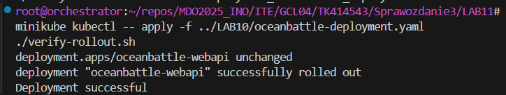

### Strategie wdrożenia

Stworzono 3 pliki wdrożeń.

* ['Rolling Update'](./LAB11/oceanbattle-deployment-rolling.yaml)

```yaml
apiVersion: apps/v1
kind: Deployment
metadata:
  name: oceanbattle-webapi-rolling
  labels:
    app: oceanbattle-webapi
    strategy: rolling
spec:
  strategy:
    type: RollingUpdate
    rollingUpdate:
      maxSurge: 25%
      maxUnavailable: 25%
  replicas: 4
  selector:
    matchLabels:
      app: oceanbattle-webapi
      strategy: rolling
  template:
    metadata:
      labels:
        app: oceanbattle-webapi
        strategy: rolling
    spec:
      containers:
      - name: oceanbattle-webapi
        image: docker.io/kurowskitomek/webapi:latest
        ports:
        - containerPort: 80

---
apiVersion: v1
kind: Service
metadata:
  name: oceanbattle-rolling-service
  labels:
    app: oceanbattle-webapi
    strategy: rolling
spec:
  selector:
    app: oceanbattle-webapi
    strategy: rolling
  ports:
  - protocol: TCP
    port: 80
    targetPort: 80
```

W przypadku Rolling Update aktualizacja podów odbywa się stopniowo – nowe wersje są uruchamiane pojedynczo, a stare usuwane dopiero po ich poprawnym wystartowaniu. Dzięki temu aplikacja pozostaje dostępna podczas całego procesu aktualizacji, co minimalizuje lub eliminuje downtime.

```
minikube kubectl -- apply -f oceanbattle-deployment-rolling.yaml
```

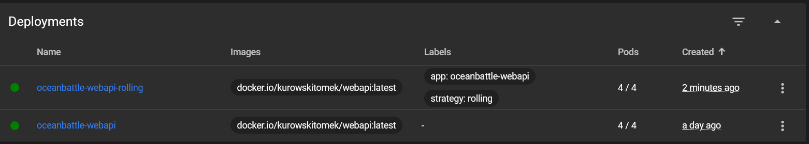

* ['Recreate'](./LAB11/oceanbattle-deployment-recreate.yaml)

```yaml
apiVersion: apps/v1
kind: Deployment
metadata:
  name: oceanbattle-webapi-recreate
  labels:
    app: oceanbattle-webapi
    strategy: recreate
spec:
  strategy:
    type: Recreate
  replicas: 4
  selector:
    matchLabels:
      app: oceanbattle-webapi
      strategy: recreate
  template:
    metadata:
      labels:
        app: oceanbattle-webapi
        strategy: recreate
    spec:
      containers:
      - name: oceanbattle-webapi
        image: docker.io/kurowskitomek/webapi:latest
        ports:
        - containerPort: 80

---
apiVersion: v1
kind: Service
metadata:
  name: oceanbattle-recreate-service
  labels:
    app: oceanbattle-webapi
    strategy: recreate
spec:
  selector:
    app: oceanbattle-webapi
    strategy: recreate
  ports:
  - protocol: TCP
    port: 80
    targetPort: 80
```

W przypadku Recreate w momencie podniesienia wersji podów są one wszystkie zatrzymywane, a następnie uruchamiane ponownie z nową wersją. Jest to najprostszy sposób aktualizacji, lecz powoduje downtime całej aplikacji.

```
minikube kubectl -- apply -f oceanbattle-deployment-recreate.yaml
```

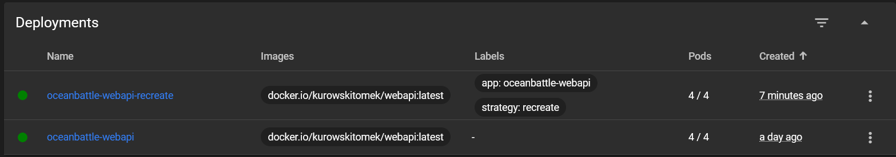

* ['Canary'](./LAB11/oceanbattle-deployment-canary.yaml)

```yaml
apiVersion: apps/v1
kind: Deployment
metadata:
  name: oceanbattle-webapi-stable
  labels:
    app: oceanbattle-webapi
    version: stable
    strategy: canary
spec:
  replicas: 3
  selector:
    matchLabels:
      app: oceanbattle-webapi
      version: stable
      strategy: canary
  template:
    metadata:
      labels:
        app: oceanbattle-webapi
        version: stable
        strategy: canary
    spec:
      containers:
      - name: oceanbattle-webapi
        image: docker.io/kurowskitomek/webapi:1.0.31
        ports:
        - containerPort: 80
---
apiVersion: apps/v1
kind: Deployment
metadata:
  name: oceanbattle-webapi-canary
  labels:
    app: oceanbattle-webapi
    version: canary
    strategy: recreate
spec:
  replicas: 1
  selector:
    matchLabels:
      app: oceanbattle-webapi
      version: canary
      strategy: recreate
  template:
    metadata:
      labels:
        app: oceanbattle-webapi
        version: canary
        strategy: recreate
    spec:
      containers:
      - name: oceanbattle-webapi
        image: docker.io/kurowskitomek/webapi:latest
        ports:
        - containerPort: 80
---
apiVersion: v1
kind: Service
metadata:
  name: oceanbattle-canary-service
  labels:
    app: oceanbattle-webapi
    strategy: canary
spec:
  selector:
    app: oceanbattle-webapi
    strategy: canary
  ports:
  - protocol: TCP
    port: 80
    targetPort: 80

```

Canary Deployment polega na wdrożeniu nowej wersji aplikacji tylko na części podów, podczas gdy reszta nadal działa na starej wersji. Umożliwia to przetestowanie nowej wersji na ograniczonej liczbie użytkowników i szybkie wycofanie zmian w razie problemów, bez wpływu na całą aplikację.

```
minikube kubectl -- apply -f oceanbattle-deployment-canary.yaml
```

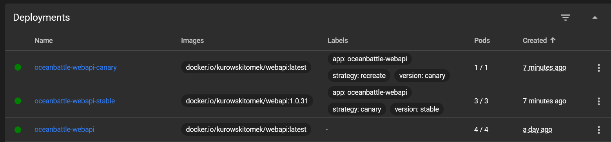