# Sprawozdanie 1 - Tomasz Kurowski

1. Zainstalowano klienta Git i obsługę kluczy SSH

   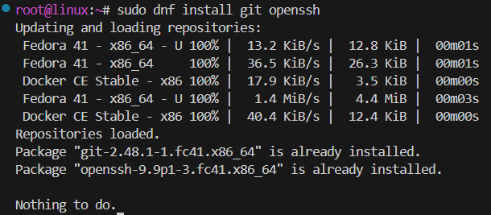
   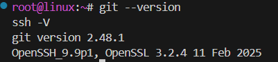

2. Sklonowano [repozytorium przedmiotowe](https://github.com/InzynieriaOprogramowaniaAGH/MDO2025_INO) za pomocą HTTPS i [*personal access token*](https://docs.github.com/en/authentication/keeping-your-account-and-data-secure/managing-your-personal-access-tokens)

   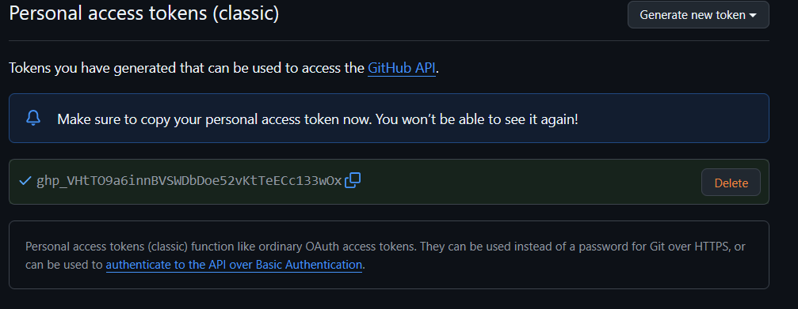
   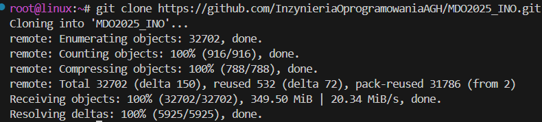

3. Sklonowano repozytorium za pomocą utworzonego klucza SSH.
   - Utworzono dwa klucze SSH, inne niż RSA, oba zabezpieczone hasłem
   
      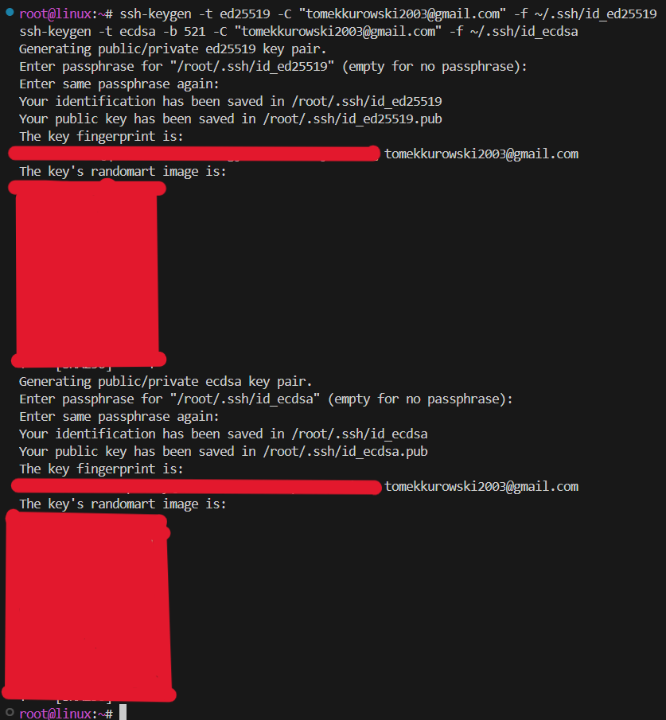
      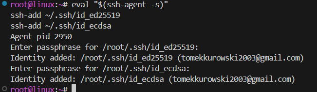
   
   - Skonfigurowano klucz SSH jako metodę dostępu do GitHuba
   
      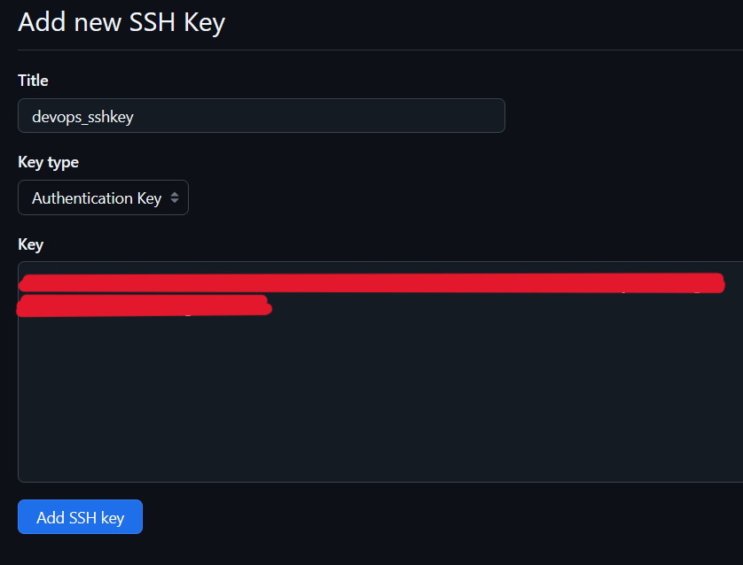
      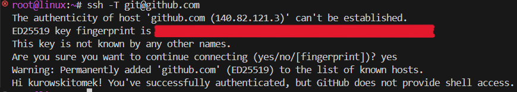
   
   - Sklonowano repozytorium z wykorzystaniem protokołu SSH
   
      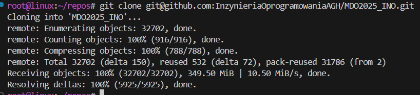
   
   - Skonfigurowano 2FA
   
      

4. Przełączono się na gałąź ```main```, a potem na gałąź swojej grupy (GCL04)

   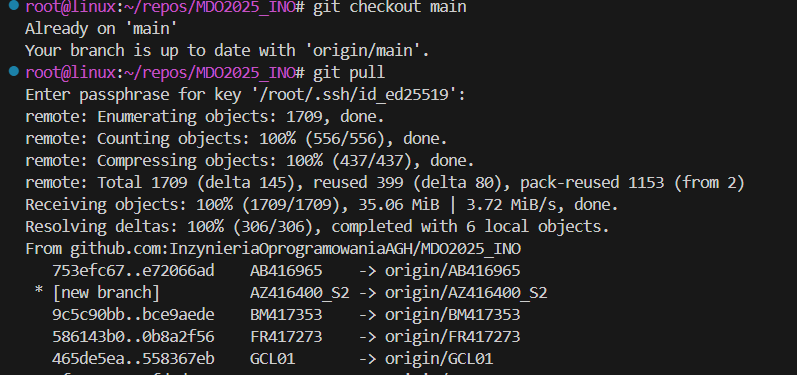
   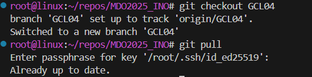

5. Utwórzono gałąź o nazwie "TK414543".

   
   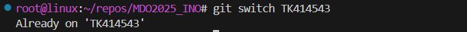

6. Rozpoczęto pracę na nowej gałęzi
   - W katalogu GCL04 utwórzono nowy katalog TK414543
   
      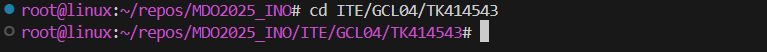
   
   - Napisano [Git hooka](https://git-scm.com/book/en/v2/Customizing-Git-Git-Hooks) - weryfikującego, że każdy "commit message" zaczyna się od "TK414543".
   
   - Treść git hooke'a:
   
      ```bash
      #!/bin/bash
      COMMIT_MSG_FILE=$1
      PREFIX="TK414543"

      if ! grep -q "^$PREFIX" "$COMMIT_MSG_FILE"; then
         echo "Commit message must start from $PREFIX"
         exit 1
      fi
      ```

   - Dodano ten skrypt do stworzonego wcześniej TK414543.
   
      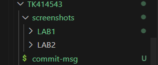
   
   - Skopiowano go do katalogu ".git/hooks, tak by uruchamiał się za każdym razem przy wykonywaniu commita.
  
      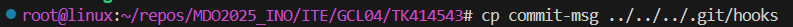
      

   - W katalogu TK414543 dodano plik ze sprawozdaniem
   
      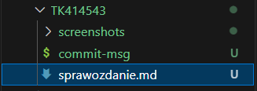
   
   - Wysłano zmiany do zdalnego źródła
   - Wciągnięto swoją gałąź do gałęzi grupowej

