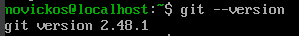
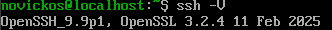

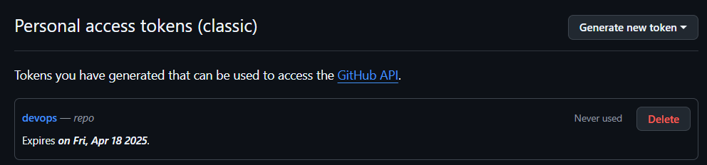
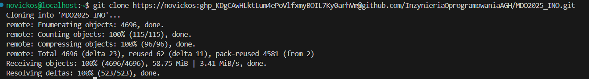
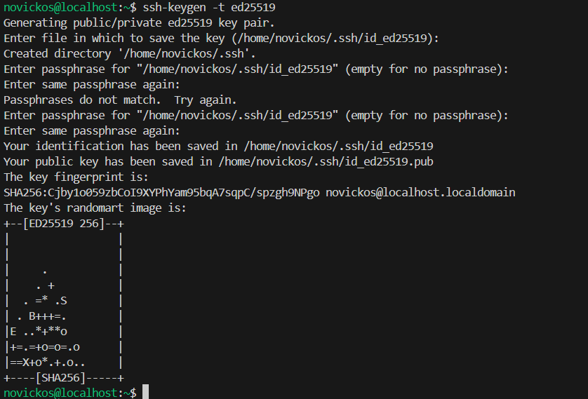
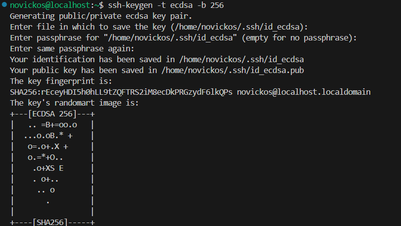
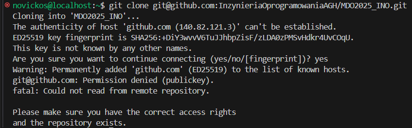
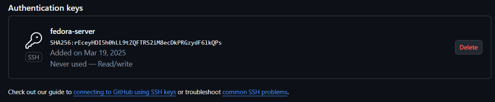
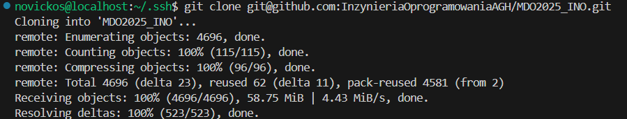
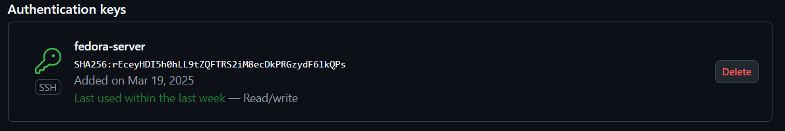

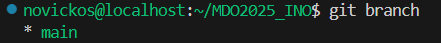
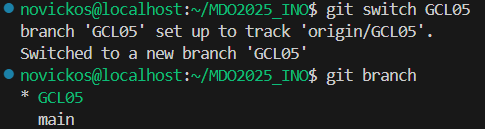
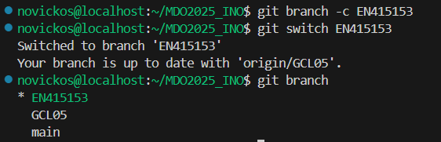
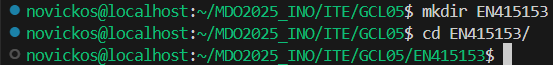


```bash
#!/bin/bash

PREFIX="EN415153"
COMMIT_MSG_FILE="$1"
FIRST_LINE=$(head -n 1 "$COMMIT_MSG_FILE")

if [[ ! "$FIRST_LINE" =~ ^"$PREFIX" ]]; then
    echo "Commit musi zaczynac sie od: '$PREFIX'"
    exit 1
fi

exit 0
```

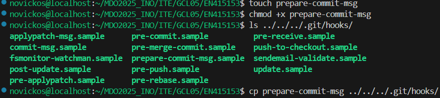
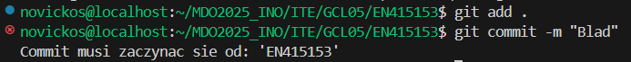
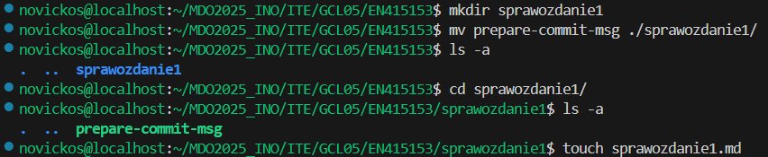
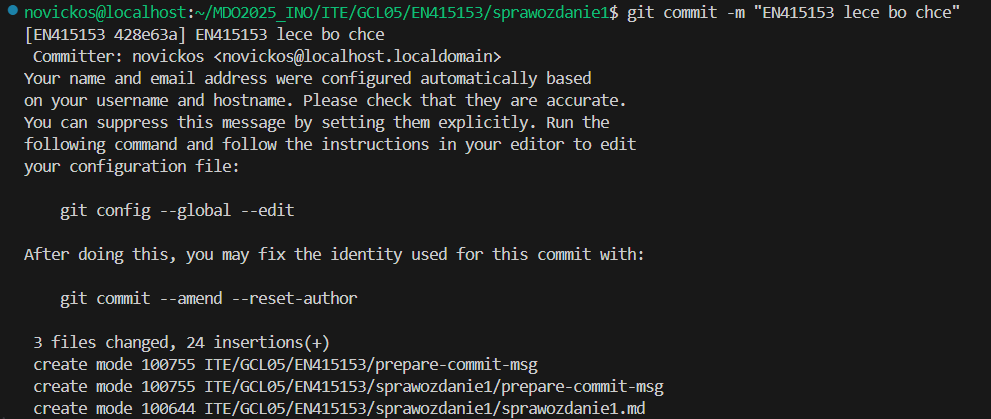
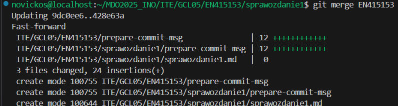


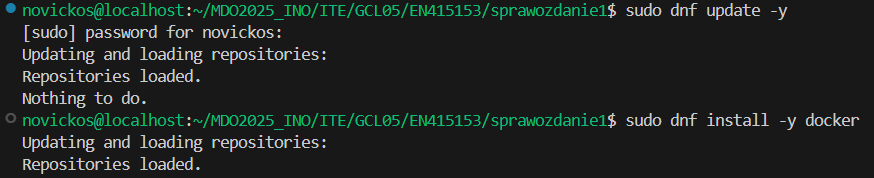
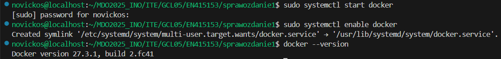
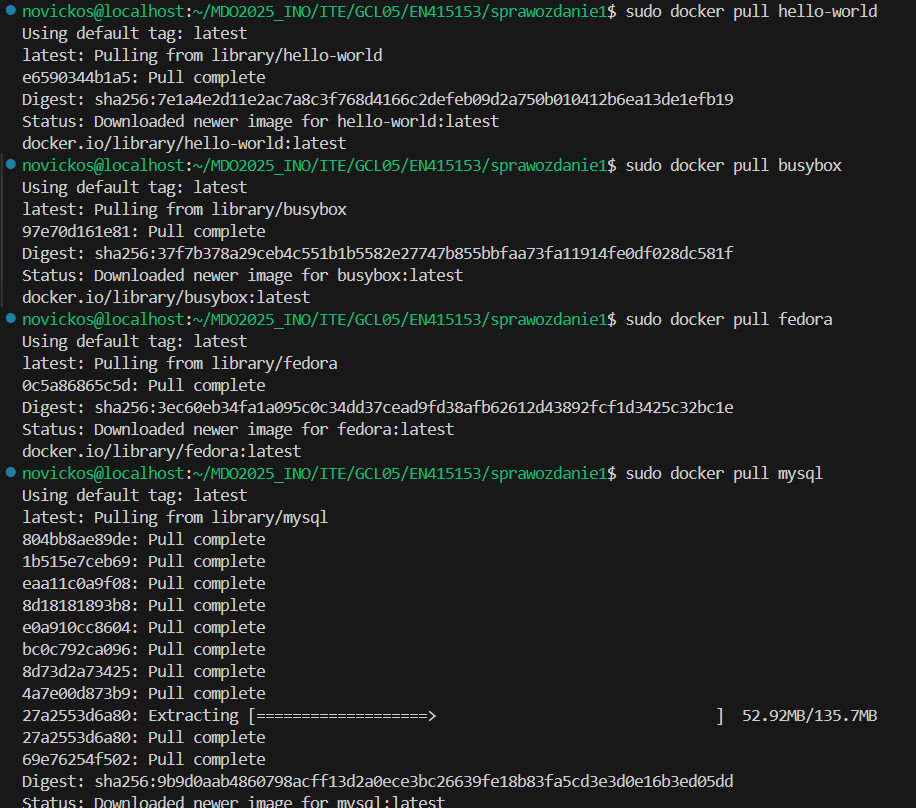
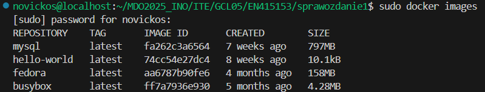
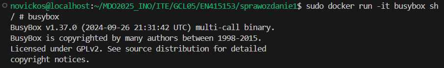
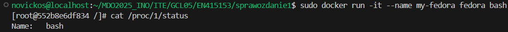
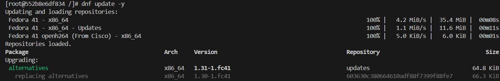
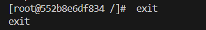


```bash
FROM fedora:latest
RUN dnf update -y && dnf install -y git
WORKDIR /app
RUN git clone https://github.com/InzynieriaOprogramowaniaAGH/MDO2025_INO.git .
CMD ["/bin/bash"]
```


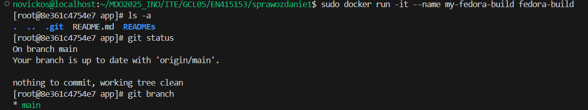
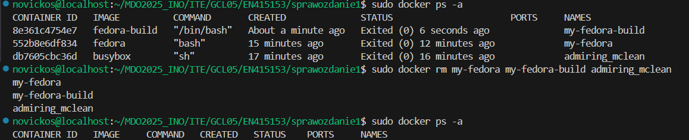
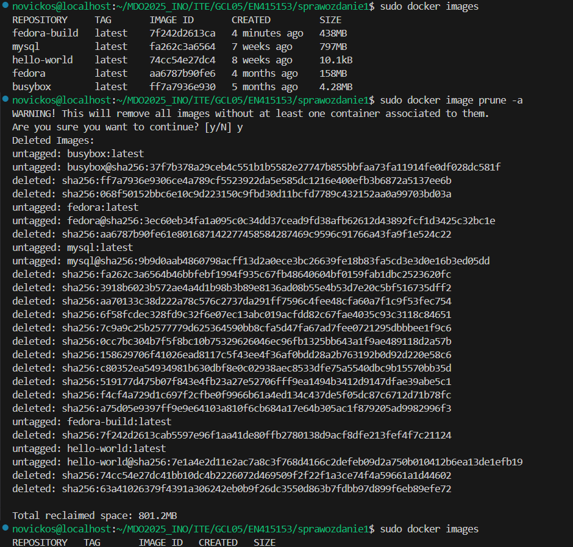