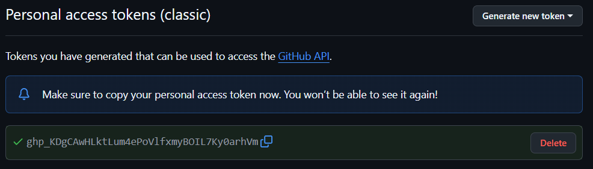
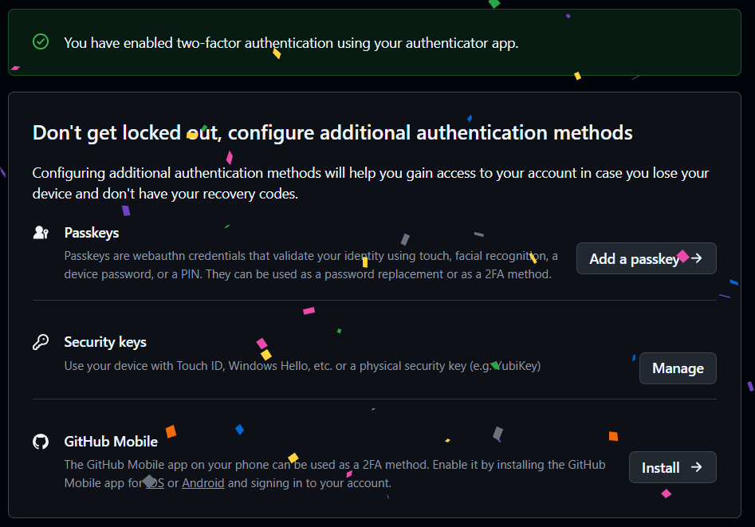
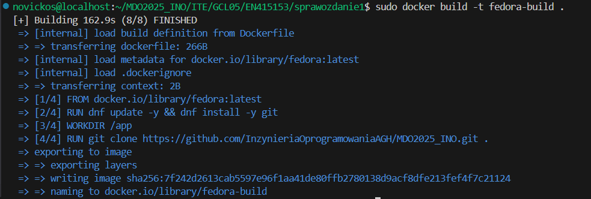

# header 1
## header 2
### header 3
`Jakas nazwa`

```bash
cd ..
```

```dockerfile
FROM fedora:latest
```

### docker-compose
```yml
services: 


```

# Sprawozdanie 1
## Lab 1 - Wprowadzenie, Git, Gałęzie, SSH

### 1. Instalacja Gita i SSH

Zainstalowano SSH i Gita. Następnie sprawdzono ich wersje, aby upewnić się, że działają poprawnie. 


### 2. Klonowanie repozytorium

#### Stworzenie tokenów




#### Sklonowanie repozytorium z użyciem tokenu

   

### 3. Konfiguracja SSH

#### Tworzenie kluczy `ed25519`


Nie dodano klucza do Githuba, co poskutowało niepowodzeniem klonowania 


Po dodaniu klucza, klonowanie się powiodło.


#### Skonfigurowano 2FA


### 4. Praca z gałęziami
#### Gałąź `main`


#### Przełączono na gałąź grupy 05


#### Utworzono i przełączono na gałąź `EN415153`


#### Napisano skrypt Githook weryfikujący, że każdy commit message zaczyna się od właściwych inicjałów i numeru indexu


```bash
#!/bin/bash

PREFIX="EN415153"
COMMIT_MSG_FILE="$1"
FIRST_LINE=$(head -n 1 "$COMMIT_MSG_FILE")

if [[ ! "$FIRST_LINE" =~ ^"$PREFIX" ]]; then
    echo "Commit musi zaczynac sie od: '$PREFIX'"
    exit 1
fi

exit 0
```


Zaprezentowano działanie Githooka


#### Utworzono sprawozdanie


#### Commit zmian


#### Merge gałęzi


## 2. Docker

#### Zainstalowano docker


#### Uruchomiono docker


#### Pobrano obrazy hello-world, busybox, fedora, mysql


#### Wyświetlono pobrane obrazy


#### Uruchomiono kontener `busybox`


#### Uruchomiono kontener na podstawie obrazu Fedora


#### Zaktualizowano pakiety


#### 

```Dockerfile
FROM fedora:latest
RUN dnf update -y && dnf install -y git
WORKDIR /app
RUN git clone https://github.com/InzynieriaOprogramowaniaAGH/MDO2025_INO.git .
CMD ["/bin/bash"]
```




# class003


 
 
 
 
 
 
 
 
 
 


# class004

 
 
 
 
 
 
 
 
 
 
 
 
 
 
 
 
 
 
 
 
 
 
 
 
 
 
 
 
 
 
 
 
 

```bash
    1  sudo dnf install openssh-server
    2  sudo systemctl enable --now sshd
    3  sudo systemctl status
    4  ip a
    5  poweroff
    6  exit
    7  git clone https://novickos:<GPA>@github.com/InzynieriaOprogramowaniaAGH/MDO2025_INO.git
    8  rm -rf MDO2025_INO/
    9  ssh-keygen -t ed25519
   10  ssh-keygen -t ecdsa -b 256
   11  git clone git@github.com:InzynieriaOprogramowaniaAGH/MDO2025_INO.git
   12  ls -a
   13  cd .ssh/
   14  ls -a
   15  cut id_ecdsa.pub
   16  cat id_ecdsa.pub
   17  git clone git@github.com:InzynieriaOprogramowaniaAGH/MDO2025_INO.git
   18  rm -rf MDO2025_INO/
   19  cd ..
   20  git clone git@github.com:InzynieriaOprogramowaniaAGH/MDO2025_INO.git
   21  cd MDO2025_INO/
   22  git branch
   23  git fetch
   24  git branch -a
   25  git switch GCL05
   26  git branch
   27  git branch -c EN415153
   28  git switch EN415153 
   29  git branch
   30  touch prepare-commit-msg
   31  chmod +x prepare-commit-msg
   32  rm prepare-commit-msg 
   33  ls -a
   34  cd ITE/GCL05/
   35  ls -a
   36  mkdir EN415153
   37  cd EN415153/
   38  touch prepare-commit-msg
   39  chmod +x prepare-commit-msg 
   40  code 
   41  cd ITE/GCL05/EN415153/
   42  ls -a
   43  rm prepare-commit-msg 
   44  touch prepare-commit-msg
   45  chmod +x prepare-commit-msg 
   46  ls ../../../.git/hooks/
   47  cp prepare-commit-msg ../../../.git/hooks/
   48  ls -a ../../../.git/hooks/
   49  ls -l ../../../.git/hooks/
   50  git commit -m "Blad"
   51  git add .
   52  git commit -m "Blad"
   53  mkdir sprawozdanie1
   54  cp prepare-commit-msg ./sprawozdanie1/
   55  ls -a
   56  rm -rf sprawozdanie1/
   57  mkdir sprawozdanie1
   58  mv prepare-commit-msg ./sprawozdanie1/
   59  ls -a
   60  cd sprawozdanie1/
   61  ls -a
   62  touch sprawozdanie1.md
   63  git add .
   64  git commit -m "EN415153 lece bo chce"
   65  git status
   66  git switch GCL05
   67  git pull origin GCL05
   68  git merge EN415153 
   69  git switch EN415153 
   70  git status
   71  git branch
   72  mkdir ss
   73  git add .
   74  git commit -m "EN415153 dodane sprawozdanie" 
   75  git status
   76  git switch GCL05
   77  git merge EN415153 
   78  git switch EN415153 
   79  git branch
   80  git push origin EN415153 
   81  git add .
   82  git commit -m "EN415153 dodanie skryptu do sprawozdania"
   83  git push origin EN415153 
   84  git status
   85  sudo dnf update -y
   86  sudo dnf install -y docker
   87  sudo systemctl start docker
   88  sudo systemctl enable docker
   89  docker --version
   90  sudo docker pull hello-world
   91  sudo docker pull busybox
   92  sudo docker pull fedora
   93  sudo docker pull mysql
   94  sudo docker images
   95  sudo docker run -it --name my-busybox sh
   96  sudo docker run -it busybox sh
   97  sudo docker ps -a
   98  sudo docker run -it --name my-fedora fedora bash
   99  touch Dockerfile
  100  sudo docker build -t fedora-build .
  101  sudo docker run -it --name my-fedora-build fedora-build 
  102  sudo docker ps -a
  103  sudo docker rm my-fedora my-fedora-build admiring_mclean
  104  sudo docker ps -a
  105  sudo docker images
  106  sudo docker image prune -a 
  107  sudo docker images
  108  git status
  109  git add .
  110  git commit -m "EN415153 class002"
  111  git push origin EN415153 
  112  git branch
  113  git switch GCL05
  114  git merge EN415153 
  115  git switch EN415153 
  116  ip a
  117  sudo dnf install git
  118  git --version
  119  sshd --version
  120  sshd -v
  121  ssh -V
  122  ip a
  123  poweroff
  124  git clone https://github.com/irssi/irssi
  125  cd irssi
  126  meson Build
  127  sudo dnf install  meson ninja-build
  128  meson build
  129  ninja -C Build && sudo ninja -C Build install
  130  ninja -C build && sudo ninja -C Build install
  131  ninja -C Build && sudo ninja -C build install
  132  ninja -C build && sudo ninja -C build install
  133  meson build
  134  ninja -C Build && sudo ninja -C Build install
  135  sudo dnf install -y gcc gcc-c++ make
  136  meson build
  137  sudo dnf install -y glib2-devel
  138  meson build
  139  ninja -C Build && sudo ninja -C Build install
  140  sudo dnf install -y ncurses-devel utf8proc-devel
  141  meson build
  142  sudo dnf install -y openssl-devel
  143  meson build
  144  perl -v
  145  perl -MExtUtils::Embed -e ccopts
  146  sudo dnf install -y perl-devel
  147  meson build
  148  perl -v
  149  perl -MExtUtils::Embed -e ccopts
  150  sudo apt install -y libperl-dev
  151  sudo dnf install -y libperl-dev
  152  sudo dnf install -y perl-devel
  153  perl -MExtUtils::Embed -e ccopts
  154  sudo dnf install perl-ExtUtils-Embed
  155  perl -MExtUtils::Embed -e ccopts
  156  meson build
  157  sudo dnf install -y libgcrypt-devel
  158  sudo dnf install -y libotr-devel
  159  sudo dnf install -y cmake
  160  meson build
  161  ip a
  162  docker ps 
  163  sudo groupadd docker
  164  sudo usermod -aG docker $USER
  165  newgrp docker
  166  poweroff
  167  docker ps
  168   docker images
  169  docker ps -a
  170  git clone https://github.com/doctest/doctest.git
  171  ls -la
  172  rm -rf doctest
  173  ls -la
  174  cd ..
  175  git clone https://github.com/doctest/doctest.git
  176  sudo dnf install -y cmake g++
  177  cd doctest
  178  mkdir build && cd build && cmake .. && make -j$(nproc) 
  179  make test
  180  docker pull fedora
  181  docker run -it --name my-fedora fedora sh
  182  cd ../..
  183  cd MDO2025_INO/ITE/GCL05/EN415153/sprawozdanie1/
  184  ls -la
  185  touch Dockfile.build
  186  touch Dockfile.test
  187  docker build -t doctest-build -f Dockerfile.bld .
  188  docker ps
  189  poweroff
  190  ip a
  191  poweroff
  192  docker run --rm doctest-test
  193  docker inspect client
  194  docker images 
  195  docker images ps
  196  docker images -a
  197  cd ITE/GCL05/EN415153/sprawozdanie1/
  198  docker build -t doctest-build -f Dockerfile.bld .
  199  docker build -t doctest-test -f Dockerfile.test .
  200  docker run -it doctest-build -d
  201  docker run -it doctest-build 
  202  docker-compose up --build
  203  sudo dnf install docker-compose
  204  docker-compose up --build
  205  docker-compose down
  206  docker volume create input
  207  docker volume create output
  208  docker volume ls
  209  docker build -t volume -f Dockerfile.volume .
  210  docker run -it --rm -v input:/app/input -v output:/app/output --name my-volume volume sh
  211  docker run -it --rm -v input:/app/input alpine/git clone https://github.com/doctest/doctest.git
  212  docker run -it --rm -v input:/app/input fedora ls -la input
  213  docker run -it --rm -v input:/app/input fedora ls -la
  214  docker run -it --rm -v input:/app/input fedora ls -la /app/input
  215  docker run -it --rm -v input:/app/input fedora ls -la /app
  216  docker run -it --rm -v input:/app/input alpine/git clone https://github.com/doctest/doctest.git /app/input/doctest
  217  docker run -it --rm -v input:/app/input fedora ls -la /app/input
  218  docker run -it --rm -v input:/app/input fedora ls -la /app/input/doctest
  219  docker run -it --rm -v input:/app/input -v output:/app/output --name my-fedora fedora sh
  220  docker run -it --rm -v input:/app/input -v output:/app/output fedora sh
  221  docker run -it --rm -v input:/app/input -v output:/app/output --name my-volume  volume sh
  222  docker run -it --rm -v input:/app/input -v output:/app/output --name my-volume volume sh
  223  docker run -d -s -p 5201:5201 networkstatic/iperf3
  224  docker run -d -p 5201:5201 networkstatic/iperf3 -s
  225  ip a
  226  docker run --rm networkstatic/iperf3 -c 172.17.0.2
  227  docker network create iperf3
  228  docker network connect iperf3 vigilant_tharp
  229  curl vigilant_tharp
  230  docker run --rm --name client fedora --network iperf3 sh
  231  docker network ls
  232  docker run --rm --name client --network iperf3 fedora sh
  233  docker run -it --rm --name client --network iperf3 fedora sh
  234  docker inspect vigilant_tharp 
  235  docker run -it --rm --name client --network iperf3 fedora sh
  236  docker run -it --rm --name client --network iperf3 fedora -s
  237  docker run -d --rm --name client --network iperf3 fedora -s
  238  docker run -d --name client --network iperf3 fedora -s
  239  docker run -d --name client --network iperf3 volume -s
  240  docker run -d -p 5201:5201 --name client --network iperf3 volume -s
  241  docker run -it --rm --name client --network iperf3 sh
  242  docker run -it --rm --name client --network iperf3 volume sh
  243  iperf3 -c localhost
  244  dnf install -y iperf
  245  sudo dnf install -y iperf
  246  iperf3 -c localhost
  247  sudo dnf install -y iperf3
  248  iperf3 -c localhost
  249  docker logs vigilant_tharp
  250  touch logi.txt && docker logs vigilant_tharp >> logi.txt
  251  ls
  252  docker logs vigilant_tharp >> logi.txt
  253  docker logs vigilant_tharp 
  254  docker logs vigilant_tharp > logi.txt
  255  ssh novickos@localhost -p 2222
  256  history
```


