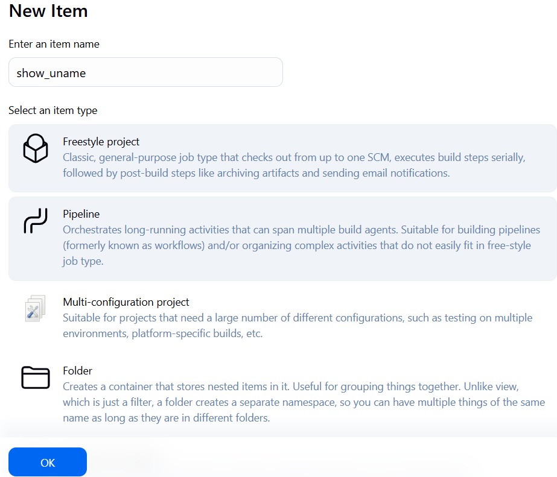

# Sprawozdanie 2

## *Class005*

Celem tych ćwiczeń jest stworzenie kompletnego procesu CI/CD, który automatyzuje pobieranie i testowanie kodu, a następnie wdrażanie gotowego produktu.

Z wykorzystaniem Jenkinsa zostało utworzone proste zadanie, a następnie zbudowano pierwszy pełny pipeline.

### 1. Pierwsze projekty

#### projekt *`show_uname`*

Stworzono projekt o nazwie `show_uname`.



W oknie `uruchom powłokę` (zakładka `kroki budowania`) wpisano komendę `uname -a`.


Zapisano konfigurację, uruchomiono zadanie oraz wyświetlono logi z konsoli.


#### projekt *`check_hour`*

Projekt utworzono tak jak poprzedni.


W `uruchom powłokę` umieszczono poniższy skrypt:

```bash
HOUR=$(date +%H)
if [ $((HOUR % 2)) -ne 0 ]; then
    echo "Godzina $HOUR nieparzysta. Stop."
    exit 1
else
    echo "Godzina $HOUR parzysta. Kontynuuję..."
fi
```

Zapisano konfigurację, uruchomiono zadanie oraz wyświetlono logi z konsoli.


#### projekt *`pull_ubuntu`*

Projekt utworzono tak jak poprzednie, jednak w `uruchom powłokę` wpisano komendę, która pulluje obraz ubuntu.

  

Zapisano konfigurację, uruchomiono zadanie oraz wyświetlono logi z konsoli.


### 2. Obiekt pipeline

Pipeline obejmuje kolejne etapy budowania i testowania przykładowego repozytorium doctest. Ważnym elementem procesu jest usuwanie nieaktualnych obrazów Dockera oraz resetowanie środowiska Dockera w celu zapewnienia czystości i powtarzalności działania. Pipeline zakończono sukcesem.

```
pipeline {
    agent any  

    environment {
        REPO_URL = 'https://github.com/InzynieriaOprogramowaniaAGH/MDO2025_INO.git'
        BRANCH = 'EN415153' 
        DOCKERFILE_PATH = 'ITE/GCL05/EN415153/sprawozdanie1'  
    }


    stages {
        stage('Clean Workspace') {
            steps {
                script {
                    cleanWs()
                }
            }
        }
        
        stage('Clone') {
            steps {
                git branch: "${BRANCH}", url: "${REPO_URL}"
            }
        }
    
        
        stage('Clean Docker Images') {
            steps {
                script {
                    sh 'docker rmi -f doctest_build'
                    sh 'docker rmi -f doctest_test'
                    sh 'docker builder prune --force --all'
                    sh 'docker stop app || true'
                    sh 'docker rm app || true'
                }
            }
        }

        stage('Build Docker Image for build') {
            steps {
                dir("${DOCKERFILE_PATH}") {
                    sh 'docker build --no-cache -f Dockerfile.bld -t doctest-build .'
                }
            }
        }

        stage('Run Docker Image for build') {
            steps {
                script {
                    sh 'docker run -it -d doctest-build'
                }
            }
        }

        stage('Build Docker Image for test') {
            steps {
                dir("${DOCKERFILE_PATH}") {
                    sh 'docker build --no-cache -f Dockerfile.test -t doctest-test .'
                    sh 'docker run --rm doctest-test'
                }
            }
        }

        stage('Test Docker Image for test') {
            steps {
                script {
                    sh 'docker run --rm doctest-test'
                }
            }
        }
    }

    post {
        success {
            echo 'Pipeline zakończony sukcesem!'
        }
        failure {
            echo 'Pipeline zakończony niepowodzeniem.'
        }
    }
}
```


Utworzono projekt pipeline 


Skrypt umieszczono w zakładce `pipeline`


Następnie zbudowano pipeline i wyświetlono output z konsoli 


## *Class006, class007*
### Wybór projektu

Zdecydowano się na projekt oparty na Express.js - minimalistycznym frameworku dla Node.js.

### Licencja
Projekt wykorzystuje licencję MIT, która pozwala na swobodne wykorzystanie w celach edukacyjnych oraz umożliwia tworzenie własnych modyfikacji. Licencja ta spełnia wymagania określone w zadaniu.

### Budowanie aplikacji
 Budowanie ogranicza się do zainstalowania zależności za pomocą `npm install`.

 ### Testy aplikacji

 Testy uruchamiane są komendą `npm test`. Uruchomiono je lokalnie z wynikiem pozytywnym.

  ### Diagram UML

  Poniżej znajduje się diagram UML, który przedstawia przepływ procesu CI/CD (z etapami budowania, testowania i wdrażania aplikacji).

  

  ### Proces build w kontenerze

  ```dockerfile
FROM node AS express-build

RUN git clone https://github.com/expressjs/express

RUN npm install -g express-generator@4

RUN express /tmp/foo

WORKDIR /tmp/foo

RUN npm install
  ```

  ### Testowanie w kontenerze
  ```dockerfile
FROM node AS express-build

RUN git clone https://github.com/expressjs/express.git /app

WORKDIR /app

RUN npm install

RUN npm test
  ```

### Kontener deploy
Finalny obraz z uruchamialną aplikacją:

```dockerfile
FROM node:18-slim

COPY --from=expressjs-build /tmp/foo /app

WORKDIR /app

CMD ["npm", "start"]
```

### Smoke test
Weryfikację działania aplikacji przeprowadzono przez komendę `curl http://localhost:3000`.

### Format artefaktu

Dockerowy obraz aplikacji umożliwia jej łatwe uruchamianie zarówno lokalnie, jak i w środowiskach produkcyjnych, zapewniając przenośność oraz spójność wdrożeń.

### Wersjonowanie

Wersjonowanie semantyczne w postaci tagów, `express-deploy:1.0.0`.

### Jenkins pipeline

```
pipeline {
    agent any  

    environment {
        REPO_URL = 'https://github.com/InzynieriaOprogramowaniaAGH/MDO2025_INO.git'
        BRANCH = 'EN415153' 
        DOCKERFILE_PATH = 'ITE/GCL05/EN415153/sprawozdanie2' 
        IMAGE = 'novickos/express-app:latest' 
    }


    stages {
        stage('Clean Workspace') {
            steps {
                script {
                    cleanWs()
                }
            }
        }
        
        stage('Clone') {
            steps {
                git branch: "${BRANCH}", url: "${REPO_URL}"
            }
        }
    
        
        stage('Clean Docker Images') {
            steps {
                script {
                    sh 'docker rmi -f expressjs-build'
                    sh 'docker rmi -f expressjs-test'
                    sh 'docker builder prune --force --all'
                    sh 'docker stop app || true'
                    sh 'docker rm app || true'
                    sh 'docker network inspect ci >/dev/null 2>&1 && docker network rm ci || true'
                }
            }
        }

        stage('Build Docker Image for build') {
            steps {
                dir("${DOCKERFILE_PATH}") {
                    sh 'docker build --no-cache -f Dockerfile.bld -t expressjs-build .'
                }
            }
        }

        stage('Run Docker Image for build') {
            steps {
                script {
                    sh 'docker run -it -d expressjs-build'
                }
            }
        }

        stage('Build Docker Image for test') {
            steps {
                dir("${DOCKERFILE_PATH}") {
                    sh 'docker build --no-cache -f Dockerfile.test -t expressjs-test .'
                    sh 'docker run --rm expressjs-test'
                }
            }
        }
        
        stage('Build Docker Image for publish') {
            steps {
                dir("${DOCKERFILE_PATH}") {
                    sh 'docker build -f Dockerfile.dep -t express-app .'
                }
            }
        }
        
        stage('Run app') {
            steps {
                dir("${DOCKERFILE_PATH}") {
                    sh 'docker network create ci'
                    sh 'docker run --rm -d --network ci --name app -p 3000:3000 express-app'
                    sh 'docker run --rm --network ci fedora curl -s app:3000'
                }
            }
        }
        stage('Docker push') {
            steps {
                withCredentials([usernamePassword(credentialsId: 'dockerhub', usernameVariable: 'DOCKER_USER', passwordVariable: 'DOCKER_PASS')]) {
                    sh 'echo "$DOCKER_PASS" | docker login -u "$DOCKER_USER" --password-stdin'
                    sh 'docker tag express-app $IMAGE'
                    sh 'docker push $IMAGE'
                }
            }
        }
    }

    post {
        success {
            echo 'Pipeline zakończony sukcesem!'
        }
        failure {
            echo 'Pipeline zakończony niepowodzeniem.'
        }
    }
}
```


### SCM

Stworzono personal access tokenu w dockerhubie, a następnie wykorzystano go jako hasło do uwierzytelniania w Jenkinsie.


Wygenerowano uwierzytelnianie oraz stworzono nowy projekt pipeline, który wykorzystuje SCM.


Po pomyślnym wykonaniu obraz dockera zostaje wypchnięty do docker huba.


Można to zweryfikować sprawdzając jego obecność na docker hubie.

