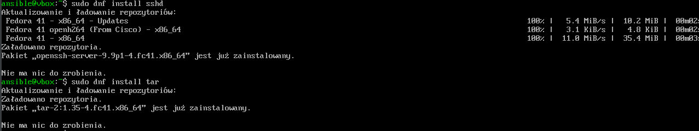
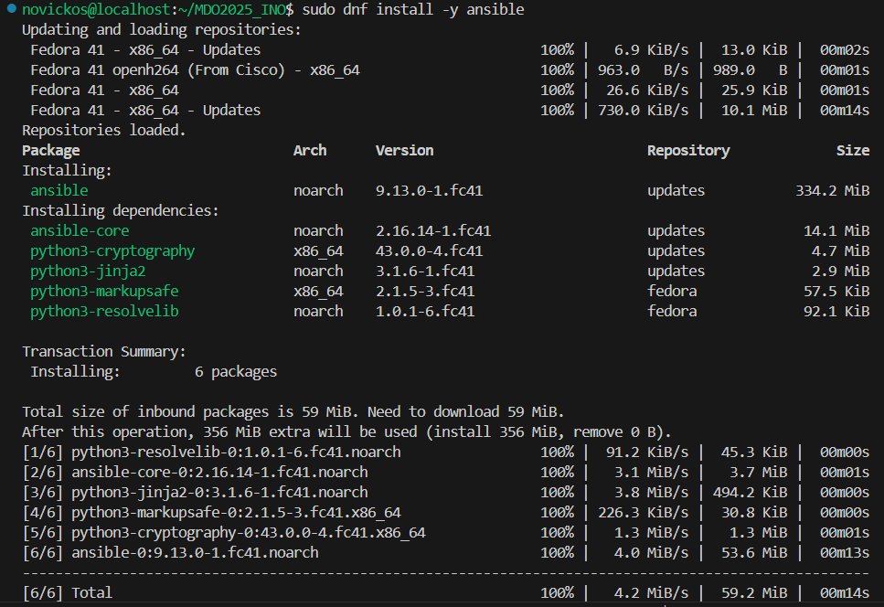
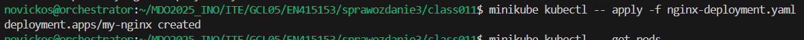

# Sprawozdanie 3
## Konfiguracja maszyn wirtualnych

Utworzono nową maszynę wirtualną, na której dodano użytkownika ansible. Po zakończonej instalacji zmieniono nazwę hosta tej maszyny na `ansible-target`. Równocześnie dotychczasową maszynę nazwano `orchestrator`.


Zainstalowano pakiety `sshd` oraz `tar`.




Na maszynie orchestrator zainstalowano narzędzie Ansible, wykorzystując repozytoria systemowe.




Do pliku /etc/hosts dodano wpis IP maszyny docelowej.


Następnie skopiowano klucz SSH z maszyny orchestrator na ansible-target, umożliwiając połączenie SSH bez potrzeby podawania hasła.


## Konfiguracja inventory i test połączenia
Stworzono plik inventory.ini zawierający konfigurację dwóch grup hostów:


Następnie przetestowano łączność, wysyłając komendę ping do wszystkich maszyn. Wszystkie odpowiedzi były pozytywne.


## Tworzenie i wykonanie playbooka Ansible
Utworzono plik procedury.yml realizujący szereg zdalnych operacji:

- ping wszystkich maszyn docelowych
- kopiowanie pliku inventory.ini na maszyny docelowe
- ponowne wysyłanie ping po przekopiowaniu pliku
- aktualizacja pakietów systemowych
- instalacja usługi rngd
- restart usług sshd i rngd
- oczekiwanie na ponowną dostępność usług SSH


## Automatyczne wdrażanie aplikacji Express z użyciem Dockera
Utworzono plik deploy.yml, który realizuje następujące kroki:

- instalacja Dockera na maszynie ansible-target
- pobranie obrazu novickos/express-app z Docker Huba
- uruchomienie kontenera
- weryfikacja działania aplikacji (HTTP 200)
- wyświetlenie odpowiedzi aplikacji
- zatrzymanie i usunięcie kontenera

```yaml
---
- name: Deploy express app container on Fedora
  hosts: Endpoints
  become: true
  vars:
    container_name: express_app
    image_name: novickos/express-app
    exposed_port: 3000

  tasks:
    - name: Install Docker (moby-engine and docker packages)
      ansible.builtin.dnf:
        name:
          - moby-engine
          - docker
        state: present
        update_cache: yes

    - name: Start and enable Docker service
      ansible.builtin.service:
        name: docker
        state: started
        enabled: true

    - name: Pull the Docker image from Docker Hub
      community.docker.docker_image:
        name: "{{ image_name }}"
        source: pull

    - name: Run the container from the image
      community.docker.docker_container:
        name: "{{ container_name }}"
        image: "{{ image_name }}"
        state: started
        restart_policy: always
        published_ports:
          - "{{ exposed_port }}:3000"

    - name: Wait for HTTP response from the container
      ansible.builtin.uri:
        url: "http://localhost:{{ exposed_port }}/"
        method: GET
        return_content: yes
        status_code: 200
      register: result
      retries: 10
      delay: 3
      until: result.status == 200

    - name: Display HTTP status code
      ansible.builtin.debug:
        msg: "HTTP status: {{ result.status }}"

    - name: Display first 300 characters of HTTP response content
      ansible.builtin.debug:
        msg: "{{ result.content[:300] }}"

    - name: Stop the container
      community.docker.docker_container:
        name: "{{ container_name }}"
        state: stopped

    - name: Remove the container
      community.docker.docker_container:
        name: "{{ container_name }}"
        state: absent

```


## Automatyczna instalacja z użyciem Kickstarta
W ramach zajęć Class009, wykonano nienadzorowaną instalację systemu Fedora z wykorzystaniem pliku anaconda-ks.cfg. Plik zawierał m.in.:

- wybór mirrora Fedory 41
- użytkownika z uprawnieniami sudo
- instalację Dockera i pakietów
- skrypt firstboot.sh uruchamiający aplikację Express przy pierwszym starcie
- jednorazową usługę systemową express-app-firstboot.service

Plik został udostępniony poprzez skrócony link TinyURL i wskazany w parametrze inst.ks w GRUB.


`anaconda-ks.cfg`

```yaml
#version=DEVEL
# System language
lang pl_PL.UTF-8

# Keyboard layouts
keyboard --vckeymap=pl --xlayouts='pl'

# Timezone
timezone Europe/Warsaw --utc

# Network & hostname
network --hostname=orchestrator

# Root user
rootpw --iscrypted --allow-ssh $y$j9T$Ue5uObLv57A.Qh7B91u7Z0$qJzHpvIwFKXO6NgN6myL242U3RH9pRZwgNPkgoxdoJ2

# User with sudo access
user --groups=wheel --name=novickos --password=$y$j9T$/RUov59Tf07URGWLAqOP7g4E$Mhe9Z5QHfDn.4K/JzE6UVc2TGkVz4gmT4AaxhqIpDH. --iscrypted --gecos="novickos"

# Installation source
url --mirrorlist=http://mirrors.fedoraproject.org/mirrorlist?repo=fedora-41&arch=x86_64
repo --name=update --mirrorlist=http://mirrors.fedoraproject.org/mirrorlist?repo=updates-released-f41&arch=x86_64

# System boot settings
firstboot --enable
reboot

# Partitioning
ignoredisk --only-use=sda
clearpart --all --initlabel
autopart

# Package selection
%packages
@^server-product-environment
@headless-management
docker
wget
%end

%post --log=/root/kickstart-post.log

# Skrypt, który pobierze obraz i uruchomi kontener po pierwszym uruchomieniu systemu
mkdir -p /opt/express_app
cat << 'EOF' > /opt/express_app/firstboot.sh
#!/bin/bash

# Uruchom docker (na wszelki wypadek)
systemctl start docker

# Pobierz obraz z Docker Huba
docker pull novickos/express-app:latest

# Uruchom kontener w tle z mapowaniem portu
docker run -d --name express-app -p 3000:3000 novickos/express-app:latest

# Wyłącz tę usługę po wykonaniu
systemctl disable express-app-firstboot.service
rm -f /etc/systemd/system/express-app-firstboot.service
rm -f /opt/express_app/firstboot.sh
EOF

chmod +x /opt/express_app/firstboot.sh

# Utwórz usługę systemd, która wykona ten skrypt raz po pierwszym starcie systemu
cat << 'EOF' > /etc/systemd/system/express-app-firstboot.service
[Unit]
Description=Pull and run express-app container on first boot
After=network.target docker.service
Requires=docker.service

[Service]
Type=oneshot
ExecStart=/opt/express_app/firstboot.sh
RemainAfterExit=true
StandardOutput=journal
StandardError=journal

[Install]
WantedBy=multi-user.target
EOF

# Włącz usługę, aby odpalała się po starcie systemu
systemctl enable express-app-firstboot.service

# Włącz dockera, aby działał po starcie systemu
systemctl enable docker

%end


```

## Minikube i Kubernetes
Zainstalowano i uruchomiono Minikube oraz Dashboard.

Utworzono alias do kubectl.


Przygotowano obraz Dockera z Nginx.

Uruchomiono pod w Kubernetesie, przekierowano port i zweryfikowano w Dashboardzie.


Utworzono plik nginx-deployment.yaml definiujący 4 repliki kontenera z obrazem nginx:alpine.

Na podstawie tego pliku stworzono wdrożenie.


Wyeksponowano wdrożenie jako serwis.


Wygląd w dashboardzie.


## Wersjonowanie i zarządzanie wdrożeniami
Przygotowano dwa pliki index.html (v1 i v2) oraz Dockerfile obsługujący wersjonowanie i testy kontenerów z błędami (/bin/false).

wersja 1
```yaml
<html>
  <body>
    <h1>Wersja 1 nginx</h1>
  </body>
</html>
```

wersja 2
```yaml
<html>
  <body>
    <h1>Wersja 2 nginx</h1>
  </body>
</html>
```

zła wersja
```yaml
<html>
  <body>
    <h1>zla wersja</h1>
  </body>
</html>
```

Dockerfile

```yaml
FROM nginx:alpine

ARG VERSION=v1
ENV VERSION=$VERSION

COPY ${VERSION}/index.html /usr/share/nginx/html/index.html

EXPOSE 80
CMD sh -c 'if [ "$VERSION" = "wersjazla" ]; then /bin/false; else nginx -g "daemon off;"; fi'

```

Zbudowano kontenery:


Sprawdzono czy kontenery zachowują się zgodnie z oczekiwaniami. Poprawnie odpalilły się obie wersje, zła wersja zwróciła exited(1).


Na podstawie wystawionych portów sprawdzono także działanie kontenerów, a dokładnie zawartość ich index.html z pomocą polecenia curl


Następnie spushowano obrazy do Docker Huba.


W dockerhubie:


## Zarządzanie replikami i obrazami w Kubernetes
Utworzono deployment my-nginx i modyfikowano plik YAML:

Zmieniano liczbę replik: 8 → 1 → 0 → 4

Modyfikowano obraz: v1 → v2 → bad

```yaml
apiVersion: apps/v1
kind: Deployment
metadata:
  name: nginx-deployment
spec:
  replicas: 4
  selector:
    matchLabels:
      app: nginx
  template:
    metadata:
      labels:
        app: nginx
    spec:
      containers:
        - name: nginx
          image: nginx:alpine
          ports:
            - containerPort: 80

```

Zaobserwowano działanie mechanizmu rolling update – niepoprawne pody (złym obrazem) wywoływały zatrzymanie rolloutu.




1 replika


0 replik


Replika set został utworzony, ale nie zawiera żadnych podów.


4 repliki 


utworzono dwa przykładowe pliki index.html aby rozróżnić wersje podów oraz plik Dockerfile wykorzystujący /bin/false; do zwracania exited(1) dla złego kontenera

Zastosowano nowszą wersję obrazu

image: novickos/my-nginx:v2


Wrócono do starszej

image: novickos/my-nginx:v1


Zastosowano złą wersję

image: novickos/my-nginx:bad


Zaobserwowano, że dwa pody wchodzą w stan błędu, a następnie przechodzą do stanu CrashLoopBackOff. Jednocześnie trzy inne pody pozostają w stanie Running. Pomimo ustawienia wartości replicas: 4 oraz użycia błędnego obrazu, utworzone zostały jedynie dwa pody wykorzystujące ten niepoprawny obraz, natomiast w klastrze Kubernetes nadal działają trzy pody ze starszą, poprawną wersją obrazu.

Zachowanie to wynika z domyślnej strategii wdrażania aplikacji w Kubernetes, tzw. rolling update. Strategia ta polega na stopniowym zastępowaniu działających instancji nowymi. W przypadku, gdy nowe pody nie uruchamiają się poprawnie, proces rollout zostaje zatrzymany, a wcześniej działające pody pozostają aktywne. Potwierdzenie takiego stanu można uzyskać za pomocą polecenia:


Następnie sprawdzono historię rolloutów. Ze względu na użycie polecenia kubectl apply do aktualizacji deploymentów, a także brak wykorzystania adnotacji --record lub kubectl annotate do zapisywania przyczyny zmian (CHANGE-CAUSE), informacje o przyczynach modyfikacji są puste, co utrudnia identyfikację poszczególnych wersji.

Do przywracania wcześniejszych wersji deploymentu można wykorzystać komendę:


Zamiast polecenia apply, możliwe jest również użycie bezpośrednich komend do zmiany liczby replik i wersji obrazu:

`kubectl scale deployment my-nginx --replicas=<ilość> kubectl set image deployment/my-nginx nginx=filnaw/my-nginx:<wersja>`

Z uwagi na brak informacji CHANGE-CAUSE w historii, rozpoczęto pracę nad skryptem weryfikującym, czy rollout zakończył się powodzeniem w ciągu 60 sekund:

`check_time.sh`
```yaml
#!/bin/bash
DEPLOYMENT=nginx-demo
TIMEOUT=60

for i in $(seq 1 $TIMEOUT); do
    READY=$(kubectl get deploy $DEPLOYMENT -o jsonpath='{.status.readyReplicas}')
    DESIRED=$(kubectl get deploy $DEPLOYMENT -o jsonpath='{.status.replicas}')
    if [[ "$READY" == "$DESIRED" && "$READY" != "" ]]; then
        echo "Deployment is ready ($READY/$DESIRED)"
        exit 0
    fi
    echo "Waiting... ($i/$TIMEOUT)"
    sleep 1
done

echo "Deployment failed or timed out"
exit 1
```

Wcześniej potwierdzono działanie domyślnej strategii RollingUpdate, w której możliwe jest konfigurowanie parametrów takich jak:

```yaml
maxUnavailable: 2 
maxSurge: 2 
```

Zmieniono strategie na Recreate

```yaml
strategy:
    type: Recreate
```

W celu dalszej obserwacji zachowania klastra, wdrożono ponownie błędny deployment. Zaobserwowano, że wszystkie działające wcześniej pody zostały wyłączone, jednak uruchomione zostały tylko dwa nowe pody (zamiast czterech ustawionych replik). Wynika to z mechanizmu exponential backoff w Kubernetes, który ogranicza liczbę restartów niepoprawnie działających podów, zapobiegając przeciążeniu klastra.


W celu przeprowadzenia testu wdrożenia typu Canary Deployment utworzono dwa pliki konfiguracyjne:

canary.yaml

```yaml
---
apiVersion: apps/v1
kind: Deployment
metadata:
  name: my-nginx-stable
  labels:
    app: my-nginx
    version: stable
spec:
  replicas: 3
  selector:
    matchLabels:
      app: my-nginx
      track: stable
  template:
    metadata:
      labels:
        app: my-nginx
        track: stable
    spec:
      containers:
        - name: nginx
          image: novickos/moj-nginx:v1
          ports:
            - containerPort: 80
---
apiVersion: apps/v1
kind: Deployment
metadata:
  name: my-nginx-canary
  labels:
    app: my-nginx
    version: canary
spec:
  replicas: 1
  selector:
    matchLabels:
      app: my-nginx
      track: canary
  template:
    metadata:
      labels:
        app: my-nginx
        track: canary
    spec:
      containers:
        - name: nginx
          image: novickos/moj-nginx:v2
          ports:
            - containerPort: 80

```

`service.yaml`
```yaml
apiVersion: v1
kind: Service
metadata:
  name: my-nginx-service
spec:
  selector:
    app: my-nginx
  ports:
    - protocol: TCP
      port: 80
      targetPort: 80

```


Po wdrożeniu konfiguracji zaobserwowano uruchomienie czterech podów: trzech dla deploymentu my-nginx-stable z obrazem v1 oraz jednego dla my-nginx-canary z obrazem v2. Serwis został również pomyślnie uruchomiony i działa zgodnie z etykietami app: my-nginx, umożliwiając dostęp do obu wersji aplikacji.


