# Sprawozdanie 1

Githook odpowiada za sprawdzenie, czy commit message rozpoczyna się od inicjałów i numeru indeksu (w tym przypadku `FN414313`).

## Skrypt

```bash
#!/bin/bash

PREFIX="FN414313"
COMMIT_MSG_FILE="$1"
FIRST_LINE=$(head -n 1 "$COMMIT_MSG_FILE")

if [[ ! "$FIRST_LINE" =~ ^"$PREFIX" ]]; then
    echo "Błąd: Commit message musi zaczynać się od: '$PREFIX'"
    exit 1
fi

exit 0
```

---

# Instalacja SSH i Gita


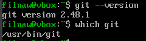

# Stworzenie tokenu


# Klonowanie repozytorium

- **Próba klonowania repozytorium** (wymagane poświadczenie tokenem)
  
  

- **Sklonowanie repozytorium przy użyciu tokenu**
  
  

# Tworzenie kluczy SSH

- Klucz `ed25519` z passphrase:
  
  
  

- **Nieudane klonowanie** (nie dodano klucza do GitHuba)
  
  

- **Dodanie klucza do GitHuba**
  
  

- **Udane klonowanie**
  
  

# Skonfigurowanie 2FA


# Gałęzie w repozytorium

- **Gałęź main**
  
  

- **Przełączenie na gałęź swojej grupy**
  
  

- **Utworzenie i przełączenie na gałęź `FN414313`**
  
  

# Utworzenie Git Hooka

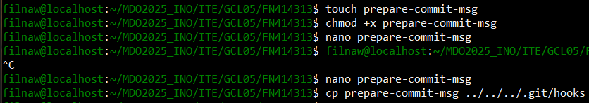

# Prezentacja działania Git Hooka


# Utworzenie sprawozdania


# Commit dotychczasowych zmian


# Przejście na gałęź `GCL05`

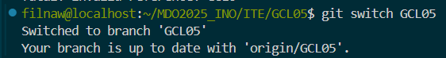

# Wciągnięcie gałęzi `FN414313` do `GCL05`

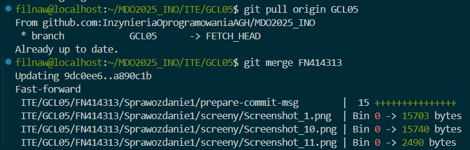

---

# Docker

## Pobieranie i uruchamianie Dockera


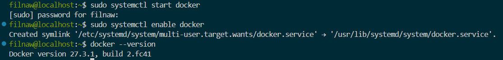

## Pobieranie i wyświetlanie obrazów

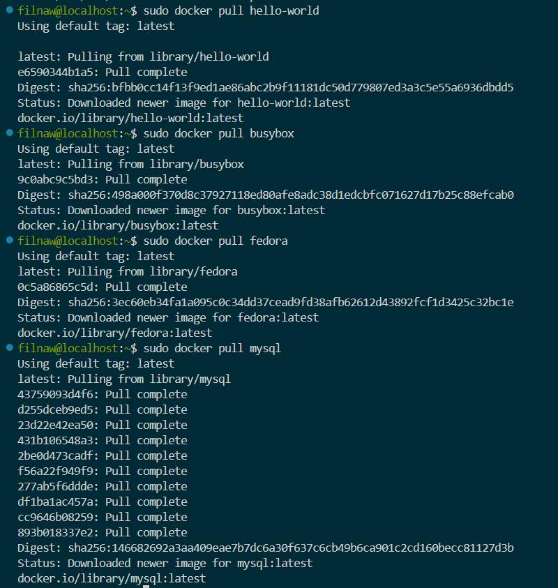
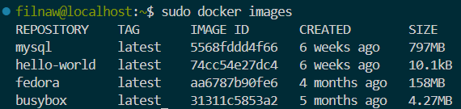

## Uruchomienie kontenera `busybox` i wyświetlenie wersji


## Uruchomienie kontenera na podstawie obrazu Fedora


## Wyświetlenie pierwszego procesu (bash)

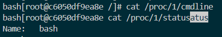

## Aktualizacja pakietów


## Wyjście z kontenera

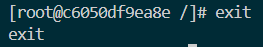

---

# Class002

Treść Dockerfile na podstawie lekkiego obrazu Fedora, na którym instalowane są aktualizacje, git oraz klonowane jest repozytorium.

## Skrypt

```dockerfile
FROM fedora:latest

LABEL maintainer="Filnaw <filipnaw@student.agh.edu.pl>"

ENV DEBIAN_FRONTEND=noninteractive

RUN dnf update && dnf install git && dnf clean all

WORKDIR /app

RUN git clone https://github.com/InzynieriaOprogramowaniaAGH/MDO2025_INO.git /app

CMD ["/bin/bash"]
```

---

# Zbudowanie prostego obrazu na podstawie Dockerfile

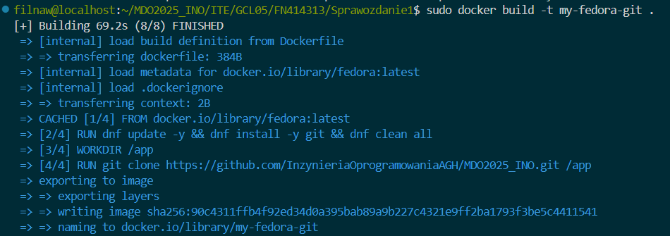

## Stworzenie i uruchomienie kontenera, wyświetlenie sklonowanego repozytorium


## Wyświetlenie i wyczyszczenie kontenerów


## Wyczyszczenie obrazów

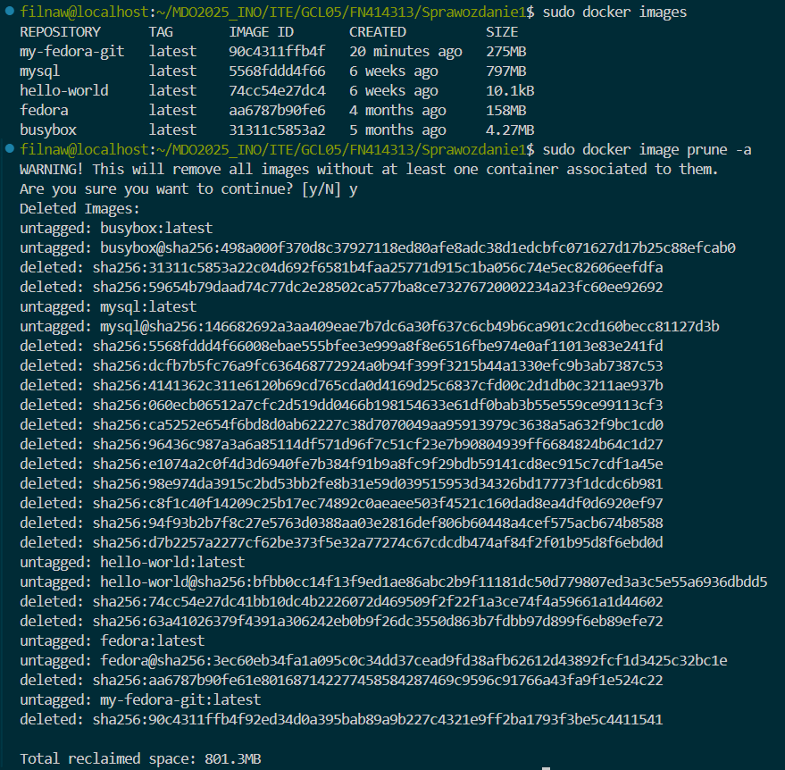

# Class003

## Wykorzystane repozytorium z kodem `doctest` `https://github.com/doctest/doctest`

## klonowanie repozytorium, doinstalowanie wymaganych zależności, wykonanie builda


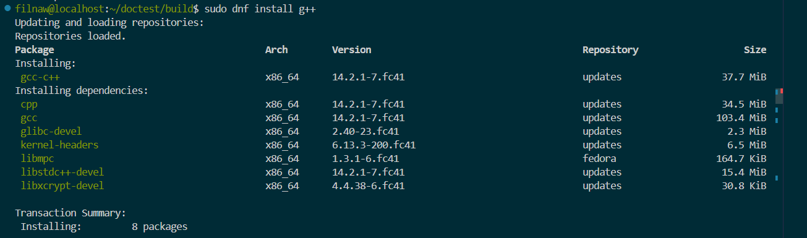
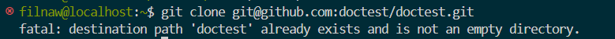


##  Uruchomienie testów
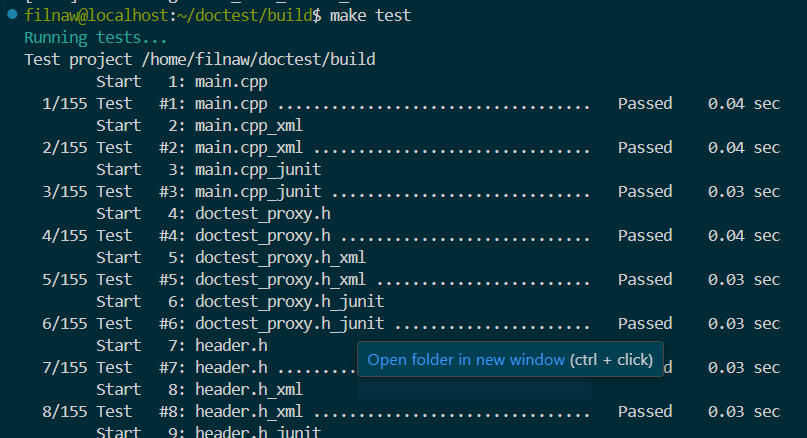

## ponowienie ww. procesów z pomocą kontenerowego TTY

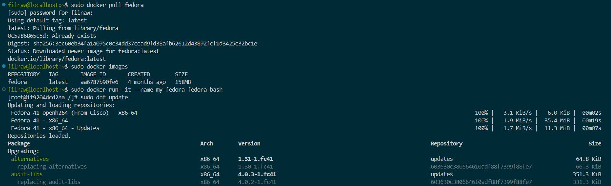

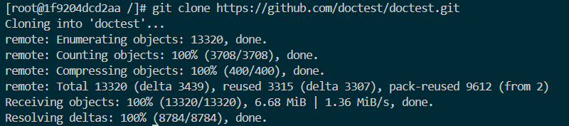

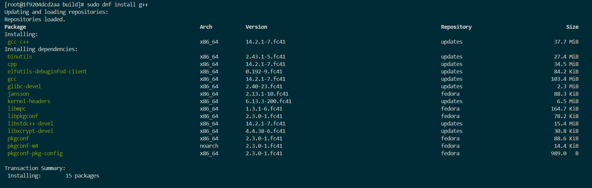


## dwa pliki Dockerfile automatyzujące kroki powyżej 

## Pierwszy kontener (wszystkie kroki aż do builda) `image_1/Dockerfile`

```dockerfile
FROM fedora:latest AS build

RUN dnf update -y && dnf install -y \
cmake \
g++ \
git

WORKDIR /app
RUN git clone --recursive https://github.com/doctest/doctest.git .
RUN mkdir build && cd build && cmake .. && make -j$(nproc)

CMD ["/bin/bash"]
```

## Drugi kontener (bazuje na pierwszym i wykonuje testy) `image_2/Dockerfile`

```dockerfile
FROM doctest-build AS test

WORKDIR /app/build

CMD ["make", "test"]
```

## Budowanie i wdrażanie kontenerów


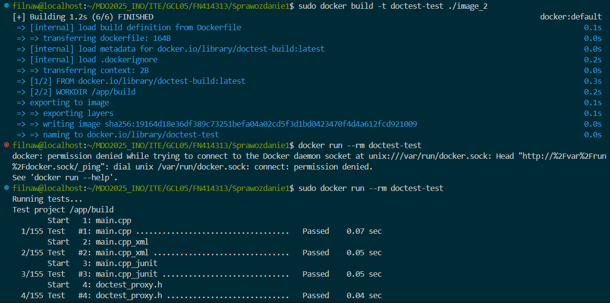
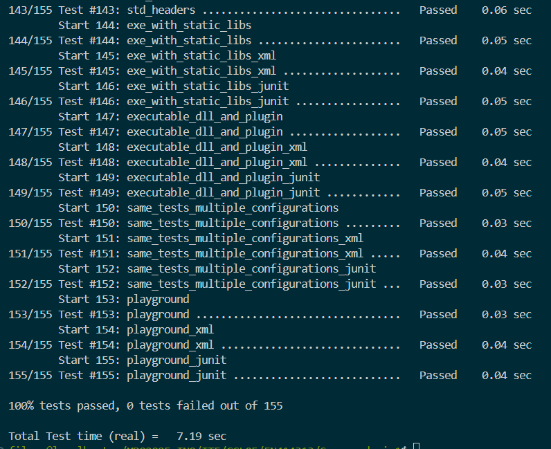

Widać wdrożony i uruchomiony kontener na którym poprawnie sklonowano repozytorium. Widać, też poprawne działanie konteneru testowego.

W przypadku kontenera testowego będzie pracował proces make test wywołany przez linijkę `CMD ["make", "test"]` w Dockerfile'u.

## Docker compose skrypt

```yaml
services:
  build: 
    build:
      context: ./image_1
      dockerfile: Dockerfile
    image: doctest-build
    container_name: my-doctest-buils
    volumes:
      - build_data:/app/build

  test:
    build: 
      context: ./image_2
      dockerfile: Dockerfile
    image: doctest-test
    container_name: doctest-test
    depends_on:
      - build
    volumes:
      - build_data:/app/build

volumes:
  build_data:
```

## docker compose budowanie i wykorzystanie 


### czy program nadaje się do wdrażania i publikowania jako kontener, czy taki sposób interakcji nadaje się tylko do builda

Program nie nadaję się do wdrożenia w postaci kontenera. Doctest to framework do testowania w C+, który nie jest samodzielną aplikacją interaktywną. Kontener więc ma sens dla procesu build i test, ale nie ma dla finalnego 

### jeżeli program miałby być publikowany jako kontener - czy trzeba go oczyszczać z pozostałości po buildzie?

Jeżeli ostatecznie zdecydowano by się na takie rozwiązanie usunięcie niepotrzenych plików i artefaktów byłoby wskazane.

### Jak przygotować finalny artefakt?

Doctest można publikować w formie:
- Pakietu systemowego (DEB, RPM)
- Biblioteki językowej np (doctest.h)
- Dystrubucja jako archiwum (.tar.gz, .zip)

Można wykonać trzeci odziellny kontener np. o nazwie `doctest-package`, który będzie odpowiedzialny za tworzenie tworzenie pakietu systemowego np. deb. Wtedy taki dockerfile tworzył by pakiet i kopiował np. na zewnęrzny wolumin. Przykład:

## Przykładowy dockerfile do generowania pakietów
```dockerfile
FROM doctest-build AS package

WORKDIR /app/doctest/build

RUN apt-get update && apt-get install -y dpkg-dev

RUN make install DESTDIR=/tmp/doctest && \
    dpkg-deb --build /tmp/doctest /app/doctest.deb

CMD ["cp", "/app/doctest.deb", "/output/"]
```

# class004

## Przygotowanie woluminu wejściowego i wyjściowego o nazwach `in_vol` i `out_vol`


## Przygotowanie dodatkowego dockerfile dedykowanego dla kontenera adekwatnego do dzisiejszych zajęć.

## `Dockerfile.vol`
```dockerfile
FROM fedora:latest AS build

RUN dnf update -y && dnf install -y \
cmake \
g++

WORKDIR /app

CMD ["/bin/bash"]
```

## Uruchomienie kontenera i przedstawienie wymagań wstępnych


## klonowanie repozytorium na wolumin zewnętrzny z pomocą kontenera `alpine/git`


## Uruchomienie builda w kontenerze (skopiowanie repozytorium do kontenera) (skopiowanie builda do woluminu wyjściowego)


## Powtórzenie operacji, ale z użyciem gita w kontenerze


# Eksponowanie portu

## Uruchomienie wewnątrz kontenera serweru iperf3 i połączenie się z drugiego kontenera (zbadanie ruchu)


## Stworzenie dedykowanej sieci mostkowej i użycie rozwiązywania nazw


## Połączenie się z poza kontenera z hosta i z poza hosta


## Przedstawienie logów z kontenera `logs.txt`


# Instalacja Jenkins

## skomponowanie pliku `docker-compose.yml` dla Jenkinsa

```yaml
version: '3.8'

services:
  jenkins:
    image: jenkins/jenkins:lts
    restart: unless-stopped
    privileged: true
    user: root
    ports:
      - "8080:8080"
      - "50000:50000"
    volumes:
      - jenkins_home:/var/jenkins_home
      - /var/run/docker.sock:/var/run/docker.sock
    environment:
      - DOCKER_HOST=tcp://dind:2375
      - DOCKER_TLS_CERTDIR=""
    depends_on:
      - dind

  dind:
    image: docker:dind
    restart: unless-stopped
    privileged: true
    environment:
      - DOCKER_TLS_CERTDIR=""
    volumes:
      - dind_storage:/var/lib/docker

volumes:
  jenkins_home:
  dind_storage:

```

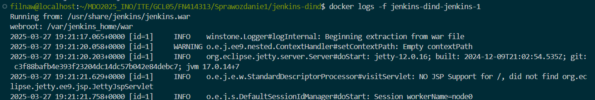

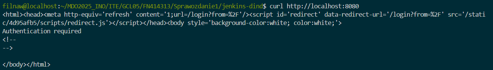


## Usługa ssh w kontenerze i łączenie się z nią


### Co jest potrzebne by w naszym Jenkinsie uruchomić Dockerfile dla buildera?

Aby było to możliwe należy zapewnić parę rzeczy. Dostęp do Dockera dlatego w docker-compose dla Jenkinsa należy zamontować socket `/var/run/docker.sock`. Oraz instalacja odpowiednich pluginów Jenkinsa

### Co jest potrzebne w Jenkinsie by uruchomić Docker Compose?

Wystarczy w uruchomionym kontenerze doinstalować docker-compose.

# LISTA POLECEŃ

```sh
    1  sudo dnf install openssh-server
    2  sudo dnf install git
    3  git --version
    4  which git
    5  ip a
    6  poweroff
    7  git clone https://Filnaw@github.com/InzynieriaOprogramowaniaAGH/MDO2025_INO.git
    8  la
    9  ls -a
   10  rm -r MDO2025_INO/
   11  rm -rf MDO2025_INO/
   12  ls -a
   13  git config --global user.name "Filnaw"
   14  git config --global user.email "filipnaw@student.agh.edu.pl"
   15  git config -l
   16  git clone https://Filnaw@github.com/InzynieriaOprogramowaniaAGH/MDO2025_INO.git
   17  cd MDO2025_INO/
   18  git pull
   19  cd ..
   20  rm -rf MDO2025_INO/
   21  git clone https://github.com/InzynieriaOprogramowaniaAGH/MDO2025_INO.git
   22  rm -rf MDO2025_INO/
   23  git credential reject https://github.com
   24  echo url=https://github.com | git credential reject
   25  git clone https://github.com/InzynieriaOprogramowaniaAGH/MDO2025_INO.git
   26  rm -rf MDO2025_INO/
   27  echo url=https://github.com | git credential approve
   28  git clone https://github.com/InzynieriaOprogramowaniaAGH/MDO2025_INO.git
   29  rm -rf MDO2025_INO/
   30  ls -a
   31  nano .gitconfig 
   32  git config --global credential.helper
   33   git config --global credential.helper
   34  git config --global credential.helper cache
   35  git config --global credential.helper
   36  ls -a
   37  git clone https://github.com/InzynieriaOprogramowaniaAGH/MDO2025_INO.git
   38  rm -rf MDO2025_INO/
   39  printf "protocol=https\nhost=github.com\n" | git credential reject
   40  git clone https://github.com/InzynieriaOprogramowaniaAGH/MDO2025_INO.git
   41  rm -rf MDO2025_INO/
   42  git clone https://your-username@github.com/your-repository.git
   43  git clone https://Filnaw@github.com/InzynieriaOprogramowaniaAGH/MDO2025_INO.git
   44  rm -rf MDO2025_INO/
   45  git clone https://github.com/InzynieriaOprogramowaniaAGH/MDO2025_INO.git
   46  rm -rf MDO2025_INO/
   47  GIT_ASKPASS= echo git clone https://github.com/InzynieriaOprogramowaniaAGH/MDO2025_INO.git
   48  ls -a
   49  GIT_ASKPASS= echo git clone https://github.com/InzynieriaOprogramowaniaAGH/MDO2025_INO.git
   50  git clone https://github.com/InzynieriaOprogramowaniaAGH/MDO2025_INO.git
   51  rm -rf MDO2025_INO/
   52  git config --global credential.helper store
   53  git config --global credential.helper 
   54  ls -a
   55  git config --global credential.helper 
   56  git credential reject https://github.com
   57  git credential reject 
   58  git credential approve
   59  git config --global credential.helper 
   60  git config --global credential.helper cache
   61  git config --global credential.helper 
   62  git clone https://github.com/InzynieriaOprogramowaniaAGH/MDO2025_INO.git
   63  rm -rf MDO2025_INO/
   64  git clone https://github.com/Filnaw/cpm_calculator.git
   65  ip a
   66  poweroff
   67  ip a
   68  poweroff

  disc (69 linge changed due to GitHub push protection)

   69  git clone https://filnaw:<PAT>@github.com/InzynieriaOprogramowaniaAGH/MDO2025_INO.git
   70  ssh-keygen -t ed25519 -C "filipnaw@student.agh.edu.pl"
   71  ssh-keygen -t ecdsa -b 256 -C "your_email@example.com"
   72  ssh-keygen -t ecdsa -b 256 -C "filipnaw@student.agh.edu.pl"
   73  git clone git@github.com:InzynieriaOprogramowaniaAGH/MDO2025_INO.git
   74  rm -rf M
   75  rm -rf MDO2025_INO/
   76  git clone git@github.com:InzynieriaOprogramowaniaAGH/MDO2025_INO.git
   77  ls -a
   78  cd .ssh/
   79  ls -a
   80  cut id_ecdsa.pub 
   81  cat id_ecdsa.pub 
   82  git clone git@github.com:InzynieriaOprogramowaniaAGH/MDO2025_INO.git
   83  cd ..
   84  cd .ssh/
   85  rm -rf MDO2025_INO/
   86  cd ..
   87  git clone git@github.com:InzynieriaOprogramowaniaAGH/MDO2025_INO.git
   88  cd MDO2025_INO/
   89  git branch
   90  git fetch
   91  git branch
   92  git pull
   93  git branch
   94  git branch -a
   95  git switch GCL05
   96  git branch
   97  ls -a
   98  git pull origin GCL05
   99  ls -a
  100  git status
  101  git branch -c FN414313
  102  git status
  103  git branch
  104  git switch FN414313 
  105  git branch
  106  ls -a
  107  cd ITE
  108  ls -a
  109  cd GCL05/
  110  ls -a
  111  mkdir FN414313
  112  ls -a
  113  cd FN414313/
  114  ls ../../..
  115  ls -a ../../..
  116  ls -a ../../../.git
  117  ls -a ../../../.git/hooks/
  118  cat ../../../.git/hooks/pre-commit.sample 
  119  cat ../../../.git/hooks/prepare-commit-msg.sample 
  120  touch prepare-commit-msg
  121  chmod +x prepare-commit-msg 
  122  nano prepare-commit-msg 
  123  cp prepare-commit-msg ../../../.git/hooks
  124  ls -a ../../../.git/hooks/
  125  rm ../../../.git/hooks/prepare-commit-msg
  126  nano prepare-commit-msg 
  127  cp prepare-commit-msg ../../../.git/hooks
  128  git commit -m "Nie zadziala"
  129  chmod -x  ../../../.git/hooks/prepare-commit-msg
  130  git commit -m "Nie zadziala"
  131  git add .
  132  git status
  133  git commit -m "Nie zadziala"
  134  chmod -x ../../../.git/hooks/prepare-commit-msg
  135  git commit -m "Nie zadziala"
  136  git reset --soft HEAD~1
  137  git status
  138  git commit -m "Nie zadziala"
  139  git reset --soft HEAD~1
  140  git status
  141  ls -l ../../../.git/hooks/prepare-commit-msg
  142  sudo chmod -x ../../../.git/hooks/prepare-commit-msg
  143  ls -l ../../../.git/hooks/prepare-commit-msg
  144  git status
  145  git commit -m "Nie zadziala"
  146  sudo chmod +x ../../../.git/hooks/prepare-commit-msg
  147  git status
  148  git reset --soft HEAD~1
  149  git status
  150  git commit -m "Nie zadziala"
  151  touch sprawozdanie1.md
  152  sudo dnf install code 
  153  exit
  154  ip a
  155  poweroff
  156  ip a
  157  poweroff
  158  ls -a
  159  cd MDO2025_INO/
  160  ls -a
  161  cd ITE/
  162  ls -a
  163  cd GCL05/
  164  cd FN414313/
  165  ls -a
  166  code .
  167  git status
  168  mkdir Sprawozdanie1
  169  ls -a
  170  mv prepare-commit-msg ./Sprawozdanie1/
  171  mv sprawozdanie1.md ./Sprawozdanie1/
  172  ls -a
  173  ls -a ./Sprawozdanie1/
  174  cd Sprawozdanie1/
  175  cd ..
  176  code .
  177  cd Sprawozdanie1/
  178  mkdir screeny
  179  ls -a
  180  git branch
  181  git push origin FN414313 
  182  cd ../..
  183  git branch
  184  git switch GCL05
  185  ls -a
  186  ls -a FN414313/
  187  ls -a FN414313/Sprawozdanie1/
  188  git switch FN414313 
  189  git branch
  190  git status
  191  git add .
  192  git status 
  193  git commit -m "FN414313 class 01"
  194  git status
  195  git branch 
  196  git switch GCL0
  197  git switch GCL05
  198  git barnch
  199  git branch
  200  git status
  201  ls -a
  202  git pull origin GCL05
  203  git merge FN414313 
  204  git branch
  205  git switch FN414313 
  206  git switch GCL05
  207  git status
  208  git switch FN414313 
  209  git status
  210  git branch
  211  git add .
  212  git commit -m "FN414313 class01 merge"
  213  git push origin FN414313 
  214  sudo dnf update -y
  215  sudo dnf install docker
  216  ip a
  217  poweroff
  218  sudo systemctl start docker
  219  sudo systemctl enable docker
  220  docker --version
  221  docker pull hello-world
  222  sudo docker pull hello-world
  223  sudo docker pull busybox
  224  sudo docker pull fedora
  225  sudo docker pull mysql
  226  docker images
  227  sudo docker images
  228  docker run -d --name my-busybox busybox
  229  sudo docker run -d --name my-busybox busybox
  230  sudo docker exec -it my-busybox sh
  231  docker exec -it my-busybox sh
  232  sudo docker exec -it my-busybox sh
  233  docker run -it --name my-busybox busybox sh
  234  sudo docker run -it --name my-busybox busybox sh
  235  sudo docker ps -a
  236  sudo docker rm my-busybox
  237  docker run -it --name my-busybox busybox sh
  238  sudo docker run -it --name my-busybox busybox sh
  239  sudo docker run -it --name my-fedora fedora bash
  240  ls -a
  241  cd MDO2025_INO/
  242  ls -a
  243  cd ITE/
  244  ls -a
  245  cd GCL05/
  246  ls -a 
  247  cd FN414313/
  248  ls -a
  249  cd Sprawozdanie1/
  250  ls -a
  251  git branch
  252  ls -a
  253  touch Dockerfile
  254  code .
  255  docker build -t my-fedora-git .
  256  sudo docker build -t my-fedora-git .
  257  sudo docker run -it --name my-fedora fedora bash
  258  sudo docker rm my-fedora
  259  sudo docker run -it --name my-fedora fedora bash
  260  sudo docker rm my-fedora
  261  sudo docker run -it --name my-fedora fedora bash
  262  cd MDO2025_INO/
  263  cd ITE/GCL05/FN414313/
  264  cd Sprawozdanie1/
  265  ls -a
  266  code .
  267  sudo docker run -it --name my-fedora fedora bash
  268  sudo docker rm my-fedora
  269  sudo docker run -it --name my-fedora fedora bash=> ERROR [2/4] RUN dnf update && dnf install git && dnf clean all                                                                                                                                 23.0s
  270  ------                                                                                                                                                                                                   
  271   > [2/4] RUN dnf update && dnf install git && dnf clean all:                                                                                                                                             
  272  0.401 Updating and loading repositories:                                                                                                                                                                 
  273  5.734  Fedora 41 - x86_64 - Updates           100% |   2.5 MiB/s |  13.1 MiB |  00m05s                                                                                                                   
  274  17.19  Fedora 41 - x86_64                     100% |   3.1 MiB/s |  35.4 MiB |  00m11s                                                                                                                   
  275  18.41  Fedora 41 openh264 (From Cisco) - x86_ 100% |   5.2 KiB/s |   6.0 KiB |  00m01s                                                                                                                   
  276  20.92 Repositories loaded.
  277  22.77 Package                                        Arch   Version                    Repository                            Size
  278  22.77 Upgrading:
  279  22.77  alternatives                                  x86_64 1.31-1.fc41                updates                           64.8 KiB
  280  22.77    replacing alternatives                      x86_64 1.30-1.fc41                603630c380664610adf88f7399f88fe7  66.3 KiB
  281  22.77  audit-libs                                    x86_64 4.0.3-1.fc41               updates                          351.3 KiB
  282  22.77    replacing audit-libs                        x86_64 4.0.2-1.fc41               603630c380664610adf88f7399f88fe7 331.3 KiB
  283  22.77  coreutils                                     x86_64 9.5-11.fc41                updates                            5.7 MiB
  284  22.77    replacing coreutils                         x86_64 9.5-10.fc41                603630c380664610adf88f7399f88fe7   5.6 MiB
  285  22.77  coreutils-common                              x86_64 9.5-11.fc41                updates                           11.2 MiB
  286  22.77    replacing coreutils-common                  x86_64 9.5-10.fc41                603630c380664610adf88f7399f88fe7  11.2 MiB
  287  22.77  crypto-policies                               noarch 20250124-1.git4d262e7.fc41 updates                          137.4 KiB
  288  22.77    replacing crypto-policies                   noarch 20241010-1.git8baf557.fc41 603630c380664610adf88f7399f88fe7 136.9 KiB
  289  22.77  curl                                          x86_64 8.9.1-3.fc41               updates                          793.5 KiB
  290  22.77    replacing curl                              x86_64 8.9.1-2.fc41               603630c380664610adf88f7399f88fe7 796.2 KiB
  291  22.77  dnf5                                          x86_64 5.2.10.0-2.fc41            updates                            2.2 MiB
  292  22.77    replacing dnf5                              x86_64 5.2.6.2-1.fc41             603630c380664610adf88f7399f88fe7   1.6 MiB
  293  22.77  dnf5-plugins                                  x86_64 5.2.10.0-2.fc41            updates                            1.2 MiB
  294  22.77    replacing dnf5-plugins                      x86_64 5.2.6.2-1.fc41             603630c380664610adf88f7399f88fe7   1.0 MiB
  295  22.77  elfutils-default-yama-scope                   noarch 0.192-9.fc41               updates                            1.8 KiB
  296  22.77    replacing elfutils-default-yama-scope       noarch 0.192-5.fc41               551623a9fceb4bb4b7bf61f67f15cf34   1.8 KiB
  297  22.77  elfutils-libelf                               x86_64 0.192-9.fc41               updates                            1.2 MiB
  298  22.77    replacing elfutils-libelf                   x86_64 0.192-5.fc41               551623a9fceb4bb4b7bf61f67f15cf34   1.2 MiB
  299  22.77  elfutils-libs                                 x86_64 0.192-9.fc41               updates                          670.2 KiB
  300  22.77    replacing elfutils-libs                     x86_64 0.192-5.fc41               551623a9fceb4bb4b7bf61f67f15cf34 666.3 KiB
  301  22.77  fedora-release-common                         noarch 41-31                      updates                           19.7 KiB
  302  22.77    replacing fedora-release-common             noarch 41-25                      603630c380664610adf88f7399f88fe7  19.5 KiB
  303  22.77  fedora-release-container                      noarch 41-31                      updates                            0.0   B
  304  22.77    replacing fedora-release-container          noarch 41-25                      603630c380664610adf88f7399f88fe7   0.0   B
  305  22.77  fedora-release-identity-container             noarch 41-31                      updates                            1.5 KiB
  306  22.77    replacing fedora-release-identity-container noarch 41-25                      603630c380664610adf88f7399f88fe7   1.5 KiB
  307  22.77  glibc                                         x86_64 2.40-21.fc41               updates                            6.7 MiB
  308  22.77    replacing glibc                             x86_64 2.40-3.fc41                603630c380664610adf88f7399f88fe7   6.7 MiB
  309  22.77  glibc-common                                  x86_64 2.40-21.fc41               updates                            1.0 MiB
  310  22.77    replacing glibc-common                      x86_64 2.40-3.fc41                603630c380664610adf88f7399f88fe7   1.0 MiB
  311  22.77  glibc-minimal-langpack                        x86_64 2.40-21.fc41               updates                            0.0   B
  312  22.77    replacing glibc-minimal-langpack            x86_64 2.40-3.fc41                603630c380664610adf88f7399f88fe7   0.0   B
  313  22.77  gnutls                                        x86_64 3.8.9-2.fc41               updates                            3.6 MiB
  314  22.77    replacing gnutls                            x86_64 3.8.6-7.fc41               603630c380664610adf88f7399f88fe7   3.2 MiB
  315  22.77  krb5-libs                                     x86_64 1.21.3-4.fc41              updates                            2.3 MiB
  316  22.77    replacing krb5-libs                         x86_64 1.21.3-2.fc41              603630c380664610adf88f7399f88fe7   2.3 MiB
  317  22.77  libblkid                                      x86_64 2.40.4-1.fc41              updates                          257.2 KiB
  318  22.77    replacing libblkid                          x86_64 2.40.2-4.fc41              603630c380664610adf88f7399f88fe7 258.5 KiB
  319  22.77  libcurl                                       x86_64 8.9.1-3.fc41               updates                          809.3 KiB
  320  22.77    replacing libcurl                           x86_64 8.9.1-2.fc41               603630c380664610adf88f7399f88fe7 818.1 KiB
  321  22.77  libdnf5                                       x86_64 5.2.10.0-2.fc41            updates                            3.5 MiB
  322  22.77    replacing libdnf5                           x86_64 5.2.6.2-1.fc41             603630c380664610adf88f7399f88fe7   3.2 MiB
  323  22.77  libdnf5-cli                                   x86_64 5.2.10.0-2.fc41            updates                          878.8 KiB
  324  22.77    replacing libdnf5-cli                       x86_64 5.2.6.2-1.fc41             603630c380664610adf88f7399f88fe7 779.7 KiB
  325  22.77  libgcc                                        x86_64 14.2.1-7.fc41              updates                          270.9 KiB
  326  22.77    replacing libgcc                            x86_64 14.2.1-3.fc41              603630c380664610adf88f7399f88fe7 274.6 KiB
  327  22.77  libgomp                                       x86_64 14.2.1-7.fc41              updates                          514.2 KiB
  328  22.77    replacing libgomp                           x86_64 14.2.1-3.fc41              603630c380664610adf88f7399f88fe7 523.5 KiB
  329  22.77  libmount                                      x86_64 2.40.4-1.fc41              updates                          348.8 KiB
  330  22.77    replacing libmount                          x86_64 2.40.2-4.fc41              603630c380664610adf88f7399f88fe7 351.8 KiB
  331  22.77  librepo                                       x86_64 1.19.0-1.fc41              updates                          244.5 KiB
  332  22.77    replacing librepo                           x86_64 1.18.1-1.fc41              603630c380664610adf88f7399f88fe7 244.5 KiB
  333  22.77  libsmartcols                                  x86_64 2.40.4-1.fc41              updates                          176.2 KiB
  334  22.77    replacing libsmartcols                      x86_64 2.40.2-4.fc41              603630c380664610adf88f7399f88fe7 180.4 KiB
  335  22.77  libsolv                                       x86_64 0.7.31-1.fc41              updates                          944.3 KiB
  336  22.77    replacing libsolv                           x86_64 0.7.30-1.fc41              603630c380664610adf88f7399f88fe7 944.2 KiB
  337  22.77  libstdc++                                     x86_64 14.2.1-7.fc41              updates                            2.7 MiB
  338  22.77    replacing libstdc++                         x86_64 14.2.1-3.fc41              603630c380664610adf88f7399f88fe7   2.8 MiB
  339  22.77  libtasn1                                      x86_64 4.20.0-1.fc41              updates                          180.4 KiB
  340  22.77    replacing libtasn1                          x86_64 4.19.0-9.fc41              603630c380664610adf88f7399f88fe7 175.7 KiB
  341  22.77  libtirpc                                      x86_64 1.3.6-1.rc3.fc41           updates                          197.6 KiB
  342  22.77    replacing libtirpc                          x86_64 1.3.6-0.fc41               551623a9fceb4bb4b7bf61f67f15cf34 202.7 KiB
  343  22.77  libuuid                                       x86_64 2.40.4-1.fc41              updates                           39.9 KiB
  344  22.77    replacing libuuid                           x86_64 2.40.2-4.fc41              603630c380664610adf88f7399f88fe7  37.5 KiB
  345  22.77  libxcrypt                                     x86_64 4.4.38-6.fc41              updates                          288.5 KiB
  346  22.77    replacing libxcrypt                         x86_64 4.4.36-7.fc41              603630c380664610adf88f7399f88fe7 266.8 KiB
  347  22.77  libxml2                                       x86_64 2.12.9-1.fc41              updates                            1.7 MiB
  348  22.77    replacing libxml2                           x86_64 2.12.8-2.fc41              603630c380664610adf88f7399f88fe7   1.7 MiB
  349  22.77  libzstd                                       x86_64 1.5.7-1.fc41               updates                          804.0 KiB
  350  22.77    replacing libzstd                           x86_64 1.5.6-2.fc41               603630c380664610adf88f7399f88fe7 795.9 KiB
  351  22.77  lua-libs                                      x86_64 5.4.7-3.fc41               updates                          285.0 KiB
  352  22.77    replacing lua-libs                          x86_64 5.4.6-6.fc41               603630c380664610adf88f7399f88fe7 285.0 KiB
  353  22.77  openldap                                      x86_64 2.6.8-7.fc41               updates                          631.4 KiB
  354  22.77    replacing openldap                          x86_64 2.6.8-5.fc41               603630c380664610adf88f7399f88fe7 644.2 KiB
  355  22.77  openssl-libs                                  x86_64 1:3.2.4-1.fc41             updates                            7.8 MiB
  356  22.77    replacing openssl-libs                      x86_64 1:3.2.2-9.fc41             603630c380664610adf88f7399f88fe7   7.8 MiB
  357  22.77  pam                                           x86_64 1.6.1-7.fc41               updates                            1.8 MiB
  358  22.77    replacing pam                               x86_64 1.6.1-6.fc41               551623a9fceb4bb4b7bf61f67f15cf34   1.8 MiB
  359  22.77  pam-libs                                      x86_64 1.6.1-7.fc41               updates                          139.0 KiB
  360  22.77    replacing pam-libs                          x86_64 1.6.1-6.fc41               551623a9fceb4bb4b7bf61f67f15cf34 139.0 KiB
  361  22.77  publicsuffix-list-dafsa                       noarch 20250116-1.fc41            updates                           68.5 KiB
  362  22.77    replacing publicsuffix-list-dafsa           noarch 20240107-4.fc41            603630c380664610adf88f7399f88fe7  67.5 KiB
  363  22.77  rpm-sequoia                                   x86_64 1.7.0-5.fc41               updates                            2.4 MiB
  364  22.77    replacing rpm-sequoia                       x86_64 1.7.0-2.fc41               603630c380664610adf88f7399f88fe7   2.4 MiB
  365  22.77  setup                                         noarch 2.15.0-8.fc41              updates                          720.7 KiB
  366  22.77    replacing setup                             noarch 2.15.0-5.fc41              603630c380664610adf88f7399f88fe7 720.7 KiB
  367  22.77  sqlite-libs                                   x86_64 3.46.1-2.fc41              updates                            1.5 MiB
  368  22.77    replacing sqlite-libs                       x86_64 3.46.1-1.fc41              603630c380664610adf88f7399f88fe7   1.4 MiB
  369  22.77  systemd-libs                                  x86_64 256.12-1.fc41              updates                            2.0 MiB
  370  22.77    replacing systemd-libs                      x86_64 256.7-1.fc41               603630c380664610adf88f7399f88fe7   2.0 MiB
  371  22.77  tzdata                                        noarch 2025a-1.fc41               updates                            1.6 MiB
  372  22.77    replacing tzdata                            noarch 2024a-9.fc41               603630c380664610adf88f7399f88fe7   1.7 MiB
  373  22.77  util-linux-core                               x86_64 2.40.4-1.fc41              updates                            1.5 MiB
  374  22.77    replacing util-linux-core                   x86_64 2.40.2-4.fc41              603630c380664610adf88f7399f88fe7   1.5 MiB
  375  22.77  vim-data                                      noarch 2:9.1.1169-1.fc41          updates                           10.3 KiB
  376  22.77    replacing vim-data                          noarch 2:9.1.785-1.fc41           551623a9fceb4bb4b7bf61f67f15cf34  17.8 KiB
  377  22.77  vim-minimal                                   x86_64 2:9.1.1169-1.fc41          updates                            1.7 MiB
  378  22.77    replacing vim-minimal                       x86_64 2:9.1.785-1.fc41           551623a9fceb4bb4b7bf61f67f15cf34   1.7 MiB
  379  22.77  zlib-ng-compat                                x86_64 2.2.3-2.fc41               updates                          141.9 KiB
  380  22.77    replacing zlib-ng-compat                    x86_64 2.1.7-3.fc41               603630c380664610adf88f7399f88fe7 134.0 KiB
  381  22.77  zstd                                          x86_64 1.5.7-1.fc41               updates                            1.7 MiB
  382  22.77    replacing zstd                              x86_64 1.5.6-2.fc41               603630c380664610adf88f7399f88fe7   1.7 MiB
  383  22.77 
  384  22.77 Transaction Summary:
  385  22.77  Upgrading:         52 packages
  386  22.77  Replacing:         52 package
  387  22.77 
  388  22.77 Total size of inbound packages is 24 MiB. Need to download 24 MiB.
  389  22.77 After this operation, 2 MiB extra will be used (install 75 MiB, remove 73 MiB).
  390  22.77 Is this ok [y/N]: Operation aborted by the user.
  391  ------
  392  Dockerfile:7
  393  --------------------
  394     5 |     ENV DEBIAN_FRONTEND=noninteractive
  395     6 |     
  396     7 | >>> RUN dnf update && dnf install git && dnf clean all
  397     8 |     
  398     9 |     WORKDIR /app
  399  --------------------
  400  ERROR: failed to solve: process "/bin/sh -c dnf update && dnf install git && dnf clean all" did not complete successfully: exit code: 1
  401  docker build -t my-fedora-git .
  402  sudo docker build -t my-fedora-git .
  403  ip a
  404  poweroff
  405  cd MDO2025_INO/ITE/GCL05/FN414313/Sprawozdanie1/
  406  code .
  407  sudo docker build -t my-fedora-git .
  408  ls -a
  409  docker run -it --name my-fedora-container my-fedora-git
  410  sudo docker run -it --name my-fedora-container my-fedora-git
  411  docker ps -a
  412  sudo docker ps -a
  413  sudo docker rm my-fedora-git fedora busybox
  414  sudo docker ps -a
  415  sudo docker rm my-fedora-container my-fedora my-busybox
  416  sudo docker ps -a
  417  docker images
  418  sudo docker images
  419  docker image prune -a
  420  sudo docker images
  421  sudo docker image prune -a
  422  cd MDO2025_INO/ITE/GCL05/FN414313/Sprawozdanie1/
  423  code .
  424  git status
  425  git add .
  426  git commit -m "FN414313 class 02"
  427  git status
  428  poweroff
  429  cd MDO2025_INO/ITE/GCL05/FN414313/Sprawozdanie1/
  430  code .
  431  git status
  432  git branch
  433  git push origin FN414313 
  434  git status
  435  git add .
  436  git status
  437  git commit -m "FN414313 format sprawozdania"
  438  git push origin FN414313 
  439  git branch
  440  ip a
  441  poweroff
  442  ip a
  443  exit
  444  ls -a
  445  cd MDO2025_INO/ITE/GCL05/FN414313/
  446  poweroff
  447  cd ../doctest/build/
  448  cmake ..
  449  sudo dnf install cmake
  450  cmake ..
  451  sudo dnf update
  452  sudo apt install g++
  453  sudo dnf install g++
  454  cmake ..
  455  make -j$(nproc)
  456  make test
  457  cd ../..
  458  git clone git@github.com:doctest/doctest.git
  459  cd ..
  460  git clone git@github.com:doctest/doctest.git
  461  cd doctest/
  462  ls -a
  463  mkdir build && cd build
  464  cmake ..
  465  make -j$(nproc)
  466  ip a
  467  poweroff
  468  ip a
  469  poweroff
  470  sudo docker pull fedora
  471  sudo docker images
  472  sudo docker run -it --name my-fedora fedora bash
  473  cd MDO2025_INO/ITE/GCL05/FN414313/
  474  ls -a
  475  cd Sprawozdanie1/
  476  ls -a
  477  mkdir image_1 image_2
  478  ls -a
  479  touch image_1/Dockerfile
  480  ip a
  481  power off
  482  poweroff
  483  cd ..
  484  cd doctest/
  485  ls -a
  486  cd scripts/
  487  ls -a
  488  cd ITE/GCL05/FN414313/
  489  sudo docker build -t doctest-build ./image_1
  490  ls -a
  491  cd Sprawozdanie1/
  492  sudo docker build -t doctest-build ./image_1
  493  sudo docker ps -a
  494  sudo docker ps -a
  495  ip a
  496  poweroff
  497  ls -a
  498  cd ..
  499  sudo docker ps -a
  500  docker attach `docker ps -q -l
  501  ls -a
  502  exit
  503  docker attach `docker ps -q -l`
  504  sudo docker attach `docker ps -q -l`
  505  sudo docker attach `docker ps -a`
  506  sudo docker attach "docker ps -a"
  507  sudo docker ps -a
  508  sudo docker attach my-fedora
  509  sudo docker start my-fedora
  510  sudo docker attach my-fedora
  511  cd MDO2025_INO/ITE/GCL05/FN414313/
  512  cd Sprawozdanie1/
  513  ls -a
  514  sudo docker build -t doctest-build ./image_1
  515  sudo docker run -it --name my-doctest-build doctest-build
  516  sudo docker ps -a
  517  sudo rm my-doctest-buil
  518  sudo rm my-doctest-build
  519  sudo docker rm my-doctest-build
  520  sudo docker build -t doctest-build ./image_1
  521  touch image_2/Dockerfile
  522  sudo docker build -t doctest-test ./image_2
  523  sudo docker ps -a
  524  sudo docker build -t doctest-build ./image_1
  525  sudo docker run -it doctest-build
  526  sudo docker build -t doctest-test ./image_2
  527  cd ITE/GCL05/FN414313/Sprawozdanie1/
  528  sudo docker build -t doctest-test ./image_2
  529  docker run --rm doctest-test
  530  sudo docker run --rm doctest-test
  531  ls -a
  532  touch docker-compose.yml
  533  sudo docker ps -a
  534  sudo docker image
  535  sudo docker images\
  536  sudo docker images
  537  sudo docker-compose up --build
  538  docker-compose up --build
  539  docker compose version
  540  ip a
  541  poweroff
  542  cd ITE/GCL05/FN414313/Sprawozdanie1/screeny/
  543  mkdir class003
  544  cd ..
  545  git add .
  546  git commit -m "FN414313 class003"
  547  git branch
  548  git push origin FN414313 
  549  git switch GCL05
  550  git merge FN414313 
  551  git switch FN414313 
  552  sudo dnf install -y docker-compose-plugin
  553  sudo docker compose version
  554  sudo docker-compose vers
  555  docker info
  556  sudo docker info
  557  sudo dnf install -y docker-compose
  558  cd ITE/GCL05/FN414313/Sprawozdanie1/
  559  ls -a
  560  docker-compose up --build
  561  sudo docker-compose up --build
  562  sudo docker ps -a
  563  docker-compose logs
  564  sudo docker-compose logs
  565  docker-comopse down
  566  sudo docker-compose down
  567  sudo docker-compose up --build
  568  sudo docker ps -a
  569  sudo docker-compose down
  570  sudo docker ps -a
  571  cd ..
  572  ls -a
  573  cd Sprawozdanie1/
  574  ls -a
  575  history
  576  sudo docker volume ls
  577  sudo groupadd docker
  578  sudo usermod -aG docker $USER
  579  newgrp docker
  580  docker ps
  581  sudo docker ps
  582  sudo groupadd docker
  583  sudo usermod -aG docker $USER
  584  newgrp docker
  585  docker
  586  docker ps
  587  user
  588  echo $USER
  589  groups
  590  newgrp docker
  591  sudo usermod -aG docker $USER
  592  groups
  593  docker ps
  594  docker volume ls
  595  docker volume prune in_vol out_vol
  596  docker volume rm in_vol out_vol
  597  docker volume ls
  598  docker volume create in_vol
  599  docker volume create out_vol
  600  docker volume ls 
  601  docker build -t my-vol-fedora
  602  docker build -t my-vol-fedora ./Dockerfile.vol
  603  cd ITE/GCL05/FN414313/Sprawozdanie1/
  604  docker build -t my-vol-fedora ./Dockerfile.vol
  605  la
  606  ls -a
  607  docker build -t my-vol-fedora Dockerfile.vol .
  608  docker build -t my-vol-fedora -f Dockerfile.vol .
  609  docker ps
  610  docker ps -a
  611  docker build -t my-vol-fedora -f Dockerfile.vol .
  612  docker image
  613  docker images
  614  docker run -it --rm \ 
  615  docker run -it --rm -v in_vol:/app/input -v out_vol:/app/input vol_cont sh
  616  docker run -it --rm -v in_vol:/app/input -v out_vol:/app/input my-vol-fedora sh
  617  docker run -it --rm -v in_vol:/app/input -v out_vol:/app/output my-vol-fedora sh
  618  ip a
  619  docker ps
  620  sudo groupadd docker
  621  sudo usermod -aG docker $USER
  622  newgrp docker
  623  poweroff
  624  ip a
  625  poweroff
  626  ip a
  627  poweroff
  628  ip a
  629  poweroff
  630  cd ITE/GCL05/FN414313/Sprawozdanie1/
  631  docker run --rm -it my-vol-fedora -v in_vol:/doctest -v out_vol:/app/output sh 
  632  docker run --rm -it -v in_vol:/doctest -v out_vol:/app/output my-vol-fedora sh 
  633  docker run --name iperf3-server -d -p 5201:5201 networkstatic/iperf3 -s
  634  docker logs iperf3-server
  635  docker ps
  636  docker stop iperf3-server
  637  docker network create my_bridge_network
  638  docker rm iperf3-server
  639  docker run --name iperf3-server --network my_bridge_network -d networkstatic/iperf3 -s
  640  docker inspect iperf3-server | grep "IPAddress"
  641  cd ITE/GCL05/FN414313/Sprawozdanie1/
  642  docker run --rm networkstatic/iperf3 -c 172.17.0.2
  643  ip a
  644  poweroff
  645  cd ITE/GCL05/FN414313/Sprawozdanie1/
  646  docker run --rm --network my-bridge-network networkstatic/iperf3 iperf3-server
  647  docker network ls
  648  docker run --name iperf3-server --network my_bridge_network -d --rm networkstatic/iperf3 -s
  649  docker ps
  650  docker start iperf3-server
  651  docker run --rm --network my-bridge-network networkstatic/iperf3 iperf3-server
  652  docker run --rm --network my_bridge_network networkstatic/iperf3 iperf3-server
  653  docker run --rm --network my_bridge_network networkstatic/iperf3 -c iperf3-server
  654  ip a
  655  poweroff
  656  ip a
  657  poweroff
  658  docker rm iperf3-server
  659  docker rm adoring-khayyam
  660  docker network ls
  661  ip a
  662  docker run -it --rm --name my-fedora fedora --network my_bridge_network 
  663  docker run --rm -name my-fedora --network my_bridge_network fedora
  664  docker run --rm --name my-fedora --network my_bridge_network fedora
  665  docker run --rm --name my-fedora --network my_bridge_network fedora -d
  666  docker run --rm -d --name nginx_server --network my_bridge_network
  667  docker run --rm -d --name nginx_server --network my_bridge_network nginx
  668  docker run --rm -it --name nginx_client --network my_bridge_network fedora sh
  669  curl nginx_server
  670  ip a
  671  curl 172.18.0.1
  672  curl 172.18.0.2
  673  ip a
  674  docker run --name iperf3-server -d --rm -p 5201:5201 networkstatic/iperf3 -s
  675  iperf3 -c localhost
  676  dnf install -y iperf3
  677  sudo dnf install -y iperf3
  678  iperf3 -c localhost
  679  docker logs iperf3-server
  680  docker logs iperf3-server >> touch logs.txt
  681  touch logs.txt && docker logs iperf3-server >> logs.txt
  682  cd ITE/GCL05/FN414313/Sprawozdanie1/
  683  touch logs.txt && docker logs iperf3-server >> logs.txt
  684  mkdir jenkins-dind && cd jenkins-dind
  685  touch docker-compose.yml
  686  docker-compose up -d
  687  cd ITE/GCL05/FN414313/Sprawozdanie1/jenkins-dind/
  688  docker-compose up -d
  689  docker logs -f jenkins-dind-jenkins-1
  690  docker exec -it jenkins-dind-jenkins-1 cat /var/jenkins_home/secrets/initialAdminPassword
  691  curl http://localhost:8080
  692  cd ..
  693  touch Dockerfile.builder
  694  docker run -d --name fedora-ssh -p 2222:22 fedora
  695  docker run -d --name fedora-ssh -p 2222:22 fedora sleep infinity
  696  docker exec -it fedora-ssh bash
  697  ssh user@localhost -p 2222
  698  ssh filnaw@localhost -p 2222
  699  ip a
  700  poweroff
  701  cd ITE/GCL05/FN414313/Sprawozdanie1/
  702  ls -a
  703  cd screeny/
  704  ls -a
  705  mkdir class004
  706  history
```
