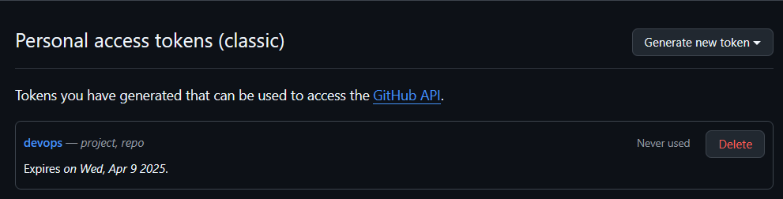
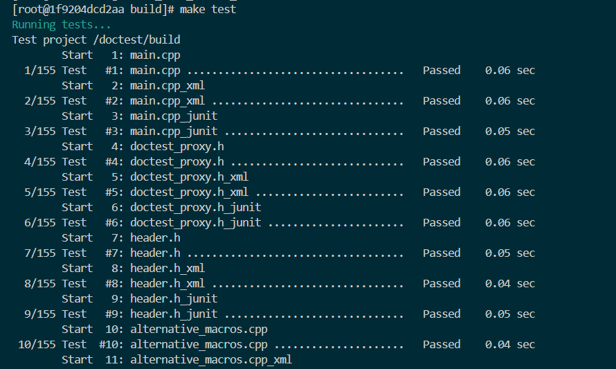
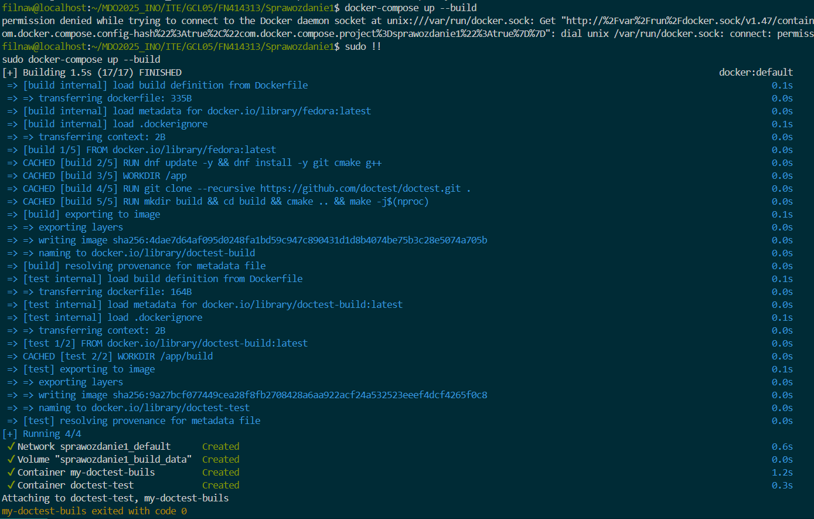

# Sprawozdanie 1

Githook odpowiada za sprawdzenie, czy commit message rozpoczyna się od inicjałów i numeru indeksu (w tym przypadku `FN414313`).

## Skrypt

```bash
#!/bin/bash

PREFIX="FN414313"
COMMIT_MSG_FILE="$1"
FIRST_LINE=$(head -n 1 "$COMMIT_MSG_FILE")

if [[ ! "$FIRST_LINE" =~ ^"$PREFIX" ]]; then
    echo "Błąd: Commit message musi zaczynać się od: '$PREFIX'"
    exit 1
fi

exit 0
```

---

# Instalacja SSH i Gita


# Stworzenie tokenu



# Klonowanie repozytorium

- **Próba klonowania repozytorium** (wymagane poświadczenie tokenem)
  
  

- **Sklonowanie repozytorium przy użyciu tokenu**
  
  

# Tworzenie kluczy SSH

- Klucz `ed25519` z passphrase:
  
  
  

- **Nieudane klonowanie** (nie dodano klucza do GitHuba)
  
  

- **Dodanie klucza do GitHuba**
  
  

- **Udane klonowanie**
  
  

# Skonfigurowanie 2FA


# Gałęzie w repozytorium

- **Gałęź main**
  
  

- **Przełączenie na gałęź swojej grupy**
  
  

- **Utworzenie i przełączenie na gałęź `FN414313`**
  
  

# Utworzenie Git Hooka


# Prezentacja działania Git Hooka


# Utworzenie sprawozdania


# Commit dotychczasowych zmian


# Przejście na gałęź `GCL05`


# Wciągnięcie gałęzi `FN414313` do `GCL05`


---

# Docker

## Pobieranie i uruchamianie Dockera


## Pobieranie i wyświetlanie obrazów


## Uruchomienie kontenera `busybox` i wyświetlenie wersji


## Uruchomienie kontenera na podstawie obrazu Fedora


## Wyświetlenie pierwszego procesu (bash)


## Aktualizacja pakietów


## Wyjście z kontenera


---

# Dockerfile

Treść Dockerfile na podstawie lekkiego obrazu Fedora, na którym instalowane są aktualizacje, git oraz klonowane jest repozytorium.

## Skrypt

```dockerfile
FROM fedora:latest

LABEL maintainer="Filnaw <filipnaw@student.agh.edu.pl>"

ENV DEBIAN_FRONTEND=noninteractive

RUN dnf update && dnf install git && dnf clean all

WORKDIR /app

RUN git clone https://github.com/InzynieriaOprogramowaniaAGH/MDO2025_INO.git /app

CMD ["/bin/bash"]
```

---

# Zbudowanie prostego obrazu na podstawie Dockerfile


## Stworzenie i uruchomienie kontenera, wyświetlenie sklonowanego repozytorium


## Wyświetlenie i wyczyszczenie kontenerów


## Wyczyszczenie obrazów







