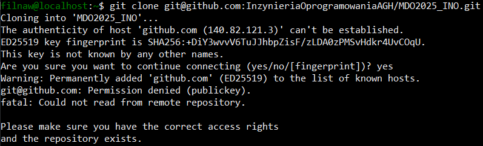

Treść githooka, który odpowiada za poprawny początek każdego commita (ma się on zaczynać od inicjałów i numer indeksu, w moim przypadku FN414313)

## Skrypt

```bash
#!/bin/bash

PREFIX="FN414313"

COMMIT_MSG_FILE="$1"

FIRST_LINE=$(head -n 1 "$COMMIT_MSG_FILE")

if [[ ! "$FIRST_LINE" =~ ^"$PREFIX" ]]; then
    echo  "Błąd: Commit message musi zaczynać się od: '$PREFIX'"
    exit 1
fi

exit 0
```

Instalcja ssh i gita


Stworzenie tokenu


Próba klonowania repozytorium użytkownika (wymagane poświadczenie tokenem)


Sklonowanie repozytorium przy użyciu tokenu


Tworzenie kluczy SSH (gdzie klucz ed25519 posiada passphrase)


Nieudane klonowanie (nie dodano klucza do Githuba)



Dodanie klucza do githuba


Udane klonowanie


Gałęź main


Przełączono na gałęź swojej grupy


Utworzenie i przełączenie na gałęź FN414313


Utworzenie git hooka


Prezentacja działania git hooka


Utworzenie sprawozdania


Commit z dotychczasowymi zmianami


Przejście na gałęź GCL05


Wciągnięcie gałęzi FN414313 do GCL05

