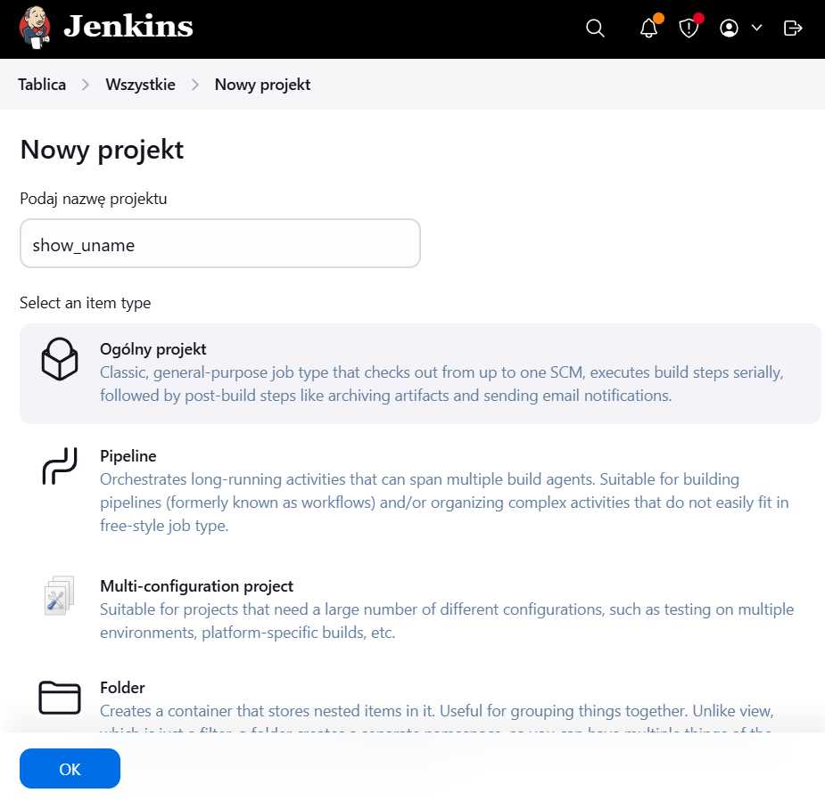
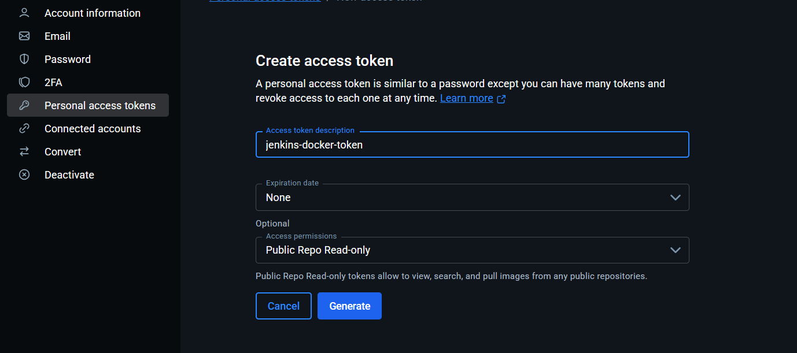
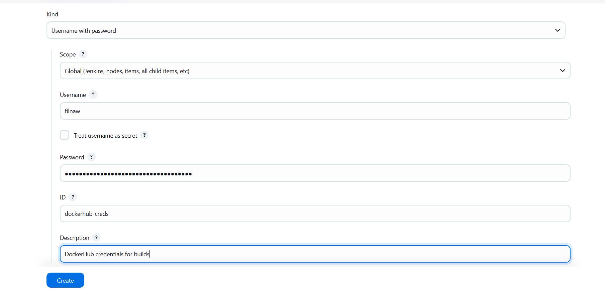
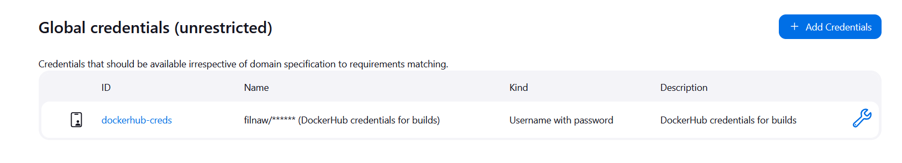
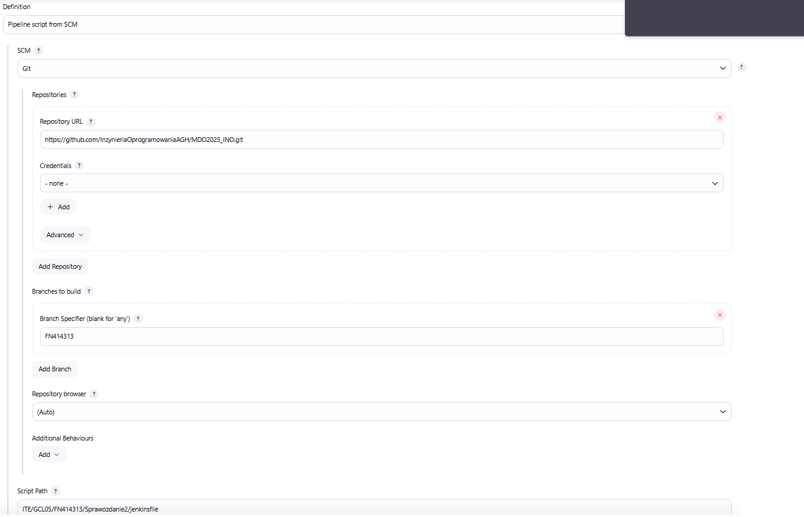
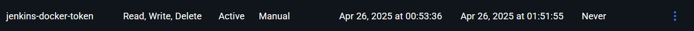
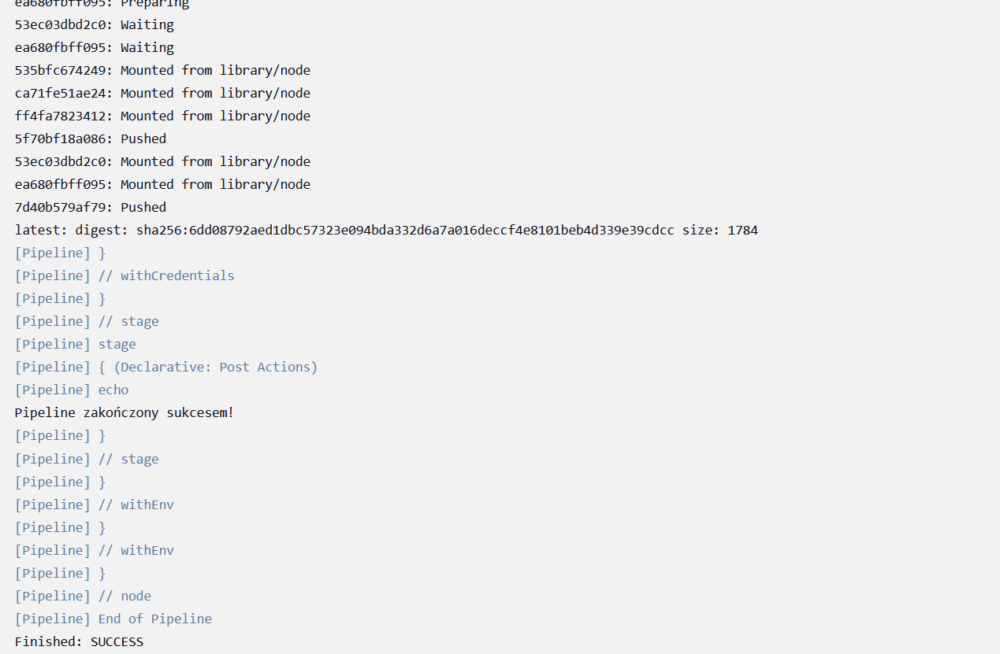
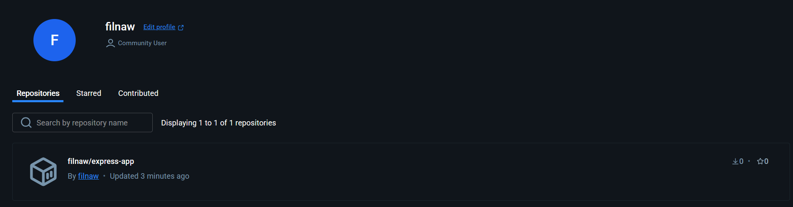

# Sprawozdanie 2

## Class005 

Celem tych ćwiczeń jest zbudowanie kompletnego procesu CI/CD. Którego celem jest automatyczne pobieranie i testowanie kodu, a następnie wdrażanie gotowego produktu.

Z pomocą Jenkinsa tworzene jest proste zadanie, a następnie pierwszy pełny pipeline. 

### 1. Edycja pliku docker-compose

W poprzednim sprowazdaniu wykonane zostały kroki do instalacji Jenkinsa za pomocą pliku docker-compose. Nie uwzględniony wtedy jednak zapisywania logów na woluminie. O to edytowany docker compose i ponowne uruchomienie kontenerów 

```yml
version: '3.8'

services:
  jenkins:
    image: jenkins/jenkins:lts
    restart: unless-stopped
    privileged: true
    user: root
    ports:
      - "8080:8080"
      - "50000:50000"
    volumes:
      - jenkins_home:/var/jenkins_home
      - jenkins_logs:/var/log/jenkins
      - /var/run/docker.sock:/var/run/docker.sock
    environment:
      - DOCKER_HOST=tcp://dind:2375
      - DOCKER_TLS_CERTDIR=""
    depends_on:
      - dind

  dind:
    image: docker:dind
    restart: unless-stopped
    privileged: true
    environment:
      - DOCKER_TLS_CERTDIR=""
    volumes:
      - dind_storage:/var/lib/docker

volumes:
  jenkins_home:
  jenkins_logs:
  dind_storage:

```

Zatrzymanie poprzednich kontenerów i uruchomienie z woluminem


### 2. Utworzenie wstępnych projektów

#### projekt `show_uname`

Na początku utworzono projekt w Jenkinsie (typu ogólny projekt) i nazwano go `show_uname`



W następnym oknie w zakładce `Kroki budowania` wybrano `Uruchom powłokę`. W wyświetlonym oknie wpisano komendę `uname -a`


Po zapisaniu konfiguracji projektu uruchomiono zadanie `Uruchom`, a następnie wyświetlono logi z konsoli 


#### projekt `check_hour`

Utworzenie projektu podobnie jak wcześniej


W konfiguracji w polu `Kroki budowania` i `uruchom powłokę` umieszczono prosty skrypt 

```bash
HOUR=$(date +%H)
if [ $((HOUR % 2)) -ne 0 ]; then
    echo "Godzina $HOUR jest nieparzysta. Przerywam działanie."
    exit 1
else
    echo "Godzina $HOUR jest parzysta. Kontynuuję..."
fi

```


Zapisano konfiguracje i od razu uruchomiono zadanie 


#### projekt `pull_ubuntu`

Utworzony kolejny projekt podobnie jak wcześniej 


W polu `Uruchom powłokę` umieszczono komendę pullującą obraz ubuntu


Zapisano konfiguracje i od razu uruchomiono zadanie 


### 3. obiekt typu pipeline 

Tworzenie projektu pipeline.

Pipeline ten zawiera kolejne kroki budowy i testowania przykładowego repozytorium `doctest`. Ważnym krokiem jest czyszczenie starych obrazow dockerowych i resetowanie dockera

'''
pipeline {
    agent any  

    environment {
        REPO_URL = 'https://github.com/InzynieriaOprogramowaniaAGH/MDO2025_INO.git'
        BRANCH = 'FN414313' 
        DOCKERFILE_PATH_1 = 'ITE/GCL05/FN414313/Sprawozdanie1/image_1/Dockerfile'  
        DOCKERFILE_PATH_2 = 'ITE/GCL05/FN414313/Sprawozdanie1/image_2/Dockerfile'  
    }

    stages {
        stage('Clean Workspace') {
            steps {
                script {
                    // Clean the workspace before each run to ensure fresh repository
                    cleanWs()
                }
            }
        }
        
        stage('Clone') {
            steps {
                git branch: "${BRANCH}", url: "${REPO_URL}"
            }
        }
    
        
        stage('Clean Docker Images') {
            steps {
                script {
                    sh 'docker rmi -f doctest_build'
                    sh 'docker rmi -f doctest_test'
                    sh 'docker builder prune --force --all'
                    sh 'docker stop app || true'
                    sh 'docker rm app || true'
                }
            }
        }

        stage('Build Docker Image for build') {
            steps {
                dir('ITE/GCL05/FN414313/Sprawozdanie1/image_1') {
                    sh 'docker build --no-cache -t doctest-build .'
                }
            }
        }

        stage('Run Docker Image for build') {
            steps {
                script {
                    sh 'docker run -it -d doctest-build'
                }
            }
        }

        stage('Build Docker Image for test') {
            steps {
                dir('ITE/GCL05/FN414313/Sprawozdanie1/image_2') {
                    sh 'docker build --no-cache -t doctest-test .'
                    sh 'docker run --rm doctest-test'
                }
            }
        }

        stage('Test Docker Image for test') {
            steps {
                script {
                    sh 'docker run --rm doctest-test'
                }
            }
        }
    }

    post {
        success {
            echo 'Pipeline zakończony sukcesem!'
        }
        failure {
            echo 'Pipeline zakończony niepowodzeniem.'
        }
    }
}

'''


Pipeline zakończył się sukcesem 


## Class006 i 007

### Wybór aplikacji

Wybrano projekt [Express.js](https://github.com/expressjs/express), który jest minimalistycznym frameworkiem, idealnym do stworzenia pipeline'a

## Licencja

Projekt objęty jest licencją MIT, która zezwala na użytek edukacyjny oraz rozwój własnych modyfikacji. Licencja jest zgodna z wymaganiami zadania.

## Budowanie aplikacji

Aplikacja nie wymaga kompilacji. Budowanie sprowadza się do instalacji zależności poprzez narzędzie `npm`:

```
npm install
```

## Testy aplikacji

W repozytorium dostępne są testy uruchamiane komendą:

```
npm test
```

Testy zostały uruchomione lokalnie i zakończyły się sukcesem.

## Diagram UML

Przygotowano diagram UML przedstawiający przepływ procesu CI/CD obejmujący etapy budowania, testowania oraz wdrażania aplikacji.


## Proces build w kontenerze

Do wykonania procesu wykorzystano obraz build

```Dockerfile
FROM node AS express-build

RUN git clone https://github.com/expressjs/express

RUN npm install -g express-generator@4

RUN express /tmp/foo

WORKDIR /tmp/foo

RUN npm install
```
## Testowanie w kontenerze

Testy są wykonywane w osobnym etapie `test`, który również klonuję repozytorium, z uwagi na problemy z testami w innym scenariuszu

```Dockerfile
FROM node AS express-build

RUN git clone https://github.com/expressjs/express.git /app

WORKDIR /app

RUN npm install

RUN npm test
```

## Kontener deploy

Utworzono finalny obraz zawierający wyłącznie uruchamialną aplikację:

```Dockerfile
FROM node:18-slim

COPY --from=express-build /tmp/foo /app

WORKDIR /app

CMD ["npm", "start"]
```

## Smoke test

Weryfikacja działania aplikacji poprzez wywołanie:

```
curl http://localhost:3000
```

Aplikacja odpowiada poprawnie.

## Format artefaktu

Obraz Dockera pozwala na łatwe uruchamianie aplikacji lokalnie i w środowiskach produkcyjnych. Umożliwia przenośność i powtarzalność wdrożeń.

## Wersjonowanie artefaktów

Zastosowano wersjonowanie semantyczne w postaci tagów, np.:

```
express-deploy:1.0.0
```

## Ostateczny jenkins pipeline 

```groovy
pipeline {
    agent any  

    environment {
        REPO_URL = 'https://github.com/InzynieriaOprogramowaniaAGH/MDO2025_INO.git'
        BRANCH = 'FN414313' 
        DOCKERFILE_PATH = 'ITE/GCL05/FN414313/Sprawozdanie2/dockerfile'  
    }

    stages {
        stage('Clean Workspace') {
            steps {
                script {
                    // Clean the workspace before each run to ensure fresh repository
                    cleanWs()
                }
            }
        }
        
        stage('Clone') {
            steps {
                git branch: "${BRANCH}", url: "${REPO_URL}"
            }
        }
    
        
        stage('Clean Docker Images') {
            steps {
                script {
                    sh 'docker rmi -f doctest_build'
                    sh 'docker rmi -f doctest_test'
                    sh 'docker builder prune --force --all'
                    sh 'docker stop app || true'
                    sh 'docker rm app || true'
                    sh 'docker network inspect ci >/dev/null 2>&1 && docker network rm ci || true'
                }
            }
        }

        stage('Build Docker Image for build') {
            steps {
                dir("${DOCKERFILE_PATH}") {
                    sh 'docker build --no-cache -f Dockerfile.buildjs -t expressjs-build .'
                }
            }
        }

        stage('Run Docker Image for build') {
            steps {
                script {
                    sh 'docker run -it -d expressjs-build'
                }
            }
        }

        stage('Build Docker Image for test') {
            steps {
                dir("${DOCKERFILE_PATH}") {
                    sh 'docker build --no-cache -f Dockerfile.test -t expressjs-test .'
                    sh 'docker run --rm expressjs-test'
                }
            }
        }
        
        stage('Build Docker Image for publish') {
            steps {
                dir("${DOCKERFILE_PATH}") {
                    sh 'docker build -f Dockerfile.publish -t express-app .'
                }
            }
        }
        
        stage('Run app') {
            steps {
                dir("${DOCKERFILE_PATH}") {
                    sh 'docker network create ci'
                    sh 'docker run --rm -d --network ci --name app -p 3000:3000 express-app'
                    sh 'docker run --rm --network ci fedora curl -s app:3000'
                }
            }
        }
    }

    post {
        success {
            echo 'Pipeline zakończony sukcesem!'
        }
        failure {
            echo 'Pipeline zakończony niepowodzeniem.'
        }
    }
}

```
## Początek tworzenia SCM

Tworzenie personal access tokena w dockerhubie 



Wykorzystanie utworzenego tokena jako hasło podczas ustawiania uwierzytelniana w Jenkinsie (z nazwą ID `dockerhub-creds`)



Wygenerowane uwierzytelnianie 



Następnie tworzenie nowego projektu typu pipeline, który będzie wykorzysytwał SCM z danymi widocznymi na screenie (repozytorium, jenkinsfile w repozytorium)



Należało zmienić uprawnienia tokena, aby poprawnie przeprowadzić push. Zmienione uprawnienia



Po wykoaniu tego pipeline kończy się sukcesem i pushuję obraz do dockerhuba 



Widać to na końce dockerhub



Pipeline jest powtarzalny i działa bez cashu    