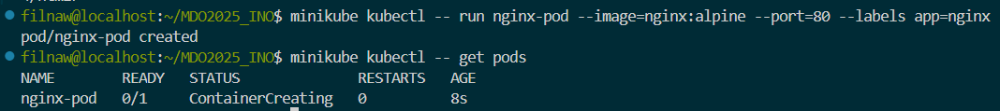

# Sprawozdanie 3

## Class010

instalacja minikube 


Startowanie minikube 


Startowanie minikube dashboarda


Dodanie aliasu dla kubectl


Przygotowano obraz docker z użyciem ngnixa, sprawdzono działanie


Uruchomiono obraz jako pod w kubernatasie 



Przekierowano port dla stworzonego poda


Przedstawienie wyników w dashboardzie minikube'a


utworzono plik yaml nginx-deployment

```yaml
apiVersion: apps/v1
kind: Deployment
metadata:
  name: nginx-deployment
spec:
  replicas: 4
  selector:
    matchLabels:
      app: nginx
  template:
    metadata:
      labels:
        app: nginx
    spec:
      containers:
        - name: nginx
          image: nginx:alpine
          ports:
            - containerPort: 80

```

Następnie na podstawie tego pliku stworzono wdrożenie


Wyeksponowano wdrożenie jako serwis 


Wygląd w dashboardzie


## Class011

utworzono dwa przykładowe pliki index.html aby rozróżnić wersje podów oraz plik Dockerfile wykorzystujący /bin/false; do zwracania exited(1) dla złego kontenera

*v1/index.html*

```html
<html>
  <body>
    <h1>Wersja 1 - moja własna wersja nginx</h1>
  </body>
</html>

```

*v2/index.html*

```html
<html>
  <body>
    <h1>Wersja 2 - zaktualizowana strona</h1>
  </body>
</html>

```

*Dockerfile*

```dockerfile
FROM nginx:alpine

ARG VERSION=v1
ENV VERSION=$VERSION

COPY ${VERSION}/index.html /usr/share/nginx/html/index.html

EXPOSE 80
CMD sh -c 'if [ "$VERSION" = "bad" ]; then /bin/false; else nginx -g "daemon off;"; fi'

```

Na tej podstawie zbudowano te kontenery


Odpaliłem również te kontenery w celu sprawdzenia czy zachowują się zgodnie z oczekiwaniami. Poprawnie odpaliły się obie wersje. Zła wersja zwróciła exited(1). Screeny poleceń i extension w visual studio code


Na podstawie wystawionych portów sprawdzono także działanie kontenerów, a dokładnie zawartość ich index.html z pomocą polecenia curl


Następnie spushowano do dockerhuba wszystkie wersje obrazów


Wygląd w dockerhubie


Utworzyłem plik my-nginx-deployment.yaml 

```yaml 
apiVersion: apps/v1
kind: Deployment
metadata:
  name: my-nginx
spec:
  replicas: 8
  selector:
    matchLabels:
      app: my-nginx
  template:
    metadata:
      labels:
        app: my-nginx
    spec:
      containers:
        - name: nginx
          image: filnaw/my-nginx:v1
          ports:
            - containerPort: 80

```

Następnie rozpocząłem różne rodzaje deploymentu początkowo z ośmioma replikami. Zmieniałem plik my-nginx-deployment.yaml i wykorzysytwałem polecenie `kubectl apply -f my-nginx-deployment.yaml` do przeładowania deploymentu.

`zmieniania linijka`
```yaml
replicas: 8
```


Następnie zmieniono na jedną replikę

`zmieniania linijka`
```yaml
replicas: 1
```


Następnie na 0 replik 

`zmieniania linijka`
```yaml
replicas: 0
```


replika set został utworzony, ale nie zawiera żadnych podów


Znów dokonano zmiany, powrócono do 4 replik

`zmieniania linijka`
```yaml
replicas: 4
```


Zastosowanie nowszej wersji obrazu 

`zmieniania linijka`
```yaml
image: filnaw/my-nginx:v2
```


Powrót do starszej wersji obrazu

`zmieniania linijka`
```yaml
image: filnaw/my-nginx:v1
```


Zastosowanie "złej" wersji 

`zmieniania linijka`
```yaml
image: filnaw/my-nginx:bad
```


Można zauważyć, że 2 pody wpadają w error, a potem CrashLoopBack. Co ciekawe trzy pody zwracają running. Pomimo ustawienia 4 replik i złego obrazu powstały tylko dwa pody złego obrazu, w kubernates można wciąż zauważyć 3 działające pody pierwszej wersji.

Wygląda na to, że wynika to z działania tak zwanego rolling update w kubernatesie. Kubernates stopniowo zmienia stare instancje na nowe. W przypadku kiedy nowe pody się nie uruchamiają poprawnie to kubernates zatrzymuje rollout i zostawia stare działajace pody. Można to też zauważyć po zastosowaniu komendy 
`kubectl rollout status deployment my-nginx`


Następnie sprawdziłem historię rolloutów. Z uwagi na wykorzystanie apply do zmiany deployów i nie używanie komendy annotate dodającej informacje o zmianie CHANGE-CAUSE jest puste w każdej zmianie, przez co trudno stwierdzić, która dokładnie jest która 


Do powrotu do dawnych zmian można wykorzystać polecenie 

`kubectl rollout undo deployment my-nginx`

Zamiast wykorzystywać komendy apply można także komendami zmieniać ilość replik i wersje

`kubectl scale deployment my-nginx --replicas=<ilość>`
`kubectl set image deployment/my-nginx nginx=filnaw/my-nginx:<wersja>`


Historia deploymentu nie pokazała żadnych CHANGE-CAUSE z powodu na użyty sposób zmiany replik i wersji z tego powodu rozpoczęto pisanie skryptu weryfikującego czy wdrożenie "zdążyło" się wdrożyć w 60 sekund.

`check_deployment.sh`
```bash
#!/bin/bash
DEPLOYMENT=nginx-demo
TIMEOUT=60

for i in $(seq 1 $TIMEOUT); do
    READY=$(kubectl get deploy $DEPLOYMENT -o jsonpath='{.status.readyReplicas}')
    DESIRED=$(kubectl get deploy $DEPLOYMENT -o jsonpath='{.status.replicas}')
    if [[ "$READY" == "$DESIRED" && "$READY" != "" ]]; then
        echo "Deployment is ready ($READY/$DESIRED)"
        exit 0
    fi
    echo "Waiting... ($i/$TIMEOUT)"
    sleep 1
done

echo "Deployment failed or timed out"
exit 1
```

Wcześniej zauważyliśmy działanie strategi deployment która nazywa się rolling update, która była domyślną strategią. Można w niej też ustawić ilość podów niedziałających po których deployment jest zatrzymany jak i liczbę podów ponad żądaną ilość

```yaml
maxUnavailable: 2 
maxSurge: 2 
```

Zmieniono strategie na Recrate


```yaml
strategy:
    type: Recreate
```

Kontynuowałem używanie "złego" deploymentu, żeby zobaczyć czy wszystkie dobre pody zostaną zamienione na złe.


Jak widać wszystkie dobre pody zostały wyłączone. Jednak nie zostały uruchomione 4 pody, a tylko 2, pomimo, że ilość replik jest ustawiona na 4. Wynika to z faktu, że Kubernates zauważa, że dwa pody się crashują, więc nie chcę uruchamiać kolejnych, co wynika z jego mechanizmu exponential backoff, który ma ustawiony limit aktywnych restartów.

Utworzono dwa pliki potrzebne do Canary Deployment workload

`canary-deployment.yaml`
```yaml
---
apiVersion: apps/v1
kind: Deployment
metadata:
  name: my-nginx-stable
  labels:
    app: my-nginx
    version: stable
spec:
  replicas: 3
  selector:
    matchLabels:
      app: my-nginx
      track: stable
  template:
    metadata:
      labels:
        app: my-nginx
        track: stable
    spec:
      containers:
        - name: nginx
          image: filnaw/my-nginx:v1
          ports:
            - containerPort: 80
---
apiVersion: apps/v1
kind: Deployment
metadata:
  name: my-nginx-canary
  labels:
    app: my-nginx
    version: canary
spec:
  replicas: 1
  selector:
    matchLabels:
      app: my-nginx
      track: canary
  template:
    metadata:
      labels:
        app: my-nginx
        track: canary
    spec:
      containers:
        - name: nginx
          image: filnaw/my-nginx:v2
          ports:
            - containerPort: 80

```

oraz 

`service.yaml`
```yaml
apiVersion: v1
kind: Service
metadata:
  name: my-nginx-service
spec:
  selector:
    app: my-nginx
  ports:
    - protocol: TCP
      port: 80
      targetPort: 80

```

Następnie uruchomiono ten deployment


Jak można zauważyć utworzony zostały 4 pody. 3 pody dla deploymentu my-nginx-stable, które posiada obraz v1 oraz 1 pod my-nginx-canry, który posiada obraz nummer 1. Widać, też że serwis został uruchomiony


