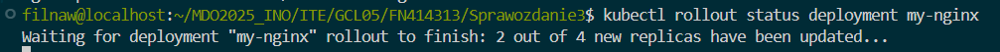

# Sprawozdanie 3

## Class008

Utworzono nową maszynę wirtualną na której utworzono użytkownika ansible. Następnie po instalacji na nowej maszynie nadano nazwę hosta na  "ansible-target". Nazwę dotychczasowej maszyny zmieniono na "orchestrator"


Zapewniono zainstalowanie pakietów sshd i tar


Zainstalowano na maszynie głównej ansible z repozytoriów dystrybucji


Dodano adres ip do etc/hosts


Następnie skopiowano klucz ssh na drugą maszynę 


Udało się połączyć do maszyny po ssh bez podawania hasła


W ramach inwenteryzacji zadbano o poprawne połączenie między maszynami po ssh, bez hasła i po nazwie urządzenia zamiast IP. Następnie stworzono plik inwentaryzacyjny `inventory.ini` w którym umieszczono sekcje `Orchestrators` oraz `Endpoints`

```ini
[Orchestrators]
orchestrator ansible_user=filnaw

[Endpoints]
ansible-target ansible_user=ansible
```

Następnie wysłano żądanie ping do wszystkich maszyn, który był pomyślny


W ramach zdalnego wywołania procedur utworzono Ansible playbook, który:

- wysyła żądanie ping do wszystkich maszyn
- kopiuje plik inwentaryzacji na maszynę Endpoints
- Ponowia operacje ping, dzięki czemu można porównać różnicę w wyjściu po dodaniu pliku ini
- Aktualizuje pliki w systemie
- Rejestruję usługi sshd i rngd
- Przeprowadza operację względem maszyny z wyłączonym serwerem SSH, odpiętą kartą sieciową

### Dodano również instalacje rngd, ponieważ to nie było na maszynie docelowej

`procedury.yml`

```yml
---
- name: Ping all reachable machines
  hosts: Endpoints
  gather_facts: no
  tasks:
    - name: Ping the target machine
      ansible.builtin.ping:

- name: Copy inventory file to target machines
  hosts: Endpoints
  gather_facts: no
  tasks:
    - name: Copy the inventory file
      ansible.builtin.copy:
        src: ./inventory.ini
        dest: /tmp/inventory.ini
        mode: '0644'

- name: Ping the target machines again
  hosts: Endpoints
  gather_facts: no
  tasks:
    - name: Ping the target machine again
      ansible.builtin.ping:

- name: Update packages on target machines
  hosts: Endpoints
  become: yes
  gather_facts: no
  tasks:
    - name: Update all packages
      ansible.builtin.dnf:
        name: "*"
        state: latest
        update_cache: yes
      ignore_errors: yes
      register: update_result
      ignore_errors: yes

- name: Install rngd service on target machines
  hosts: Endpoints
  become: yes
  tasks:
    - name: Install rngd package
      ansible.builtin.dnf:
        name: rng-tools
        state: present
        
- name: Restart services on target machines
  hosts: Endpoints
  become: yes
  gather_facts: no
  tasks:
    - name: Restart sshd service
      ansible.builtin.service:
        name: sshd
        state: restarted
      ignore_errors: yes

    - name: Restart rngd service
      ansible.builtin.service:
        name: rngd
        state: restarted
      ignore_errors: yes

- name: Wait for machines to become reachable again
  hosts: Endpoints
  gather_facts: no
  tasks:
    - name: Wait for SSH port to become available
      ansible.builtin.wait_for:
        port: 22
        timeout: 300
        state: started
        delay: 10

```

Wynik wykonania playbooka


Następnie utworzono plik `deploy.yml` który za pomoca playbooka Ansible 

- Buduje i uruchamia kontener sekcji Deploy z poprzednich zajęć
- Pobiera z Docker Hub aplikację "opublikowaną" w ramach kroku Publish
- Na maszynie docelowej instaluje Dockera
- Weryfikuję łączność z kontenerem
- Zatrzymuję i usuwa kontener

```yml
---
- name: Deploy express app container on Fedora
  hosts: Endpoints
  become: true
  vars:
    container_name: express_app
    image_name: filnaw/express-app
    exposed_port: 3000

  tasks:
    - name: Install Docker (moby-engine and docker packages)
      ansible.builtin.dnf:
        name:
          - moby-engine
          - docker
        state: present
        update_cache: yes

    - name: Start and enable Docker service
      ansible.builtin.service:
        name: docker
        state: started
        enabled: true

    - name: Pull the Docker image from Docker Hub
      community.docker.docker_image:
        name: "{{ image_name }}"
        source: pull

    - name: Run the container from the image
      community.docker.docker_container:
        name: "{{ container_name }}"
        image: "{{ image_name }}"
        state: started
        restart_policy: always
        published_ports:
          - "{{ exposed_port }}:3000"

    - name: Wait for HTTP response from the container
      ansible.builtin.uri:
        url: "http://localhost:{{ exposed_port }}/"
        method: GET
        return_content: yes
        status_code: 200
      register: result
      retries: 10
      delay: 3
      until: result.status == 200

    - name: Display HTTP status code
      ansible.builtin.debug:
        msg: "HTTP status: {{ result.status }}"

    - name: Display first 300 characters of HTTP response content
      ansible.builtin.debug:
        msg: "{{ result.content[:300] }}"

    - name: Stop the container
      community.docker.docker_container:
        name: "{{ container_name }}"
        state: stopped

    - name: Remove the container
      community.docker.docker_container:
        name: "{{ container_name }}"
        state: absent

```

Działanie zaprezentowano w terminalu, jak widać obraz udało się zpullować, uruchomić, jego zawartość (index.html) wypisać, a następnie zatrzymać kontener i go usunąć


## Class009

Laboratoria wymagały instalacji nienadzorowanej z użyciem pliku anaconda-ks.cfg, który znajduje się w folderze ze sprawozdaniem i ma nadane uprawnienia 777. Plik został zmodyfikowany, aby korzystał z odpowiedniego mirrora Fedory (wersja 41) oraz zawierał w sekcji %post polecenia do automatycznego uruchomienia programu express.js. Artefakt dostępny jest na Docker Hubie pod nazwą filnaw/express-app.

`anaconda-ks.cfg`
```cfg
#version=DEVEL
# System language
lang pl_PL.UTF-8

# Keyboard layouts
keyboard --vckeymap=pl --xlayouts='pl'

# Timezone
timezone Europe/Warsaw --utc

# Network & hostname
network --hostname=orchestrator

# Root user
rootpw --iscrypted --allow-ssh $y$j9T$Ue5uObLv57A.Qh7B91u7Z0$qJzHpvIwFKXO6NgN6myL242U3RH9pRZwgNPkgoxdoJ2

# User with sudo access
user --groups=wheel --name=filnaw --password=$y$j9T$DPkkFJJkb5B5y0vplaL3jBwA$iQ/o9YZxPyY.FvZQyX0lv/PVlzaP5E2yWwqaEU2xfO8 --iscrypted --gecos="Filnaw"

# Installation source
url --mirrorlist=http://mirrors.fedoraproject.org/mirrorlist?repo=fedora-41&arch=x86_64
repo --name=update --mirrorlist=http://mirrors.fedoraproject.org/mirrorlist?repo=updates-released-f41&arch=x86_64

# System boot settings
firstboot --enable
reboot

# Partitioning
ignoredisk --only-use=sda
clearpart --all --initlabel
autopart

# Package selection
%packages
@^server-product-environment
@headless-management
docker
wget
%end

%post --log=/root/kickstart-post.log

# Skrypt, który pobierze obraz i uruchomi kontener po pierwszym uruchomieniu systemu
mkdir -p /opt/express_app
cat << 'EOF' > /opt/express_app/firstboot.sh
#!/bin/bash

# Uruchom docker (na wszelki wypadek)
systemctl start docker

# Pobierz obraz z Docker Huba
docker pull filnaw/express-app:latest

# Uruchom kontener w tle z mapowaniem portu
docker run -d --name express-app -p 3000:3000 filnaw/express-app:latest

# Wyłącz tę usługę po wykonaniu
systemctl disable express-app-firstboot.service
rm -f /etc/systemd/system/express-app-firstboot.service
rm -f /opt/express_app/firstboot.sh
EOF

chmod +x /opt/express_app/firstboot.sh

# Utwórz usługę systemd, która wykona ten skrypt raz po pierwszym starcie systemu
cat << 'EOF' > /etc/systemd/system/express-app-firstboot.service
[Unit]
Description=Pull and run express-app container on first boot
After=network.target docker.service
Requires=docker.service

[Service]
Type=oneshot
ExecStart=/opt/express_app/firstboot.sh
RemainAfterExit=true
StandardOutput=journal
StandardError=journal

[Install]
WantedBy=multi-user.target
EOF

# Włącz usługę, aby odpalała się po starcie systemu
systemctl enable express-app-firstboot.service

# Włącz dockera, aby działał po starcie systemu
systemctl enable docker

%end

```

Następnie podczas instalacji w GRUBie dopisano instrukcje "inst.ks", która wskazywała na link do będącego na repo pliku anaconda-ks.cfg. Link został skrócony w tiny url.


Po wykonaniu automatycznej instalacji działa aplikacja z włączona z pomocą linuxowych serwisów. Wykonanie curl pokazuję działanie aplikacji


## Class010

instalacja minikube 


Startowanie minikube 


Startowanie minikube dashboarda


Dodanie aliasu dla kubectl


Przygotowano obraz docker z użyciem ngnixa, sprawdzono działanie


Uruchomiono obraz jako pod w kubernatasie 


Przekierowano port dla stworzonego poda


Przedstawienie wyników w dashboardzie minikube'a


utworzono plik yaml nginx-deployment

```yaml
apiVersion: apps/v1
kind: Deployment
metadata:
  name: nginx-deployment
spec:
  replicas: 4
  selector:
    matchLabels:
      app: nginx
  template:
    metadata:
      labels:
        app: nginx
    spec:
      containers:
        - name: nginx
          image: nginx:alpine
          ports:
            - containerPort: 80

```

Następnie na podstawie tego pliku stworzono wdrożenie


Wyeksponowano wdrożenie jako serwis 


Wygląd w dashboardzie


## Class011

utworzono dwa przykładowe pliki index.html aby rozróżnić wersje podów oraz plik Dockerfile wykorzystujący /bin/false; do zwracania exited(1) dla złego kontenera

*v1/index.html*

```html
<html>
  <body>
    <h1>Wersja 1 - moja własna wersja nginx</h1>
  </body>
</html>

```

*v2/index.html*

```html
<html>
  <body>
    <h1>Wersja 2 - zaktualizowana strona</h1>
  </body>
</html>

```

*Dockerfile*

```dockerfile
FROM nginx:alpine

ARG VERSION=v1
ENV VERSION=$VERSION

COPY ${VERSION}/index.html /usr/share/nginx/html/index.html

EXPOSE 80
CMD sh -c 'if [ "$VERSION" = "bad" ]; then /bin/false; else nginx -g "daemon off;"; fi'

```

Na tej podstawie zbudowano te kontenery


Odpaliłem również te kontenery w celu sprawdzenia czy zachowują się zgodnie z oczekiwaniami. Poprawnie odpaliły się obie wersje. Zła wersja zwróciła exited(1). Screeny poleceń i extension w visual studio code


Na podstawie wystawionych portów sprawdzono także działanie kontenerów, a dokładnie zawartość ich index.html z pomocą polecenia curl


Następnie spushowano do dockerhuba wszystkie wersje obrazów


Wygląd w dockerhubie


Utworzyłem plik my-nginx-deployment.yaml 

```yaml 
apiVersion: apps/v1
kind: Deployment
metadata:
  name: my-nginx
spec:
  replicas: 8
  selector:
    matchLabels:
      app: my-nginx
  template:
    metadata:
      labels:
        app: my-nginx
    spec:
      containers:
        - name: nginx
          image: filnaw/my-nginx:v1
          ports:
            - containerPort: 80

```

Następnie rozpocząłem różne rodzaje deploymentu początkowo z ośmioma replikami. Zmieniałem plik my-nginx-deployment.yaml i wykorzysytwałem polecenie `kubectl apply -f my-nginx-deployment.yaml` do przeładowania deploymentu.

`zmieniania linijka`
```yaml
replicas: 8
```


Następnie zmieniono na jedną replikę

`zmieniania linijka`
```yaml
replicas: 1
```


Następnie na 0 replik 

`zmieniania linijka`
```yaml
replicas: 0
```


replika set został utworzony, ale nie zawiera żadnych podów


Znów dokonano zmiany, powrócono do 4 replik

`zmieniania linijka`
```yaml
replicas: 4
```


Zastosowanie nowszej wersji obrazu 

`zmieniania linijka`
```yaml
image: filnaw/my-nginx:v2
```


Powrót do starszej wersji obrazu

`zmieniania linijka`
```yaml
image: filnaw/my-nginx:v1
```


Zastosowanie "złej" wersji 

`zmieniania linijka`
```yaml
image: filnaw/my-nginx:bad
```


Można zauważyć, że 2 pody wpadają w error, a potem CrashLoopBack. Co ciekawe trzy pody zwracają running. Pomimo ustawienia 4 replik i złego obrazu powstały tylko dwa pody złego obrazu, w kubernates można wciąż zauważyć 3 działające pody pierwszej wersji.

Wygląda na to, że wynika to z działania tak zwanego rolling update w kubernatesie. Kubernates stopniowo zmienia stare instancje na nowe. W przypadku kiedy nowe pody się nie uruchamiają poprawnie to kubernates zatrzymuje rollout i zostawia stare działajace pody. Można to też zauważyć po zastosowaniu komendy 
`kubectl rollout status deployment my-nginx`



Następnie sprawdziłem historię rolloutów. Z uwagi na wykorzystanie apply do zmiany deployów i nie używanie komendy annotate dodającej informacje o zmianie CHANGE-CAUSE jest puste w każdej zmianie, przez co trudno stwierdzić, która dokładnie jest która 


Do powrotu do dawnych zmian można wykorzystać polecenie 

`kubectl rollout undo deployment my-nginx`

Zamiast wykorzystywać komendy apply można także komendami zmieniać ilość replik i wersje

`kubectl scale deployment my-nginx --replicas=<ilość>`
`kubectl set image deployment/my-nginx nginx=filnaw/my-nginx:<wersja>`


Historia deploymentu nie pokazała żadnych CHANGE-CAUSE z powodu na użyty sposób zmiany replik i wersji z tego powodu rozpoczęto pisanie skryptu weryfikującego czy wdrożenie "zdążyło" się wdrożyć w 60 sekund.

`check_deployment.sh`
```bash
#!/bin/bash
DEPLOYMENT=nginx-demo
TIMEOUT=60

for i in $(seq 1 $TIMEOUT); do
    READY=$(kubectl get deploy $DEPLOYMENT -o jsonpath='{.status.readyReplicas}')
    DESIRED=$(kubectl get deploy $DEPLOYMENT -o jsonpath='{.status.replicas}')
    if [[ "$READY" == "$DESIRED" && "$READY" != "" ]]; then
        echo "Deployment is ready ($READY/$DESIRED)"
        exit 0
    fi
    echo "Waiting... ($i/$TIMEOUT)"
    sleep 1
done

echo "Deployment failed or timed out"
exit 1
```

Wcześniej zauważyliśmy działanie strategi deployment która nazywa się rolling update, która była domyślną strategią. Można w niej też ustawić ilość podów niedziałających po których deployment jest zatrzymany jak i liczbę podów ponad żądaną ilość

```yaml
maxUnavailable: 2 
maxSurge: 2 
```

Zmieniono strategie na Recrate


```yaml
strategy:
    type: Recreate
```

Kontynuowałem używanie "złego" deploymentu, żeby zobaczyć czy wszystkie dobre pody zostaną zamienione na złe.


Jak widać wszystkie dobre pody zostały wyłączone. Jednak nie zostały uruchomione 4 pody, a tylko 2, pomimo, że ilość replik jest ustawiona na 4. Wynika to z faktu, że Kubernates zauważa, że dwa pody się crashują, więc nie chcę uruchamiać kolejnych, co wynika z jego mechanizmu exponential backoff, który ma ustawiony limit aktywnych restartów.

Utworzono dwa pliki potrzebne do Canary Deployment workload

`canary-deployment.yaml`
```yaml
---
apiVersion: apps/v1
kind: Deployment
metadata:
  name: my-nginx-stable
  labels:
    app: my-nginx
    version: stable
spec:
  replicas: 3
  selector:
    matchLabels:
      app: my-nginx
      track: stable
  template:
    metadata:
      labels:
        app: my-nginx
        track: stable
    spec:
      containers:
        - name: nginx
          image: filnaw/my-nginx:v1
          ports:
            - containerPort: 80
---
apiVersion: apps/v1
kind: Deployment
metadata:
  name: my-nginx-canary
  labels:
    app: my-nginx
    version: canary
spec:
  replicas: 1
  selector:
    matchLabels:
      app: my-nginx
      track: canary
  template:
    metadata:
      labels:
        app: my-nginx
        track: canary
    spec:
      containers:
        - name: nginx
          image: filnaw/my-nginx:v2
          ports:
            - containerPort: 80

```

oraz 

`service.yaml`
```yaml
apiVersion: v1
kind: Service
metadata:
  name: my-nginx-service
spec:
  selector:
    app: my-nginx
  ports:
    - protocol: TCP
      port: 80
      targetPort: 80

```

Następnie uruchomiono ten deployment


Jak można zauważyć utworzony zostały 4 pody. 3 pody dla deploymentu my-nginx-stable, które posiada obraz v1 oraz 1 pod my-nginx-canry, który posiada obraz nummer 1. Widać, też że serwis został uruchomiony


