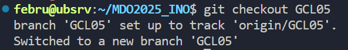

# Sprawozdanie 1

### Temat 1 - Wprowadzenie, Git, Gałęzie, SSH

Na początku sklonowano repozytorium przedmiotowe.

```bash
git clone https://github.com/InzynieriaOprogramowaniaAGH/MDO2025_INO
```


Następnie utworzono dwa klucze SSH zabezpieczone hasłem oraz szyfrowane za pomocą algorytmów pierwszy - ED25519 oraz drugi - ECDSA. 

```bash
ssh-keygen -t ed25519 -f ~/.ssh/id_ed25519
ssh-keygen -t ecdsa -f ~/.ssh/id_ecdsa
```


Uzyskany klucz publiczny skonfigurowano jako metodę dostępu do GitHuba.

```bash
cat .ssh/id_ed25519.pub 
```


Ponownie sklonowano repozytorium przedmiotowe, lecz tym razem z wykorzystaniem protokołu SSH.

```bash
git clone git@github.com:InzynieriaOprogramowaniaAGH/MDO2025_INO.git
```


W repozytorium przełączono się na gałąź grupy, a następnie utworzono nową (wychodzącą od niej) gałąź o nazwie `KL417218`.

```bash
cd MDO2025_INO
git checkout main
git checkout GCL05
git checkout -b KL417218
```




W katalogu grupy utworzono nowy katalog `KL417218`. 

```bash
cd ITE/GCL05/
mkdir KL417218
```

Zmieniono working directory na katalog `.git/hooks`, w którym utworzono plik o nazwie `commit-msg`. W jego środku umieszczono kod odpowiedzialny za weryfikację poprawności wiadomości dołączanych do przyszłych commitów. Plik zapisano i przyznano możliwość jego wykonywania. Skopiowano go także do folderu utworzonego w poprzednim kroku.

```bash
cd ~/MDO2025_INO/.git/hooks
nano commit-msg
chmod +x commit-msg
cp commit-msg ../../ITE/GCL05/KL417218/
```


```bash
#!/bin/bash

COMMIT_MSG=$(cat "$1")

if [[ ! "$COMMIT_MSG" =~ ^KL417218 ]]; then
  echo "Błąd: Każdy commit message musi zaczynać się od 'KL417218'!"
  exit 1
fi
```

Powrócono do personalnego katalogu, gdzie utworzono nowy katalog  `Sprawozdanie1 `z plikiem `README.md`. Następnie wszystie zmiany dodano do staging area w gicie.

```bash
cd ~/MDO2025_INO/ITE/GCL05/KL417218/
mkdir Sprawozdanie1
cd Sprawozdanie1
touch README.md
git add .
git status
```


Utworzono nowego commita.

```bash
git commit -m "KL417218: add report and commit-msg githook"
git status
```


Wszystkie dodane pliki oraz zmiany przesłano do zdalnego źródła na gałąź `KL417218`.

```bash
git push origin KL417218
```


### Temat 2 - Git, Docker

```bash
sudo usermod -aG docker $USER (ponieważ wiem że mogę i vmka jest moja pozdro 600)
su - $USER
docker ps

docker pull hello-world
docker pull busybox
docker pull ubuntu
docker pull mysql

docker run -it busybox sh (od razu interactive bo inaczej sie wywala za 0)
>> busybox

docker run -it ubuntu sh
>> ps aux
>> apt update
>> apt upgrade
>> exit

docker build -t februbuntu .
docker run -it februbuntu

docker ps -a

docker rm $(docker ps -a -q)
docker ps -a
```

### Temat 3 - Dockerfiles, kontener jako definicja etapu


### Temat 4

```bash
docker volume create vol-in
docker volume create vol-out

git clone https://github.com/nginx/nginx.git

docker run -it -v /home/febru/nginx:/nginx -v vol-in:/vol-in ubuntu bash
cp -r nginx vol-in/
```