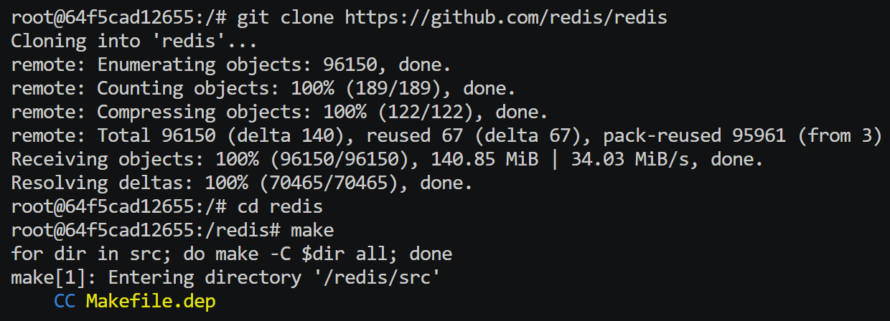
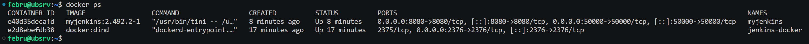

# Sprawozdanie 1

## Temat 1 - Wprowadzenie, Git, Gałęzie, SSH

### Instalacja klienta Git i kluczy SSH

Na początku pobrano git na maszynę wirtualną w celu umożliwienia klonowania zdalnego repozytorium. Utworzono dwa klucze SSH zabezpieczone hasłem oraz szyfrowane za pomocą algorytmów pierwszy - ED25519 oraz drugi - ECDSA. 


Uzyskany klucz publiczny skonfigurowano jako metodę dostępu do GitHuba.


### Przygotowanie repozytorium przedmiotowego

Sklonowano repozytorium przedmiotowe z wykorzystaniem protokołu SSH.


W repozytorium przełączono się na gałąź grupy, a następnie utworzono nową (wychodzącą od niej) gałąź o nazwie `KL417218`.


W katalogu grupy utworzono nowy katalog o nazwie `KL417218`. Kolejnym krokiem było przejście do `.git/hooks`, w którym utworzono plik o nazwie `commit-msg`. W jego środku umieszczono kod odpowiedzialny za weryfikację poprawności wiadomości dołączanych do przyszłych commitów. Plik zapisano i przyznano możliwość jego wykonywania. Skopiowano go także do folderu utworzonego w poprzednim kroku. Powrócono do personalnego katalogu, gdzie utworzono nową ścieżkę  `Sprawozdanie1 `z plikiem `README.md`. Następnie wszystie zmiany dodano do staging area w gicie.


Utworzono nowy commit.


Wszystkie dodane pliki oraz zmiany przesłano do zdalnego źródła na gałąź `KL417218`.


#### Historia poleceń

```bash
sudo apt update
sudo apt install -y git
ssh-keygen -t ed25519 -f ~/.ssh/id_ed25519
ssh-keygen -t ecdsa -f ~/.ssh/id_ecdsa
cat .ssh/id_ed25519.pub 
git clone git@github.com:InzynieriaOprogramowaniaAGH/MDO2025_INO.git
cd MDO2025_INO
git checkout main
git checkout GCL05
git checkout -b KL417218
cd ITE/GCL05/
mkdir KL417218
cd ~/MDO2025_INO/.git/hooks
nano commit-msg
chmod +x commit-msg
cp commit-msg ../../ITE/GCL05/KL417218/
cd ~/MDO2025_INO/ITE/GCL05/KL417218/
mkdir Sprawozdanie1
cd Sprawozdanie1
touch README.md
git add .
git status
git commit -m "KL417218: add report and commit-msg githook"
git status
git push origin KL417218
```

## Temat 2 - Git, Docker

### Instalacja Dockera

Pakiet Docker nie znajduje się w domyślnych repozytoriach `apt`, więc zainstalowano go zgodnie z poradnikiem dostepnym na stronie [https://docs.docker.com/engine/install/ubuntu/#install-using-the-repository](https://docs.docker.com/engine/install/ubuntu/#install-using-the-repository). Następnie, w celu usprawnienia pracy, dodano aktualnego użytkownika do grupy `docker`, co w przyszłości umozliwi pominięcie każdorazowego wpisywania `sudo` przed poleceniami. Warto jednak pamiętać, że jest to uproszczenie, które w przypadku środowisk produkcyjnych może być niebezpieczne (gdyż może pozwolić na backdoor przez użytkowników, którzy nie powinni mieć uprawnień roota). Wywołano `docker ps`, aby sprawdzić czy Docker zainstalował się poprawnie.


### Pobieranie i tworzenie obrazów, zarządzanie kontenerami

Następnie z pomocą `docker pull <nazwa_obrazu>` pobrano cztery obrazy (`hello-world`, `busybox`, `ubuntu` oraz `mysql`) na lokalny dysk. 


Uruchomiono `busybox` z shellem i wyświetlono jego wersję na ekranie. Zastosowano flagę `-it `, aby podłączyć się do niego interaktywnie i móc wydawać polecenia.


Kolejnym krokiem było uruchomienie w trybie interaktywnym kontenera `ubuntu`. Wewnątrz skorzystano z komendy `ps aux`, aby wyświetlić procesy działające wewnątrz kontenera. Zaktualizowano pakiety i opuszczono kontener.


Stworzono plik `Dockerfile.februbuntu`, w którym umieszczono konfigurację dla nowego obrazu. Jego celem jest uruchomienie ubuntu wewnątrz kontenera, instalacja systemu kontroli wersji git oraz sklonowanie repozytorium przedmiotowego. Z pliku zbudowano obraz przy pomocy `docker build`, a następnie uruchomiono go w celu weryfikacji poprawności działania.


Wyświetlono wszystkie uruchomione do tej pory kontenery (`docker ps -a`). Wyczyszczono je przy użyciu `docker container prune`. Pozbyto się także obrazów, wykorzystując `docker image prune -a`.


#### Historia poleceń

```bash
sudo apt-get update
sudo apt-get install ca-certificates curl
sudo install -m 0755 -d /etc/apt/keyrings
sudo curl -fsSL https://download.docker.com/linux/ubuntu/gpg -o /etc/apt/keyrings/docker.asc
sudo chmod a+r /etc/apt/keyrings/docker.asc

echo \
  "deb [arch=$(dpkg --print-architecture) signed-by=/etc/apt/keyrings/docker.asc] https://download.docker.com/linux/ubuntu \
  $(. /etc/os-release && echo "${UBUNTU_CODENAME:-$VERSION_CODENAME}") stable" | \
  sudo tee /etc/apt/sources.list.d/docker.list > /dev/null
sudo apt-get update

sudo apt-get install docker-ce docker-ce-cli containerd.io docker-buildx-plugin docker-compose-plugin

-------------------------------------------

sudo usermod -aG docker $USER
su - $USER
docker ps

-------------------------------------------

docker pull hello-world
docker pull busybox
docker pull ubuntu
docker pull mysql

docker run -it busybox sh
>> busybox

docker run -it ubuntu sh
>> ps aux
>> apt update
>> apt upgrade
>> exit

-------------------------------------------

docker build -f Dockerfile.februbuntu -t februbuntu .
docker run -it februbuntu

docker ps -a

docker container prune
docker image prune -a
docker ps -a
```

## Temat 3 - Dockerfiles, kontener jako definicja etapu

### Budowanie i testowanie w kontenerach

Na początku uruchomiono czysty kontener `ubuntu` w trybie interaktywnym w celu manualnego przejścia przez proces budowania i testowania [Redisa](https://github.com/redis/redis). Dzięki temu krokowi poznano paczki, których wymagają te procesy.



Utworzono dwa Dockerfile: `Dockerfile.redisbuild` oraz `Dockerfile.redistest`. Zadaniem pierwszego z nich jest sklonowanie zdalnego repozytorium z kodem źródłowym, zainstalowanie _dependencies_ i zbudowanie aplikacji. Celem drugiego jest uruchomienie testów jednostkowych, dlatego dziedziczy on po obrazie zbudowanym na pierwszym Dockerfile'u. Zbudowano więc dwa obrazy `redis-build` oraz `redis-test`.


Na końcu uruchomiono kontener z obrazu `redis-test`, aby sprawdzić poprawność jego działania. Warto jednak pamiętać, że cały proces budowania i testów wykonuje się podczas budowania obrazu i obecnie w kontenerze nie pracują żadne procesy (oprócz basha).


#### Historia poleceń

```bash
docker run -it ubuntu bash
apt update
apt install git make g++ pkg-config tcl
> y
git clone https://github.com/redis/redis
cd redis
make
make test

-------------------------------------------

docker build -f Dockerfile.redisbuild -t redis-build .
docker build -f Dockerfile.redistest -t redis-test .
docker run -it redis-test bash
```

## Temat 4 - Dodatkowa terminologia w konteneryzacji, instancja Jenkins

### Praca na wolumenach i sytemie plików

Utworzono dwa wolumeny `vol-in` oraz `vol-out`. Pierwszy z nich będzie służył jako wolumen wejściowy (będą się na nim znajdować pliki potrzebne do pracy kontenera), a drugi jako wyjściowy (będą się na nim znajdować pliki utworzone w rezultacie pracy kontenera).


Sklonowano repozytorium Redisa na hosta, a następnie stworzono zmodyfikowany Dockerfile: `Dockerfile.redisnogit`, z którego zbudowano obraz kontenera zawierającego środowisko wymagane do budowania i testowania aplikacji, ale niezawierającego gita. Następnie uruchomiono kontener z nowozbudowanego obrazu, do którego podpięto wcześniej utworzone wolumeny. Wykorzystując komendę `docker cp` przetransferowano pliki z hosta na wolumen wejściowy. Podłączono się interaktywnie do kontenera.


Wewnątrz kontenera przekopiowano pliki z wolumenu wejściowego do innej lokalizacji. W ten sposób podczas procesu budowania wolumen wejściowy nie zostanie "zaśmiecony" plikami utworzonymi jedynie na potrzeby tego procesu. Uruchomiono `make`. Po poprawnym buildzie uruchomiono aplikację, by sprawdzić jej działanie.


Na sam koniec, wykorzystując dołączony do repozytorium skrypt `make install`, przeniesiono skompilowane pliki binarne na wolumen wyjściowy.


Operację powtórzono z tą zmianą, że tym razem nie kopiowano repozytorium z hosta, lecz doinstalowano gita i sklonowano repozytorium bezpośrednio na /vol-in wewnątrz kontenera.

### Praca z sieciami (iperf3)

Uruchomiono nowy kontener `ubuntu` w trybie interaktywnym, w którym zainstalowano iperf3. Następnie uruchomiono iperf3 w trybie serwera. Odłaczono się od kontenera.


Korzystając z `docker inspect <nazwa_kontenera>` odnaleziono przydzielone kontenerowi IP wewnątrz domyślnej sieci.


Uruchomiono kolejny kontener `ubuntu`, na którym także zainstalowano iperf3. Uruchomiono iperf3 w trybie klienta, przekazując powyższy adres IP jako argument. Trasfer danych między kontenerami przebiegł pomyślnie.


Utworzono nową sieć `net-1`. Powtórzono powyższe kroki, tym razem jednak uruchamiając kontenery z opcją `--network net-1`. Ponadto serwer uruchomiono z przekierowaniem portu 5201 hosta na 5201 konteneru (`-p 5201:5201`). Przeprowadzono dodatkowe dwie analizy - jedną między kontenerami, wykorzystując nazwę kontenera-serwera jako adres oraz drugą, gdzie do serwera łączono się z hosta.


### Instalacja Jenkins

Zainstalowano Jenkinsa zgodnie z dokumentacją załączoną na [https://www.jenkins.io/doc/book/installing/docker/#on-macos-and-linux](https://www.jenkins.io/doc/book/installing/docker/#on-macos-and-linux). W tym celu stworzono nową sieć o nazwie 'jenkins', a następnie uruchomiono kontener z usługą DockerINDocker. Stworzono `Dockerfile.jenkins` z zawartością podaną w dokumentacji, a następnie uruchomiono kontener. 


W ustawieniach maszyny wirtualnej dodano przekierowanie portu 8080 gościa na 8080 hosta, aby móc dostać się do panelu z przeglądarki internetowej.


Wymagane przez jenkinsa hasło administratora pobrano, wykorzystując komendę `docker exec` i wypisując na ekran zawartość pliku /var/jenkins_home/secrets/initialAdminPassword znajdującego się w kontenerze `myjenkins`. Po podaniu hasła, udało się podłączyć do panelu jenkinsa.


Na końcu wywołano `docker ps`, aby podejrzeć wszystkie aktualnie pracujące kontenery.



#### Historia poleceń

```bash
docker volume create vol-in
docker volume create vol-out

git clone https://github.com/redis/redis

docker build -f Dockerfile.redisnogit -t redis-nogit .
docker run -dit -v vol-out:/vol-out -v vol-in:/vol-in redis-nogit bash
docker ps

docker cp redis <container_name>:/vol-in/
docker attach <container_name>

>> cp -r vol-in/redis /
>> cd redis
>> make
>> cd src
>> ./redis-server
>> cd ..
>> make PREFIX=/vol-out install
>> exit

>> apt update && install -y git
>> git clone https://github.com/redis/redis /vol-in

-------------------------------------------

docker run -it ubuntu bash
>> apt update && apt install -y iperf3
>> iperf3 -s
(ctrl + p, ctrl + q)

docker inspect <container_name>

docker run -it ubuntu bash
>> apt update && apt install -y iperf3
>> iperf3 -c 172.17.0.2

-------------------------------------------

docker network create net-1
docker run -it -p 5201:5201 --name iperf3-server --network net-1 ubuntu bash
>> apt update && apt install -y iperf3
>> iperf3 -s
(ctrl + p, ctrl + q)

docker run -it --network net-1 ubuntu bash
>> apt update && apt install -y iperf3
>> iperf3 -c iperf3-server
>> exit

iperf3 -c localhost

-------------------------------------------

docker network create jenkins

docker run \
  --name jenkins-docker \
  --rm \
  --detach \
  --privileged \
  --network jenkins \
  --network-alias docker \
  --env DOCKER_TLS_CERTDIR=/certs \
  --volume jenkins-docker-certs:/certs/client \
  --volume jenkins-data:/var/jenkins_home \
  --publish 2376:2376 \
  docker:dind \
  --storage-driver overlay2

docker build -f Dockerfile.jenkins -t myjenkins:2.492.2-1 .

  docker run \
  --name myjenkins \
  --restart=on-failure \
  --detach \
  --network jenkins \
  --env DOCKER_HOST=tcp://docker:2376 \
  --env DOCKER_CERT_PATH=/certs/client \
  --env DOCKER_TLS_VERIFY=1 \
  --publish 8080:8080 \
  --publish 50000:50000 \
  --volume jenkins-data:/var/jenkins_home \
  --volume jenkins-docker-certs:/certs/client:ro \
  myjenkins:2.492.2-1

docker exec myjenkins cat /var/jenkins_home/secrets/initialAdminPassword

```