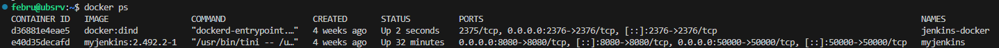
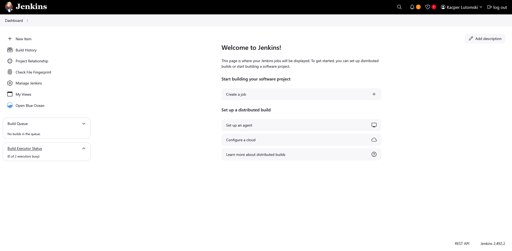
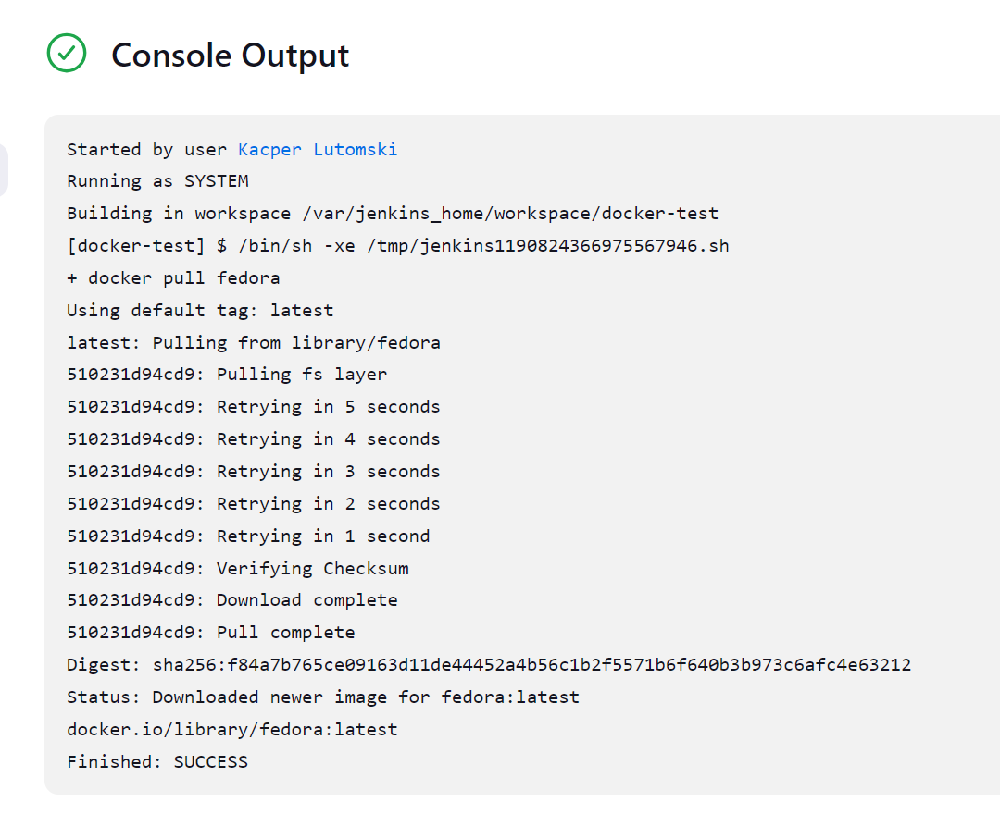
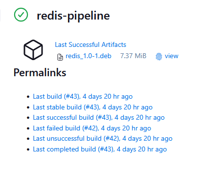
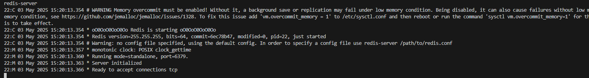

# Sprawozdanie 2

### Jenkins i DinD

Pracę rozpoczęto od stworzenia nowej sieci Docker o nazwie *jenkins*. 

```bash
docker network create jenkins
```

Następnie uruchomiono kontener Docker-In-Docker. Usługa ta będzie wykorzystywana przez Jenkinsa do uruchamiania jego własnych "podkontenerów".

```bash
docker run --name jenkins-docker --rm --detach \
  --privileged --network jenkins --network-alias docker \
  --env DOCKER_TLS_CERTDIR=/certs \
  --volume jenkins-docker-certs:/certs/client \
  --volume jenkins-data:/var/jenkins_home \
  --publish 3000:3000 --publish 5000:5000 --publish 2376:2376 \
  docker:dind --storage-driver overlay2
```

Aby uruchomić Jenkinsa w kontenerze stworzono [`Dockerfile.jenkins`](../Sprawozdanie1/Dockerfile.jenkins). Na jego podstawie zbudowano obraz *myjenkins*. Następnie uruchomiono kontener na bazie tego obrazu, w komendzie stosując flagi rekomendowane przez oficjalną dokumentację. Wynikiem działań były dwa pracujące, i mogące się ze sobą komunikować, kontenery.

```bash
docker build -t myjenkins:2.492.2-1 .

docker run --name myjenkins --restart=on-failure --detach \
  --network jenkins --env DOCKER_HOST=tcp://docker:2376 \
  --env DOCKER_CERT_PATH=/certs/client --env DOCKER_TLS_VERIFY=1 \
  --publish 8080:8080 --publish 50000:50000 \
  --volume jenkins-data:/var/jenkins_home \
  --volume jenkins-docker-certs:/certs/client:ro \
  myjenkins-blueocean:2.492.2-1

docker ps
```



Następnie przekierowano port 8080 wirtualnej maszyny na 8080 hosta w celu podłączenia się do webowego panelu Jenkins. Otworzono stronę *http://localhost:8080*, na której przeprowadzono wstępną konfigurację. Wymagane hasło pobrano z logów kontenera z Jenkinsem. Utworzono nowego użytkownika i zalogowano się do panelu.

```
docker exec myjenkins cat /var/jenkins_home/secrets/initialAdminPassword
```



W celu przetestowania połączenia z kontenerem DinD utworzono nowy pipeline. Jako jego jedyny krok dodano komendę pobierającą obraz *fedora*. Uruchomiono pipeline. Zaobserwowano brak jakichkolwiek błędów, co oznacza, że Jenkins może korzystać z usługi DinD, a sam kontener DinD ma dostęp do internetu.



### Pipeline

Stworzono nowy pipeline o nazwie *redis-pipeline*. Będzie on wykorzystany do zbudowania pipeline'u budującego, testującego oraz wdrażającego i publikującego artefakt bazy danych Redis.

#### Koncept

Zadaniem pipelinu będzie zbudowanie binarek bazy danych Redis, a następnie stworzenie z nich pakietu instalacyjnego *.deb*. Pierwszym etapem pracy pipeline'u będzie pobranie kodu z oficjalnego repozytorium (dostępnego [tutaj](https://github.com/redis/redis)). Następnie, wykorzystując opracowane na poprzednich zajęciach Dockerfile, pipeline będzie budował obraz, który skompiluje binarkę. W następnym etapie zostanie zbudowany obraz, który przeprowadzi testy jednostkowe przy użyciu `make test`. Następnie skompilowane pliki zostaną opakowane w pakkiet *.deb*. Etap Deploy będzie polegał na instalcji i uruchomieniu binarek w kontenerze i przetestowaniu ich działania (np. wysyłając prostego pinga). W ten sposób zostanie zasymulowane środowisko produkcyjne, a zachowanie programu zostanie przetestowane na czystym systemie Ubuntu. Za kroki, które będą zawarte w ostatnim etapie - Publish, uznano archiwizację gotowego artefaktu (przypięcie go do statusu danego uruchomienia pipelinu). W ten sposób artefakt będzie łatwo dostępny, a sam artefakt - pakiet można wrzucić do zewnętrzych repozytoriów.

#### Omówienie Jenkinsfile'a

*Jenkinsfile w całości (bez omówienia poszczególnych stage'y) można znaleźć [tutaj](./Jenkinsfile).*

##### Checkout

```groovy
  // Checkout the repository
        stage('Checkout') {
            steps {
                git branch: 'KL417218',
                    url: 'https://github.com/InzynieriaOprogramowaniaAGH/MDO2025_INO'
            }
        }
```

W pierwszym stage'u kod pobiera repozytorium przedmiotowe. Jest to celowy zabieg, gdyż w kolejnych krokach będziemy wykorzystywać Dockerfile do budowania i testowania Redisa, które zostały sporządzone na poprzednich zajęciach.

##### Build

```groovy
        // Build the redis server and redis-cli binaries
        stage('Build') {
            steps {
                dir('ITE/GCL05/KL417218/Sprawozdanie1') {
                    sh 'docker build -f Dockerfile.redisbuild -t redis-build .'
                }
            }
        }
```

Krok 'Build' składa się z komendy budującej obraz z dostarczonego Dockerfile'a. Obraz ten zawiera wszystkie wymagane zależności do zbudowania projektu.

##### Test

```groovy
        // Test the build container
        stage('Test') {
            steps {
                dir('ITE/GCL05/KL417218/Sprawozdanie1') {
                    sh 'docker build -f Dockerfile.redistest -t redis-test .'    
                }
            }
        }
```

Krok 'Test' składa się z komendy budującej obraz testowy z dostarczonego Dockerfile'a. Obraz opiera się na tym zbudowanym w poprzednim kroku i wykonuje polecenie `make test`.

##### Extract & Package

```groovy
        // Extract redis_server and redis_cli binaries from the build container
        stage('Extract') {
            steps {
                sh 'docker create --name redis-build-container redis-build'
                sh 'docker cp redis-build-container:/redis/src/redis-server .'
                sh 'docker cp redis-build-container:/redis/src/redis-cli .'
                sh 'docker rm redis-build-container'
            }
        }
```

Ten krok ma na celu wyciągnięcie binarek z obrazu stworzonego podczas builda. W tym celu tworzony jest kontener bazujący na obrazie `redis-build`. Kontener nie jest uruchamiany - kopiowane są binarki i kontener jest od razu usuwany. 

```groovy
        // Prepare redis_server and redis_cli for deployment & publish
        stage('Package') {
            steps {
                sh 'mkdir -p redis/usr/local/bin'
                sh 'mv redis-server redis/usr/local/bin/'
                sh 'mv redis-cli redis/usr/local/bin/'
                writeFile(
                    file: 'redis/DEBIAN/control',
                    text: """
Package: redis
Version: 1.0-1
Architecture: all
Maintainer: febru <febru@example.com>
Description: Redis server with CLI binaries.
"""
                )
                sh 'dpkg-deb --build redis'
            }
        }
```

W tym kroku odbywa się tworzenie pakietu instalacyjnego. W tym celu tworzony jest nowy katalog, do którego kopiowane są binarki. Katalog `redis` będzie traktowany przez dpkg jako ścieżka `/` na docelowym systemie. Znaczy to że jeśli umieścimy w nim katalogi `/usr/local/bin` z binarkami to finalnie, po zainstalowaniu, pliki na systemie użytkownika będą miały ścieżkę `/usr/local/bin/redis-server`. Tworzony jest także plik `control`, zawierający niezbędne informacje o pakiecie. Jedynym problemem, który można zauważyć w powyższym kodzie i na który nie znaleziono rozwiązania, jest zhardcodowana wersja pakietu - powinna być ona przypisywana dynamicznie przez pipeline.

##### Deploy

```groovy
        // Deploy the package to a sandbox containers and test it
        stage('Deploy') {
            steps {
                sh 'docker network create redis-network'
                sh 'docker run -d --name redis-deploy-server-container --network redis-network ubuntu:latest tail -f /dev/null'
                sh 'docker cp redis.deb redis-deploy-server-container:/tmp/redis.deb'
                sh 'docker exec -d redis-deploy-server-container bash -c "dpkg -i /tmp/redis.deb && redis-server --protected-mode no"'
                sh 'docker run -d --name redis-deploy-cli-container --network redis-network ubuntu:latest tail -f /dev/null'
                sh 'docker cp redis.deb redis-deploy-cli-container:/tmp/redis.deb'
                sh 'docker exec redis-deploy-cli-container bash -c "dpkg -i /tmp/redis.deb && redis-cli -h redis-deploy-server-container ping"'
            }
        }
```

Krok 'Deploy' odpowiada za wdrożenie i przetestowanie stworzonego pakietu w symulowanym środowisku produkcyjnym. W pierwszej kolejności tworzona jest nowa sieć Docker o nazwie `redis-network`, która umożliwia komunikację między kontenerami. Następnie uruchamiany jest kontener `redis-deploy-server-container` na bazie obrazu `ubuntu:latest`, do którego kopiowany jest pakiet instalacyjny. Pakiet ten jest instalowany wewnątrz kontenera, a następnie uruchamiany jest serwer Redis z wyłączonym trybem chronionym (`--protected-mode no`). Kolejnym krokiem jest uruchomienie drugiego kontenera `redis-deploy-cli-container`, również na bazie ubuntu, do którego kopiowany jest ten sam pakiet instalacyjny. Po instalacji pakietu w kontenerze wykonywana jest komenda `redis-cli`, która wysyła zapytanie `ping` do serwera Redis w celu sprawdzenia poprawności działania. Jeśli odpowiedź jest pozytywna, oznacza to, że wdrożenie zakończyło się sukcesem, a serwer Redis działa prawidłowo w symulowanym środowisku.

##### Publish

```groovy
        // Publish the package
        stage('Publish') {
            steps {
                archiveArtifacts artifacts: 'redis.deb', fingerprint: true
            }
        }
   
```

Krok 'Publish' odpowiada za archiwizację i publikację stworzonego pakietu instalacyjnego. W tym celu wykorzystywana jest funkcja `archiveArtifacts`, która zapisuje plik `redis.deb` jako artefakt w Jenkinsie. Dzięki temu pakiet jest dostępny do pobrania i wykorzystania w przyszłości. Opcja `fingerprint: true` umożliwia śledzenie artefaktu w ramach różnych uruchomień pipeline'u.

##### Cleanup

```groovy
    // Cleanup
    post {
            always {
                echo 'Cleaning up workspace...'
                sh 'docker stop $(docker ps -aq) || true'
                sh 'docker system prune -a -f'
                deleteDir()
            }
    }
```

Na samym końcu Jenkinsfile'a znajduje się sekcja *post*, która wykonywana jest po zakończeniu pracy pipeline'u. Odpowiedzialna jest ona za wykonywanie czynności porządkowych po zakończeniu pracy pipeline'u. Zatrzymuje ona wszystkie pracujące kontenery, a następnie usuwa wszystkie utworzone sieci, obrazy oraz kontenery. Na koniec czyści cały katalog, wykorzystując *DeleteDir()*. Dzięki temu pipeline jest gotowy do kolejnych uruchomień bez zbędnych pozostałości po poprzednich wykonaniach bez względu na ich rezultat.

#### Uruchomienie pipeline'u

Jenkinsfile jest zaciągany z przedmiotowego repozytorium poprzez wykorzystanie opcji *Pipeline script from SCM*. Poniżej znajduje się log pojedyńczego wykonania pipeline'u oraz zrzut ekranu finalnego rezultatu ze stworzonym pakietem instalacyjnym.

[pipeline_run_43.log](./pipeline_run_43.log)



#### Test zbudowanego artefaktu

W celu przetestowania zbudowanego artefaktu pobrano go na maszynę wirtualną i stworzono kontener z ubuntu. 

```bash
docker run -d --rm --interactive --name redis-test-container ubuntu:latest bash
```

Następnie przekopiowano do niego pakiet instalacyjny.

```bash
docker cp ./redis.deb redis-test-container:/
```

Po podłączeniu się do kontenera rozpoczęto instalację. Na koniec uruchomiono serwer.

```bash
docker attach redis-test-container
> dpkg -i redis.deb
> redis-server
```


