# Sprawozdanie 3

### Ansible

> Ansible to open source'owe narzędzie służące do automatyzacji zarządzania konfiguracją, wdrażania aplikacji oraz wykonywania zadań administracyjnych na wielu serwerach jednocześnie. Jego ogromną zaletą jest fakt, iż działa bez konieczności instalowania agentów na maszynach docelowych, wykorzystując do komunikacji jedynie protokół SSH.

Na początku utworzono nową maszynę wirtualną i przydzielono jej minimalne zasoby (wystarczające, aby uruchomić system). Podczas instalacji, ustawiono jej _hostname_ na `ansible-target` i utworzono użytkownika `ansible`. Na głównej maszynie (w dalszej części sprawozdania, będzie oznaczana jako `ubsrv`) zainstalowano oprogramowanie ansible, a następnie wymieniono klucze między maszynami za pomocą _ssh-copy-id_.

```sh
ssh-copy-id ansible@10.0.2.15
ssh ansible@10.0.2.15
> exit
```

Następnie do pliku `/etc/hosts` dopisano poniższe linijki, które pozwolą uniknąć ciągłego podawania adresów IP.

```
127.0.0.1 ubsrv
10.0.2.15 ansible-target
```

Utworzono plik [`inventory.yml`](./ansible/inventory.yml), w którym zdefiniowano grupy docelowych hostów.

```yaml
Orchestrators:
  hosts:
    ubsrv:
      ansible_user: febru
      ansible_connection: local

Endpoints:
  hosts:
    ansible-target:
      ansible_user: ansible
```

Korzystając z poniższej komendy rozesłano ping do wszystkich maszyn zdefiniowanych w pliku inwentaryzacji.

```sh
ansible all -i inventory.yml -m ping
```


Kolejnym krokiem było utworzenie prostego playbooka. 

> Playbook Ansible to plik zawierający zestaw zadań do automatycznego wykonania na wybranych hostach. Jego istotną zaletą jest to, że zamiast podawać konkretne komendy, opisuje się w nim docelowy stan, jaki powinna osiągnąć maszyna.

Playbook [`main_playbook.yml`](./ansible/main_playbook.yml), kopiuje dwukrotnie plik inwentaryzacji na maszynę docelową, aktualizuje pakiety oraz restartuje usługi `ssh` i `rng-tools`.

```sh
# Na ansible-target:
sudo apt install rng-tools

# Następnie na ubsrv:
ansible-playbook -i inventory.yml main_playbook.yml --ask-become-pass
```


Na koniec utworzono playbook [`redis-playbook.log`](./ansible/redis_playbook.yml). Korzysta on ze szkieletowania _ansible-galaxy_. Narzędzie to tworzy katalog z predefiniowaną strukturą, w której – poprzez modyfikację odpowiednich plików – możemy w prosty i uporządkowany sposób zbudować kompletną rolę do automatyzacji konfiguracji usług. W pliku [`tasks/main.yml`](./ansible/deploy_redis/tasks/main.yml) znajduje się najważniejsza logika, która wysyła plik .deb na maszynę docelową, za pomocą szkieletowania _Jinja2_ tworzy Dockerfile, buduje obraz, a następnie uruchamia dockerowy kontener z binarką Redisa. Na koniec sprawdza status kontenera, weryfikując poprawność wykonania playbooka.

```sh
ansible-galaxy init deploy_redis
ansible-playbook -i inventory.yml redis_playbook.yml --ask-become-pass
```

[`redis-playbook.log`](./ansible/redis_playbook.log)

### Kickstart

> Kickstart to mechanizm automatyzacji instalacji systemów Linux (głównie Red Hat, CentOS, Fedora), który pozwala przeprowadzić cały proces instalacyjny bez interakcji użytkownika. Działa na podstawie pliku konfiguracyjnego zawierającego wszystkie niezbędne informacje, takie jak partycjonowanie dysku, wybór pakietów czy ustawienia sieci.

Utworzono nową maszynę wirtualną i przydzielono jej minimalne zasoby wymagane do uruchomienia systemu. Nastepnie przeprowadzono **manualną** instalację systemu Fedora Server 42, korzystając z obrazu ISO pobranego z [repozytorium](https://ftp.icm.edu.pl/pub/Linux/fedora/linux/releases/42/Server/x86_64/iso/Fedora-Server-dvd-x86_64-42-1.1.iso). Po udanej instalacji z katalogu _/root_ pobrano plik `anaconda-ks.cfg`. Maszynę usunięto.

Na podstawie pliku `anaconda-ks.cfg` utworzono skrypt [`install.ks`](./kickstart/install.ks), pozwalający przeprowadzić automatyczną instalację systemu. Najważniejszą jego częścią jest część `%post`, zawierająca logikę, odpowiadającą za instalację zbudowanej przez pipeline binarki Redisa. Jako, że niemożliwym jest zainstalowanie pakietu .deb na systemie Fedora, skrypt rozpakowuje pakiet, wyłuskując z niego binarkę, a następnie tworzy z niej usługę. Finalny plik umieszczono na prywatnym serwerze HTTP.

```sh
%post

# Download and install Redis
wget https://github.com/InzynieriaOprogramowaniaAGH/MDO2025_INO/.../redis-deb.deb -O /tmp/redis-deb.deb
dnf install -y dpkg
dpkg-deb -x /tmp/redis-deb.deb /tmp/redis-extracted
cp /tmp/redis-extracted/usr/local/bin/redis-server /usr/bin/
chmod +x /usr/bin/redis-server

# Create service for Redis
cat > /etc/systemd/system/redis.service << EOF
[Unit]
Description=Redis Server
After=network.target

[Service]
Type=simple
ExecStart=/usr/bin/redis-server
Restart=always
User=nobody

[Install]
WantedBy=multi-user.target
EOF

systemctl enable redis
%end
```

Utworzono nową maszynę wirtualną. Uruchomiono ją z pobranego ISO. W parametrach instalacji przekazano argument `inst.ks=https://api.febru.dev/install.ks`. 

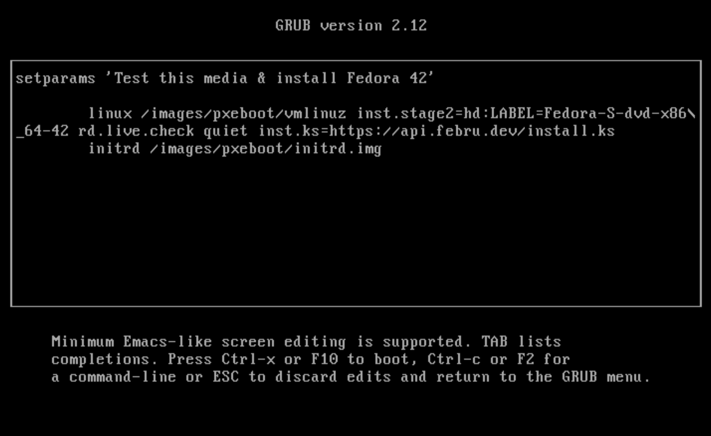

Instalator rozpoczął proces instalacji automatycznej.

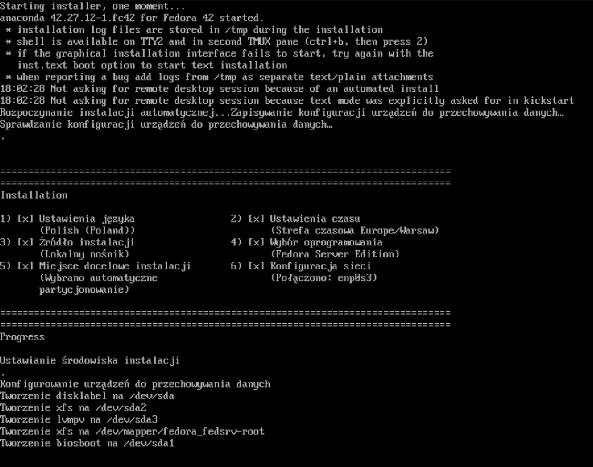

Po zakończonej instalacji i zalogowaniu się do systemu wywołano poniższą komendę, aby sprawdzić poprawność instalacji. Jak widać, skrypt poprawnie zainstalował system i utworzył na nim usługę `redis.service`.

```sh
systemctl status redis
```

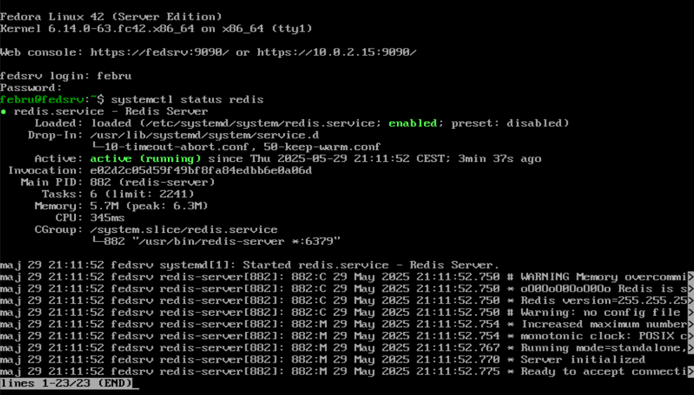

### Minikube

```sh
curl -LO https://storage.googleapis.com/minikube/releases/latest/minikube_latest_amd64.deb
sudo dpkg -i minikube_latest_amd64.deb
minikube kubectl
```

```sh
# Dodano do ./bashrc
alias kubectl="minikube kubectl --"
```

```sh
minikube start
```

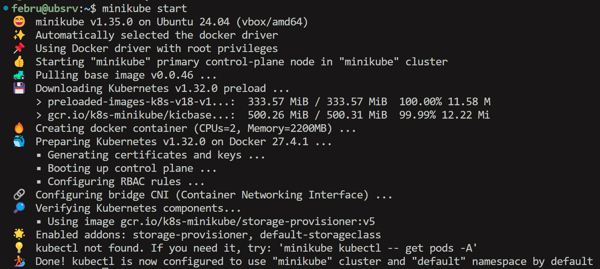

```sh
minikube dashboard
```


```sh
minikube kubectl run -- nxginx-pod --image=nginx --port=80 --labels app=nginx-pod
kubectl port-forward pod/nxginx-pod 8081:80
```

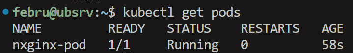

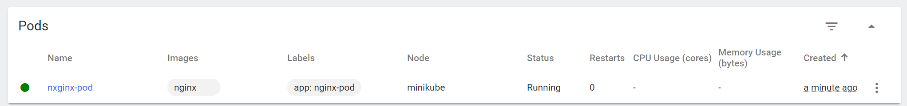

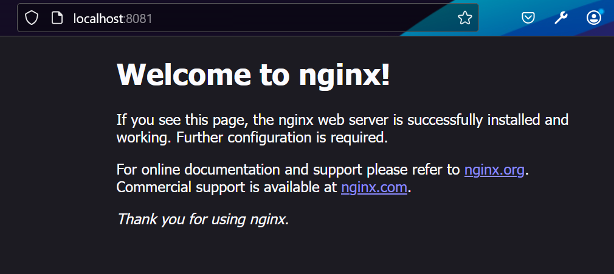

[`deployment_nginx.yml`](./minikube/deployment_nginx.yml)

```sh
kubectl apply -f deployment.yml
kubectl get deployments
kubectl expose deployment nginx-dep --type=NodePort --name=nginx-service --port=80 --target-port=80
kubectl port-forward service/nginx-service 8082:80
```

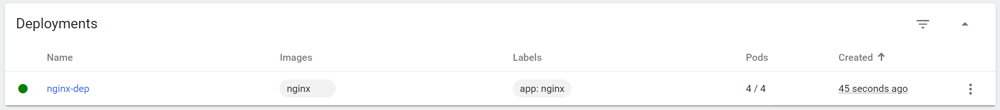

```sh
docker build -f redis.Dockerfile -t februu/mdo-redis:1.0 .
docker push februu/mdo-redis:1.0

docker build -f redis.Dockerfile -t februu/mdo-redis:1.1 .
docker push februu/mdo-redis:1.1

docker build -f redis.Dockerfile -t februu/mdo-redis:1.1 .
docker push februu/mdo-redis:1.1
```

```sh
kubectl apply -f deployment.yml
redis-cli -h $(minikube ip) -p 30083
```

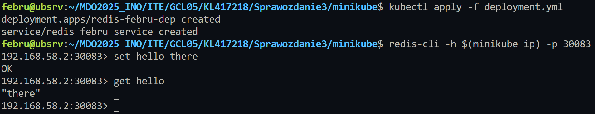

```sh
kubectl apply -f deployment.yml
```

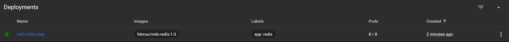

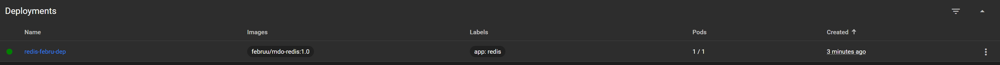

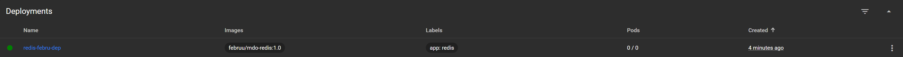

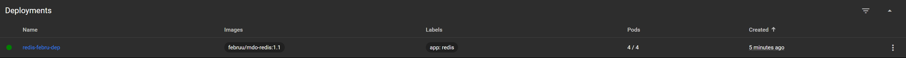

Po zmianie wersji: 

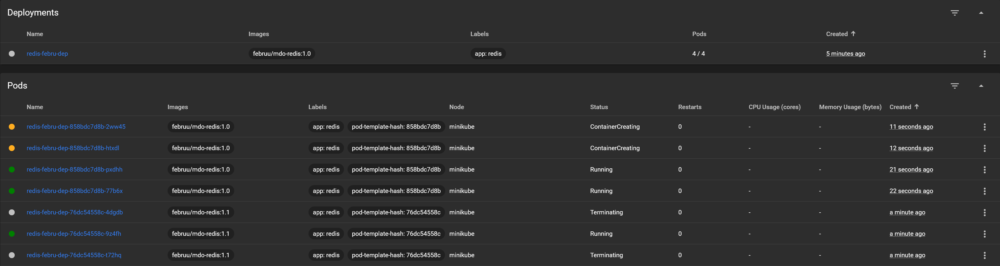


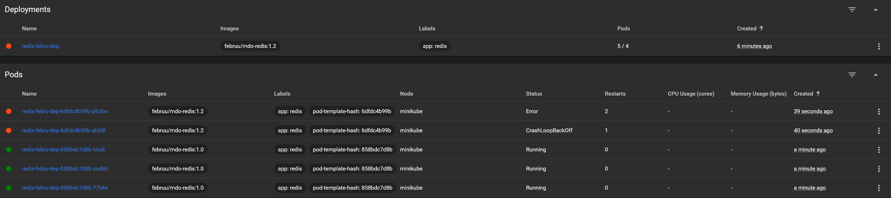

```sh
kubectl rollout undo deployment/redis-febru-dep
```

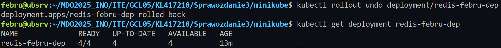

```sh
#!/bin/bash

kubectl rollout status deployment/redis-febru-dep --timeout=60s > /dev/null

if [ $? -eq 0 ]; then
  echo "Deployed successfully."
else
  echo "Deployment failed."
fi

```

```sh
kubectl apply -f deployment_recreate.yml
```

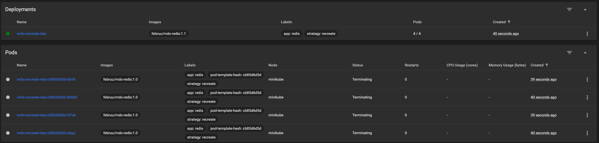

```sh
kubectl apply -f deployment_rolling.yml
```

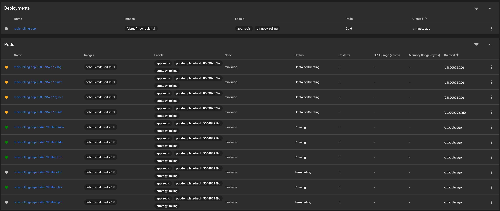

```sh
kubectl apply -f deployment_canary.yml
```

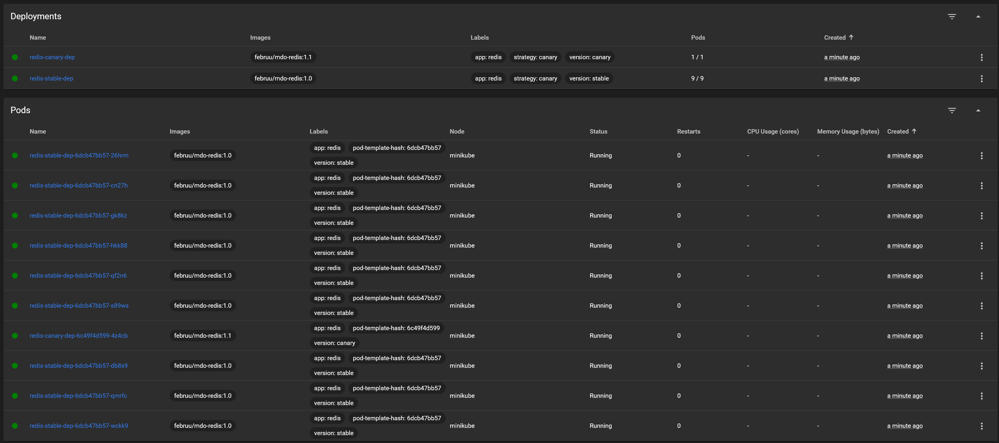