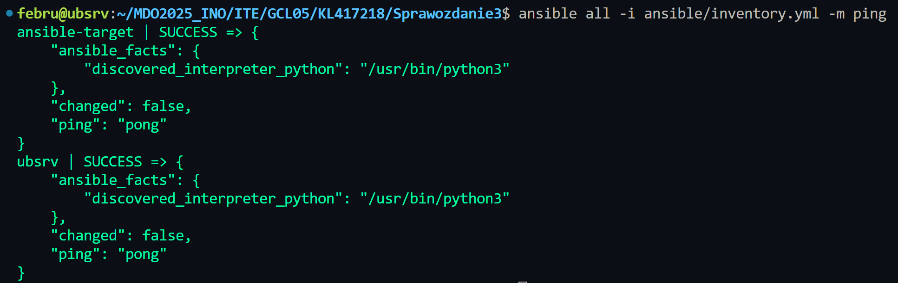
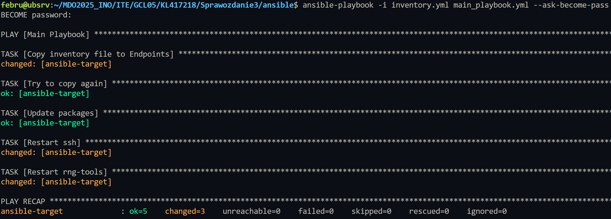
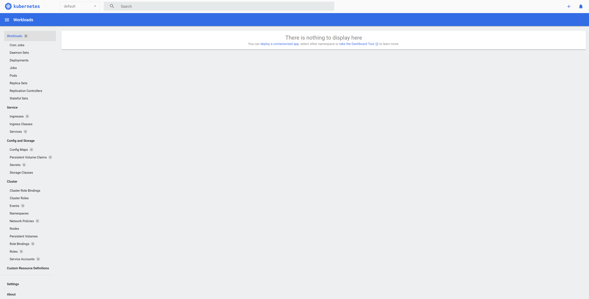

# Sprawozdanie 2

### Ansible

```sh
sudo apt install ansible
ssh-copy-id ansible@10.0.2.15
ssh ansible@10.0.2.15
# <sudo nano by dodac do /etc/hosts>
# 10.0.2.15 ansible-target
mkdir ansible
nano ansible/inventory.yml
```

[`inventory.yml`](./ansible/inventory.yml)

```sh
ansible all -i inventory.yml -m ping
```



[`main_playbook.yml`](./ansible/main_playbook.yml)

```sh
# Na ansible-target:
sudo apt install rng-tools

# Następnie na ubsrv:
ansible-playbook -i inventory.yml main_playbook.yml --ask-become-pass
```



```sh
ansible-galaxy init deploy_redis
ansible-playbook -i inventory.yml redis_playbook.yml --ask-become-pass
```

[`redis-playbook.log`](./ansible/redis-playbook.log)

### Kickstart

[`install.cfg`](./kickstart/install.cfg)


### Minikube

```sh
curl -LO https://storage.googleapis.com/minikube/releases/latest/minikube_latest_amd64.deb
sudo dpkg -i minikube_latest_amd64.deb
minikube kubectl
```

```sh
# Dodano do ./bashrc
alias kubectl="minikube kubectl --"
```

```sh
minikube start
```


```sh
minikube dashboard
```



```sh
minikube kubectl run -- nxginx-pod --image=nginx --port=80 --labels app=nginx-pod
kubectl port-forward pod/nxginx-pod 8081:80
```


[`deployment_nginx.yml`](./minikube/deployment_nginx.yml)

```sh
kubectl apply -f deployment.yml
kubectl get deployments
kubectl expose deployment nginx-dep --type=NodePort --name=nginx-service --port=80 --target-port=80
kubectl port-forward service/nginx-service 8082:80
```


```sh
docker build -f redis.Dockerfile -t februu/mdo-redis:1.0 .
docker push februu/mdo-redis:1.0

docker build -f redis.Dockerfile -t februu/mdo-redis:1.1 .
docker push februu/mdo-redis:1.1

docker build -f redis.Dockerfile -t februu/mdo-redis:1.1 .
docker push februu/mdo-redis:1.1
```

```sh
kubectl apply -f deployment.yml
redis-cli -h $(minikube ip) -p 30083
```


```sh
kubectl apply -f deployment.yml
```


Po zmianie wersji: 


```sh
kubectl rollout undo deployment/redis-febru-dep
```


```sh
#!/bin/bash

kubectl rollout status deployment/redis-febru-dep --timeout=60s > /dev/null

if [ $? -eq 0 ]; then
  echo "Deployed successfully."
else
  echo "Deployment failed."
fi

```

```sh
kubectl apply -f deployment_recreate.yml
```


```sh
kubectl apply -f deployment_rolling.yml
```


```sh
kubectl apply -f deployment_canary.yml
```

