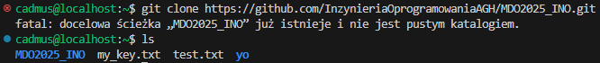
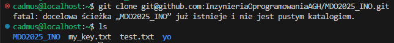
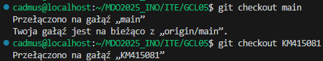
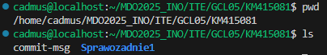
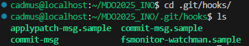
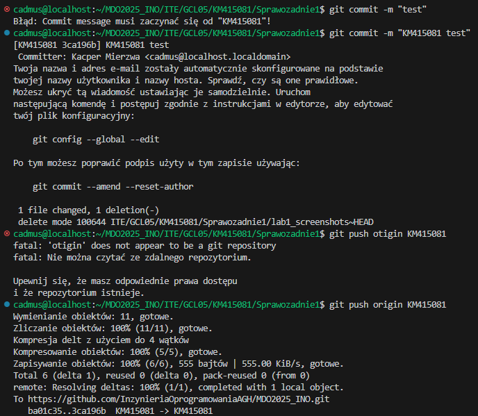
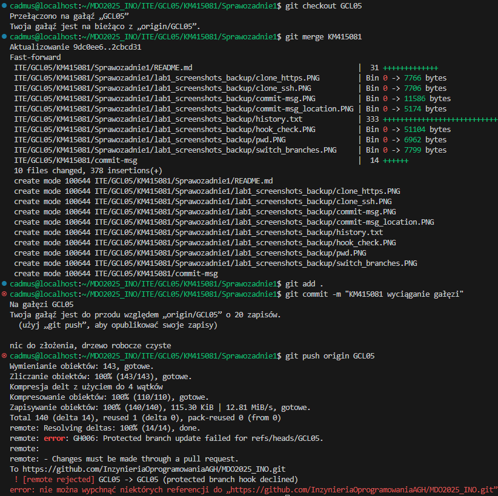

# Zajęcia 01

1. Zainstalowano klienta Git i obsługę kluczy SSH.

2. Sklonowano repozytorium za pomocą HTTPS i personal access token.


3. Utworzono dwa klucze SSH, inne niż RSA, w tym co najmniej jeden zabezpieczony hasłem. Skonfigurowano klucz SSH jako metodę dostępu do GitHuba. Sklonowano repozytorium z wykorzystaniem protokołu SSH oraz skonfigurowano 2FA.


4. Przełączono się na gałąź main, a następnie na gałąź grupową GCL05 po czym utworzono nową gałąź.


5. Praca na nowej gałęzi.
- w katalogu właściwym dla grupy utworzono nowy katalog
- napisano Git hooka oraz dodano go do stworzonego wcześniej katalogu po czym skopiowano go we właściwe miejsce, tak by uruchamiał się za każdym razem kiedy wykonywany jest commit.
- dodano plik ze sprawozdaniem
- dodano zrzuty ekranu
- wysłano zmiany

Treść githooka
```sh
#!/usr/bin/sh

EXPECTED_PREFIX="KM415081"
COMMIT_MSG=$(cat "$1")

if [[ "$COMMIT_MSG" != $EXPECTED_PREFIX* ]]; then
    echo "Błąd: Commit message musi zaczynać się od \"$EXPECTED_PREFIX\"!"
    exit 1
fi

exit 0
```




6. Próba wciągnięcia gałęzi do gałęzi grupowej.


