# Zajęcia 01

1. Zainstalowano klienta Git i obsługę kluczy SSH.

2. Sklonowano repozytorium za pomocą HTTPS i personal access token.
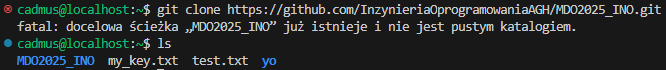

3. Utworzono dwa klucze SSH, inne niż RSA, w tym co najmniej jeden zabezpieczony hasłem. Skonfigurowano klucz SSH jako metodę dostępu do GitHuba. Sklonowano repozytorium z wykorzystaniem protokołu SSH oraz skonfigurowano 2FA.
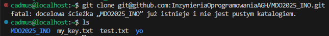

4. Przełączono się na gałąź main, a następnie na gałąź grupową GCL05 po czym utworzono nową gałąź.
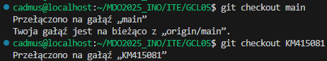

5. Praca na nowej gałęzi.
- w katalogu właściwym dla grupy utworzono nowy katalog
- napisano Git hooka oraz dodano go do stworzonego wcześniej katalogu po czym skopiowano go we właściwe miejsce, tak by uruchamiał się za każdym razem kiedy wykonywany jest commit.
- dodano plik ze sprawozdaniem
- dodano zrzuty ekranu
- wysłano zmiany

Treść githooka
```sh
#!/usr/bin/sh

EXPECTED_PREFIX="KM415081"
COMMIT_MSG=$(cat "$1")

if [[ "$COMMIT_MSG" != $EXPECTED_PREFIX* ]]; then
    echo "Błąd: Commit message musi zaczynać się od \"$EXPECTED_PREFIX\"!"
    exit 1
fi

exit 0
```
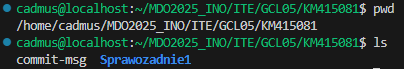

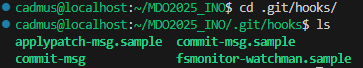

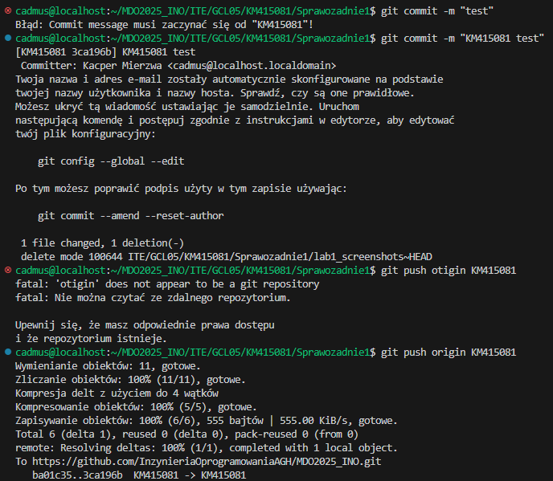

6. Próba wciągnięcia gałęzi do gałęzi grupowej.
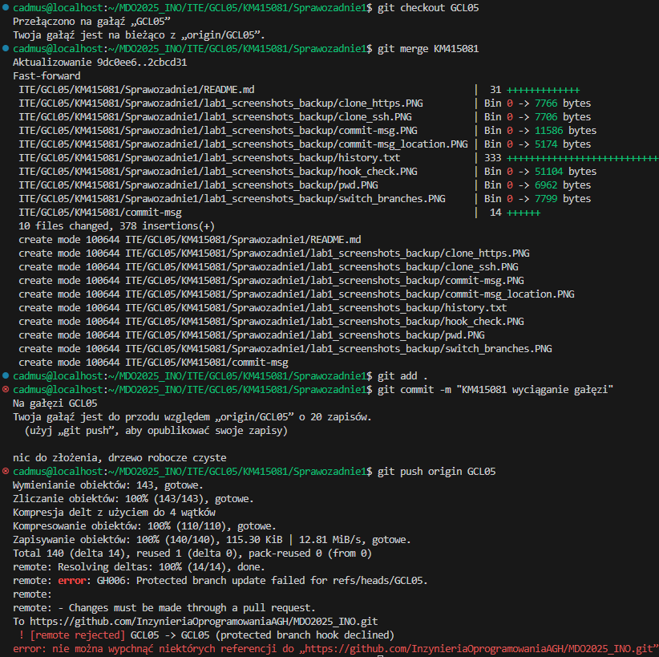

# Zajęcia 02

1. Zainstalowano Docker.


2. Zarejestrowano się w DockerHub.

3. Pobrano obrazy: hello-world, busybox, fedora, mysql.

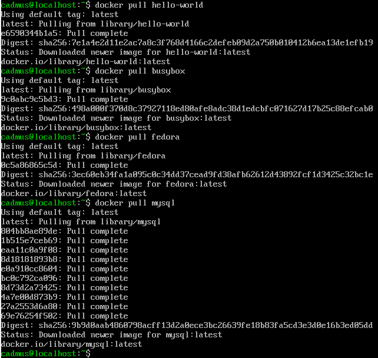

4. UruchomIONO kontener z obrazu busybox.

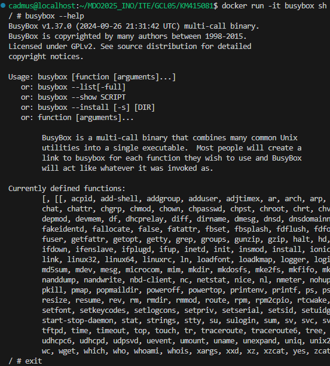

5. Uruchomiono "system w kontenerze".


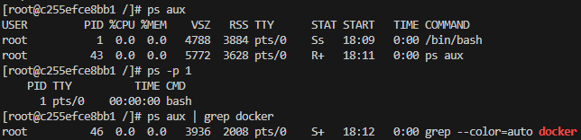

6. Stworzono własny Dockerfile, który następnie zbudowano i uruchomiono.

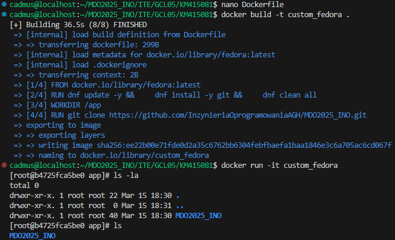

Treść Dockerfile
```sh
FROM fedora:latest

RUN dnf update -y && \
    dnf install -y git && \
    dnf clean all

WORKDIR /app

RUN git clone https://github.com/InzynieriaOprogramowaniaAGH/MDO2025_INO.git

CMD ["/bin/bash"]
```
7. Pokazano uruchomione kontenery, po czym je wyczyszczono wraz z obrazami.

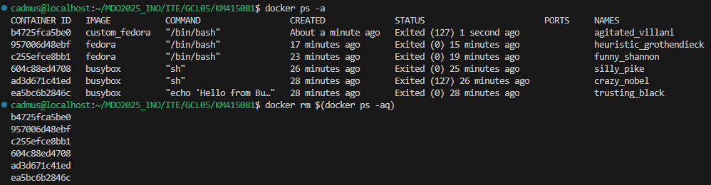

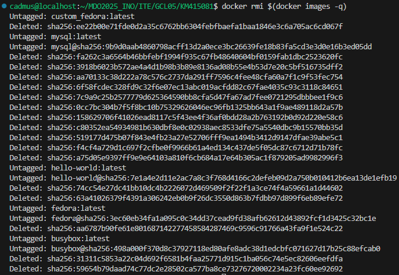

# Zajęcia 03

1. Sklonowano przesłane przez prowadzącego zajęcia repozytorium, przeprowadzono build programu, doinstalowano wymagane zależności i uruchomiono testy jednostkowe dołączone do repozytorium.

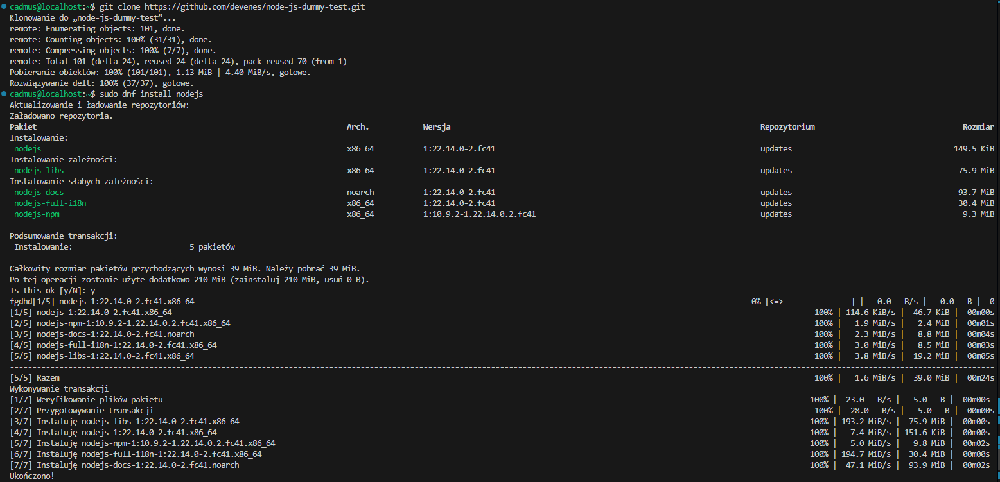

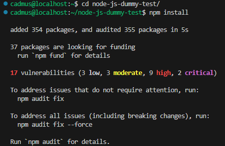

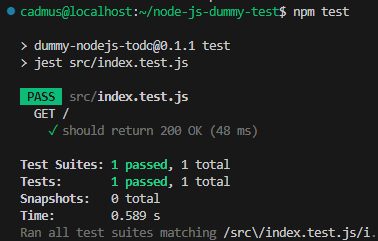

2. Wykonano kroki build i test wewnątrz wybranego kontenera bazowego.
- uruchomiono kontener
- podłączono do niego TTY celem rozpoczęcia interaktywnej pracy
- sklonowano repozytorium
- skonfigurowano środowisko i uruchomiono build
- uruchomiono testy

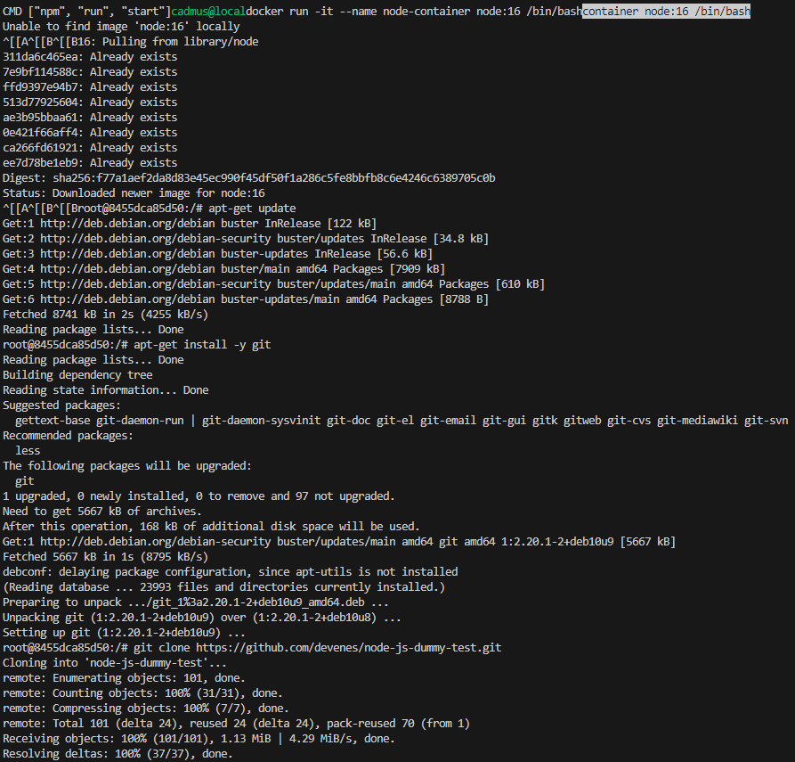

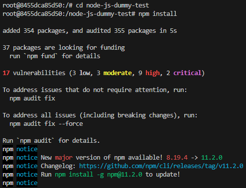

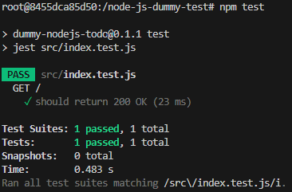

3. Stworzono dwa pliki Dockerfile automatyzujące kroki powyżej i wykazano działanie kontenera.

Dockerfile.nodebld
```sh
FROM node:22.14.0

RUN git clone https://github.com/devenes/node-js-dummy-test
WORKDIR /node-js-dummy-test
RUN npm install
CMD ["npm", "start"]
```

Dockerfile.nodetest
```sh
FROM nodebld
RUN npm test
```

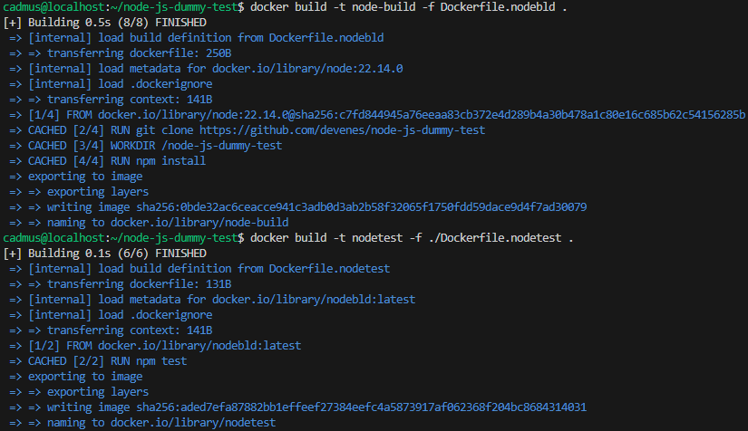

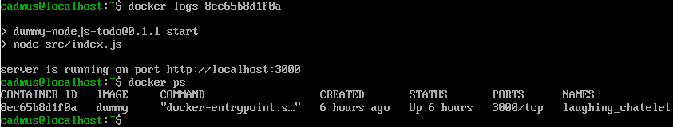

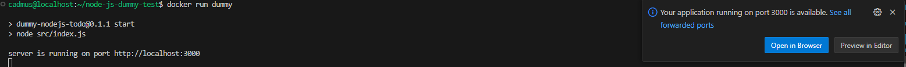
   
4. Ujęto kontenery w kompozycję.
   
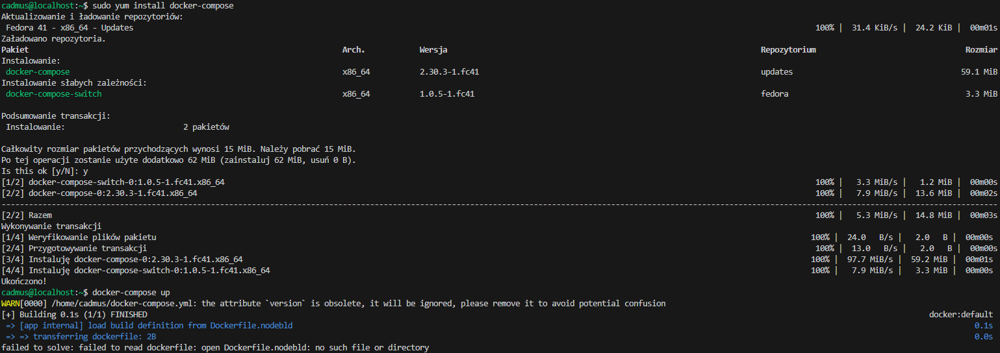

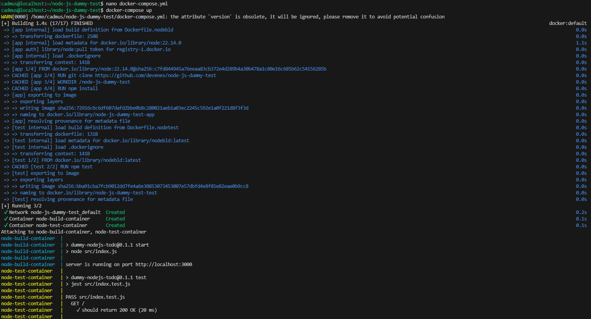

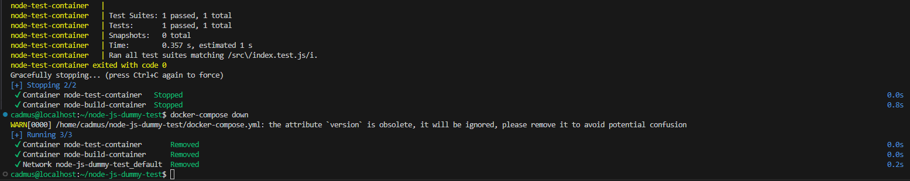
