# Zajęcia 05
## Przygotowanie
### Test uprzednio utworzonych kentenerów: budującego i testującego.

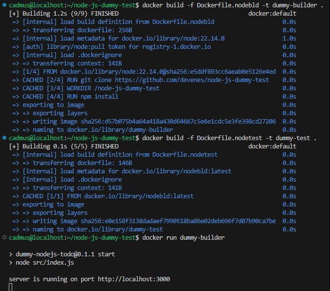

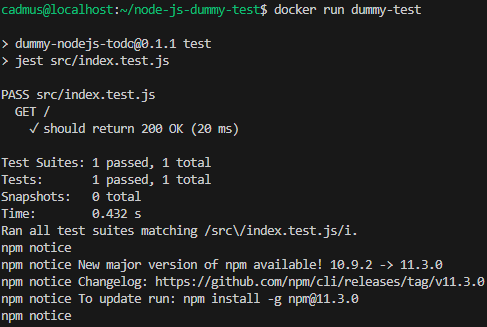

### Utworzenie i konfiguracja Jenkins
Uruchomiono kontener DIND, zbudowano obraz jenkinsa przy użyciu Dockerfila podanego w dokumentacji, stworzono kontener

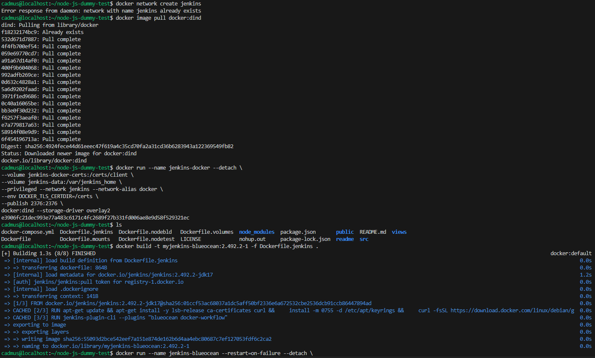

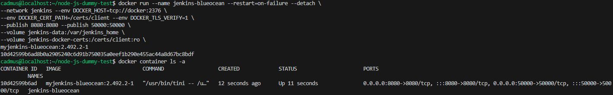

Dockerfile.jenkins
```sh
FROM jenkins/jenkins:2.492.2-jdk17
USER root
RUN apt-get update && apt-get install -y lsb-release ca-certificates curl && \
    install -m 0755 -d /etc/apt/keyrings && \
    curl -fsSL https://download.docker.com/linux/debian/gpg -o /etc/apt/keyrings/docker.asc && \
    chmod a+r /etc/apt/keyrings/docker.asc && \
    echo "deb [arch=$(dpkg --print-architecture) signed-by=/etc/apt/keyrings/docker.asc] \
    https://download.docker.com/linux/debian $(. /etc/os-release && echo \"$VERSION_CODENAME\") stable" \
    | tee /etc/apt/sources.list.d/docker.list > /dev/null && \
    apt-get update && apt-get install -y docker-ce-cli && \
    apt-get clean && rm -rf /var/lib/apt/lists/*
USER jenkins
RUN jenkins-plugin-cli --plugins "blueocean docker-workflow"
```
Uruchomiono jenkins w przeglądarce na porcie 8080 dzięki odpowiedniej konfiguracji kontenerów, odblokowano kodem z konsoli, utworzono konta admina i zainstalowano rekomendowane pluginy.

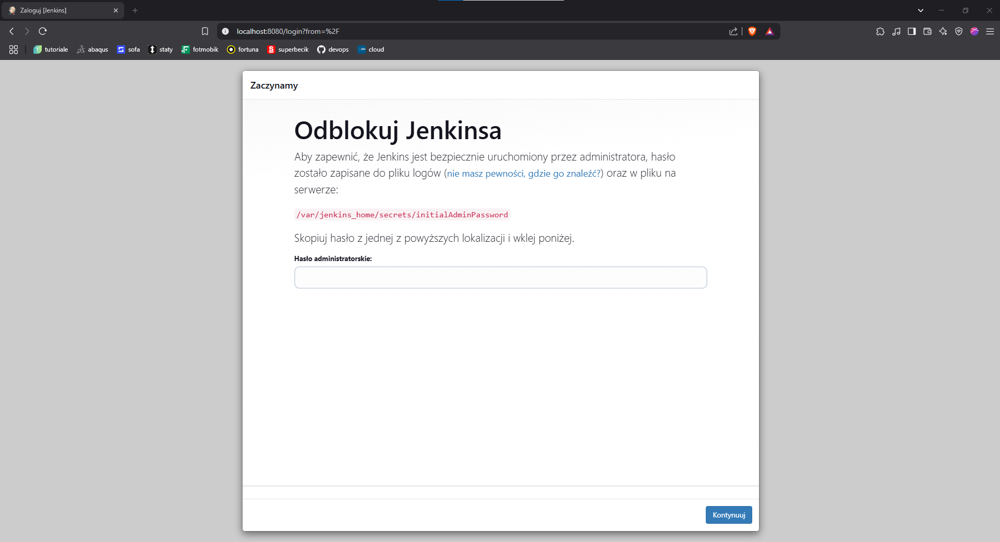

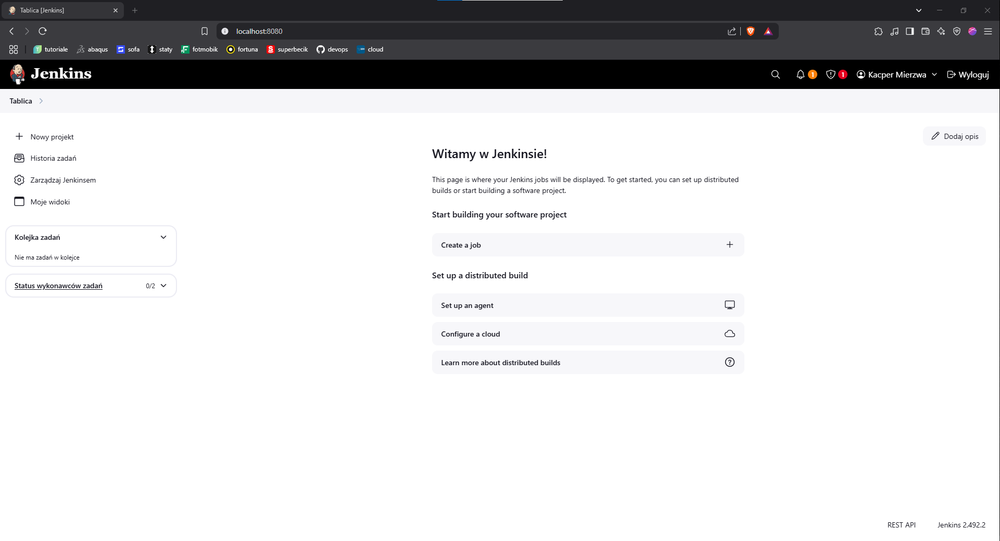

## Utworzenie i uruchomienie projektów
### Projekt 1 - wyświetlenie uname
```sh
uname -a
```
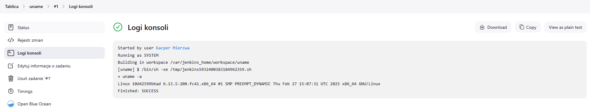

### Projekt 2 - błąd jeśli godzina jest nieparzysta
```sh
#!/bin/bash

HOUR=$(date +%H)
HOUR=$((10#$HOUR))  

if [ $((HOUR % 2)) -ne 0 ]; then
    echo "Błąd: Godzina ($HOUR) jest nieparzysta!"
    exit 1
else
    echo "OK: Godzina ($HOUR) jest parzysta."
    exit 0
fi
```
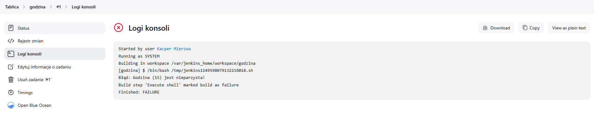

### Projekt 3 - pobranie w projekcie obrazu kontenera ubuntu stosując docker pull
```sh
docker pull ubuntu
```
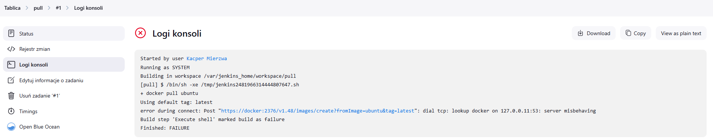

Pierwsza próba zakończyły się niepowodzeniem, lecz po zrestartowaniu kontenera docker:dind udało się to wykonać.

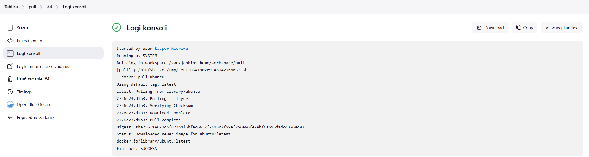

## Utworzenie projektu typu pipeline
Pipeline:
```sh
pipeline {
    agent any

    stages {
        stage('Checkout') {
            steps {
                sh 'rm -fr MDO2025_INO'
                sh 'git clone https://github.com/InzynieriaOprogramowaniaAGH/MDO2025_INO.git'
                dir("MDO2025_INO"){
                    sh 'git checkout KM415081'
                }
            }
        }

        stage('Build') {
            steps {
                dir('MDO2025_INO/ITE/GCL05/KM415081/Sprawozadnie1/lab_3_dockerfile') {
                    sh 'docker rmi -f dummy-builder || true'
                    sh 'docker builder prune --force --all'
                    sh 'docker build -t dummy-builder -f Dockerfile.nodebld .'
                }
            }
        }
        
        stage('Test') {
            steps {
                dir('MDO2025_INO/ITE/GCL05/KM415081/Sprawozadnie1/lab_3_dockerfile') {
                    sh 'docker build -t dummy-test -f Dockerfile.nodetest .'
                }
            }
        }
    }
}
```
Definiujemy nowy obiekt pipeline, czyli zestaw zautomatyzowanych kroków służących do budowania, testowania i (ewentualnie) wdrażania aplikacji. Dzięki zapisaniu całego procesu w jednym pliku konfiguracyjnym, możliwa jest jego automatyzacja oraz łatwe powtarzanie przy kolejnych uruchomieniach.

Pierwszy etap polega na pobraniu kodu źródłowego z repozytorium Git. Na początku dla bezpieczeństwa usuwana jest ewentualnie wcześniej istniejąca kopia repozytorium, po czym następuje jego ponowne sklonowanie. W dalszej kolejności następuje przejście na wskazaną gałąź projektu.

Po przejściu do konkretnego katalogu, pipeline podejmuje próbę usunięcia istniejącego lokalnie obrazu Dockera, aby uniknąć potencjalnych konfliktów. Następnie czyszczone są zalegające dane oraz cache'e buildów Dockera, które mogłyby wpłynąć na wynik budowania.

Kiedy środowisko jest już przygotowane, budowany jest pierwszy obraz na podstawie pliku Dockerfile.nodebld. Po jego utworzeniu, w kolejnym kroku budowany jest drugi obraz — tym razem z użyciem Dockerfile.nodetest, który służy do przeprowadzenia testów.

### Pierwsze uruchomienie
Console output

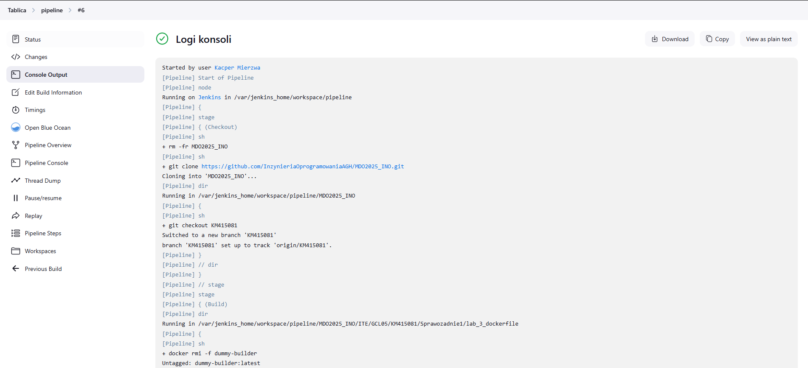

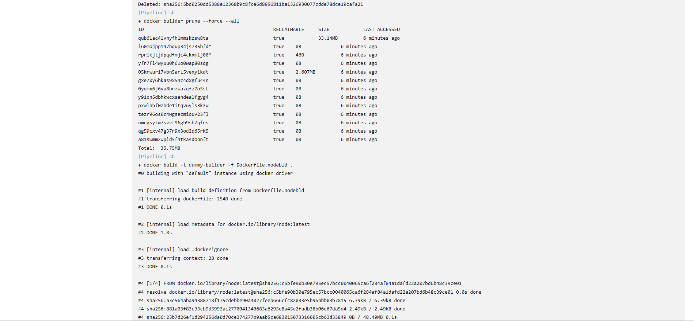

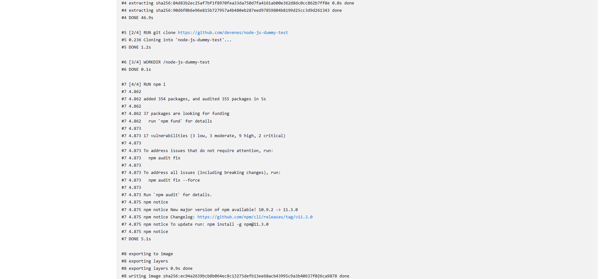

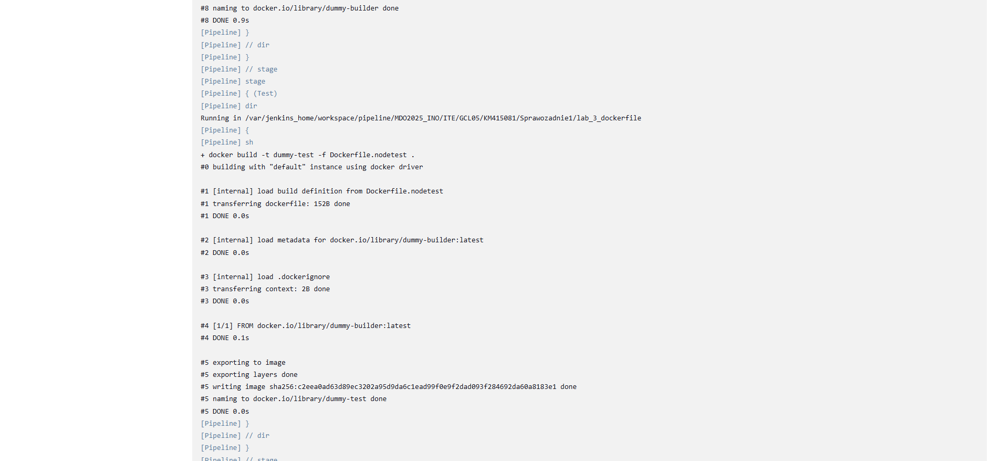

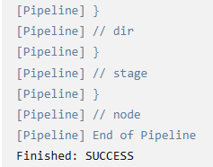

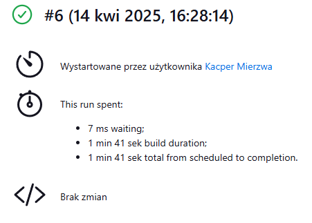

### Drugie uruchomienie

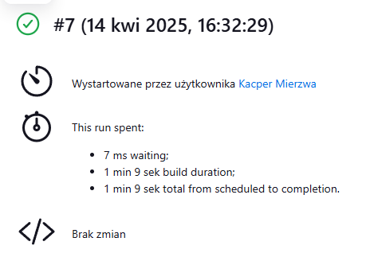

# Zajęcia 06-07
## Pipeline do wybranej aplikacji
### Node-js-dummy-test
Repozytorium node-js-dummy-test zostało wybrane ze względu na jego prostotę i lekkość, co czyni je bardzo praktycznym w kontekście budowy i testowania ciągłego. Projekt jest nieskomplikowany, szybko się klonuje i nie sprawia problemów przy budowie. Zawiera gotowe pliki Dockerfile oraz podstawowe testy, co znacząco przyspiesza konfigurację środowiska. Aplikacja działa na serwerze Node.js, który jest wystarczająco lekki i idealnie sprawdza się jako część pełnego procesu CI/CD — od momentu commitowania zmian, przez budowanie, testowanie, aż po wdrożenie i publikację artefaktów.

Założeniem projektu jest uruchomienie aplikacji node-js-dummy-test zgodnie z przedstawionym diagramem UML, przy zastosowaniu systemu kontroli wersji jako punktu startowego dla całego procesu automatyzacji. Dzięki takiemu podejściu możliwe jest pełne zautomatyzowanie pracy z kodem, począwszy od jego pobrania, aż po udostępnienie gotowego środowiska lub wyników testów.

Warto przy tym rozważyć, w jaki sposób zintegrowany jest Docker w środowisku CI. Istnieją dwie popularne metody: Docker-in-Docker (DinD) oraz podejście natywne, w którym kontener korzysta bezpośrednio z Dockera działającego na hoście poprzez socket. Pierwsza z metod zapewnia całkowitą izolację środowiska i eliminuje problemy z ewentualnym konfliktem pomiędzy procesami, jednak jej wadą może być niższa wydajność i potencjalne zagrożenia wynikające z uruchamiania demona Dockera wewnątrz kontenera. Z kolei natywne wykorzystanie Dockera przez socket jest znacznie szybsze i łatwiejsze do skonfigurowania, ale wiąże się z mniejszą separacją procesów oraz ryzykiem bezpieczeństwa, ponieważ dostęp do socketu oznacza możliwość pełnego kontrolowania środowiska hosta.

### Diagram
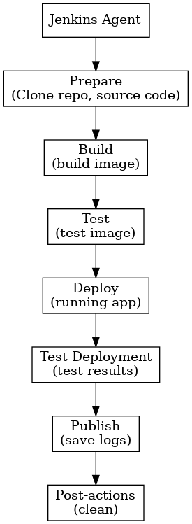

### Opis działania pipeline'u CI/CD dla aplikacji
#### Pipeline
```sh
pipeline {
    agent any

    environment {
        APP_DIR = 'MDO2025_INO/ITE/GCL05/KM415081/Sprawozadnie1/lab_3_dockerfile'
        APP_VERSION = '1.0'
        NODE_TAG = '23-alpine'
        BUILD_IMAGE = "nodebld:${NODE_TAG}"
        TEST_IMAGE = "nodetest:v${APP_VERSION}"
        DEPLOY_IMAGE = "nodedeploy:v${APP_VERSION}"
    }

    stages {
        stage('Prepare') {
            steps {
                sh '''
                    rm -fr MDO2025_INO
                    git clone https://github.com/InzynieriaOprogramowaniaAGH/MDO2025_INO.git
                    cd MDO2025_INO
                    git checkout KM415081
                '''
            }
        }

        stage('Logs') {
            steps {
                dir(env.APP_DIR) {
                    sh 'mkdir -p logs'
                }
            }
        }

        stage('Build') {
            steps {
                dir(env.APP_DIR) {
                    sh "docker build -t ${BUILD_IMAGE} -f Dockerfile.nodebld . > logs/build.log 2>&1 || (cat logs/build.log && false)"
                }
            }
        }

        stage('Tests') {
            steps {
                dir(env.APP_DIR) {
                    sh "docker build -t ${TEST_IMAGE} -f Dockerfile.nodetest . > logs/test.log 2>&1 || (cat logs/test.log && false)"
                }
            }
        }

        stage('Deploy') {
            steps {
                sh 'docker network create my_network || true'
                dir(env.APP_DIR) {
                    sh """
                        docker build -t ${DEPLOY_IMAGE} -f Dockerfile.nodedeploy .
                        docker rm -f app || true
                        docker run -d -p 3000:3000 --name app --network my_network ${DEPLOY_IMAGE}
                    """
                }
                sleep(10)
            }
        }

        stage('Test Deployment') {
            steps {
                dir(env.APP_DIR) {
                    sh '''
                        docker run --network my_network --rm curlimages/curl curl -v http://app:3000
                    '''
                }
            }
        }

        stage('Publish') {
            steps {
                dir(env.APP_DIR) {
                    sh """
                        mkdir -p artifacts_${APP_VERSION}
                        tar -cvf artifacts_${APP_VERSION}.tar logs/*.log
                    """
                    archiveArtifacts artifacts: "artifacts_${APP_VERSION}.tar"
                }
            }
        }
    }

    post {
        always {
            sh """
                docker rmi ${BUILD_IMAGE} ${TEST_IMAGE} ${DEPLOY_IMAGE} || true
                docker system prune --all --volumes --force || true
            """
        }
    }
}
```
Pipeline został zaprojektowany do automatycznego budowania, testowania oraz wdrażania lekkiej aplikacji napisanej w Node.js. Składa się z logicznie uporządkowanych etapów, które wykonują operacje krok po kroku na świeżym kodzie z repozytorium GitHub. Zastosowane podejście wykorzystuje kontenery Docker, co pozwala utrzymać czystość środowiska i zapewnia powtarzalność działania niezależnie od platformy.

#### Prepare
W pierwszym etapie wykonywane jest przygotowanie środowiska. Polega ono na usunięciu starej wersji katalogu z repozytorium (jeśli istnieje), a następnie na pobraniu aktualnej wersji kodu zdalnego. Po sklonowaniu następuje przejście do odpowiedniej gałęzi (KM415081), dzięki czemu mamy pewność, że pipeline pracuje na kodzie, który rzeczywiście chcemy przetestować i wdrożyć.

#### Logs
Zaraz po przygotowaniu repozytorium, pipeline tworzy folder logs, do którego trafiają pliki logów z kolejnych etapów – budowania oraz testowania. Choć proste, to ten krok okazuje się przydatny przy diagnozowaniu ewentualnych błędów bez konieczności przeszukiwania konsoli Jenkins.

#### Build
Tutaj następuje zbudowanie pierwszego obrazu Docker z użyciem pliku Dockerfile.nodebld. W tym obrazie przygotowywane jest środowisko dla aplikacji – np. instalowane są zależności Node.js. Proces budowania jest rejestrowany w pliku build.log, który w razie niepowodzenia zostaje wyświetlony w konsoli. Dzięki temu można szybko zlokalizować, co poszło nie tak, bez potrzeby wchodzenia do kontenera ręcznie.

Dockerfile.nodebld
```sh
FROM node:23-alpine

RUN apk add --no-cache git

RUN git clone https://github.com/devenes/node-js-dummy-test

WORKDIR /node-js-dummy-test

RUN npm install
```

#### Tests
Po zakończonym buildzie, pipeline przechodzi do etapu testów. Budowany jest kolejny obraz, bazujący na poprzednim (nodebld:23-alpine), i uruchamiane są w nim testy zdefiniowane w projekcie. Logi z tego etapu trafiają do test.log, a ich zawartość również pojawia się w konsoli w przypadku błędu, co ułatwia debugowanie. To etap krytyczny – jeśli testy nie przejdą, kolejne etapy są pomijane.

Dockerfile.nodetest
```sh
FROM nodebld:23-alpine

WORKDIR /node-js-dummy-test

RUN npm run test
```

#### Deploy
Jeśli wszystko do tej pory poszło zgodnie z planem, pipeline buduje obraz przeznaczony do wdrożenia na podstawie Dockerfile.nodedeploy. Dodatkowo tworzona jest sieć Docker o nazwie my_network, w której działać będzie aplikacja. Wcześniejszy kontener (jeśli istniał) jest usuwany, po czym aplikacja jest uruchamiana w nowym kontenerze, wystawiona na porcie 3000. Dodane sleep(10) daje czas aplikacji na rozruch przed kolejnym etapem.

Dockerfile.nodedeploy
```sh
FROM nodebld:23-alpine

WORKDIR /node-js-dummy-test

CMD ["npm", "start"]
```

#### Test Deployment
W tym etapie pipeline wykonuje szybki test wdrożenia typu smoke test. Wykorzystując kontener z obrazem curlimages/curl, wykonywane jest żądanie HTTP do uruchomionej aplikacji. Jeśli odpowiedź zostanie poprawnie odebrana – wiemy, że aplikacja działa i przyjmuje połączenia.

#### Publish
Na zakończenie pipeline’u tworzony jest katalog artifacts_1.0, do którego trafiają pliki logów z budowania i testowania. Całość pakowana jest do archiwum .tar i udostępniana jako artefakt, co umożliwia późniejsze pobranie wyników pracy pipeline’a lub ich automatyczne przetworzenie.

#### Post – Cleanup
Bez względu na wynik całego procesu, pipeline zawsze wykonuje sprzątanie. Usuwane są wszystkie obrazy, które zostały utworzone na potrzeby danego przebiegu pipeline’u (nodebld, nodetest, nodedeploy), a także czyszczone są nieużywane zasoby Dockera. Dzięki temu maszyna Jenkins nie zapycha się niepotrzebnymi danymi i pipeline może być wielokrotnie wykonywany bez ryzyka przeciążenia.

Dzięki zastosowaniu wyraźnej struktury, logowania i pełnej automatyzacji, pipeline zapewnia solidne podstawy do dalszego rozwijania procesu CI/CD dla dowolnej aplikacji opartej na Node.js. Dodatkowe etapy, jak testy wdrożeniowe czy archiwizacja logów, zwiększają przejrzystość oraz ułatwiają debugowanie i utrzymanie projektu w przyszłości.

### Uruchomienie Pipeline przez Jenkinsfile
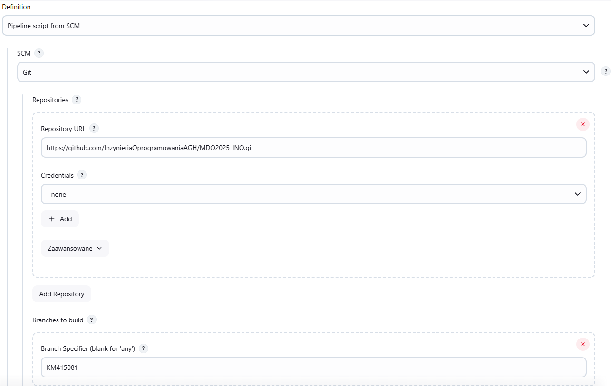
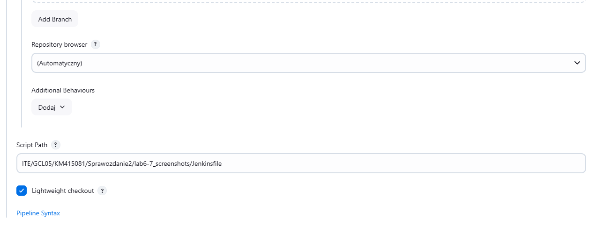

W celu uruchomienia pipeline’a z wykorzystaniem SCM (Source Code Management), utworzyłem nowy projekt typu Pipeline w Jenkinsie. W konfiguracji projektu skorzystałem z opcji „Pipeline script from SCM”, dzięki której możliwe było pobieranie skryptu Jenkinsfile bezpośrednio z repozytorium Git. Pozwoliło mi to na pełną automatyzację procesu budowania i testowania aplikacji w oparciu o aktualny kod źródłowy, bez potrzeby ręcznego kopiowania skryptów do interfejsu Jenkinsa.

#### Efekt uruchomienia
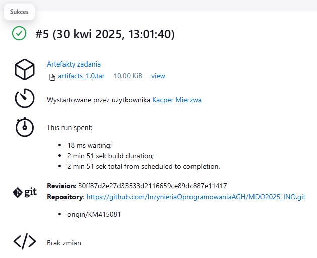
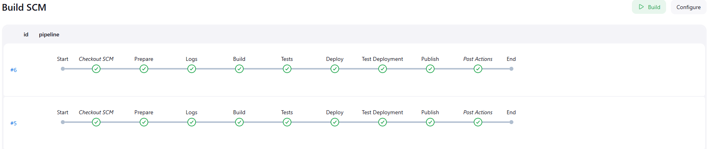

#### Console output
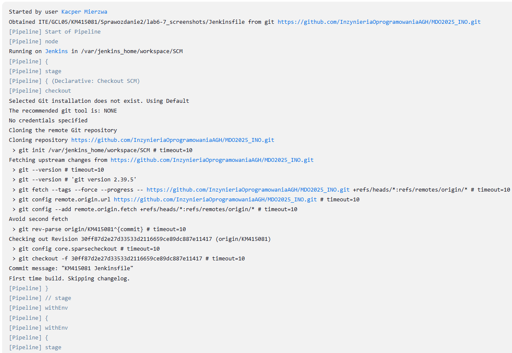
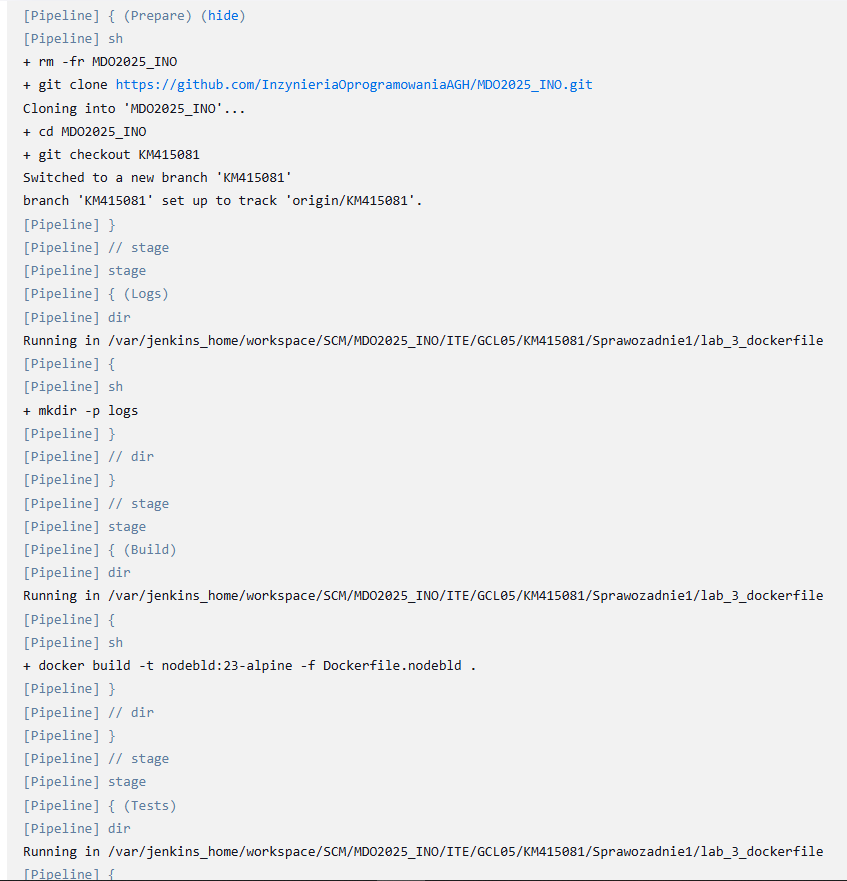
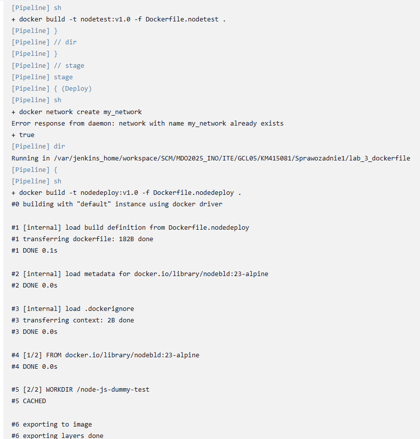
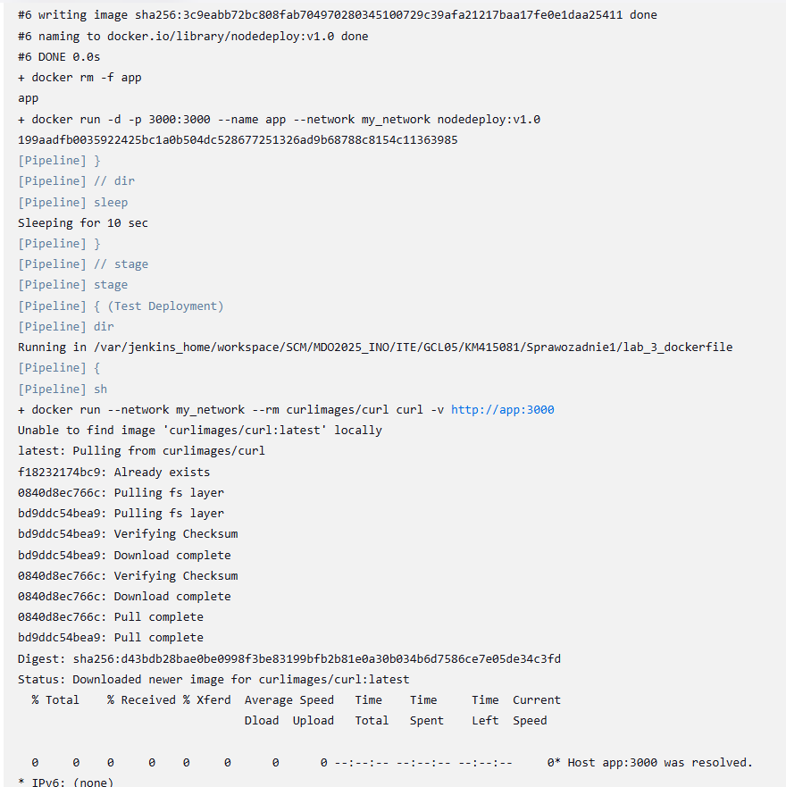
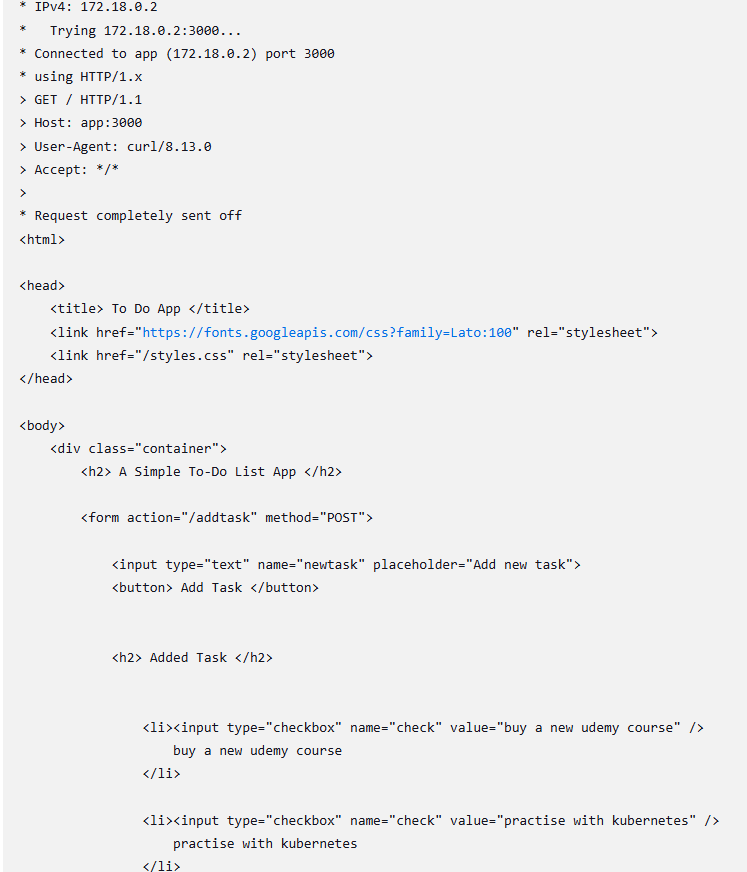
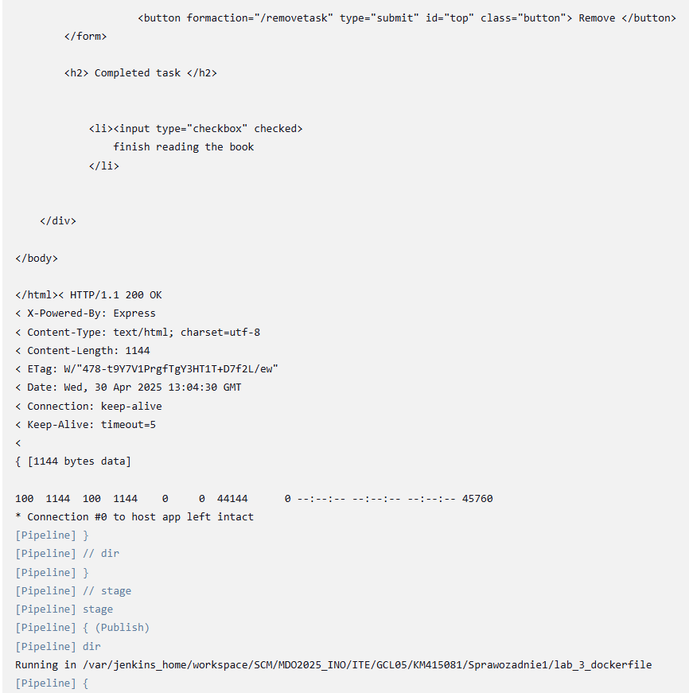
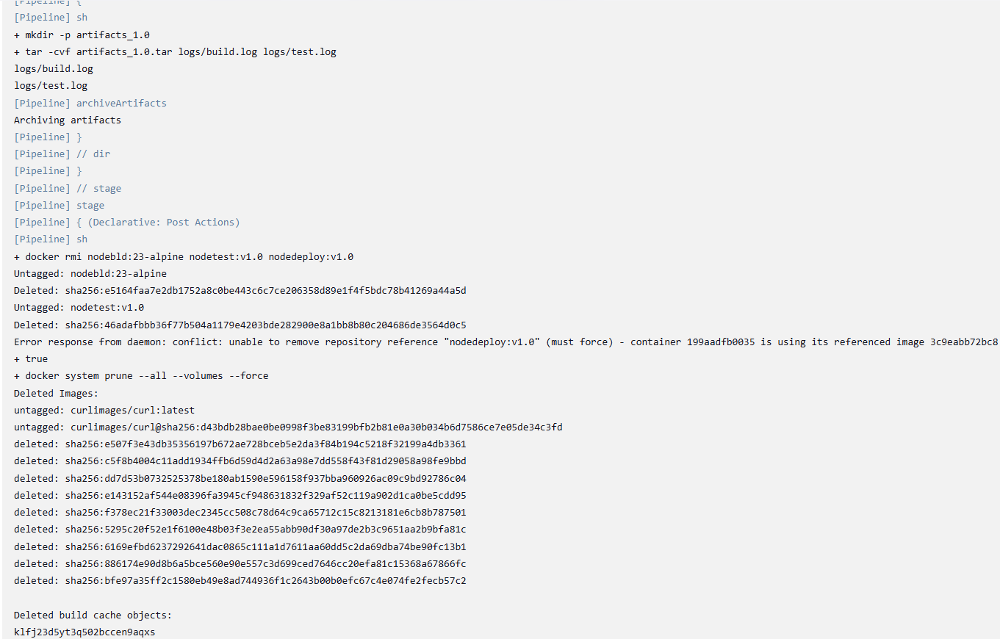
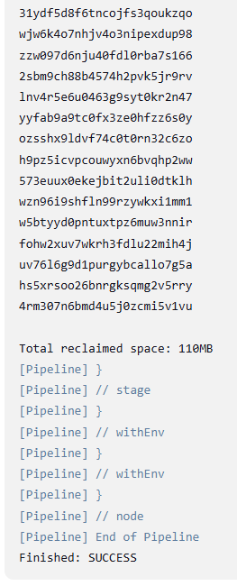

#### Logi
build.log
```sh
#0 building with "default" instance using docker driver

#1 [internal] load build definition from Dockerfile.nodebld
#1 transferring dockerfile: 262B done
#1 DONE 0.1s

#2 [internal] load metadata for docker.io/library/node:23-alpine
#2 DONE 1.7s

#3 [internal] load .dockerignore
#3 transferring context: 2B done
#3 DONE 0.0s

#4 [1/5] FROM docker.io/library/node:23-alpine@sha256:86703151a18fcd06258e013073508c4afea8e19cd7ed451554221dd00aea83fc
#4 resolve docker.io/library/node:23-alpine@sha256:86703151a18fcd06258e013073508c4afea8e19cd7ed451554221dd00aea83fc 0.0s done
#4 sha256:86703151a18fcd06258e013073508c4afea8e19cd7ed451554221dd00aea83fc 6.41kB / 6.41kB done
#4 sha256:0d468be7d2997dd2f6a3cda45e121a6b5140eb7ba3eba299a215030dbb0fb1ca 1.72kB / 1.72kB done
#4 sha256:2b99bc550caad6f10cf0fd4ad72f86a14cc9818a05a66cc72d1997a4e8ee5c77 6.18kB / 6.18kB done
#4 DONE 0.2s

#5 [2/5] RUN apk add --no-cache git
#5 0.193 fetch https://dl-cdn.alpinelinux.org/alpine/v3.21/main/x86_64/APKINDEX.tar.gz
#5 0.473 fetch https://dl-cdn.alpinelinux.org/alpine/v3.21/community/x86_64/APKINDEX.tar.gz
#5 0.938 (1/12) Installing brotli-libs (1.1.0-r2)
#5 1.013 (2/12) Installing c-ares (1.34.5-r0)
#5 1.054 (3/12) Installing libunistring (1.2-r0)
#5 1.142 (4/12) Installing libidn2 (2.3.7-r0)
#5 1.182 (5/12) Installing nghttp2-libs (1.64.0-r0)
#5 1.219 (6/12) Installing libpsl (0.21.5-r3)
#5 1.255 (7/12) Installing zstd-libs (1.5.6-r2)
#5 1.318 (8/12) Installing libcurl (8.12.1-r1)
#5 1.375 (9/12) Installing libexpat (2.7.0-r0)
#5 1.422 (10/12) Installing pcre2 (10.43-r0)
#5 1.477 (11/12) Installing git (2.47.2-r0)
#5 1.806 (12/12) Installing git-init-template (2.47.2-r0)
#5 1.839 Executing busybox-1.37.0-r12.trigger
#5 1.853 OK: 21 MiB in 29 packages
#5 DONE 2.1s

#6 [3/5] RUN git clone https://github.com/devenes/node-js-dummy-test
#6 0.195 Cloning into 'node-js-dummy-test'...
#6 DONE 1.1s

#7 [4/5] WORKDIR /node-js-dummy-test
#7 DONE 0.1s

#8 [5/5] RUN npm install
#8 4.764 
#8 4.764 added 354 packages, and audited 355 packages in 4s
#8 4.764 
#8 4.764 37 packages are looking for funding
#8 4.764   run `npm fund` for details
#8 4.777 
#8 4.777 17 vulnerabilities (3 low, 3 moderate, 9 high, 2 critical)
#8 4.777 
#8 4.777 To address issues that do not require attention, run:
#8 4.777   npm audit fix
#8 4.777 
#8 4.777 To address all issues (including breaking changes), run:
#8 4.777   npm audit fix --force
#8 4.777 
#8 4.777 Run `npm audit` for details.
#8 4.778 npm notice
#8 4.778 npm notice New major version of npm available! 10.9.2 -> 11.3.0
#8 4.778 npm notice Changelog: https://github.com/npm/cli/releases/tag/v11.3.0
#8 4.778 npm notice To update run: npm install -g npm@11.3.0
#8 4.778 npm notice
#8 DONE 5.0s

#9 exporting to image
#9 exporting layers
#9 exporting layers 0.8s done
#9 writing image sha256:e5164faa7e2db1752a8c0be443c6c7ce206358d89e1f4f5bdc78b41269a44a5d done
#9 naming to docker.io/library/nodebld:23-alpine done
#9 DONE 0.8s
```

test.log
```sh
#0 building with "default" instance using docker driver

#1 [internal] load build definition from Dockerfile.nodetest
#1 transferring dockerfile: 176B done
#1 DONE 0.0s

#2 [internal] load metadata for docker.io/library/nodebld:23-alpine
#2 DONE 0.0s

#3 [internal] load .dockerignore
#3 transferring context: 2B done
#3 DONE 0.0s

#4 [1/3] FROM docker.io/library/nodebld:23-alpine
#4 DONE 0.1s

#5 [2/3] WORKDIR /node-js-dummy-test
#5 DONE 0.1s

#6 [3/3] RUN npm run test
#6 0.318 
#6 0.318 > dummy-nodejs-todo@0.1.1 test
#6 0.318 > jest src/index.test.js
#6 0.318 
#6 1.567 PASS src/index.test.js
#6 1.567   GET /
#6 1.567     ✓ should return 200 OK (28 ms)
#6 1.567 
#6 1.570 Test Suites: 1 passed, 1 total
#6 1.570 Tests:       1 passed, 1 total
#6 1.570 Snapshots:   0 total
#6 1.570 Time:        0.574 s
#6 1.570 Ran all test suites matching /src\/index.test.js/i.
#6 DONE 1.8s

#7 exporting to image
#7 exporting layers 0.1s done
#7 writing image sha256:46adafbbb36f77b504a1179e4203bde282900e8a1bb8b80c204686de3564d0c5 done
#7 naming to docker.io/library/nodetest:v1.0 done
#7 DONE 0.1s
```
