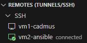

# Zajęcia 08
## Automatyzacja i zdalne wykonywanie poleceń za pomocą Ansible

Celem laboratorium jest zautomatyzowanie zarządzania środowiskiem wielomaszynowym przy użyciu Ansible. W ramach zadania skonfigurowano co najmniej dwie maszyny wirtualne z bezhasłowym dostępem SSH, utworzono inwentarz systemów oraz przygotowano playbooki do wykonywania podstawowych operacji administracyjnych, takich jak pingowanie maszyn, aktualizacja pakietów, zarządzanie kontenerami Docker oraz przesyłanie i uruchamianie aplikacji. Wszystkie te działania zostały ujęte w rolę Ansible, co umożliwia ich powtarzalne i zautomatyzowane wykonywanie, eliminując konieczność ręcznego zarządzania poszczególnymi maszynami i procesami wdrożeniowymi.

### Utworzenie nowej maszyny wirtualnej
W VirtualBox stworzono maszynę o jak najmniejszym zbiorze zainstalowanego oprogramowania, z tym samym systemem operacyjnym co uprzednio używana maszyna. Dodatkowo zapewniono obecność programu 'tar' i 'sshd', ustawiono hostname i użytkownika odpowiednio jako 'ansible-target' oraz 'ansible'.

  

