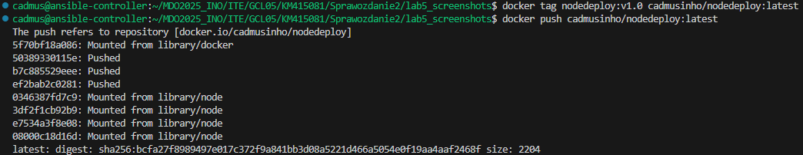
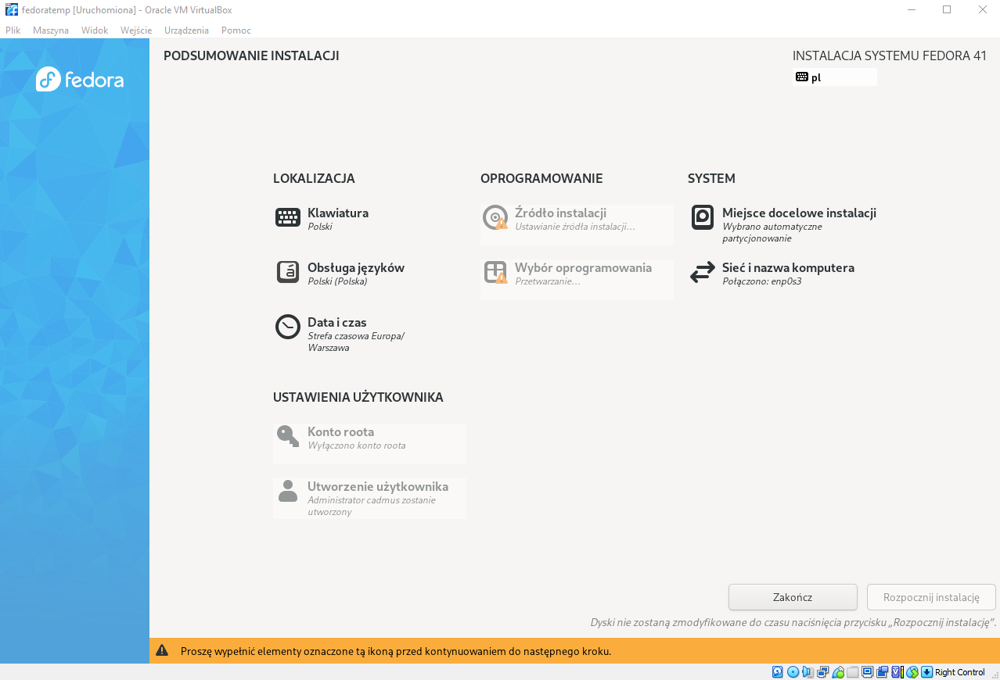
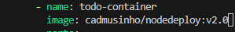
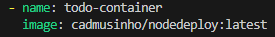
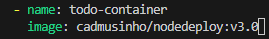

# Zajęcia 08
## Automatyzacja i zdalne wykonywanie poleceń za pomocą Ansible
Celem laboratorium jest zautomatyzowanie zarządzania środowiskiem wielomaszynowym przy użyciu Ansible. W ramach zadania skonfigurowano co najmniej dwie maszyny wirtualne z bezhasłowym dostępem SSH, utworzono inwentarz systemów oraz przygotowano playbooki do wykonywania podstawowych operacji administracyjnych, takich jak pingowanie maszyn, aktualizacja pakietów, zarządzanie kontenerami Docker oraz przesyłanie i uruchamianie aplikacji. Wszystkie te działania zostały ujęte w rolę Ansible, co umożliwia ich powtarzalne i zautomatyzowane wykonywanie, eliminując konieczność ręcznego zarządzania poszczególnymi maszynami i procesami wdrożeniowymi.

### Instalacja zarządcy Ansible
#### Utworzenie nowej maszyny wirtualnej
W VirtualBox stworzono maszynę o jak najmniejszym zbiorze zainstalowanego oprogramowania, z tym samym systemem operacyjnym co uprzednio używana maszyna. Dodatkowo zapewniono obecność programu 'tar' i 'sshd', ustawiono hostname i użytkownika odpowiednio jako 'ansible-target' oraz 'ansible'.


Dodatkowo wykonano migawkę maszyny oraz jej eksport.


#### Instalacja Ansible
Na głównej maszynie zainstalowano oprogramowanie Ansible.


#### Wymieniono klucze SSH pomiędzy użytkownikami na maszynach, aby logowanie przez ssh nie wymagało wpisywania hasła.


### Inwentaryzacja
#### Dokonano następującej inwentaryzacji systemów
Po ustawieniu przewidywalnych nazw maszyn wirtualnych 'ansible-controller' oraz 'ansible-target' używając 'hostnamectl', wprowadzono nazwy DNS maszyn stosując 'etc/hosts' na obu maszynach.


Działanie to umożliwia wywoływanie komputerów za pomocą nazw, a nie tylko wykorzystywaniu adresów IP. Zweryfikowano łączność używając wzajemny 'ping'.


Stworzono plik inwentaryzacji 'inventory.ini' z sekcjami 'Orchestrators' oraz 'Endpoints'
```sh
[Orchestrators]
ansible-controller ansible_host=10.0.2.15 ansible_user=cadmus

[Endpoints]
ansible-target ansible_host=10.0.2.4 ansible_user=ansible
```
Na testa wysłano żądanie 'ping' do wszystkich maszyn.


### Zdalne wywołanie procedur
#### Utworzono pierwszy 'playbook.yaml'
```sh
- hosts: all
  become: true
  tasks:
    - name: Ping machines
      ansible.builtin.ping:

    - name: Copy inventory file (only to ansible-target)
      ansible.builtin.copy:
        src: ./inventory.ini
        dest: /tmp/inventory.ini
      when: inventory_hostname == 'ansible-target'

    - name: Update all packages
      ansible.builtin.dnf:
        name: '*'
        state: latest
        update_cache: yes

    - name: Restart sshd and rngd
      ansible.builtin.systemd:
        name: "{{ item }}"
        state: restarted
      loop:
        - sshd
        - rngd
```
Playbook wysyła kolejno żądanie 'ping' do wszystkich maszyn, kopiuje plik inwentaryzacji na maszynę 'ansible-target', aktualizuje pakiety w systemie oraz restartuje usługi sshd oraz rngd. Pierw zainstalowano narzędzie 'rngd'.


Pierwsze uruchomienie playbooka:


Drugie uruchomienie playbooka:


Trzecie uruchomienie (z uprzednio wyłączonym serwerem SSH na maszynie 'ansible-target'):


### Zarządzanie stworzonym artefaktem
#### Artefaktem poprzednich zajęć był kontener
Pierw dodano obraz do repo na Docker Hub.



Kolejno stworzono rolę 'app', strukturę katalogów i plików dla roli Ansible. Dodano kolejne zadania w folderze 'app/tasks/':

install.yml - instaluje Dockera
```sh
- name: Install packages
  ansible.builtin.yum:
    name:
      - yum-utils
      - device-mapper-persistent-data
      - lvm2
    state: present

- name: Add Docker repository
  ansible.builtin.yum_repository:
    name: docker-ce
    description: Docker CE Repo
    baseurl: https://download.docker.com/linux/centos/7/x86_64/stable/
    gpgcheck: yes
    gpgkey: https://download.docker.com/linux/centos/gpg
    enabled: yes

- name: Install Docker
  ansible.builtin.yum:
    name: docker-ce
    state: latest

- name: Docker service
  ansible.builtin.service:
    name: docker
    state: started
    enabled: true
```

container.yml - pobranie obrazu i uruchomienie kontenera
```sh
- name: Pull image
  ansible.builtin.docker_image:
    name: cadmusinho/nodedeploy
    source: pull

- name: Run container
  ansible.builtin.docker_container:
    name: deploy-container
    image: cadmusinho/nodedeploy
    state: started
    restart_policy: always
    ports:
      - "3000:3000"
```

verify_container.yml - weryfikacja działania kontenera
```sh
- name: Test HTTP
  ansible.builtin.shell: "curl -s -o /dev/null -w '%{http_code}' http://localhost:3000"
  register: curl_result

- name: HTTP status code
  ansible.builtin.debug:
    var: curl_result.stdout
```

clean.yml - zatrzymanie i usunięcia kontenera
```sh
- name: Stop container
  ansible.builtin.docker_container:
    name: deploy-container
    state: stopped
    force_kill: true

- name: Remove container
  ansible.builtin.docker_container:
    name: deploy-container
    state: absent
```

install_py.yml - instalacja biblioteki 'requests' (dodany po pierwszym (błędnym) uruchomieniu)
```sh
- name: Install python3-requests on target
  ansible.builtin.yum:
    name: python3-requests
    state: present
  become: yes
```

main.yml - główne zadanie odpalające te wcześniejsze
```sh
---
# tasks file for app

- name: Install Docker on target host
  import_tasks: install.yml

- name: Install python3-requests on target
  import_tasks: install_py.yml

- name: Deploy container from Docker Hub
  import_tasks: container.yml

- name: Verify container
  import_tasks: verify_container.yml

- name: Clean container
  import_tasks: clean.yml
```

Dodano jeszcze plik run_app.yaml który wykorzystuje rolę 'app'.
run_app.yaml - playbook
```sh
---
- hosts: Endpoints
  become: yes
  roles:
    - app
```

Zadania w playbooku podzielono na moduły dzięki czemu kod jest bardziej przejrzysty i łatwiej go utrzymać. Instalacja zależności, jak python3-requests, została wyodrębniona, co zapobiega błędom związanym z brakującymi bibliotekami potrzebnymi do działania modułów Ansible. Sprawdzenie działania aplikacji przez test HTTP pozwala automatycznie potwierdzić sukces wdrożenia, a końcowe usunięcie kontenera utrzymuje porządek i oszczędza zasoby.

Pierwsze uruchomienie (błędne) playbooka:


Ostatnie (poprawne) uruchomienie playbooka:


# Zajęcia 09
## Pliki odpowiedzi dla wdrożeń nienadzorowanych
Celem ćwiczenia było praktyczne opanowanie automatycznego instalowania Fedory za pomocą plików Kickstart. W trakcie zajęć stworzono i dostosowano plik odpowiedzi, który pozwala na bezobsługową instalację systemu, w tym konfigurację użytkowników, repozytoriów, partycjonowanie dysku oraz automatyczne uruchomienie kontenera Docker.

### Utworzono nową maszynę Fedora


### Plik 'anaconda-ks.cfg'
Na starej maszynie pobrano ten plik odpowiedzi i nadano mu uprawnienia do odczytu.


### Edycja pliku odpowiedzi
Po zapoznaniu się z dokumentacją wykonano kolejno czynności:
- dodanie potrzebnych repozytoriów
- założenie czystego dysku i formatowania całości
- ustawiono hostname

anaconda-ks.cfg
```sh
# Generated by Anaconda 41.35
# Generated by pykickstart v3.58
#version=DEVEL

# Keyboard layouts
keyboard --vckeymap=pl --xlayouts='pl'
# System language
lang pl_PL.UTF-8

%packages
@^server-product-environment

%end

# Run the Setup Agent on first boot
firstboot --enable

# Generated using Blivet version 3.11.0
ignoredisk --only-use=sda
autopart
# Partition clearing information
clearpart --all  --initlabel
autopart

# System timezone
timezone Europe/Warsaw --utc

network --hostname=trzecia

url --mirrorlist=http://mirrors.fedoraproject.org/mirrorlist?repo=fedora-41&arch=x86_64
repo --name=updates --mirrorlist=http://mirrors.fedoraproject.org/mirrorlist?repo=updates-released-f41&arch=x86_64

#Root password
rootpw --lock
user --groups=wheel --name=cadmus --password=$y$j9T$1jYL4ytD050gFyYG9rFmnFNe$FHz/mlvsMtaON1Ul31paOJ0QxphttD/YamQjJwJIjr3 --iscrypted --gecos="Kacper Mierzwa"

firstboot --enable
```

### Przeprowadzenie instalacji
Po wrzuceniu pliku odpowiedzi na soją gałąź w repozytorium przedmiotowym, uruchomiono nową maszynę z płyty ISO i po naciśnięciu klawisza 'e' na ekranie GRUB dokonano wpisu do używania pliku 'kickstart'. 


Przebieg instalacji:





### Rozszerzenie pliku odpowiedzi
anaconda-ks2.cfg
```sh
# Generated by Anaconda 41.35
# Generated by pykickstart v3.58
#version=DEVEL

# Keyboard layouts
keyboard --vckeymap=pl --xlayouts='pl'
# System language
lang pl_PL.UTF-8

# Disk configuration
ignoredisk --only-use=sda
autopart
clearpart --all --initlabel

# System timezone
timezone Europe/Warsaw --utc

# Network
network --hostname=trzecia

# Repositories
url --mirrorlist=http://mirrors.fedoraproject.org/mirrorlist?repo=fedora-41&arch=x86_64
repo --name=updates --mirrorlist=http://mirrors.fedoraproject.org/mirrorlist?repo=updates-released-f41&arch=x86_64

# Users
rootpw --lock
user --groups=wheel --name=cadmus --password=$y$j9T$1jYL4ytD050gFyYG9rFmnFNe$FHz/mlvsMtaON1Ul31paOJ0QxphttD/YamQjJwJIjr3 --iscrypted --gecos="Admin User"

%packages
@^server-product-environment
wget
curl
docker
%end

firstboot --enable

%post --log=/root/post-install.log --interpreter=/bin/bash

echo "==> Setting up Docker..."
systemctl enable docker
systemctl start docker
usermod -aG docker cadmus

echo "==> Deploying Node.js container..."
docker pull cadmusinho/nodedeploy:latest

cat <<EOF > /etc/systemd/system/nodedeploy.service
[Unit]
Description=Node.js Application Container
Requires=docker.service
After=docker.service

[Service]
Restart=always
ExecStart=/usr/bin/docker run --rm -p 3000:3000 --name nodedeploy cadmusinho/nodedeploy:latest
ExecStop=/usr/bin/docker stop nodedeploy

[Install]
WantedBy=multi-user.target
EOF

systemctl enable nodedeploy.service
firewall-cmd --add-port=3000/tcp --permanent
firewall-cmd --reload

echo "==> Node.js app deployment complete."
%end

reboot
```

Ten rozszerzony plik instalacyjny Fedora Kickstart umożliwia w pełni automatyczną, nienadzorowaną instalację systemu z konfiguracją sieciową, użytkownikami i repozytoriami niezbędnymi do działania projektu. Sekcja %packages dopina niezbędne pakiety, w tym Dockera, wget i curl, zapewniając pełne środowisko do późniejszego wdrożenia kontenera. W sekcji %post uruchamiane są skrypty powłoki, które konfigurują i uruchamiają usługę Dockera, dodają użytkownika cadmus do grupy docker oraz pobierają i uruchamiają kontener cadmusinho/nodedeploy:latest. Aby zapewnić automatyczny start aplikacji Node.js po restarcie systemu, tworzony jest i aktywowany systemdowy serwis nodedeploy.service, który zarządza cyklem życia kontenera. Dodatkowo otwierany jest port 3000 w firewallu, co umożliwia dostęp do aplikacji z zewnątrz. Całość kończy się poleceniem restartu systemu, które pozwala na pełne wdrożenie konfiguracji i uruchomienie środowiska produkcyjnego bez żadnej interakcji użytkownika.

Weryfikacja działania:


# Zajęcia 10
## Wdrażanie na zarządzalne kontenery: Kubernetes (1)
Ćwiczenie polegało na praktycznym wdrożeniu aplikacji w lokalnym klastrze Kubernetes z użyciem Minikube. Skonfigurowano środowisko, przygotowano pliki deploymentu, uruchomiono kontenery oraz wystawiono i przetestowano usługi. Laboratorium rozwinęło umiejętności zarządzania Kubernetes i automatyzacji deployu aplikacji.

### Instalacja klastra Kubernetes
Instalacja minikube:


Uruchomienie Kubernesta:


Wyświetlenie listy wszystkich węzłów w klastrze oraz stan lokalnego klastra:


Wyświetlenie dostępnego miejsca na dysku - zalecane z dokumentacji jest minimum 20GB (u mnie spełnione):


Uruchomienie Dashboard:


Na tej stronie zapoznano się z funkcjalnościami Kubernetesa.

### Analiza posiadanego kontenera
Wybrałem aplikację 'node-js-dummy-test', na której pracuję od początku zajęć.
Uruchomienie aplikacji w konenerze:


### Uruchamianie oprogramowania
Aplikacja została uruchomiona w kontenerze na stosie Kubernetesa i wyświetlono pody wraz z ich aktualnym stanem:


Wyprowadzono port celem dotarcia do esponowanej funkcjonalności:


### Przekucie wdrożenia manualnego w plik wdrożenia

node.yaml
```sh
apiVersion: apps/v1
kind: Deployment
metadata:
  name: node
  labels:
    app: node
    environment: production

spec:
  replicas: 4
  selector:
    matchLabels:
      app: todo-app
  template:
    metadata:
      labels:
        app: todo-app
    spec:
      restartPolicy: Always
      containers:
      - name: todo-container
        image: cadmusinho/nodedeploy:latest
        ports:
          - containerPort: 3000
            protocol: TCP
        env:
          - name: NODE_ENV
            value: "production"
        resources:
          requests:
            memory: "64Mi"
            cpu: "250m"
          limits:
            memory: "128Mi"
            cpu: "500m"
```

Plik YAML definiuje zasób Deployment w Kubernetes, który zarządza uruchomieniem i skalowaniem aplikacji kontenerowej.
- apiVersion: apps/v1 wskazuje wersję API używaną do tworzenia Deploymentu.
- kind: Deployment oznacza, że jest to zasób kontrolujący zestaw replik podów.
- W sekcji metadata znajdują się dane identyfikujące Deployment, takie jak jego nazwa node oraz etykiety app: node i environment: production, które służą do selekcji i organizacji zasobów.
- spec.replicas: 4 ustala, że ma działać cztery kopie podów.
- selector.matchLabels definiuje, które etykiety muszą mieć pody, aby należały do tego Deploymentu (app: todo-app).
- template.metadata.labels to etykiety przypisywane tworzonym podom (tutaj również app: todo-app), zgodne z selektorem, co jest konieczne do prawidłowego działania Deploymentu.
- template.spec opisuje zawartość każdego poda:
  - restartPolicy: Always wymusza automatyczne restartowanie kontenera w razie błędów,
  - containers zawiera listę kontenerów, w tym przypadku jeden:
    - name: todo-container — nazwa kontenera,
    - image: cadmusinho/nodedeploy:latest — obraz Dockera, który ma być uruchomiony,
    - ports otwiera port 3000 TCP,
    - env ustawia zmienną środowiskową NODE_ENV na wartość production,
    - resources definiuje minimalne wymagania (requests) i limity zużycia CPU i pamięci RAM dla kontenera.
Całość zapewnia deklaratywne, skalowalne i odporne na awarie wdrożenie aplikacji działającej na porcie 3000.

Wdrożenie:


Zbadano stan oraz wyeksponowano wdrożenie jako serwis:


Przekierowano port do serwisu:


# Zajęcia 11
## Wdrażanie na zarządzalne kontenery: Kubernetes (2)
Celem zajęć było praktyczne opanowanie zaawansowanych technik wdrażania aplikacji w Kubernetes. Przygotowano różne wersje obrazów, przeprowadzono skalowanie i aktualizacje deploymentów, testowano strategie takie jak Rolling Update, Recreate i Canary, oraz automatyzowano weryfikację wdrożeń. Laboratorium rozwijało umiejętności zarządzania cyklem życia kontenerów, obsługi błędów oraz kontroli historii i cofania zmian w deploymentach.

### Przygotowanie nowego obrazu
Do zadania wykorzystuję trzy wersje obrazów:
- :latest - obraz aplikacji pochodzący z pipeline Jenkins
- :v2.0 - drugi poprawny obraz
- :v.30 - wadaliwy obraz (w polu command ustawiono wartość ["/bin/false"])


### Zmiany w deploymencie
#### Aktualizacje pliku YAML
Zwiększenie replik do 8:


Zmniejszenie replik do 1:


Zmniejszenie replik do 0:


Przeskalowanie do 4 replik:


Zastosowanie nowej wersji obrazu:




Zastosowanie starszej wersji:




Zastosowanie "wadliwego" obrazu:




Przywracanie poprzednich werjsi wdrożeń za pomocą poleceń 'kubectl rollout history' oraz 'kubectl rollout undo':


### Kontrola wdrożenia
Napisano skrypt, który sprawdza czy wdrożenie wykonało się w 60 sekund.

check.sh
```sh
#!/bin/bash

TARGET_DEPLOY="node"
NS="default"
MAX_WAIT=60
CHECK_EVERY=5
TIME_PASSED=0

echo "Sprawdzam status wdrożenia: $TARGET_DEPLOY"

while [ $TIME_PASSED -lt $MAX_WAIT ]; do
    if minikube kubectl -- rollout status deployment/$TARGET_DEPLOY --namespace $NS --timeout=5s > /dev/null 2>&1; then
        echo "Deployment sukces po ${TIME_PASSED}s"
        exit 0
    fi
    sleep $CHECK_EVERY
    TIME_PASSED=$((TIME_PASSED + CHECK_EVERY))
done

echo "Deployment NIE udany po $MAX_WAIT sekundach"
exit 1
```

Sprawdzenie działania skryptu:


### Strategie wdrożenia
Strategia Recreate polega na usunięciu istniejących podów przed utworzeniem nowych.


Strategia RollingUpdate umożliwia stopniowe aktualizowanie aplikacji poprzez jednoczesne usuwanie i tworzenie podów.


Canary Deployment workload:

canary1.yaml
  ```sh
apiVersion: apps/v1
kind: Deployment
metadata:
  name: todo-can
  labels:
    role: todo
    stage: canary
spec:
  replicas: 1
  selector:
    matchLabels:
      role: todo
      stage: canary
  template:
    metadata:
      labels:
        role: todo
        stage: canary
    spec:
      containers:
        - name: todo-app
          image: cadmusinho/nodedeploy:latest
          ports:
            - containerPort: 3000
  ```
Wdrożenie nowej, testowej wersji aplikacji (canary). Tworzy jeden pod z obrazem cadmusinho/nodedeploy:latest, oznaczony etykietami role: todo i stage: canary. Takie wdrożenie pozwala na wprowadzenie zmian na małej liczbie replik, minimalizując ryzyko i umożliwiając testowanie nowej wersji równolegle ze stabilną.

canary2.yaml
```sh
apiVersion: apps/v1
kind: Deployment
metadata:
  name: todo-prod
  labels:
    role: todo
    stage: stable
spec:
  replicas: 3
  selector:
    matchLabels:
      role: todo
      stage: stable
  template:
    metadata:
      labels:
        role: todo
        stage: stable
    spec:
      containers:
        - name: todo-app
          image: cadmusinho/nodedeploy:v2.0
          ports:
            - containerPort: 3000
```
Ten manifest definiuje stabilne wdrożenie aplikacji, które uruchamia trzy repliki kontenera z obrazem cadmusinho/nodedeploy:v2.0. Podobnie jak w canary, pody mają etykiety role: todo i stage: stable, co pozwala na łatwe rozróżnienie wersji. Ta stabilna wersja obsługuje większość ruchu, zapewniając ciągłość działania.

node-service.yaml
```sh
apiVersion: v1
kind: Service
metadata:
  name: todo-svc
spec:
  selector:
    role: todo
  ports:
    - port: 80
      targetPort: 3000
  type: ClusterIP
```
Definicja usługi w Kubernetes, która łączy się z podami oznaczonymi etykietą role: todo. Serwis nasłuchuje na porcie 80 i przekierowuje ruch na port 3000 w podach. Typ ClusterIP oznacza, że usługa jest dostępna tylko wewnątrz klastra, ułatwiając komunikację między komponentami.


