# Sprawozdanie 1 
## Zajęcia 01: Wprowadzenie, Git, Gałęzie, SSH

### Wprowadzenie 
Celem zajęć jest zapoznanie się z podstawowymi narzędziami do wersjonowania kodu, w tym systemem **Git** oraz **SSH**.
Zrealizowane zadania obejmowały instalację Git, konfigurację kluczy SSH oraz manipulację gałęziami. 
*Praca prowadzona jest na środowisku linuksowym - Ubuntu server.* 

### 1. Instalacja klienta Git i obsługa kluczy SSH 
Pracę rozpoczęto od aktualizacji informacji o dostępnych pakietach oraz instalacji Gita i pakietów zawierających narzędzia klienta SSH,
umożliwiając bezpieczne połączenie z serwerami zdalnymi przez protokół SSH. ('y' - automatycznie zatwierdza instalacje pakietów)
```
sudo apt update
sudo apt install git openssh-client -y
```
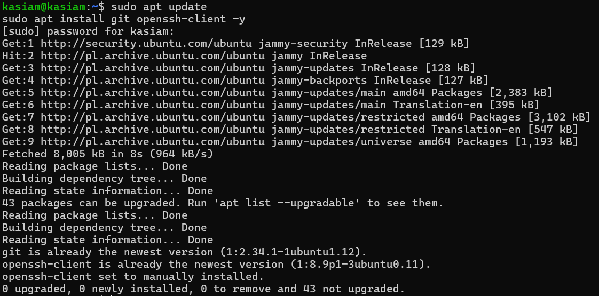

### 2. HTTPS oraz Personal access token 
a) Pierwszym krokiem jest wygenerowanie - Personal access token - na platformie Github.  
Aby to zrobić, należy przejść do sekcji - `Settings` > `Developer settings` > `Personal access token`

b) Nastepnie skopiowano link z protokołem HTTPS do repozytorium i **sklonowano** następującą komendą:
```
git clone https://github.com/InzynieriaOprogramowaniaAGH/MDO2025_INO.git
```
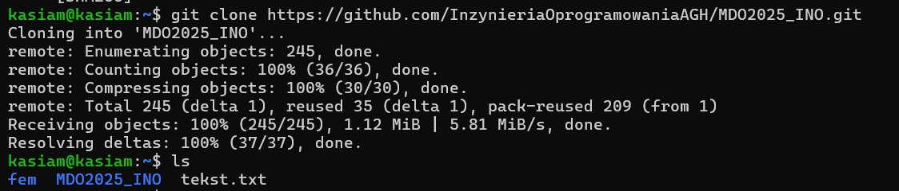

### 3. SSH 
- **Generacja kluczy**
Wygenerowano dwa różne klucze SSH: **ed25519** oraz **ecdsa** (oba zostały zabezpieczone hasłem). 
```
ssh-keygen -t ed25519 -C "your_email@example.com"
ssh-keygen -t ecdsa -b 521 -C "your_email@example.com"
```
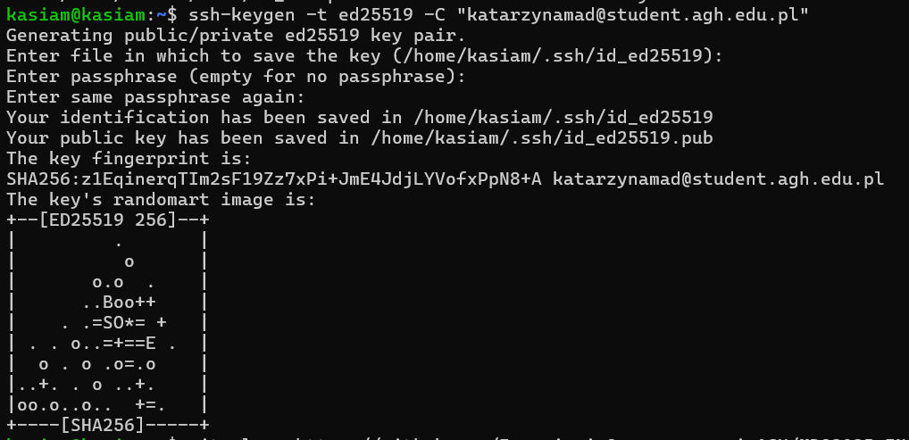
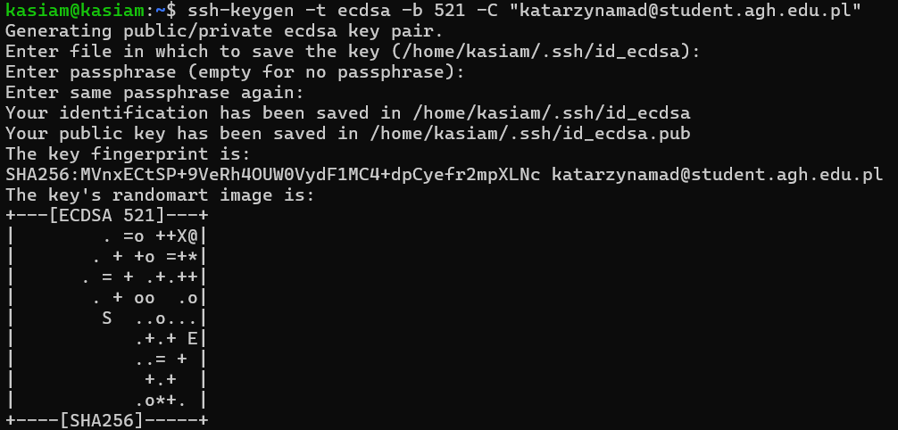
*Dodano do nich komentarz z emailem (nie jest to konieczne, ale zalecane w celu lepszej organizacji)*

- **Klonowanie z wykorzystaniem SSH**
Skopiowano zawartość pliku wcześniej wygenerowanego klucza publicznego SSH i następnie wklejono na platformie Github. 
Aby to zrobić, należy przejść do sekcji - `Settings` > `SSH and GPG keys` > `New SSH key` 
```
cat .ssh/id_ed25519.pub
```
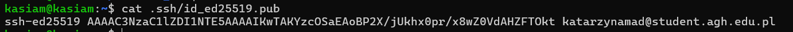
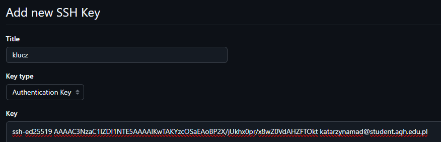

- Dzięki temu klucz SSH został dodany do GitHub, umożliwiając klonowanie repozytoriów bez potrzeby podawania hasła za każdym razem.
```
git clone git@github.com:InzynieriaOprogramowaniaAGH/MDO2025_INO.git
```
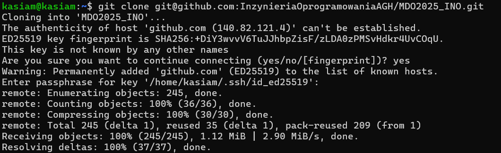

### 4. Uwierzytelnianie 2FA
Uwierzytelnianie dwuskładnikowe zostało skonfigurowane na platformie Github w celu zwiększenia bezpieczeństwa konta.
Oprócz standardowego logowania, użytkownik musi również podać drugi składnik (wybrałam sposób uwierzytelniania na wiadomość SMS).
Aby to zrobić, należy przejść do sekcji - `Settings` > `Password and authentication` > `Two-factor authentication` 
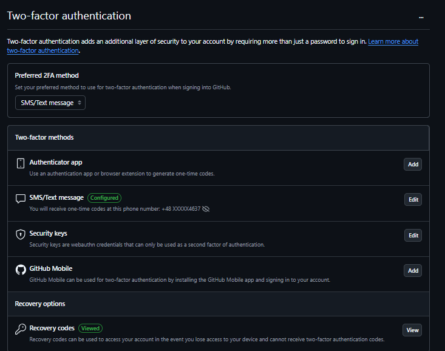

### 5. Gałęzie
- W sklonowanym repozytorium przełączono się do gałęzi *main*, a potem na gałąź mojej grupy - 5, gdzie został utworzony nowy branch - ```KM417392```
```
cd MDO2025_INO
git checout main
git checkout GCL05
git checkout -b KM417392
```
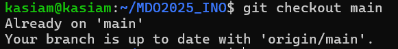


- Utworzono również nowy folder "KM417392"
```
cd ITE/GCL05/
mkdir KM417392
```
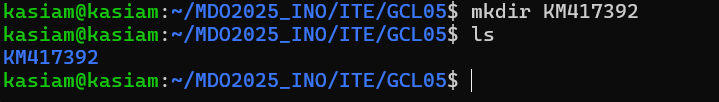

### 6. Git hook 
- Aby wymusić spójność wiadomości commitów, w folderze ```.git/hooks``` został utworzony skrypt weryfikujący, który zapewnia, że każda wiadomość commit zaczyna się od określonego prefiksu "KM417392". 
- Po utworzeniu pliku commit-msg, konieczne było nadanie mu odpowiednich uprawnień do wykonywania za pomocą polecenia chmod +x commit-msg. Dzięki temu Git wie, że ten plik może zostać wykonany jako skrypt.
```
cd ~/MDO2025_INO/.git/hooks/
nano commit-msg
chmod +x commit-msg
```
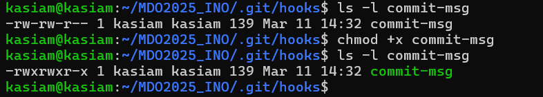

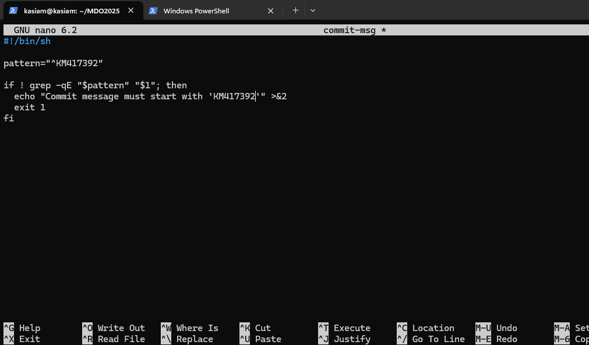
*Skrypt sprawdza, czy wiadomość commit zawiera wymagany prefiks. Jeśli nie, commit jest odrzucany z odpowiednim komunikatem.*

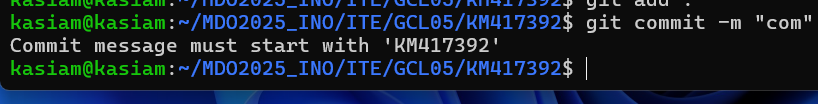
*Sprawdzenie poprawności działania*

### 7. Gałęzie cd.
- w katalogu ```KM417392``` utworzono folder "Sprawozdanie1" oraz w nim umieszczono ważne pliki (Readme.md oraz zrzuty ekranu - folder "KM")
```
mkdir Sprawozdanie1
cd Sprawozdanie1
touch Readme.md
```
- gotowe pliki dodano najpierw do staging area (aby przygotować pliki do zatwierdzenia (commitowania))
```
git add .
git status
```


- zatwierdzenie zmian z staging area do lokalnej historii repozytorium. Pliki są teraz zapisane w lokalnej gałęzi.
```
git commit -m  "KM417392: add ss"
```
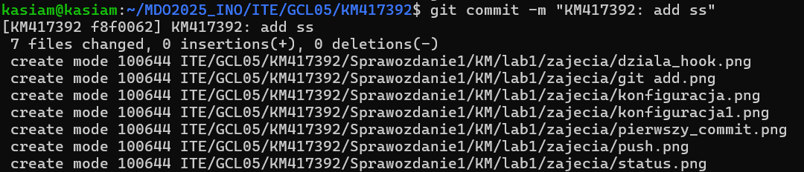

- wypchnięcie plików do zdalnego repozytorium na Githubie
```
git push origin KM417392
```
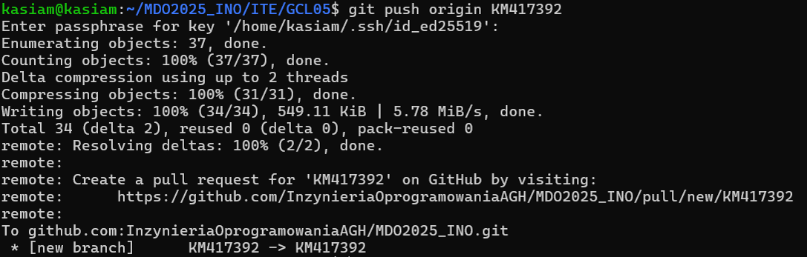

## Zajęcia 02: Git, Docker

### Wprowadzenie
Celem zajęć jest nabycie umiejętności pracy z podstawowymi funkcjonalnościami narzędzia Docker.
Gdzie Docker jest narzędziem służącym do konteneryzacji, czyli izolacji środowiska uruchomieniowego aplikacji na poziomie systemu operacyjnego.

### 1. Instalacja, Rejestracja Docker 
- w środowisku Ubuntu Server zainstalowano Docker z użyciem wersji apt 
```
sudo apt install docker.io
```


- na stronie Docker Hub zarejestrowano się oraz zapoznano z sugerowanymi obrazami
- następnie na maszynie zalogowano się na docker'a
```
docker login
```

### Obrazy 
**Obraz (Image)** to szablon, który zawiera wszystko, co jest potrzebne do uruchomienia aplikacji - system plików, zależności etc.

- Po pomyślnym logowaniu pobrano obrazy: ```hello-world```, ```busybox```, ```ubuntu```, ```mysql```
```
docker pull <nazwa-obrazu>
```
*Aby uniknąć wpisywania za każdym razem "sudo":*
```
sudo usermod -aG docker $USER
```
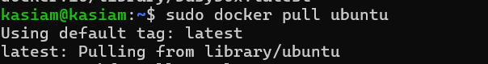
```
docker images
```
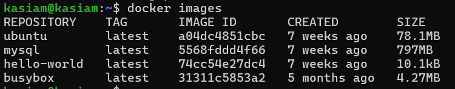
### Kontenery
**Kontener (Container)** to działający proces uruchomiony na podstawie obrazu (z jednego obrazu może powstać wiele kontenerów)
- Uruchomiono kontener z obrazu *busybox*
1) Bez podłączenia się do kontenera interaktywnie 
```
docker run busybox echo "Kontener BusyBox uruchomiony"
```
Po wykonaniu komendy *echo*, natychmiast kończy swoje działanie. Kontener się zatrzymuje.
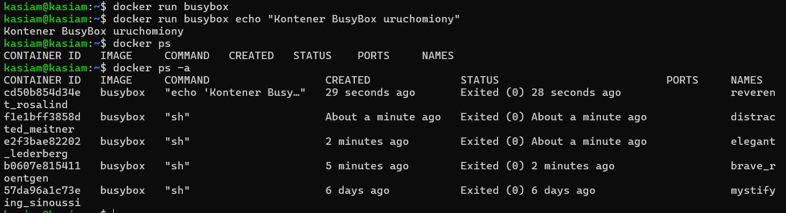

2) Z podłączeniem się do kontenera interaktywnie 
- Dzięki fladze ```-it```, użytkownik wchodzi do powłoki shell kontenera i może wykonywać polecenia wewnątrz niego.
- Tam wpisując ```busybox``` może zobaczyć na początku numer wersji, a dzięki ```ps aux``` można sprawdzić ```PID1``` (główny proces: odpowiada za uruchomienie kontenera)
i inne procesy dockera na hoście
```
docker run -it busybox sh
ps aux
```
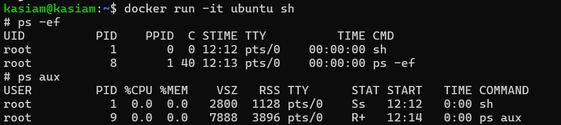

- Następnie zaktualizowano pakiety i za pomocą ```exit``` opuściło kontener.
```
apt update
apt upgrade
exit
```
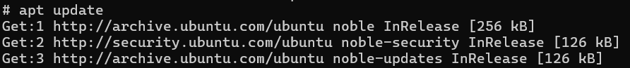
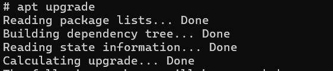

### Dockerfile
**Dockerfile** - plik konfiguracyjny, który zawiera instrukcje do automatycznego tworzenia obrazu Dockera. 
- utworzono nowy plik ```Dockerfile```, a następnie za pomocą ```build``` zbudowano nowy obraz.
```
touch Dockerfile
nano Dockerfile
docker build -t nowy_obraz .
```
*Plik Dockerfile*
- Bazowym obrazem jest najnowsza wersja systemu ubuntu,
- Aktualizuje liste pakietów, instaluje Git'a, usuwa niepotrzebne pliki tymczasowe po instalacji
- Klonuje repozytorium
- Ustanawia katalog roboczy w kontenerze na /MDO2025_INO
```
FROM ubuntu:latest

RUN apt-get update && \
    apt-get install -y git && \
    apt-get clean


RUN git clone https://github.com/InzynieriaOprogramowaniaAGH/MDO2025_INO.git

WORKDIR /MDO2025_INO

CMD ["/bin/bash"]
```
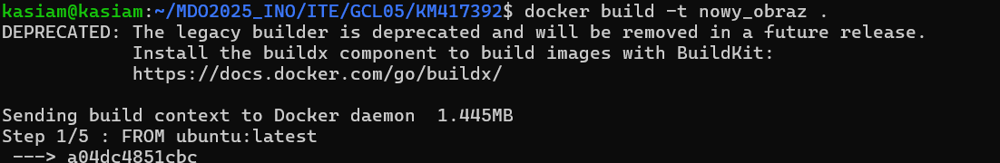
- Uruchomiono interaktywnie i sprawdzono czy jest sklonowane repozytorium
```
docker run -it nowy_obraz
docker ps -a
```
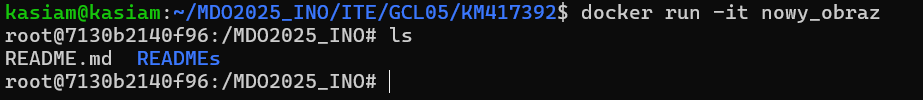

### Czyszczenie
- wyświetlenie wszystkich kontenerów(uruchomionych i zatrzymanych)
- usunięcie kontererów ```docker rm```
```
docker ps -a
docker rm $(docker ps -a -q)
```
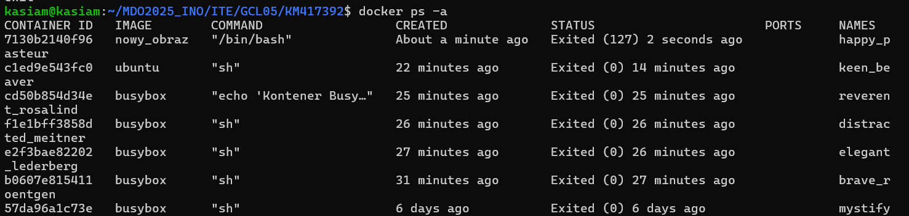
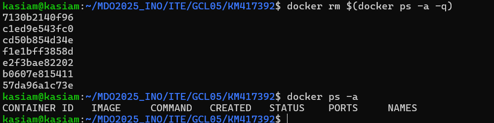
- usunięcie obrazów ```docker rmi```
```
docker rmi $(docker images -q)
docker images
``` 
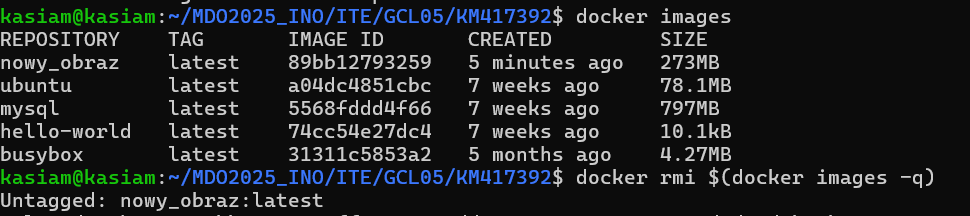


## Zajęcia 03: Dockerfiles, kontener jako definicja etapu
