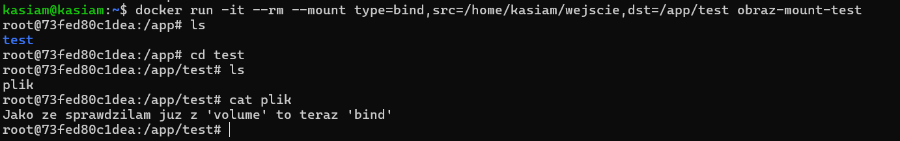
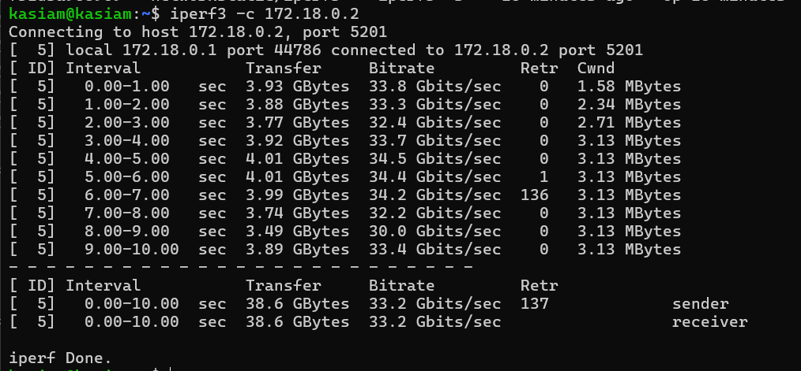

# Sprawozdanie 1 
## Zajęcia 01: Wprowadzenie, Git, Gałęzie, SSH

### Wprowadzenie 
Celem zajęć jest zapoznanie się z podstawowymi narzędziami do wersjonowania kodu, w tym systemem **Git** oraz **SSH**.
Zrealizowane zadania obejmowały instalację Git, konfigurację kluczy SSH oraz manipulację gałęziami. 
*Praca prowadzona jest na środowisku linuksowym - Ubuntu server.* 

### 1. Instalacja klienta Git i obsługa kluczy SSH 
Pracę rozpoczęto od aktualizacji informacji o dostępnych pakietach oraz instalacji Gita i pakietów zawierających narzędzia klienta SSH,
umożliwiając bezpieczne połączenie z serwerami zdalnymi przez protokół SSH. ('y' - automatycznie zatwierdza instalacje pakietów)
```
sudo apt update
sudo apt install git openssh-client -y
```


### 2. HTTPS oraz Personal access token 
a) Pierwszym krokiem jest wygenerowanie - Personal access token - na platformie Github.  
Aby to zrobić, należy przejść do sekcji - `Settings` > `Developer settings` > `Personal access token`

b) Nastepnie skopiowano link z protokołem HTTPS do repozytorium i **sklonowano** następującą komendą:
```
git clone https://github.com/InzynieriaOprogramowaniaAGH/MDO2025_INO.git
```


### 3. SSH 
- **Generacja kluczy**
Wygenerowano dwa różne klucze SSH: **ed25519** oraz **ecdsa** (oba zostały zabezpieczone hasłem). 
```
ssh-keygen -t ed25519 -C "your_email@example.com"
ssh-keygen -t ecdsa -b 521 -C "your_email@example.com"
```


*Dodano do nich komentarz z emailem (nie jest to konieczne, ale zalecane w celu lepszej organizacji)*

- **Klonowanie z wykorzystaniem SSH**
Skopiowano zawartość pliku wcześniej wygenerowanego klucza publicznego SSH i następnie wklejono na platformie Github. 
Aby to zrobić, należy przejść do sekcji - `Settings` > `SSH and GPG keys` > `New SSH key` 
```
cat .ssh/id_ed25519.pub
```


- Dzięki temu klucz SSH został dodany do GitHub, umożliwiając klonowanie repozytoriów bez potrzeby podawania hasła za każdym razem.
```
git clone git@github.com:InzynieriaOprogramowaniaAGH/MDO2025_INO.git
```


### 4. Uwierzytelnianie 2FA
Uwierzytelnianie dwuskładnikowe zostało skonfigurowane na platformie Github w celu zwiększenia bezpieczeństwa konta.
Oprócz standardowego logowania, użytkownik musi również podać drugi składnik (wybrałam sposób uwierzytelniania na wiadomość SMS).
Aby to zrobić, należy przejść do sekcji - `Settings` > `Password and authentication` > `Two-factor authentication` 


### 5. Gałęzie
- W sklonowanym repozytorium przełączono się do gałęzi *main*, a potem na gałąź mojej grupy - 5, gdzie został utworzony nowy branch - ```KM417392```
```
cd MDO2025_INO
git checout main
git checkout GCL05
git checkout -b KM417392
```


- Utworzono również nowy folder "KM417392"
```
cd ITE/GCL05/
mkdir KM417392
```


### 6. Git hook 
- Aby wymusić spójność wiadomości commitów, w folderze ```.git/hooks``` został utworzony skrypt weryfikujący, który zapewnia, że każda wiadomość commit zaczyna się od określonego prefiksu "KM417392". 
- Po utworzeniu pliku commit-msg, konieczne było nadanie mu odpowiednich uprawnień do wykonywania za pomocą polecenia chmod +x commit-msg. Dzięki temu Git wie, że ten plik może zostać wykonany jako skrypt.
```
cd ~/MDO2025_INO/.git/hooks/
nano commit-msg
chmod +x commit-msg
```


*Skrypt sprawdza, czy wiadomość commit zawiera wymagany prefiks. Jeśli nie, commit jest odrzucany z odpowiednim komunikatem.*


*Sprawdzenie poprawności działania*

### 7. Gałęzie cd.
- w katalogu ```KM417392``` utworzono folder "Sprawozdanie1" oraz w nim umieszczono ważne pliki (Readme.md oraz zrzuty ekranu - folder "KM")
```
mkdir Sprawozdanie1
cd Sprawozdanie1
touch Readme.md
```
- gotowe pliki dodano najpierw do staging area (aby przygotować pliki do zatwierdzenia (commitowania))
```
git add .
git status
```


- zatwierdzenie zmian z staging area do lokalnej historii repozytorium. Pliki są teraz zapisane w lokalnej gałęzi.
```
git commit -m  "KM417392: add ss"
```


- wypchnięcie plików do zdalnego repozytorium na Githubie
```
git push origin KM417392
```


## Zajęcia 02: Git, Docker

### Wprowadzenie
Celem zajęć jest nabycie umiejętności pracy z podstawowymi funkcjonalnościami narzędzia Docker.
Gdzie Docker jest narzędziem służącym do konteneryzacji, czyli izolacji środowiska uruchomieniowego aplikacji na poziomie systemu operacyjnego.

### 1. Instalacja, Rejestracja Docker 
- w środowisku Ubuntu Server zainstalowano Docker z użyciem wersji apt 
```
sudo apt install docker.io
```


- na stronie Docker Hub zarejestrowano się oraz zapoznano z sugerowanymi obrazami
- następnie na maszynie zalogowano się na docker'a
```
docker login
```

### Obrazy 
**Obraz (Image)** to szablon, który zawiera wszystko, co jest potrzebne do uruchomienia aplikacji - system plików, zależności etc.

- Po pomyślnym logowaniu pobrano obrazy: ```hello-world```, ```busybox```, ```ubuntu```, ```mysql```
```
docker pull <nazwa-obrazu>
```
*Aby uniknąć wpisywania za każdym razem "sudo":*
```
sudo usermod -aG docker $USER
```

```
docker images
```

### Kontenery
**Kontener (Container)** to działający proces uruchomiony na podstawie obrazu (z jednego obrazu może powstać wiele kontenerów)
- Uruchomiono kontener z obrazu *busybox*
1) Bez podłączenia się do kontenera interaktywnie 
```
docker run busybox echo "Kontener BusyBox uruchomiony"
```
Po wykonaniu komendy *echo*, natychmiast kończy swoje działanie. Kontener się zatrzymuje.


2) Z podłączeniem się do kontenera interaktywnie 
- Dzięki fladze ```-it```, użytkownik wchodzi do powłoki shell kontenera i może wykonywać polecenia wewnątrz niego.
- Tam wpisując ```busybox``` może zobaczyć na początku numer wersji, a dzięki ```ps aux``` można sprawdzić ```PID1``` (główny proces: odpowiada za uruchomienie kontenera)
i inne procesy dockera na hoście
```
docker run -it busybox sh
ps aux
```


- Następnie zaktualizowano pakiety i za pomocą ```exit``` opuściło kontener.
```
apt update
apt upgrade
exit
```


### Dockerfile
**Dockerfile** - plik konfiguracyjny, który zawiera instrukcje do automatycznego tworzenia obrazu Dockera. 
- utworzono nowy plik ```Dockerfile```, a następnie za pomocą ```build``` zbudowano nowy obraz.
```
touch Dockerfile
nano Dockerfile
docker build -t nowy_obraz .
```
*Plik Dockerfile*
- Bazowym obrazem jest najnowsza wersja systemu ubuntu,
- Aktualizuje liste pakietów, instaluje Git'a, usuwa niepotrzebne pliki tymczasowe po instalacji
- Klonuje repozytorium
- Ustanawia katalog roboczy w kontenerze na /MDO2025_INO
```
FROM ubuntu:latest

RUN apt-get update && \
    apt-get install -y git && \
    apt-get clean


RUN git clone https://github.com/InzynieriaOprogramowaniaAGH/MDO2025_INO.git

WORKDIR /MDO2025_INO

CMD ["/bin/bash"]
```

- Uruchomiono interaktywnie i sprawdzono czy jest sklonowane repozytorium
```
docker run -it nowy_obraz
docker ps -a
```


### Czyszczenie
- wyświetlenie wszystkich kontenerów(uruchomionych i zatrzymanych)
- usunięcie kontererów ```docker rm```
```
docker ps -a
docker rm $(docker ps -a -q)
```


- usunięcie obrazów ```docker rmi```
```
docker rmi $(docker images -q)
docker images
``` 


## Zajęcia 03: Dockerfiles, kontener jako definicja etapu


## Zajęcia 04: Dodatkowa terminologia w konteneryzacji, instancja Jenkins 

Do testowania wykorzystano repozytorium: https://github.com/lttr/simple-npm-webapp-starter

### Woluminy

1. Na początku stworzono plik Dockerfile - kontener bazowy, który ma:
- node.js (do budowania aplikacji)
- npm
- brak gita


i zbudowano nowy obraz:
```
docker build -t node-builder .
```
2. Następnie utworzono woluminy: ```wejsciowy``` oraz ```wyjsciowy```
```
docker volume create wejscie
docker volume create wyjscie
```


3. Uruchamiono kontener bazowy z woluminami
```
docker run -it --rm -v wejscie:/mnt/wejscie -v wyjscie:/mnt/wyjscie --name builder node-builder 
```
Po wejściu do kontenera znajduje się w '/app' i mam dostęp do `/mnt/wejscie` i `/mnt/wyjscie`


4. Sklonowano repozytorium (z zewnątrz kontenera)
```
git clone https://github.com/lttr/simple-npm-webapp-starter.git
docker run -v wejscie:/mnt/wejscie -v "$(pwd)/simple-npm-webapp-starter":/tmp/repo alpine cp -r /tmp/repo/. /mnt/wejscie
docker start -ia 8b071a78241f
```
Pliki z lokalnego katalogu ```simple-npm-webapp-starter``` zostają skopiowane do wolumenu wejscie **za pomocą kontenera** alpine. Po zakończeniu operacji kontener zostaje automatycznie usunięty.


Skopiowano zawartość plików na wolumin wyjściowy


- *Można sprawdzić zawartość kontenera z hosta*

```
docker run -v wyjscie:/mnt/wyjscie alpine ls /mnt/wyjscie
```
### Klonowanie wewnątrz kontenera
Stworzyłam do testowania dwa inne woluminny: ```input```, ```output```. 
1. Pracę rozpoczęto od stworzenia nowego Dockerfile'a z gitem
```
FROM node:20-alpine

RUN apk add --no-cache git
WORKDIR /app
CMD [ "sh" ]
```
Zbudowano nowy obraz:

```
docker build -t node-builder-git .
```
2. Uruchomiono kontener i sklonowano repozytorium wewnątrz kontenera
```
docker run -it --rm -v input:/mnt/input -v output:/mnt/output node-builder-git
git clone https://github.com/lttr/simple-npm-webapp-starter.git /mnt/input
cd /mnt/input
cp -r dist/* /mnt/output
```


### RUN --mount
1. W ramach przetestowania mozliwości RUN --mount utworzono folder ```test``` i dodano do niego "plik_testowy".

2. Napisano prosty Dockerfile
```                                                   
FROM ubuntu:latest

WORKDIR /app

RUN mkdir test
```
3. Zbuildowano nowy obraz i przetestowano
```
docker run -it --rm --volume /home/kasiam/wejscie:/app/test obraz-mount-test
docker run -it --rm --mount type=bind,src=/home/kasiam/wejscie, dst=/app/test obraz-mount-test
```



Wykorzystano ```--volume```  (uproszczona metoda montowania katalogów) oraz ```--mount```. 
Obie metody powoliły na wymiane foldery pomiędzy docker, a hostem. 

### Eksponowanie portu - serwer **iperf3**
- Pracę rozpoczęto od stworzenia sieci mostkowej(bridge) (docker domyślnie tworzy sieć typu bridge, można tyez dodać ```--driver```) o nazwie ```mynet``` 
(umożliwia kontenerom komunikację za pomocą nazw, a nie tylko adresów IP.
- Następnie uruchomiono serwer **iperf3** poprzez stworzenie nowego kontenera (```-d``` - daemon, kontener działa w tle), nadano mu nazwe ```iperf-server```
- ```--network mynet``` podłącza kontener do sieci mynet i używa obrazu ```networkstatic/iperf3```
- Uruchomienie **iperf3** w trybie klienta i łączy się z serwerem - ```-c iperf-server``` (używa nazwy kontenera, zamiast adres IP)
```
docker network create mynet
docker run -d --rm --name iperf-server --network mynet networkstatic/iperf3 -s
docker run --rm --network mynet networkstatic/iperf3 -c iperf-server
```

Zainstalowano **iperf3** na hoście i sprawdzono adres IP serwera na kontenerze.
1) Połączenie z hosta:
```
sudo apt update && sudo apt install -y iperf3
docker inspect -f '{{range .NetworkSettings.Networks}}{{.IPAddress}}{{end}}' iperf-server
iperf3 -c 172.20.0.2
```




2) Wystawienie portu iperf3 na hosta:
Poniższym poleceniem  uruchamiono kontener Docker, który działa jako serwer iperf3.
Serwer ten nasłuchuje na porcie 5201, czekając na połączenia od klientów iperf3. Dzięki temu, można testować przepustowość sieci między tym kontenerem a innymi maszynami.

```
docker run -d -p 5201:5201 networkstatic/iperf3 -s
```
kontener iperf3 działa jako serwer i nasłuchuje na porcie 5201, zarówno w kontenerze, jak i na hoście.


Logi zostały zapisane do pliku "wynik_iperf.txt"
```
docker logs iperf-server
iperf3 -c 172.19.0.2 > wynik_iperf.txt
```


### Instancja Jenkins
Zgodnie z dokumentacją, proces konfiguracji Jenkinsa za pomocą Dockera obejmuje kilka kroków, w tym tworzenie nowej sieci i woluminu, a następnie uruchomienie samego kontenera Jenkinsa. 
1. Najpierw utworzonoo osobną sieć Docker o nazwie "jenkins" dla Jenkinsa.
2. Wolumeny w Dockerze są używane do przechowywania danych, które muszą byc przechowywane niezależnie od stanu kontenera. Wolumin będzie przechowywał dane Jenkinsa
3. Ostatecznie uruchomiono kontener Docker na bazie obrazu ```jenkins/jenkins:lts```. Dodano również ```--privileged``` aby nadać uprawnienia kontenerowi.
4. W logach można było odnaleźć hasło
5. Zmapowano port 8080 kontenera na port 8080 hosta, co umożliwia dostęp do interfejsu Jenkinsa przez przeglądarkę na porcie 8080
```
docker network create jenkins
docker volume create jenkins-data
docker run -d --name jenkins-docker --rm --privileged --network jenkins -v jenkins-data:/var/jenkins_home -p 8080:8080 jenkins/jenkins:lts

docker logs jenkins-docker 
```


