# Pipeline, Jenkins, izolacja etapów
Repozytorium wykorzystane do zadań: https://github.com/mruby/mruby.git
## Przygotowanie
Zgodnie z instrukcją instalacji Jenkinsa: https://www.jenkins.io/doc/book/installing/docker/

Wykonano następujące kroki:
1. Utworzono sieć bridge dla Dockera
```
docker network create jenkins
```
2. Uruchomiono kontener z Docker-in-Docker (dind)
```
docker run \
  --name jenkins-docker \
  --rm \
  --detach \
  --privileged \
  --network jenkins \
  --network-alias docker \
  --env DOCKER_TLS_CERTDIR=/certs \
  --volume jenkins-docker-certs:/certs/client \
  --volume jenkins-data:/var/jenkins_home \
  --publish 2376:2376 \
  docker:dind \
  --storage-driver overlay2
```
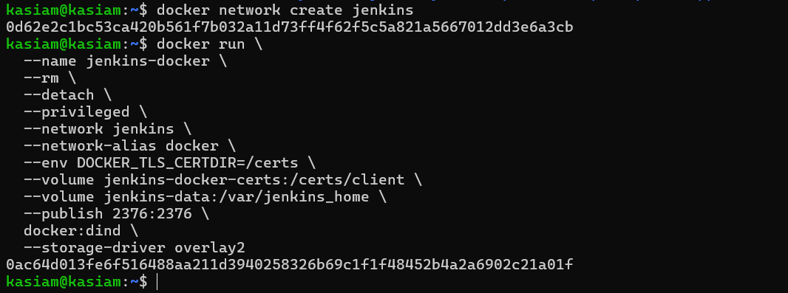

*Kontener działa jako "Docker daemon" dla Jenkinsa. Jest niezbędny, by Jenkins mógł wykonywać polecenia **docker** 

3. Stworzono własny obraz z Jenkins +  BlueOcean

a) plik Dockerfile:
```
FROM jenkins/jenkins:2.492.3-jdk17
USER root
RUN apt-get update && apt-get install -y lsb-release ca-certificates curl && \
    install -m 0755 -d /etc/apt/keyrings && \
    curl -fsSL https://download.docker.com/linux/debian/gpg -o /etc/apt/keyrings/docker.asc && \
    chmod a+r /etc/apt/keyrings/docker.asc && \
    echo "deb [arch=$(dpkg --print-architecture) signed-by=/etc/apt/keyrings/docker.asc] \
    https://download.docker.com/linux/debian $(. /etc/os-release && echo \"$VERSION_CODENAME\") stable" \
    | tee /etc/apt/sources.list.d/docker.list > /dev/null && \
    apt-get update && apt-get install -y docker-ce-cli && \
    apt-get clean && rm -rf /var/lib/apt/lists/*
USER jenkins
RUN jenkins-plugin-cli --plugins "blueocean docker-workflow"
```
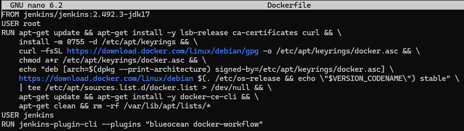
- [Dockerfile](http://github.com/InzynieriaOprogramowaniaAGH/MDO2025_INO/blob/KM417392/ITE/GCL05/KM417392/Sprawozdanie2/KM/lab5/wazne_pliki/Dockerfile)

b) budowanie obrazu:
```
docker build -t myjenkins-blueocean:2.492.3-1 .
```
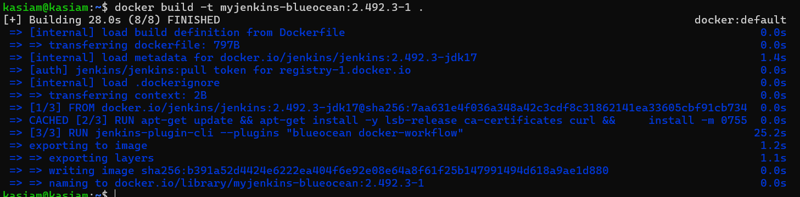

4. Uruchomiono kontener z własnym obrazem Jenkins + BlueOcean
```
docker run \
  --name jenkins-blueocean \
  --restart=on-failure \
  --detach \
  --network jenkins \
  --env DOCKER_HOST=tcp://docker:2376 \
  --env DOCKER_CERT_PATH=/certs/client \
  --env DOCKER_TLS_VERIFY=1 \
  --publish 8080:8080 \
  --publish 50000:50000 \
  --volume jenkins-data:/var/jenkins_home \
  --volume jenkins-docker-certs:/certs/client:ro \
  myjenkins-blueocean:2.492.3-1
```
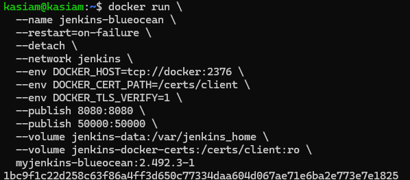

5. Jenkins jest dostępny pod adresem: http://localhost:8080

6. Po wejściu na podany adres, będzie wymagane hasło, które można uzyskać poniższą komendą:
```
sudo docker exec ${CONTAINER_ID or CONTAINER_NAME} cat /var/jenkins_home/secrets/initialAdminPassword
```

**Podsumowanie:**  
BlueOcean to nowoczesne rozszerzenie Jenkinsa, które upraszcza zarządzanie pipeline’ami i oferuje przyjazny interfejs graficzny, ale nadal bazuje na podstawowej instalacji Jenkins.


### Zadanie wstępne: uruchomienie
```Nowy projekt``` > ```Ogólny projekt``` > ```Kroki budowania``` > ```Dodaj krok budowania``` > ```Uruchom powłokę```
1. Uname - wyświetla nazwę systemu operacyjnego
```
uname -a
```
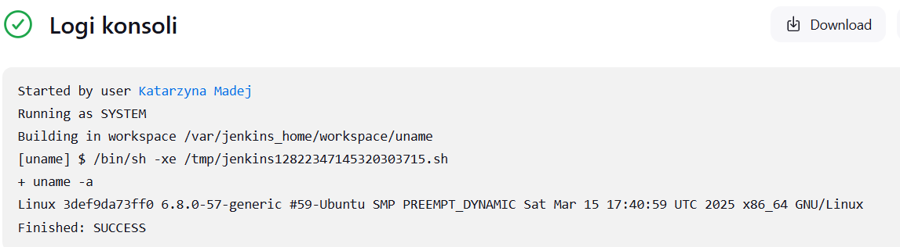

2. Hour - zwraca błąd, gdy... godzina jest nieparzysta
```
#!/bin/bash

GODZINA=$(date +%H)
echo "Aktualna godzina: $GODZINA"

if [ $((GODZINA % 2)) -ne 0 ]; then
  echo "Błąd: godzina $GODZINA jest nieparzysta."
  exit 1
else
  echo "OK: godzina $GODZINA jest parzysta."
fi
```
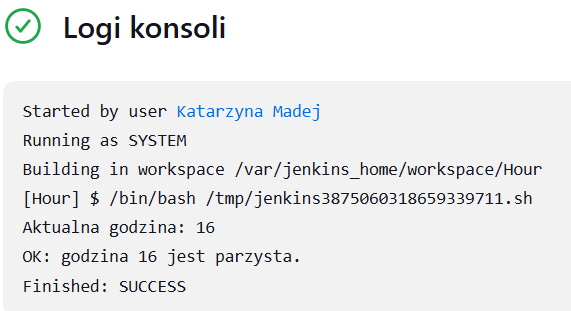

3. Obraz - pobiera obraz kontenera ```ubuntu```
```
docker pull ubuntu
```
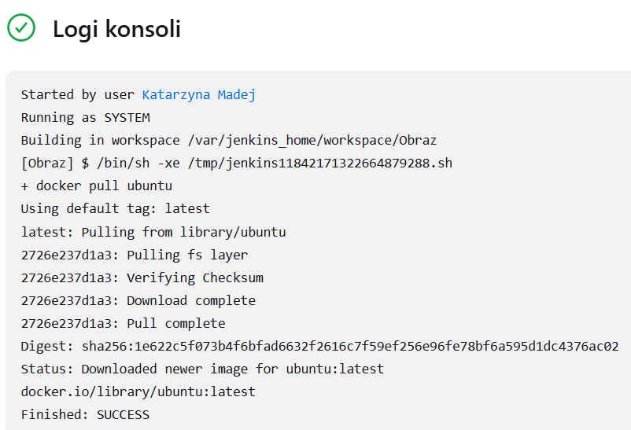

### Zadanie wstępne: obiekt typu pipeline (bez SCM)
- Sklonowano repozytorium przedmiotowe (MDO2025_INO)
- Zrobiono checkout do pliku Dockerfile (na osobistej gałęzi) właściwego dla buildera wybranego programu - mruby.
- Zbudowano Dockerfile do budowania i testowania
```
pipeline {
    agent any

    stages {
        stage('Clean') {
            steps {
                echo 'Cleaning ...'
                sh 'rm -rf MDO2025_INO'
            }
        }

        stage('Checkout') {
            steps {
                echo 'Checkout ...'
                sh 'git clone https://github.com/InzynieriaOprogramowaniaAGH/MDO2025_INO'
                dir('MDO2025_INO') {
                    sh 'git checkout KM417392'
                }
            }
        }

        stage('Build') {
            steps {
                echo 'Building ...'
                dir('MDO2025_INO/ITE/GCL05/KM417392/Sprawozdanie1/KM/lab3/lab3-wazne-pliki') {
                    sh 'docker build -f Dockerfile.build -t r-build .'
                }
            }
        }

        stage('Test') {
            steps {
                echo 'Testing ...'
                dir('MDO2025_INO/ITE/GCL05/KM417392/Sprawozdanie1/KM/lab3/lab3-wazne-pliki') {
                    sh 'docker build -f Dockerfile.test -t r-test .'
                }
            }
        }
    }
}
```

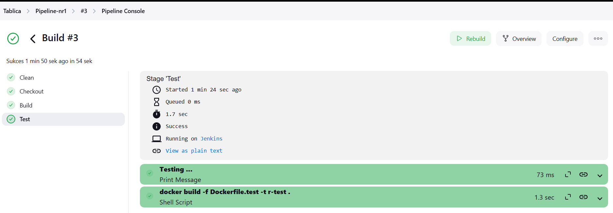
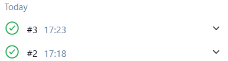

## mruby - Jenkinsfile (z SCM)
W ramach ćwiczeń wykorzystano repozytorium zawierające mruby – lekką implementację języka Ruby, przeznaczoną głównie do zastosowań wbudowanych i środowisk ograniczonych zasobowo. Projekt ten udostępnia minimalistyczne środowisko uruchomieniowe Ruby, umożliwiające wykonywanie skryptów bez potrzeby korzystania z pełnego interpretera Ruby.

Pipeline zdefiniowany w pliku Jenkinsfile został w całości dostarczony z SCM (Source Code Management) – kod repozytorium jest pobierany bezpośrednio przez etap Checkout.

### Problem interaktywnego shell'a
Domyślnym trybem działania mruby jest interaktywny shell, który po uruchomieniu oczekuje na wejście użytkownika. W kontekście automatyzacji w Jenkinsie, uruchomienie kontenera w trybie interaktywnym skutkuje zawieszeniem się pipeline'u — ponieważ proces czeka na dane wejściowe, których nigdy nie otrzyma.

### Rozwiązanie: uruchamianie z niestandardowym entrypointem
Aby obejść ten problem, zastosowano zmodyfikowany entrypoint (CMD) w obrazie Docker. Zamiast uruchamiać mruby w trybie interaktywnym, obraz został skonfigurowany tak, aby automatycznie wykonywał wskazany skrypt – script.rb. Skrypt ten jest montowany jako wolumin do katalogu /app, a następnie interpretowany przez mruby.

Dzięki temu pipeline może automatycznie uruchomić testowy skrypt w bezpieczny i przewidywalny sposób, a wynik jego działania można przechwycić do pliku (result.txt) i dalej wykorzystać w logice pipeline'u (np. do warunkowego wypychania obrazu do rejestru Docker Hub).


### Wymagania wstępne środowiska CI
Aby system CI działał poprawnie, środowisko powinno zawierać:

- Docker (z CLI dostępne dla Jenkinsa)

- Jenkins (z pluginami: Docker Pipeline, Git)

- Dostęp do repozytorium kodu (np. GitHub)

- Pliki projektowe: Jenkinsfile, Dockerfile.build, Dockerfile.deploy, script.rb

- Jenkins skonfigurowany do uruchamiania jobów z rep


### Diagram aktywności
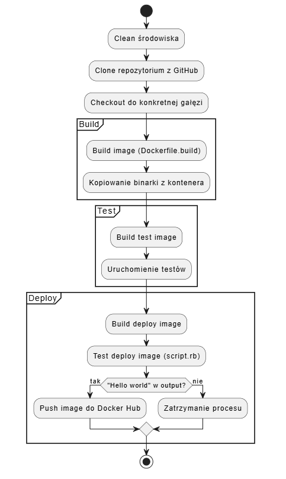


### Diagram wdrożeniowy
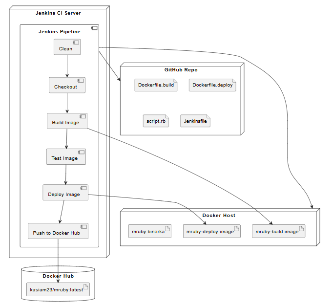


- [Dockerfile.build](https://github.com/InzynieriaOprogramowaniaAGH/MDO2025_INO/blob/KM417392/ITE/GCL05/KM417392/Sprawozdanie2/mruby-pipeline/Dockerfile.build)
- [Dockerfile.deploy](https://github.com/InzynieriaOprogramowaniaAGH/MDO2025_INO/blob/KM417392/ITE/GCL05/KM417392/Sprawozdanie2/mruby-pipeline/Dockerfile.deploy)
- [script.rb](https://github.com/InzynieriaOprogramowaniaAGH/MDO2025_INO/blob/KM417392/ITE/GCL05/KM417392/Sprawozdanie2/mruby-pipeline/script.rb)


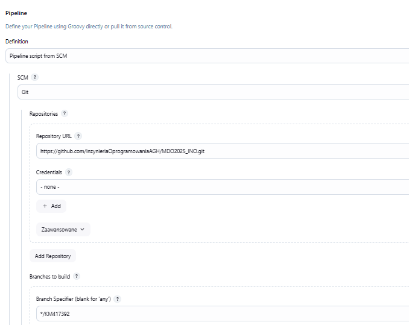

Proces automatyzacji budowania i wdrażania aplikacji mruby został zrealizowany przy użyciu narzędzia Jenkins w oparciu o wieloetapowy pipeline.

1. **Czyszczenie środowiska i pobranie kodu źródłowego**

Pipeline rozpoczyna się od etapu Clean, w którym usuwany jest lokalny katalog roboczy (rm -rf MDO2025_INO). Działanie to zapewnia, że pipeline pracuje zawsze na czystym i świeżym kodzie, bez wpływu ewentualnych pozostałości z poprzednich uruchomień. W kolejnym etapie Checkout następuje pobranie aktualnej wersji repozytorium z GitHuba wraz z przełączeniem na wybraną gałąź (KM417392). Gwarantuje to pełną kontrolę nad wersją źródła.

2. **Budowa obrazu buildowego**

W etapie Build mruby wykorzystywany jest plik Dockerfile.build, na bazie którego budowany jest tymczasowy obraz mruby-build. Obraz ten zawiera wszystkie niezbędne narzędzia (m.in. kompilator gcc, system rake, bibliotekę mruby) i pozwala na zbudowanie artefaktu w postaci binarki mruby. Następnie tworzony jest tymczasowy kontener, z którego kopiowana jest gotowa binarka do folderu mruby.deploy. Dalsze kroki nie wymagają już obecności narzędzi kompilacyjnych, co pozwala na stworzenie lekkiego, "czystego" kontenera produkcyjnego.

3. **Przygotowanie obrazu produkcyjnego z własnym CMD**

W etapie Build deploy image powstaje finalny obraz mruby-deploy, który zawiera jedynie pliki niezbędne do uruchomienia aplikacji — bez narzędzi deweloperskich czy systemów budowania(bez git, gcc etc). Najważniejszym aspektem jest tutaj modyfikacja domyślnego sposobu uruchamiania kontenera. Zamiast uruchamiania mruby w trybie interaktywnym (który zawieszałby pipeline), obraz zawiera własny CMD, który pozwala wykonać podany skrypt script.rb — montowany do kontenera jako wolumin.

Dzięki temu rozwiązaniu mruby działa w trybie batchowym i automatycznie wykonuje treść skryptu, co pozwala na sprawne testowanie i wdrażanie logiki.

4. **Test działania i warunkowe wypchnięcie do rejestru**

W etapie Test deploy image uruchamiany jest kontener na podstawie obrazu mruby-deploy, a wynik działania skryptu script.rb zapisywany jest do pliku result.txt. Pipeline następnie sprawdza, czy output zawiera oczekiwaną wartość (Hello world). Jeśli tak — uruchamiany jest etap Push image to Docker Hub, który wypycha obraz do zewnętrznego rejestru jako kasiam23/mruby:latest.

Taka konstrukcja zapewnia, że do rejestru trafią wyłącznie poprawnie zbudowane i przetestowane wersje aplikacji.


```
pipeline {
    agent any

    environment {
        IMAGE_NAME = 'kasiam23/mruby'
        IMAGE_VERSION = "${env.BUILD_NUMBER}" 
    }

    stages {
        stage('Clean') {
            steps {
                echo ' Czyszczenie środowiska roboczego...'
                sh 'rm -rf MDO2025_INO'
            }
        }

        stage('Checkout') {
            steps {
                echo ' Klonowanie repozytorium...'
                sh 'git clone https://github.com/InzynieriaOprogramowaniaAGH/MDO2025_INO'
                dir('MDO2025_INO') {
                    sh 'git checkout KM417392'
                }
            }
        }

        stage('Build mruby') {
            steps {
                echo ' Budowanie obrazu mruby-build i kompilacja...'
                dir('MDO2025_INO/ITE/GCL05/KM417392/Sprawozdanie2/mruby-pipeline') {
                    sh '''
                        docker build -f Dockerfile.build -t mruby-build .

                        echo "Tworzenie tymczasowego kontenera i kopiowanie binarki..."
                        docker create --name temp mruby-build
                        mkdir -p mruby.deploy
                        docker cp temp:/mruby/build/host/bin/mruby mruby.deploy/
                        docker rm temp

                        echo "Nadawanie uprawnień do uruchomienia binarki..."
                        chmod +x mruby.deploy/mruby
                    '''
                }
            }
        }

        stage('Test') {
            steps {
                echo 'Testing ...'
                dir('MDO2025_INO/ITE/GCL05/KM417392/Sprawozdanie1/KM/lab3/lab3-wazne-pliki') {
                    sh 'docker build -f Dockerfile.test -t r-test .'
                }
            }
        }

        stage('Build deploy image') {
            steps {
                echo ' Budowanie czystego obrazu deploy...'
                dir('MDO2025_INO/ITE/GCL05/KM417392/Sprawozdanie2/mruby-pipeline') {
                    sh 'docker build -f Dockerfile.deploy -t mruby-deploy .'
                }
            }
        }

        stage('Test deploy image') {
            steps {
                echo ' Testowanie obrazu deploy z podmontowanym script.rb...'
                dir('MDO2025_INO/ITE/GCL05/KM417392/Sprawozdanie2/mruby-pipeline') {
                    sh '''
                        docker run --rm \
                          -v $(pwd)/script.rb:/app/script.rb \
                          mruby-deploy > result.txt

                        echo " Wynik testu:"
                        cat result.txt

                        echo "Sprawdzanie, czy output zawiera 'Hello world'..."
                        grep -q "Hello world" result.txt
                    '''
                }
            }
        }

        stage('Push image to Docker Hub') {
            when {
                expression {
                    return fileExists('MDO2025_INO/ITE/GCL05/KM417392/Sprawozdanie2/mruby-pipeline/result.txt') &&
                           readFile('MDO2025_INO/ITE/GCL05/KM417392/Sprawozdanie2/mruby-pipeline/result.txt').contains('Hello world')
                }
            }
            steps {
                echo ' Wypychanie obrazu deploy na Docker Hub...'
                dir('MDO2025_INO/ITE/GCL05/KM417392/Sprawozdanie2/mruby-pipeline') {
                    sh """
                        docker tag mruby-deploy ${IMAGE_NAME}:${IMAGE_VERSION}
                        docker tag mruby-deploy ${IMAGE_NAME}:latest
                        docker push ${IMAGE_NAME}:${IMAGE_VERSION}
                        docker push ${IMAGE_NAME}:latest
                    """
                }
            }
        }
    }
}
```
- [Jenkinsfile](https://github.com/InzynieriaOprogramowaniaAGH/MDO2025_INO/blob/KM417392/ITE/GCL05/KM417392/Sprawozdanie2/KM/Jenkinsfile)


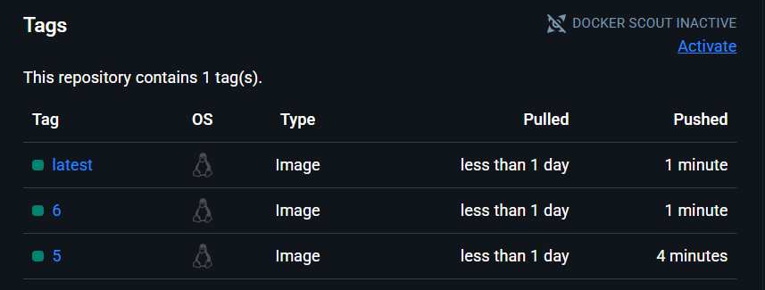
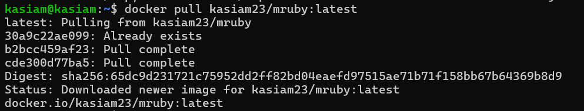

### Przykład uruchomienia:
```
docker run --rm -v $(pwd)/script.rb:/app/script.rb kasiam23/mruby:latest
```

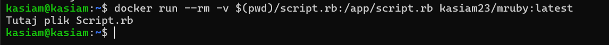


### Krok Deploy - wyjaśnienie 
Etap Deploy w pipeline został zaprojektowany z myślą o specyfice aplikacji mruby, która nie działa jak klasyczna aplikacja serwerowa, lecz jako interpreter języka skryptowego. W związku z tym, deploy nie polega na długotrwałym uruchomieniu serwisu w tle, lecz na jednorazowym wykonaniu skryptu użytkownika.

W celu realizacji tej funkcji przygotowano osobny obraz mruby-deploy, zbudowany z wykorzystaniem pliku Dockerfile.deploy(czysty kontener, nie posiadający git, gcc etc). Obraz zawiera artefakt mruby skopiowany wcześniej z obrazu buildowego oraz skonfigurowany entrypoint, który umożliwia uruchomienie podanego skryptu script.rb. Skrypt ten montowany jest do kontenera jako wolumin, co umożliwia dynamiczne testowanie i wdrażanie różnych wersji bez konieczności przebudowy obrazu.


### Krok Publish - wyjaśnienie 
Pipeline zawiera zaimplementowany krok Publish w etapie Push image to Docker Hub. Obraz mruby-deploy zostaje oznaczony odpowiednim tagiem (kasiam23/mruby:latest) (wykorzystuje i wypychany do rejestru zewnętrznego Docker Hub.
Publikacja obrazu jest warunkowa, co zwiększa niezawodność całego procesu — obraz zostaje opublikowany tylko wtedy, gdy wynik działania skryptu script.rb zawiera oczekiwaną frazę Hello world.
Podczas wypychania obrazu stosowane jest wersjonowanie oparte o zmienną środowiskową BUILD_NUMBER, wbudowaną w Jenkinsa.
Każdy pipeline generuje automatycznie unikalny numer buildu, który następnie jest używany jako tag wersji obrazu:
```
docker push ${IMAGE_NAME}:${IMAGE_VERSION}
```
Oprócz wersji specyficznej (:42, :43, itd.), obraz jest także tagowany jako latest, co pozwala łatwo odwoływać się do najnowszej wersji.

### Maintainability
Pipeline został zaprojektowany w sposób umożliwiający łatwe utrzymanie i ponowne wykorzystanie:

- Każdy etap jest niezależny – od czyszczenia, przez build i testy, aż po deploy i publish.

- Etapy build i deploy są rozdzielone, co umożliwia wymianę jednego bez wpływu na drugi.

- Build zawsze rozpoczyna się od git clone, co zapewnia pracę na aktualnym kodzie.

- Testy muszą przejść, by możliwe było wypchnięcie obrazu.

- Zawieszenie kontenera mruby jest niemożliwe dzięki zastosowaniu niestandardowego CMD.


### Podsumowanie
Proces CI/CD został zaprojektowany tak, aby kończył się powstaniem w pełni wdrażalnego artefaktu — w tym przypadku obrazu Docker mruby-deploy, zawierającego gotową do uruchomienia binarkę mruby oraz odpowiednio skonfigurowany CMD, który umożliwia wykonanie skryptów dostarczanych jako wolumin.

Obraz jest publikowany do zewnętrznego rejestru Docker Hub i może być uruchomiony na dowolnej maszynie z zainstalowanym Dockerem, bez potrzeby instalacji dodatkowych narzędzi (takich jak git, gcc, make czy środowisko CI). 
