# Zajęcia08::Automatyzacja i zdalne wykonywanie poleceń za pomocą Ansible

Prace rozpoczęto od utworzenia drugiej maszyny wirtualnej, wyposażonej w ten sam system operacyjny i tę samą wersję co "główna" maszyna — Ubuntu Server 24.04.2.
Podczas instalacji nadano maszynie hostname **ansible-target** oraz utworzono w systemie użytkownika **ansible**.

- Główna maszyna: **kasiam@kasiam**
- Dodatkowa maszyna: **ansible@ansible-target**

### Połącznie SSH

a) Ustawienie połączenia bez konieczności podawania hasła

1. Wygenerowano parę kluczy SSH bez ustawiania hasła:
```
ssh-keygen
```
2. Skopiowano klucz publiczny na maszynę docelową (ansible-target) dla użytkownika ansible:
```
ssh-copy-id ansible@IP_address
```
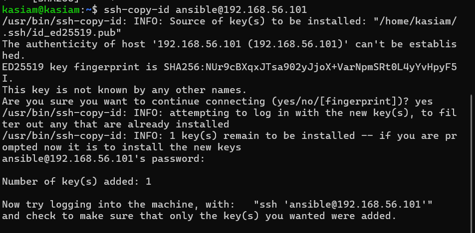

3. Następnie nawiązano połączenie z maszyną ansible-target za pomocą adresu IP:
```
ssh ansible@IP_address
```
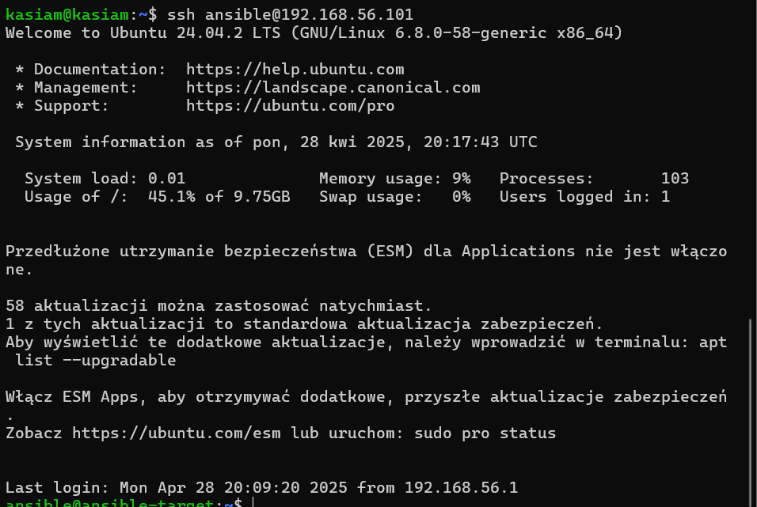

Połączenie zostało ustanowione bez potrzeby podawania hasła.

b)  Ustawienie połączenia z użyciem nazwy zamiast adresu IP

1. Zedytowano plik /etc/hosts na głównej maszynie:
```
sudo nano /etc/hosts
```


2. Dodano wpis odpowiadający maszynie docelowej:
```
IP_address   ansible-target
```
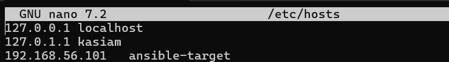

3. Połączenie z maszyną zostało nawiązane poprzez nazwę hosta:
```
ssh ansible@ansible-target
```
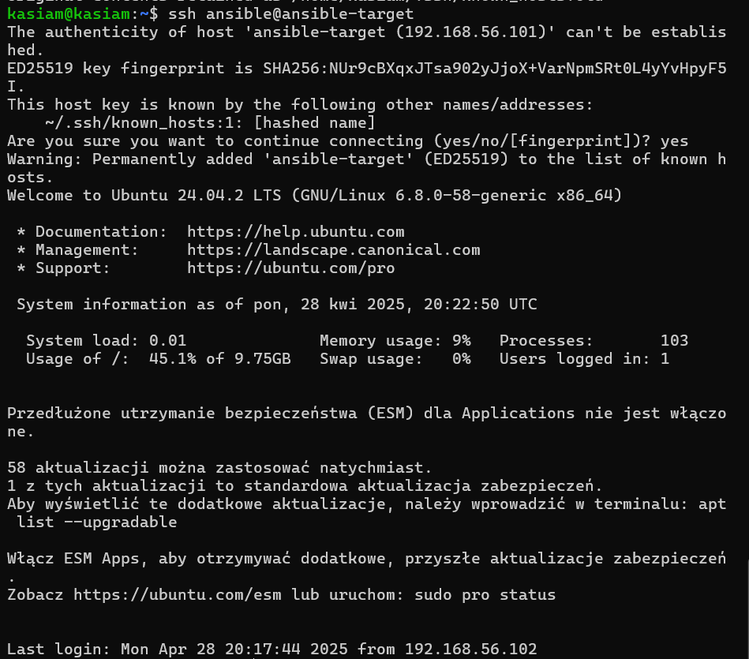

### Migawka maszyny wirtualnej
**Migawka** to pełne zapisanie stanu maszyny wirtualnej w danym momencie.
Gdy zostaje zrobiona migawka - system plików, pamięć RAM, ustawienia — wszystko zostaje "zamrożone".
Można w dowolnym momencie wrócić do tego punktu.

Warto kiedy - są robione duże zmiany i jeśli pójdzie coś nie tak -> przywracana zostaje migawka i stan maszyny jest taka jak wcześniej.

Virtualbox > ```Wybierz maszynę``` > ```Migawki``` > ```Zrób migawkę``` > ```Nadaj nazwe``` >> ```OK```
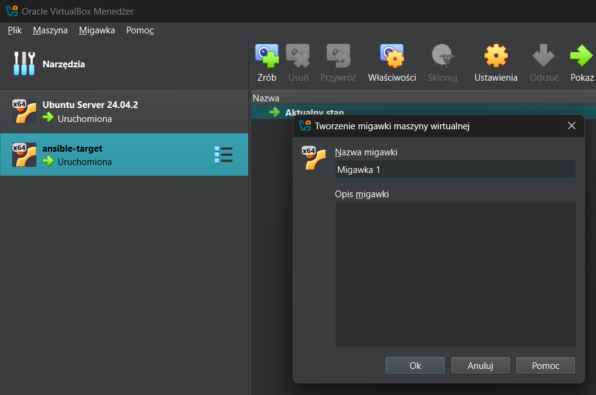
### Eskport maszyny wirtualnej
Eksport oznacza pełne spakowanie maszyny wirtualnej do jednego pliku. Działa jak "backup" lub "przenośna wersja" maszyny.
Ekportowana zostaje maszyna -> można ją potem zaimportować gdzie indziej np. na innym komputerze.

Virtualbox > ```Eksportuj jako urządzenie wirtualne``` > ```Wybierz maszynę``` 

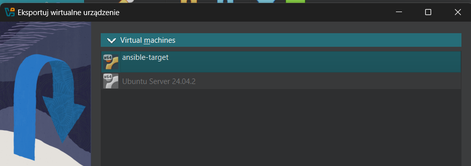

### Ansible
Na głównej maszynie wirtualnej, zainstalowano oprogramowanie Ansible
```
sudo apt install ansible -y
```
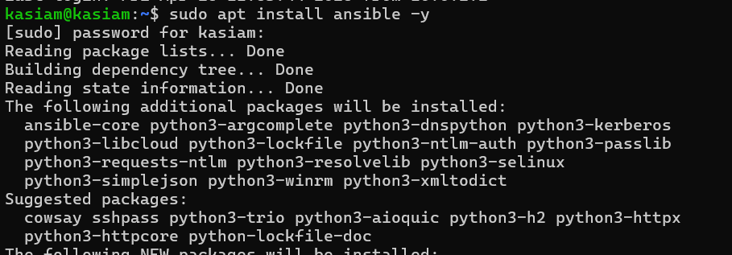
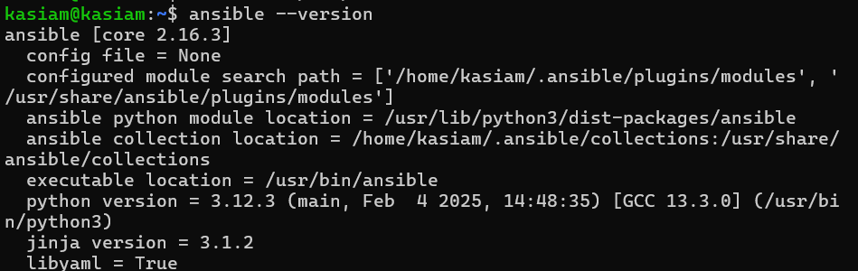

- Sprawdzono również obecność programu ```tar``` oraz ```sshd```

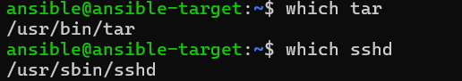

## Inwentaryzacja
W ramach przygotowania środowiska sprawdzono obecność niezbędnych narzędzi oraz dokonano inwentaryzacji systemów. Celem było umożliwienie komunikacji pomiędzy maszynami wirtualnymi za pomocą nazw hostów, a następnie przygotowanie pliku inwentaryzacyjnego dla Ansible.
### Zmiana hostname
1. Na maszynie głównej zmieniono nazwę hosta:
Warto gdy masz np. ustawioną nazwę na ```localhost``` na bardziej czytelną.
```
sudo hostnamectl set-hostname orchestrator
```
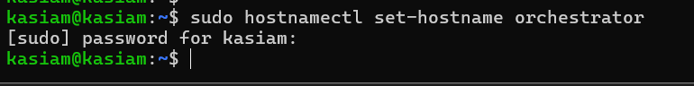
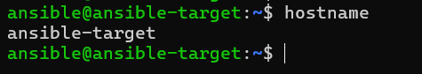
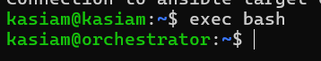

### Konfiguracja nazw DNS
(Wcześniej również był wspomniany ten temat)
1. Aby umożliwić komunikację za pomocą nazw zamiast adresów IP, zmodyfikowano plik /etc/hosts, dodając odpowiednie wpisy:
```
sudo nano /etc/hosts
```
2. Dodano linie mapujące IP na nazwy hostów:
```
IP_address_1   orchestrator
IP_address_2   ansible-target
```
### Weryfikacja łączności
Zweryfikowano poprawność komunikacji z maszyną ansible-target za pomocą polecenia ping:
```
ping ansible-target 
```
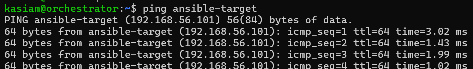

### Przygotowanie pliku inwentaryzacji Ansible
Stworzono plik inventory.yml z podziałem na grupy:

- Orchestrators – zawiera maszynę główną.
- Endpoints – zawiera maszyny docelowe zarządzane przez Ansible.

1) Plik **inventory.yml**:
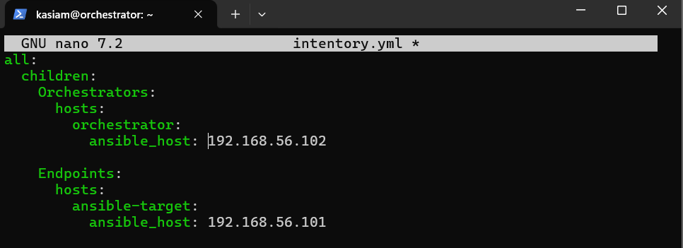

- Wysłano polecenie ping do wszystkich maszyn zdefiniowanych w pliku inventory.yml
```
ansible all -i inventory.yml -u ansible -m ping
```
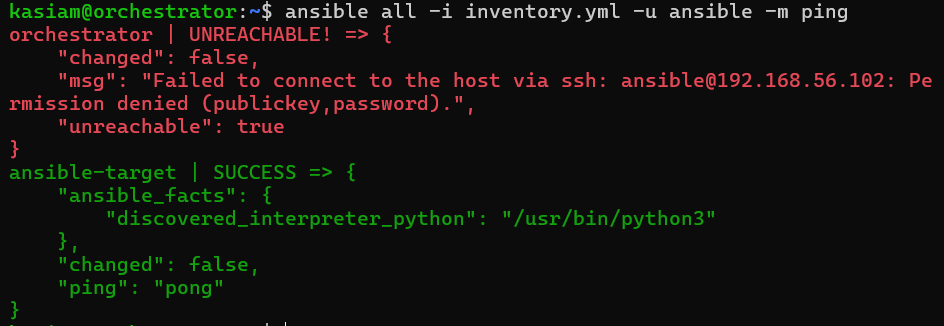

Ansible nawiązał połączenie z ansible-target. Pojawił się błąd przy próbie połączenia z orchestrator, co jest normalne — użytkownik ansible nie istnieje lub nie ma odpowiedniej konfiguracji SSH na maszynie orchestrator.

2) Plik **inventory.yml** - Wysyłanie zapytania ping tylko do grupy Endpoints
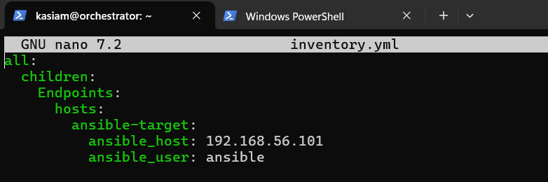

```
ansible Endpoints -i inventory.yml -m ping
```
Aby uniknąć problemu z orchestrator, przetestowano połączenie wyłącznie z maszynami docelowymi (Endpoints)
- wysłanie zapytania ping

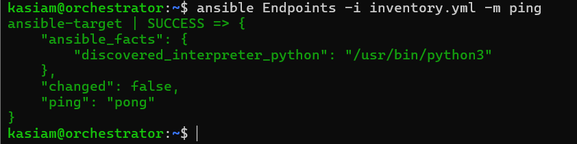

Ansible skutecznie połączył się z maszynami z grupy Endpoints, co potwierdza prawidłową konfigurację środowiska.

# Zajęcia09::Kickstart

## Automatyzacja instalacji Fedory z wykorzystaniem Kickstart
### 1. Pobranie i przygotowanie środowiska
Pracę rozpoczęto od pobrania instalatora sieciowego Fedora NetInstall i zainstalowania maszyny wirtualnej na VirtualBox.
### 2. Sprawdzenie pliku odpowiedzi Anaconda
Po zakończeniu instalacji przełączono się na konto roota i sprawdzono zawartość katalogu domowego roota:
```
sudo su
ls -l /root
```


Można zauważyć, że instalator Anaconda automatycznie generuje plik odpowiedzi ```anaconda-ks.cfg```.
Plik ten zawiera wszystkie odpowiedzi na pytania, które były udzielane ręcznie podczas procesu instalacji.
Dzięki temu można go wykorzystać do stworzenia maszyny wzorcowej i przyspieszenia wdrażania systemu na wielu maszynach bez konieczności każdorazowego przechodzenia przez cały proces instalacji.

### 3. Modyfikacja pliku KickStart 
Plik został dodany do repozytorium, delikatnie go zmodyfikowano:
- dodano konfigurację źródeł repozytoriów:
```
url --mirrorlist=http://mirrors.fedoraproject.org/mirrorlist?repo=fedora-38&arch=x86_64
repo --name=update --mirrorlist=http://mirrors.fedoraproject.org/mirrorlist?repo=updates-released-f38&arch=x86_64
``` 
- zapewniono, że zawsze będzie formatować całość
```
clearpart --all
```
- ustawiono hostname na inny niż domyślny ```localhost```
```
network --hostname=kickstart.local
```
### 4. Automatyczna instalacja z użyciem Kickstart 
Następnie stworzono nową maszynę wirtualną, korzystając z wcześniej pobranego obrazu ISO Fedora Server.

Zamiast standardowego rozpoczęcia instalacji:

1. Na ekranie wyboru GRUB naciśnięto klawisz ```e``` w celu edycji parametrów rozruchu.
2. Dodano na końcu linii zaczynającej się od linux parametr:
```
inst.ks=https://raw.githubusercontent.com/InzynieriaOprogramowaniaAGH/MDO2025_INO/KM417392/ITE/GCL05/KM417392/Sprawozdanie3/kickstart/anaconda-ks.cfg
```

3. Następnie naciśnięto kombinację klawiszy ```Ctrl``` + ```X```, co uruchomiło instalator z podanym plikiem odpowiedzi.

Instalator automatycznie rozpoczął instalację zgodnie z przepisami zawartymi w pliku Kickstart.


# Zajęcia10::Wdrażanie na zarządzalne kontenery: Kubernetes (1)
## Instalacja klastra Kubernetes
```
curl -LO https://storage.googleapis.com/minikube/releases/latest/minikube_latest_amd64.deb
sudo dpkg -i minikube_latest_amd64.deb
```
## Uruchomienie Kubernates
```
minikube start
```

### Uruchomienie Dashboard
```
minikube dashboard
```


*Polecane w VS, z powodu automatycznego przekierowywania portów*


### Zaopatrzenie w polecenie ```kubectl```  w wariancie minikube
```
alias kubectl="minikube kubectl --"
```


## Analiza posiadanego kontenera
### Projekt Deploy to cloud

**Wymagania:**
- pracuje w tle (nie kończy się od razu),
- udostępnia funkcjonalność przez sieć,
- może być wdrożona jako serwis.

Obraz ```kasiam23/mruby``` został zbudowany w ramach pipeline'u jako kontener zawierający interpreter języka mruby oraz predefiniowany skrypt (script.rb). Chociaż obraz poprawnie wykonuje swoje zadanie (uruchamia skrypt i zwraca wynik), to nie spełnia wymagań zadania „Deploy do chmury”, ponieważ:

- Kontener z mruby uruchamia skrypt i natychmiast kończy działanie. W Kubernetes prowadzi to do

  a) Podu o statusie ```Completed``` zamiast ```Running```

  b) Braku możliwości trwałego udostępniania aplikacji jako serwisu

- Aplikacja nie udostępnia funkcjonalności przez sieć

  a) Obraz kasiam23/mruby nie otwiera żadnego portu ani nie oferuje interfejsu HTTP/API, który można by wystawić jako usługę (Service) w Kubernetes.

  b) Nie można użyć kubectl port-forward

  c) kubectl expose nie ma zastosowania

  d) Brak możliwości komunikacji z aplikacją po HTTP
---
  ## Test - deploy i analiza własnego obrazu - ```kasiam23/mruby```
  1. Etap 1 - przygotowanie skryptu ```script.rb```
     ```
     puts "Hello world
     ```
  Skrypt został zamieniony na ConfigMap, aby mógł zostać zamontowany do kontenera jako plik:
  ```
  kubectl create configmap mruby-script --from-file=script.rb
  ```
   
  
  2. Etap 2 - uruchomienie Poda z własnym obrazem
     Stworzono plik mruby-pod.yaml, który definiował pojedynczy Pod uruchamiający kontener kasiam23/mruby:latest i wykonujący skrypt script.rb:

  

Zastosowano go komendą: 
  ```
  kubectl apply -f mruby-pod.yaml
  ```

  3. Etap 3 - Weryfikacja
     Po uruchomieniu Poda:
     ```
     kubectl get pods
     ```
  
     Logi z Poda:
     ```
     kubectl logs kasiam-app
     ```
  

---


