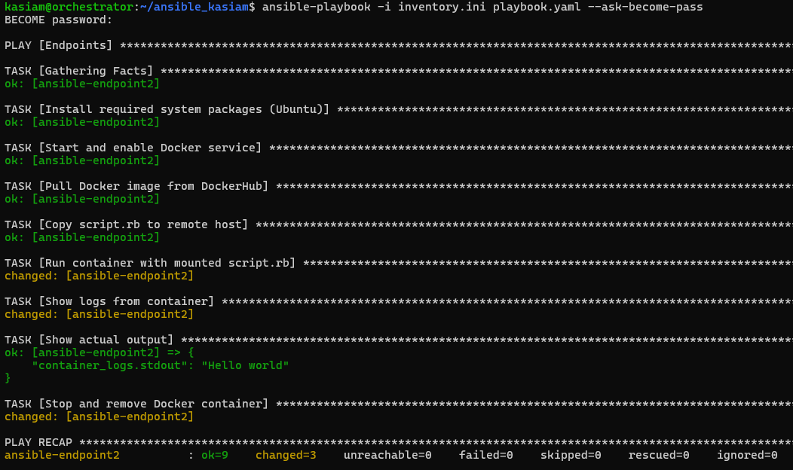
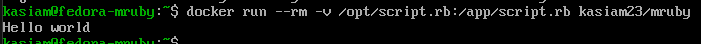
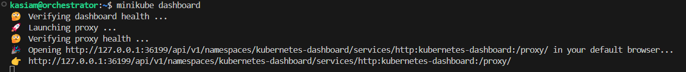
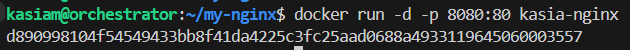
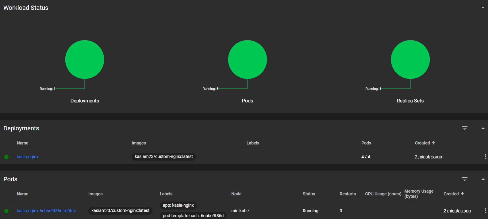
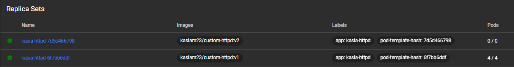

# Zajęcia08::Automatyzacja i zdalne wykonywanie poleceń za pomocą Ansible

## Instalacja zarządcy Ansible
### 1. Utworzenie drugiej maszyny wirtualnej
Prace rozpoczęto od utworzenia drugiej maszyny wirtualnej, wyposażonej w ten sam system operacyjny i tę samą wersję co "główna" maszyna — Ubuntu Server 24.04.2.
Podczas instalacji nadano maszynie hostname **ansible-target** oraz utworzono w systemie użytkownika **ansible**.

- Główna maszyna: **kasiam@kasiam**
- Dodatkowa maszyna: **ansible@ansible-target**

### 2. Konfiguracja połączenia SSH (bez hasła)
a) Połączenie za pomocą adresu IP

1. Wygenerowanie pary kluczy SSH
```
ssh-keygen
```

2. Skopiowanie klucza publicznego na maszynę ```ansible-target```
```
ssh-copy-id ansible@IP_address
```


3. Połączenie przez SSH bez hasła
```
ssh ansible@IP_address
```

<a name="połączenie-z-użyciem-nazwy-hosta"></a>

b) Połączenie z użyciem nazwy hosta

1. Edycja pliku ```/etc/hosts```
```
sudo nano /etc/hosts
```


2. Dodanie wpisu:
```
IP_address   ansible-target
```


3. Test połączenia
```
ssh ansible@ansible-target
```


### 3. Migawka maszyny wirtualnej
Migawka zapisuje pełny stan maszyny (RAM, pliki, ustawienia). Przydatna przed wprowadzeniem większych zmian.

**Kroki (VirtualBox):**

```Wybierz maszynę``` > ```Migawki``` > ```Zrób migawkę``` > ```Nadaj nazwe``` > ```OK```


### 4. Eksport maszyny wirtualnej
Eksport umożliwia przeniesienie maszyny (backup).

**Kroki (VirtualBox):**

```Eksportuj jako urządzenie wirtualne``` > ```Wybierz maszynę``` 


### 5. Instalacja Ansible 
Na maszynie głównej zainstalowano Ansible 
```
sudo apt install ansible -y
```

```
ansible --version
```


### 6. Weryfikacja narzędzi 
Sprawdzono obecność wymaganych programów ``` tar``` oraz ```sshd```
```
which tar
which sshd
```


## Inwentaryzacja 
### 1. Ustawienie nazw hostów
Na głównej maszynie zmieniono nazwę hosta na ```orchestrator```

**Przed:**
```
sudo hostnamectl set-hostname orchestrator
```


**Po :**
```
exec bash
```


Na dodatkowej maszynie hostname pozostał taki sam jak przy instalacji maszyny ```ansible-target```
```
hostname
```


### 2. Konfiguracja nazw DNS (plik ```/etc/hosts```)
Aby umożliwić rozpoznawianie nazw hostów zamiast korzystania z adresów IP 

(Szczegóły: [Połączenie z użyciem nazwy hosta](#połączenie-z-użyciem-nazwy-hosta))


1. Zmodyfikowano plik  ```/etc/hosts```
```
sudo nano /etc/hosts
```
2. Dodano wpisy przypisujące IP do nazw hostów
```
IP_address_1   orchestrator
IP_address_2   ansible-target
```
### 3. Weryfikacja łączności
Sprawdzono możliwość komunikacji między naszynami za pomocą polecenia ```ping```
```
ping ansible-target
```


### 4. Przygotowanie pliku inwentaryzacyjnego Ansible
Utworzono plik ```inventory.yml``` z podziałem na grupy maszyn:

* ```Orchestrators``` - zawiera maszynę główną (zarządzającą)
* ```Endpoints``` - zawiera maszyny docelowe (zarządzane przez Ansible)

Zawartość pliku ```inventory.yml```
```
all:
  children:
    Orchestrators:
      hosts:
        orchestrator:
          ansible_host: 127.0.0.1
          ansible_user: ansible

    Endpoints:
      hosts:
        ansible-target:
          ansible_host: 192.168.56.102
          ansible_user: ansible
        ansible-endpoint2:
          ansible_host: ansible-endpoint2
          ansible_user: ansible
```

### 5. Test połączenia (Ansible ping)

a) Ping do wszystkich maszyn:
```
ansible all -i inventory.yml -m ping
```


b) Ping tylko do grupy ```Endpoints```:
```
ansible Endpoints -i inventory.yml -m ping
```


Wszystkie maszyny odpowiedziały komunikatem pong, co oznacza, że połączenie zostało nawiązane pomyślnie:

* orchestrator (localhost przez SSH)

* ansible-target

* ansible-endpoint2

*Dodatkowo wypróbowano plik ```inventory.ini```*
```
[Orchestrators]
orchestrator ansible_host=127.0.0.1 ansible_user=ansible

[Endpoints]
ansible-target ansible_host=192.168.56.102 ansible_user=ansible
ansible-endpoint2 ansible_host=192.168.56.103 ansible_user=ansible
```

## Zdalne wywoływanie procedur
Zadanie zostało wykonane z użyciem narzędzia Ansible oraz wcześniej przygotowanego pliku ```inventory.ini```. Operacje były wykonywane z maszyny głównej (orchestrator) i obejmowały wszystkie maszyny wchodzące w skład grupy ```all```.

### 1. Struktura playbooka
Przygotowano playbook playbook.yaml, który automatyzuje następujące kroki:

* Sprawdzenie dostępności wszystkich maszyn (ping),

* Skopiowanie pliku inwentaryzacji inventory.ini na zdalne maszyny (do katalogu /tmp/),

* Zdalna aktualizacja wszystkich pakietów systemowych z użyciem apt,

* Restart wybranych usług (ssh, rng-tools-debian).
```
- hosts: all
  become: yes
  tasks:
    - name: Ping machines
      ansible.builtin.ping:

    - name: Copy inventory file
      ansible.builtin.copy:
        src: ./inventory.ini
        dest: /tmp/inventory.ini

    - name: Update all packages
      ansible.builtin.apt:
        name: "*"
        state: latest
        update_cache: yes

    - name: Restart ssh and rng-tools if present
      ansible.builtin.systemd:
        name: "{{ item }}"
        state: restarted
      loop:
        - ssh
        - rng-tools-debian
```
### Uruchomienie playbooka
Playbook został uruchomiony z poleceniem
```
ansible-playbook -i inventory.ini playbook.yaml --ask-become-pass
```
Dzięki zastosowaniu ```--ask-become-pass```, Ansible mógł wykonać operacje wymagające uprawnień administratora (sudo) na zdalnych hostach.

### Próba 1


W podsumowaniu pojawił się failed=1 na każdej maszynie, ponieważ playbook próbował zrestartować usługę rngd, która nie była dostępna. Nie wpłynęło to jednak na wykonanie wcześniejszych zadań, które zakończyły się powodzeniem (changed=3).

Zainstalowano dodatkowo ```rngd``` na maszynach
```
sudo apt install rng-tools -y
```


### Próba 2


Playbook został wykonany poprawnie na wszystkich maszynach.

Warto zauważyć, że przy ponownym uruchomieniu playbooka różnica widoczna jest w statusach zadań: zadania takie jak ```Gathering Facts```, ```Ping machines```, ```Copy inventory file``` oraz ```Update all packages``` nie powodują już zmian (changed=0), ponieważ ich działanie nie wprowadza nowych modyfikacji, gdy konfiguracja systemu jest już zgodna z oczekiwaną. 


### Operacja względem maszyny z wyłączonym serwerem SSH i odłączoną kartą sieciową

1. Wyłączenie serwera SSH
Na maszynie ```ansible-target``` wykonano
```
sudo systemctl stop ssh.socket
sudo systemctl stop ssh
```


Spowodowało to dezaktywację usługi ```sshd``` oraz mechanizmu automatycznego nasłuchiwania (ssh.socket). W rezultacie, podczas kolejnego uruchomienia playbooka, Ansible nie był w stanie nawiązać połączenia z hostem i oznaczył go jako ```UNREACHABLE```.

2. Odłączenie interfejsu sieciowego

Następnie, aby zasymulować całkowitą niedostępność sieci, wykonano
```
sudo ip link set enp0s8 down
```


Po odłączeniu interfejsu sieciowego ponownie uruchomiono playbooka. W tym przypadku, przy pierwszym zadaniu (Gathering Facts), Ansible próbował nawiązać połączenie z hostem, jednak brak odpowiedzi powodował widoczne „zawieszenie się” procesu.

## Zarządzanie stworzonym artefaktem
W moim pipeline'ie Jenkinsowym tworzony był obraz kontenera zawierający zbudowany interpreter mruby. Obraz ten, po pozytywnym przejściu testów, był wypychany na Docker Hub pod nazwą: ```kasiam23/mruby:latest```

### 1. Struktura playbooka

Na potrzeby tego zadania przygotowałam playbook Ansible, którego celem jest automatyczne pobranie i uruchomienie tego kontenera na zdalnej maszynie. Struktura playbooka obejmuje:

1. Instalację Dockera oraz zależności (python3-docker)

2. Pobranie obrazu kasiam23/mruby z Docker Hub

3. Wysłanie pliku script.rb (zawierającego prosty kod Ruby: puts "Hello world")

4. Uruchomienie kontenera z zamontowanym skryptem script.rb pod ścieżką /app/script.rb

5. Odczyt logów z działania kontenera w celu weryfikacji, czy interpreter mruby wykonał skrypt poprawnie

6. Zatrzymanie i usunięcie kontenera

```
- hosts: Endpoints
  become: yes
  vars:
    image_name: kasiam23/mruby
    container_name: mruby-app
    script_path: /tmp/script.rb

  tasks:
    - name: Install required system packages (Ubuntu)
      ansible.builtin.apt:
        name:
          - docker.io
          - python3-pip
          - python3-docker
        state: present
        update_cache: yes

    - name: Start and enable Docker service
      ansible.builtin.service:
        name: docker
        state: started
        enabled: yes

    - name: Pull Docker image from DockerHub
      ansible.builtin.docker_image:
        name: "{{ image_name }}"
        source: pull

    - name: Copy script.rb to remote host
      ansible.builtin.copy:
        src: ./script.rb
        dest: "{{ script_path }}"
        mode: '0644'

     - name: Run container with mounted script.rb
      ansible.builtin.docker_container:
        name: "{{ container_name }}"
        image: "{{ image_name }}"
        state: started
        volumes:
          - "{{ script_path }}:/app/script.rb"
        auto_remove: no
        detach: no

    - name: Show logs from container
      ansible.builtin.command: docker logs {{ container_name }}
      register: container_logs

    - name: Show actual output
      debug:
        var: container_logs.stdout

    - name: Stop and remove Docker container
      ansible.builtin.docker_container:
        name: "{{ container_name }}"
        state: absent
        force_kill: yes
```
### 2. Weryfikacja działania
Po uruchomieniu kontenera za pomocą Ansible, logi wskazywały, że skrypt został wykonany poprawnie, a output zawierał: ``` Hello world ```.



## Szkieletowanie ```ansible-galaxy```
W celu uporządkowania i ustandaryzowania kodu Ansible, zastosowano szkieletowanie roli za pomocą polecenia:
```
ansible-galaxy init nazwa_roli
```


Polecenie to automatycznie utworzyło strukturę katalogową roli, umożliwiając rozdzielenie kodu na logiczne komponenty.

1. W folderze ```tasks/main.yml``` umieszczono zadania związane z:
```
---
- name: Install required system packages (Ubuntu)
  ansible.builtin.apt:
    name:
      - docker.io
      - python3-pip
      - python3-docker
    state: present
    update_cache: yes

- name: Start and enable Docker service
  ansible.builtin.service:
    name: docker
    state: started
    enabled: yes

- name: Pull Docker image from DockerHub
  ansible.builtin.docker_image:
    name: "{{ image_name }}"
    source: pull

- name: Copy script.rb to remote host
  ansible.builtin.copy:
    src: script.rb
    dest: "{{ script_path }}"
    mode: '0644'

- name: Run container with mounted script.rb
  ansible.builtin.docker_container:
    name: "{{ container_name }}"
    image: "{{ image_name }}"
    volumes:
      - "{{ script_path }}:/app/script.rb"
    state: started
    auto_remove: no
    detach: no

- name: Show logs from container
  ansible.builtin.command: docker logs {{ container_name }}
  register: container_logs

- name: Show output
  debug:
    var: container_logs.stdout

- name: Stop and remove Docker container
  ansible.builtin.docker_container:
    name: "{{ container_name }}"
    state: absent
    force_kill: yes

```
2. W folderze ```defaults/main.yml``` zapisano zmienne domyślne używane w roli, takie jak:
```
image_name: kasiam23/mruby
container_name: mruby-app
script_path: /tmp/script.rb
```
3. W folderze ```files/``` umieszczono skrypt ```script.rb```, który został automatycznie przesłany na zdalny serwer przez rolę. Skrypt ten był uruchamiany wewnątrz kontenera przy użyciu interpretera mruby.

Zastosowanie szkieletu roli znacząco poprawiło czytelność kodu i pozwoliło na ponowne wykorzystanie logicznych komponentów. Całość została zintegrowana w playbooku głównym:

```
- hosts: Endpoints
  become: yes
  roles:
    - deploy_mruby
```


# Zajęcia09::Pliki odpowiedzi dla wdrożeń nienadzorowanych

## Automatyzacja instalacji Fedory z wykorzystaniem Kickstart
### 1. Pobranie i przygotowanie środowiska
Pracę rozpoczęto od pobrania instalatora sieciowego Fedora NetInstall i zainstalowania maszyny wirtualnej na VirtualBox.
### 2. Sprawdzenie pliku odpowiedzi Anaconda
Po zakończeniu instalacji przełączono się na konto roota i sprawdzono zawartość katalogu domowego roota:
```
sudo su
ls -l /root
```


Można zauważyć, że instalator Anaconda automatycznie generuje plik odpowiedzi ```anaconda-ks.cfg```.

Plik ten zawiera wszystkie odpowiedzi na pytania, które były udzielane ręcznie podczas procesu instalacji.
Dzięki temu można go wykorzystać do stworzenia maszyny wzorcowej i przyspieszenia wdrażania systemu na wielu maszynach bez konieczności każdorazowego przechodzenia przez cały proces instalacji.

### 3. Modyfikacja pliku KickStart 
Plik został dodany do repozytorium, delikatnie go zmodyfikowano:
- dodano konfigurację źródeł repozytoriów:
```
url --mirrorlist=http://mirrors.fedoraproject.org/mirrorlist?repo=fedora-41&arch=x86_64
repo --name=update --mirrorlist=http://mirrors.fedoraproject.org/mirrorlist?repo=updates-released-f41&arch=x86_64
``` 
- zapewniono, że zawsze będzie formatować całość
```
clearpart --all --initlabel
```
- ustawiono hostname na inny niż domyślny ```localhost```
```
network --hostname=fedora-mruby.local
```
### 4. anaconda-ks.cfg
```
# Generated by Anaconda 41.35
# Generated by pykickstart v3.58
#version=DEVEL

# Keyboard layouts
keyboard --vckeymap=pl --xlayouts='pl'
# System language
lang pl_PL.UTF-8

# Network information
network  --bootproto=dhcp --device=enp0s3 --ipv6=auto --activate
network  --hostname=fedora-mruby.local

%packages
@^server-product-environment

%end

# Run the Setup Agent on first boot
firstboot --enable

url --mirrorlist=http://mirrors.fedoraproject.org/mirrorlist?repo=fedora-41&arch=x86_64
repo --name=update --mirrorlist=http://mirrors.fedoraproject.org/mirrorlist?repo=updates-released-f41&arch=x86_64

# Generated using Blivet version 3.11.0
ignoredisk --only-use=sda
autopart
# Partition clearing information
clearpart --none --initlabel

# System timezone
timezone Europe/Warsaw --utc

#Root password
rootpw haslo123 --plaintext
user --groups=wheel --name=kasiam --password=haslo123 --plaintext --gecos="kasiam"

reboot
```

### 5. Automatyczna instalacja z użyciem Kickstart 
Następnie stworzono nową maszynę wirtualną, korzystając z wcześniej pobranego obrazu ISO Fedora Server.

Zamiast standardowego rozpoczęcia instalacji:

1. Na ekranie wyboru GRUB naciśnięto klawisz ```e``` w celu edycji parametrów rozruchu.
2. Dodano na końcu linii zaczynającej się od linux parametr:
```
inst.ks=https://raw.githubusercontent.com/InzynieriaOprogramowaniaAGH/MDO2025_INO/KM417392/ITE/GCL05/KM417392/Sprawozdanie3/kickstart/anaconda-ks.cfg
```
**!** Link URL musi być RAW


3. Następnie naciśnięto kombinację klawiszy ```Ctrl``` + ```X```, co uruchomiło instalator z podanym plikiem odpowiedzi.

Instalator automatycznie rozpoczął instalację zgodnie z przepisami zawartymi w pliku Kickstart.


## Rozszerzenie pliku odpowiedzi
Po wykonaniu testowej instalacji z użyciem domyślnego pliku ```anaconda-ks.cfg```, utworzono nowy plik ```ks.cfg```, który automatyzuje cały proces wdrożenia systemu Fedora oraz uruchamia kontener z aplikacją stworzoną w ramach projektu mruby.

Zgodnie z wymaganiami, rozszerzono plik odpowiedzi o:

- instalację Dockera i narzędzi pomocniczych,

- konfigurację użytkownika i skryptu Ruby (script.rb),

- automatyczne uruchomienie kontenera kasiam23/mruby po pierwszym starcie systemu,

- pełne repozytoria i reboot po instalacji

### Plik ks.cfg 

```
# Generated by Anaconda 41.35
# Generated by pykickstart v3.58
#version=DEVEL

# Keyboard layouts
keyboard --vckeymap=pl --xlayouts='pl'

# System language
lang pl_PL.UTF-8

# Network information
network --bootproto=dhcp --device=enp0s3 --ipv6=auto --activate
network --hostname=fedora-mruby.local

# System timezone
timezone Europe/Warsaw --utc

# Root password and user creation
rootpw haslo123 --plaintext
user --groups=wheel --name=kasiam --password=haslo123 --plaintext --gecos="kasiam"

# Disk partitioning
ignoredisk --only-use=sda
autopart
clearpart --none --initlabel

# Package selection
%packages
@^server-product-environment
docker
curl
wget
%end

# Run the Setup Agent on first boot
firstboot --enable

# Installation sources
url --mirrorlist=http://mirrors.fedoraproject.org/mirrorlist?repo=fedora-41&arch=x86_64
repo --name=update --mirrorlist=http://mirrors.fedoraproject.org/mirrorlist?repo=updates-released-f41&arch=x86_64

# Post-installation configuration
%post --log=/root/ks-post.log --interpreter=/bin/bash

# Enable Docker service
systemctl enable docker
usermod -aG docker kasiam

# Create sample Ruby script
mkdir -p /opt
echo 'puts "Hello world"' > /opt/script.rb

# Create startup script for mruby container
cat << 'EOF' > /usr/local/bin/kasiam-mruby.sh
#!/bin/bash
until systemctl is-active --quiet docker; do
  sleep 1
done
if ! docker ps -a --format '{{.Names}}' | grep -q '^mruby-app$'; then
  docker run --rm --name mruby-app -v /opt/script.rb:/app/script.rb kasiam23/mruby
fi
EOF

chmod +x /usr/local/bin/kasiam-mruby.sh

# Create systemd service to run mruby container at boot
cat << 'EOF' > /etc/systemd/system/kasiam-mruby.service
[Unit]
Description=Start mruby container at boot
After=network-online.target docker.service
Requires=docker.service

[Service]
ExecStart=/usr/local/bin/kasiam-mruby.sh
Type=oneshot
RemainAfterExit=yes

[Install]
WantedBy=multi-user.target
EOF

# Enable the service
systemctl enable kasiam-mruby.service

%end

# Reboot after installation
reboot
```

### Potwierdzenie działania 
Po zakończeniu instalacji i automatycznym restarcie systemu jednostka kasiam-mruby.service została uruchomiona.


Logi systemd wskazują:

- obraz ```kasiam23/mruby``` został pobrany z Docker Hub,

- kontener ```mruby-app``` uruchomił się z zamontowanym skryptem ```/opt/script.rb```,

- skrypt wykonał się poprawnie, wypisując ```"Hello world"```.

Usługa zakończyła się bezbłędnie (status=0/SUCCESS) i ma status enabled, co oznacza, że uruchamia się przy każdym starcie systemu.

### Weryfikacja manualna
Ponieważ w pliku odpowiedzi kontener został uruchomiony z opcją --rm, jest on automatycznie usuwany po zakończeniu działania. 

Kontener nie działa w tle, ponieważ jego zadaniem jest jedynie jednorazowe wykonanie skryptu script.rb i zakończenie pracy.




# Zajęcia10::Wdrażanie na zarządzalne kontenery: Kubernetes (1)
## Instalacja klastra Kubernetes
### 1. Pobranie i instalacja Minikube
 Instalator został pobrany bezpośrednio z oficjalnego źródła i zainstalowany poleceniem:
```
curl -LO https://storage.googleapis.com/minikube/releases/latest/minikube_latest_amd64.deb
sudo dpkg -i minikube_latest_amd64.deb
```
### 2. Uruchomienie klastra Kubernates
Minikube domyślnie uruchamia klaster lokalnie w maszynie wirtualnej. Start klastra odbywa się przy pomocy polecenia
```
minikube start
```

### 3. Uruchomienie Dashboard
Aby ułatwić wizualne zarządzanie klastrem, uruchomiono wbudowany Kubernetes Dashboard, dostępny z poziomu przeglądarki
```
minikube dashboard
```
To polecenie otwiera lokalny panel graficzny w nowym oknie przeglądarki i jednocześnie uruchamia lokalne tunelowanie portów:



*Zalecane jest korzystanie z VS Code, z powodu automatycznego przekierowywania portów z maszyny wirtualnej do hosta*


### 4. Konfiguracja ```kubectl```  (alias dla Minikube)
Zaopatrzono się w polecenie ```kubectl``` w wariancie minikube

```
alias kubectl="minikube kubectl --"
```


### 5. Działający klaster - weryfikacja
Działanie klastra można potwierdzić poprzez
```
kubectl get nodes
kubectl get pods -A
```
### 6. Problemy sprzętowe i ich mitygacja
Uruchomienie klastra Minikube wymaga podstawowego środowiska wirtualizacji oraz zasobów, które są standardowe dla współczesnych komputerów. Zgodnie z oficjalną dokumentacją Minikube, wymagania to:

- minimum 2 CPU,

- co najmniej 2 GB pamięci RAM,

- około 20 GB wolnego miejsca na dysku,

- menedżer kontenerów lub maszyn wirtualnych (np. Docker, VirtualBox, Podman, KVM).

### 7. Podstawowe obiekty Kubernetesa
W ramach pracy z Minikube i Dashboardem zapoznano się z podstawowymi komponentami K8s:

- Pod – najmniejsza jednostka wdrożeniowa, zawierająca jeden lub więcej kontenerów

- Deployment – definiuje strategię wdrażania i skalowania podów

- Service – zapewnia stały adres dostępu do grupy podów

- Namespace – logiczne grupowanie zasobów

Dashboard pozwala na łatwą eksplorację tych zasobów i podgląd ich stanu w czasie rzeczywistym.

## Analiza posiadanego kontenera
### Projekt Deploy to cloud

Obraz ```kasiam23/mruby``` zawiera interpreter mruby i uruchamia skrypt ```script.rb```. Choć działa poprawnie, nie spełnia wymagań zadania "Deploy to cloud", ponieważ:

- kontener natychmiast kończy działanie po wykonaniu skryptu (Pod ma status Completed),

- nie udostępnia interfejsu sieciowego – brak portów, HTTP/API, nie można użyć ```kubectl expose``` ani ```port-forward```.

---
## Test - deploy i analiza własnego obrazu - ```kasiam23/mruby```


1. Etap 1 - przygotowanie skryptu ```script.rb```

```
puts "Hello world
```
Skrypt został zamieniony na ConfigMap, aby mógł zostać zamontowany do kontenera jako plik:
```
kubectl create configmap mruby-script --from-file=script.rb
```

  
2. Etap 2 - uruchomienie Poda z własnym obrazem

Stworzono plik mruby-pod.yaml, który definiował pojedynczy Pod uruchamiający kontener kasiam23/mruby:latest i wykonujący skrypt script.rb:


Pod ```mruby-pod.yaml``` został utworzony i uruchomiony: 
```
kubectl apply -f mruby-pod.yaml
```

  
3. Etap 3 - Weryfikacja
Pod uruchamia się i kończy poprawnie (Completed)
```
kubectl get pods
```

     
Logi potwierdzają działanie
```    
kubectl logs kasiam-app
```


```kasiam23/mruby``` to kontener, nie dający się wdrożyć jako trwała usługa w K8s. Nie spełnia warunków Deploy to cloud, ale poprawnie wykonuje zaplanowane zadanie jako jednorazowe uruchomienie skryptu


## Alternatywny projekt: Deploy aplikacji jako usługowego kontenera
Na potrzeby zadania wybrano alternatywny projekt oparty na serwerze NGINX, który działa jako usługowy kontener. Celem było zbudowanie i uruchomienie kontenera zawierającego prostą aplikację webową z własną stroną startową.
### 1. Obraz Dockera
Do budowy obrazu wykorzystano oficjalny obraz ```nginx:alpine``` jako bazę. Do katalogu serwowanego przez NGINX (/usr/share/nginx/html) dodano własny plik ```index.html``` z niestandardową zawartością, potwierdzającą poprawne wdrożenie kontenera.

**Zawartość ```Dockerfile```**
```
FROM nginx:alpine
COPY custom-index.html /usr/share/nginx/html/index.html
```


**Zawartość ```index.html```**
```
<!DOCTYPE html>
<html>
<head><title>KasiaApp</title></head>
<body><h1>Minikube testing (Custom NGINX)</h1></body>
</html>
```
### 2. Budowa i uruchomienie kontenera
- Obraz został zbudowany poleceniem:
```
docker build -t kasia-nginx .
```


- Kontener został uruchomiony w tle:
```
docker run -d -p 8080:80 kasia-nginx
```



### 3. Weryfikacja działania kontenera
- sprawdzenie aktywności kontenera:


- dostęp to aplikacji w przeglądarce:


## Uruchamianie oprogramowania
Zadaniem było uruchomienie aplikacji (nginx z własną konfiguracją) jako kontenera na lokalnym klastrze Kubernetes (Minikube). Użyto wcześniej zbudowanego lokalnie obrazu ```kasiam23/custom-nginx:latest```.

### 1. Uruchomienie aplikacji jako kontenera na stosie K8s
Aby uruchomić kontener jako pod, użyto polecenia:
```
minikube kubectl -- run kasia-nginx-run --image=kasiam23/custom-nginx --port=80 --labels app=kasia-nginx  --image-pull-policy=Never
```
```--image-pull-policy=Never``` – wskazuje, że obraz ma zostać użyty lokalnie (nie z Docker Hub).

### 3. Weryfikacja działania poda
Sprawdzono status poda poleceniem:
```
kubectl get pods
```
Oczekiwanym statusem jest ```Running```.


### 4. Weryfikacja przez dashboard
W przeglądarce można było podejrzeć status poda ```kasia-nginx-run```.


### 5. Wystawienie portu (forwarding)
Aby uzyskać dostęp do serwera nginx uruchomionego wewnątrz poda, wykonano port forwarding:
```
kubectl port-forward pod/kasia-nginx-run 8888:80
```


### 6. Komunikacja z eksponowaną funkcjonalnością
Po uruchomieniu port-forwardu wykonano połączenie z aplikacją:

Przeglądarka:
Adres: http://localhost:8888


## Przekucie wdrożenia manualnego w plik wdrożenia 
Ręczne uruchomienie aplikacji zostało przekształcone w deklaratywne wdrożenie Kubernetes za pomocą pliku ```kasia-nginx-deploy.yaml```. Dzięki temu aplikacja może być łatwo ponownie uruchamiana i skalowana.

 Plik ```kasia-nginx-deploy.yaml```:
```
apiVersion: apps/v1
kind: Deployment
metadata:
  name: kasia-nginx
spec:
  replicas: 4
  selector:
    matchLabels:
      app: kasia-nginx
  template:
    metadata:
      labels:
        app: kasia-nginx
    spec:
      containers:
        - name: kasia-nginx
          image: kasiam23/custom-nginx:latest
          imagePullPolicy: Never
          ports:
            - containerPort: 80
```
### 1. Wdrożenie aplikacji z pliku YAML

Polecenie użyte do wdrożenia oraz jego wynik:
```
kubectl apply -f kasia-nginx-deploy.yaml
kubectl get deployments
kubectl get pods
```

### 2. Monitoring rolloutu
Aby upewnić się, że wdrożenie zostało przeprowadzone poprawnie, użyto:
```
kubectl rollout status deployment/kasia-nginx
```
 Wszystkie 4 repliki zostały poprawnie uruchomione i działają bez błędów.
 

### 3. Eksponowanie aplikacji
Aby udostępnić aplikację na zewnątrz klastra, wykonano:
```
kubectl expose deployment kasia-nginx --type=NodePort --port=80  --name=kasia-nginx-service
```
### 4. Przekierowanie portu do serwisu
Aplikacja została wystawiona lokalnie poprzez przekierowanie portu z serwisu:
```
kubectl port-forward service/kasia-nginx-service 8888:80
```


### Dashboard – Weryfikacja wizualna
Do weryfikacji działania aplikacji i zarządzania zasobami klastra wykorzystano Dashboard Minikube.
1. **Workload Status**

Pokazuje ogólny stan zasobów wdrożonych w klastrze:



2. **Pods**

Widoczne są wszystkie 4 repliki poda ```kasia-nginx```:


3. **Deployments**

Pokazuje aktywne wdrożenie z nazwą ```kasia-nginx```:


<<<<<<< HEAD
=======

# Zajęcia11::Wdrażanie na zarządzalne kontenery: Kubernetes (2)
## Przygotowanie nowego obrazu
Jako bazę wykorzystano oficjalny obraz ```httpd:alpine```. Do katalogu serwującego treści /usr/local/apache2/htdocs dodano własne pliki index.html z różną zawartością. Zbudowano i opublikowano trzy wersje obrazu:

### ✅ Wersja 1: kasiam23/custom-httpd:v1 

**Plik index-v1.html**
```
<!DOCTYPE html>
<html>
<head><title>Kasia HTTPD v1</title></head>
<body><h1>Wersja 1 – Działa!</h1></body>
</html> 
```

### ✅ Wersja 2: kasiam23/custom-httpd:v2 

**Plik index-v2.html**
```
<!DOCTYPE html>
<html>
<head><title>Kasia HTTPD v2</title></head>
<body><h1>Wersja 2 – Działa jeszcze lepiej!</h1></body>
</html>
```

### ❌ Wersja błędna: kasiam23/custom-httpd:broken – kontener kończy się błędem exit 1 zaraz po starcie

**Plik index-broken.html**
```
<!DOCTYPE html>
<html>
<head><title>Kasia HTTPD - Error</title></head>
<body><h1>Ta wersja ma zwrócić błąd!</h1></body>
</html>
```

### ✅ Dockerfile 

**Plik Dockerfile**
```
FROM httpd:alpine
COPY index.html /usr/local/apache2/htdocs/index.html
CMD ["httpd-foreground"]
```

### ❌ Dockerfile

**Plik Dockerfile**
```
FROM httpd:alpine
COPY index.html /usr/local/apache2/htdocs/index.html
CMD ["sh", "-c", "echo Błąd uruchomienia && exit 1"]
```

Każda wersja została ręcznie zbudowana i wypchnięta do Docker Hub.
```
docker build -t kasiam23/custom-httpd:v2 .
docker push kasiam23/custom-httpd:v2
```

- budowanie poprawnej wersji 


- budowanie niepoprawnej wersji


- wypychanie na Docker Hub


## Zmiany w deploymencie

**Plik deployment.yaml**
```
apiVersion: apps/v1
kind: Deployment
metadata:
  name: kasia-httpd
spec:
  replicas: 8
  selector:
    matchLabels:
      app: kasia-httpd
  template:
    metadata:
      labels:
        app: kasia-httpd
    spec:
      containers:
        - name: httpd
          image: kasiam23/custom-httpd:v1
          ports:
            - containerPort: 80
```

### Skalowanie: Zwiększenie replik do 8

1.  **Zastosowanie zmian** 

```
kubectl apply -f httpd-deployment.yaml
```


2. **Sprawdzenie liczby podów i deployment**
```
kubectl get pods
kubectl get deployment kasia-httpd
```


3. **Dashboard**


4. **Obserwacje** Znaczne zwiększenie liczby replik (np. z 4 do 28)

- Występuje okres przejściowy: 4/28, z czego np. 4 Running, 24 Pending,

- Wiele podów czeka na zasoby lub przydział węzłów (Pending),

- Nowe pody uruchamiają się z widocznym statusem ContainerCreating,

- Tworzenie nowych podów może zająć kilka-kilkanaście sekund.

### Skalowanie: Zmniejszenie do 1 repliki

1. **Sprawdzenie liczby podów i deployment**


2. **Dashboard**


### Zmniejszenie liczby replik do 0 (np. z 1 do 0)

- Wszystkie pody są usuwane – kubectl get pods pokazuje brak zasobów (No resources found)

- Usługa (Service) nadal istnieje, ale nie ma żadnych podów do obsługi żądań.

1. **Sprawdzenie liczby podów i deployment**


2. **Dashboard**


3. **Obserwacje**  Znaczne zmniejszenie liczby replik (np. z 28 do 4)

- Proces przebiega stopniowo – liczba aktywnych podów zmniejsza się krokowo (np. 28/4 → 21/4 → 18/4 → 4/4),

- Niektóre pody przechodzą w stan Succeeded (zakończone poprawnie),

- Pełne skalowanie może chwilę potrwać w zależności od zasobów klastra.

- Pody są stopniowo usuwane: statusy przechodzą przez Terminating


### Zwiększenie do 4 replik

1. **Sprawdzenie liczby podów i deployment**


2. **Dashboard**


### Skalowanie: Zastosowanie nowej wersji obrazu

1. **Sprawdzenie liczby podów i deployment**


2. **Dashboard**


3. **Obserwacje**


- Kubernetes nie zaktualizował wszystkich replik jednocześnie, lecz zgodnie ze strategią RollingUpdate.

- W trakcie rolloutu pojawił się etap:
```1 old replicas are pending termination``` – wskazuje na zachowanie ciągłej dostępności, dopóki nowe pody nie były gotowe.

- Finalnie:
```3 of 4 updated replicas are available```
a następnie:
```deployment "kasia-httpd" successfully rolled out```
co oznacza, że wszystkie nowe pody są aktywne, a stare zostały usunięte.

### Zastosowanie starszej wersji obrazu

1. **Sprawdzenie liczby podów i deployment**


2. **Dashboard**



### Zastosowanie "wadliwej" wersji obrazu

1. **Sprawdzenie liczby podów i deployment**


2. **Dashboard**


3. **Obserwacje**

- Po rolloutcie liczba podów zatrzymała się na 5/4, czyli więcej niż docelowa liczba replik.

- 2 pody mają status ```CrashLoopBackOff``` – wskazuje na błąd startu kontenera 

- 3 pody są w stanie ```Running```, ale nie odpowiadają docelowej konfiguracji,

- Licznik ```RESTARTS``` wzrasta, co oznacza, że wadliwe pody próbują się ciągle uruchomić,


### Sprawdzenie historii wdrożeń
```
kubectl rollout history deployment kasia-httpd
```

### Sprawdzenie konkretnej wersji
```
minikube kubectl -- rollout history deployment/flask-hello-deployment --revision=2
```


1. Mechanizm rewizji wdrożeń w Kubernetes pozwala na łatwe śledzenie zmian w konfiguracji Deploymentu, takich jak zmiana obrazu kontenera. 
2. Zmiana liczby replik (replicas) w Deployment nie tworzy nowej rewizji (rollout revision)
3. W historii wdrożenia Deploymentu kasia-httpd zarejestrowano trzy rewizje:

- **Rewizja 2**: obraz kasiam23/custom-httpd:v2 – wersja działająca,

- **Rewizja 3**: obraz kasiam23/custom-httpd:v1 – wersja działająca,

- **Rewizja 4**: obraz kasiam23/custom-httpd:broken – wersja wadliwa, celowo kończąca się błędem.

### Przywracanie do poprzedniej wersji
Aktualnie jest na wersji niedziałającej, wcześniej był na ```kasiam23/custom-httpd:v1```
```
kubectl rollout undo deployment kasia-httpd
```


### Przywracanie do konkretnej wersji
Przywracam wersje ```kasiam23/custom-httpd:v2```
```
kubectl rollout undo deployment kasia-httpd --to-revision=2
```


## Kontrola wzdrożenia

**Plik check-deployment.sh**
```
#!/bin/bash

DEPLOYMENT="kasia-httpd"
TIMEOUT=60
INTERVAL=5
ELAPSED=0

KUBECTL="minikube kubectl --"

echo "Sprawdzanie, czy deployment '$DEPLOYMENT' zakończył się sukcesem (timeout: $TIMEOUT s)..."

while [ $ELAPSED -lt $TIMEOUT ]; do
  READY_REPLICAS=$($KUBECTL get deployment $DEPLOYMENT -o jsonpath='{.status.readyReplicas}' 2>/dev/null)
  TOTAL_REPLICAS=$($KUBECTL get deployment $DEPLOYMENT -o jsonpath='{.spec.replicas}' 2>/dev/null)

  READY_REPLICAS=${READY_REPLICAS:-0}
  TOTAL_REPLICAS=${TOTAL_REPLICAS:-0}

  echo " Gotowe repliki: ${READY_REPLICAS}/${TOTAL_REPLICAS}"

  if [ "$READY_REPLICAS" = "$TOTAL_REPLICAS" ] && [ "$TOTAL_REPLICAS" -ne 0 ]; then
    echo " Wdrożenie zakończone sukcesem!"
    exit 0
  fi

  sleep $INTERVAL
  ELAPSED=$((ELAPSED + INTERVAL))
done

echo "Timeout: wdrożenie nie zakończyło się w ciągu $TIMEOUT sekund."
exit 1
```
### 1. Nadanie uprawnień i uruchomienie
```
chmod +x check-deployment.sh
./check-deployment.sh
```

### 2. Wynik dla ```kasiam23/custom-httpd:broken```


- Skrypt wykonał 12 cykli sprawdzających gotowość podów w interwałach co 5 sekund (łącznie 60 sekund).

- Przez cały czas gotowych było tylko 3 z 4 replik (Gotowe repliki: 3/4).

- Czwarty pod nie osiągnął stanu Ready, prawdopodobnie z powodu błędu w kontenerze (CrashLoopBackOff).

- Zarejestrowano niepowodzenie

### 2. Wynik dla ```kasiam23/custom-httpd:v1```


Deployment został zakończony prawidłowo i w przewidzianym czasie.
Skrypt skutecznie wykrył, czy wersja poprawnie działa. To potwierdza jego przydatność do automatycznego nadzoru nad wdrożeniami i wczesnego wykrywania problemów.

## Strategie wdrożenia

### Recreate 

**Plik deployment.yaml**
```
    strategy: 
      type: Recreate
```

- [Recreate](http://github.com/InzynieriaOprogramowaniaAGH/MDO2025_INO/blob/KM417392/ITE/GCL05/KM417392/Sprawozdanie2/KM/lab5/wazne_pliki/Dockerfile)

Aby przetestować zachowanie podów, wprowadzałam zmiany w pliku ```deployment.yaml```, dostosowując wybraną metodę aktualizacji. Następnie stosowałam zmodyfikowaną konfigurację za pomocą polecenia ```kubectl apply```, a cały proces monitorowałam za pomocą polecenia ```kubectl get pods -w```, obserwując, jak zmienia się stan podów w czasie rzeczywistym.

```
kubectl set image deployment kasia-httpd httpd=kasiam23/custom-httpd:v2 && kubectl get pods -l app=kasia-httpd -w
```


- Stare pody przechodzą w stan ```Terminating```, a potem ```Completed```, czyli zostały najpierw usunięte.

- Przez chwilę nie było żadnych nowych podów uruchomionych (czas przejściowy bez Running).

- Nowe pody pojawiły się dopiero po zakończeniu starych.

- Nowe pody przeszły kolejno: ```Pending``` → ```ContainerCreating``` → ```Running```.

- Przerwa w działaniu jest możliwa

### RollingUpdate
**Zmiana strategii**
```
  strategy:
    type: RollingUpdate
    rollingUpdate:
      maxUnavailable: 2
      maxSurge: 25%
```
- [RollingUpdate](http://github.com/InzynieriaOprogramowaniaAGH/MDO2025_INO/blob/KM417392/ITE/GCL05/KM417392/Sprawozdanie2/KM/lab5/wazne_pliki/Dockerfile)

- maxSurge 25% = może powstać dodatkowy 1 pod (25% z 4).

- maxUnavailable 2 = mogą być jednocześnie niedostępne 2 pody


Strategia ```RollingUpdate```: Stopniowo podmienia stare pody na nowe.
Strategia ```Recreate```: wszystkie stare pody usuwane naraz.

### Canary Deployment
Wdrożono nową wersję ```v2``` tylko na 1 replice, pozostawiając starszą wersję ```v1``` na 3 replikach.
Dzięki temu można:
- testować ```v2``` bez ryzyka

- porównać zachowanie obu wersji


- [kasia-httpd-main.yaml](http://github.com/InzynieriaOprogramowaniaAGH/MDO2025_INO/blob/KM417392/ITE/GCL05/KM417392/Sprawozdanie2/KM/lab5/wazne_pliki/Dockerfile)

- [kasia-httpd-canary.yaml](http://github.com/InzynieriaOprogramowaniaAGH/MDO2025_INO/blob/KM417392/ITE/GCL05/KM417392/Sprawozdanie2/KM/lab5/wazne_pliki/Dockerfile)

- [kasia-httpd-svc-main.yaml](http://github.com/InzynieriaOprogramowaniaAGH/MDO2025_INO/blob/KM417392/ITE/GCL05/KM417392/Sprawozdanie2/KM/lab5/wazne_pliki/Dockerfile)

- [kasia-httpd-svc-canary.yaml](http://github.com/InzynieriaOprogramowaniaAGH/MDO2025_INO/blob/KM417392/ITE/GCL05/KM417392/Sprawozdanie2/KM/lab5/wazne_pliki/Dockerfile)

### Wdrażanie

```
kubectl apply -f kasia-httpd-main.yaml
kubectl apply -f kasia-httpd-canary.yaml
kubectl apply -f kasia-httpd-svc-main.yaml
kubectl apply -f kasia-httpd-svc-canary.yaml
```
### Sprawdzanie działania
```
kubectl port-forward service/kasia-httpd-svc-main 8081:80
kubectl port-forward service/kasia-httpd-svc-canary 8082:80
```


```http://localhost:8081``` → v1 (główna wersja)


```http://localhost:8082`` → v2 (canary)


### Dashboard

