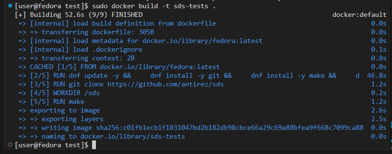
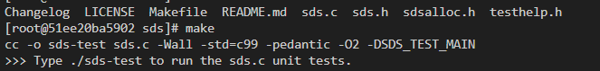

# Lab 1

## obsługa kluczy ssh
pierwszym krokiem było utworzenie dwóch par kluczy ssh przy pomocy komedy ```ssh-keygen``` podając typ klucza i mail. następnie podano nazwy i hasła kluczy


## dodanie kluczy do githuba

W opcjach, w zakładce SSH and GPG keys dodano jeden z utworzonych kluczy ssh


## Klonowanie repozytorium przy użyciu SSH

sklonowano repozytorium przedmiotu


## Przełączanie gałęzi

utworzono nową gałąź w gałęzi grupowej


## Tworzenie katalogu


## Tworzenie git-hook'a

Tworzymy plik o nazwie commit-msg z poniższą treścią, aby wymusić żeby treść commitów zaczynała się od "KO414646"


Aby git hook działał należy go umieścić w .git/hooks zaczynając od root'a repozytorium, a także dodać uprawnienia do wykonywania pliku.

- próba utworzenia nieprawidłowego commita


## Pushowanie do zdalnego repozytorium

Aby dodać brancha do zdalenego repozytorium należy wykonac następującją komendę

```git push --set-upstream miejsce_odgałężenia gałąź```


# Lab2

## Pobranie Dockera
```sudo dnf install docker```


## Pobranie obrazów
używająć ```sudo docker pull <nazwa_obrazu>``` pobrano busybox, fedora, ubuntu i sql


## Odpalenia busybox

```docker run busybox``` uruchomia kontener, ale nie przydziela mu konsoli


dodanie flagi ```-it``` umożliwi sprawdzenie wersji w trybie interaktywnym po wpisaniu ```busybox``` wewnątrz kontenera


## Sprawdzanie procesów
Aby sprawdzić aktualne procesy, w kontenerze zainstalowano komende ps używając ```dnf install -y procps-ng``` i porównano jej wynik wewnątrz kontenera fedory i poza nim


## Wychodzenie
Aby wyjść z kontenera uzywamy komendy ```exit```.


## Tworzenie obrazu przy pomocy pliku dockerfile
Utworzono Dockerfile tworzący obraz fedory, zwierającej gita i repozytorium przedmiotowe

[dockerfile-lab2](../L2/dockerfile)

Następnie budujemy kontener.


Odpalamy w trybie interaktywnym, oraz sprawdzamy czy repozytorium jest sklonowane.


## Usuwanie kontenerów
Aby wylistować kontenery, naley wywołać ```docker ps -a```
Usunąć kontenery można przy użyciu ```docker stop $(docker ps -aq)```
i następnie ```docker rm $(docker ps -aq)```


## Usuwanie obrazów
Aby wylistować obrazy, naley wywołać ```docker images```
Usunąć obrazy można przy użyciu ```docker rmi -f $(docker images -q)```


# Lab3

## Wybór repozytorium 
Wybrano sds (simple dynamic string) do języka C.

https://github.com/antirez/sds

## Tworzenie kontenera pomocniczego


Nastpępnie zaistalowano gita, w celu sklonowania repozytorium


Potrzeba również make'a


Make wymaga cc


Po zainstalowaniu wymaganych programów można zbudować i przetestować aplikacje


## Tworzenie obrazów do budowania i testowania aplikacji

W oparciu u kontener pomocniczy utworzono dwa dockerfile'e, do budowania i testowania aplikacji. oba instalują gita, make'a, cc. Następnie klonują repozytorium i wykonują komende ```make``` w katalogu roboczym. obraz testowy wykonuje testy przy uruchomieniu kontenera

[dockerfile-run](L3/run/dockerfile)

[dockerfile-test](L3/test/dockerfile)

- tworzenie obrazu testowego



# Lab4

## Cz 1 - woluminy
Tworzymy woluminy w następujący sposób.


Klonujemy repozytorium na wolumin wejściowy, przy pomocy kontenera pomocniczego


Teraz tworzymy dockerfile bez git'a, ale z wymaganymi dependencjami.


Następnie należy utworzyć obraz.


Odpalamy container z podpiętymi woluminami.


Po uzyciu make kopiujemy zawartość woluminu wejściowego na wolumin wyjściowy, oraz container.




Przy użyciu innego kontenera sprawdzamy czy operacje się powiodły


## Cz 2 - Docker Network

Odpalamy server i sprawdzamy jego ip.


Łączymy się z serwerem.


Teraz nalęzy stworzyć sieć mostkową.


Tworzenie serwera w nowej sieci


Łączenie siędo servera przy pomocy lokalnego DNS


# Cz 3 - Jenkins
Tworzymy sieć dla jenkins'a.


Odpalamy Server, wraz z dind.


Upewniamy się, ze server pracuje.


Sprawdzamy hasło jenkinsa.


Teraz w vs Code frwardujemy port, aby móc wyświetlić stronę na naszym komputerze.


Odpalamy stronę jenkins'a przez localhost i logujemy się hasłem z powyszego punktu.

