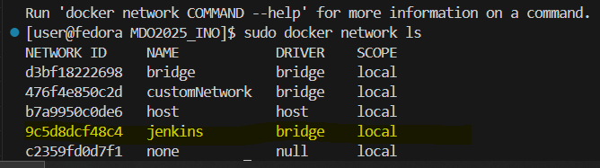

# Przygotowanie Jenkins
1. utworzenie networka jenkins

`docker network create jenkins`



2. Utworzenie kontenera Docker in docker (dind)

`docker run
  --name jenkins-docker
  --rm 
  --detach 
  --privileged 
  --network jenkins 
  --network-alias docker 
  --env DOCKER_TLS_CERTDIR=/certs 
  --volume jenkins-docker-certs:/certs/client 
  --volume jenkins-data:/var/jenkins_home 
  --publish 2376:2376 
  docker:dind 
  --storage-driver overlay2`

  3. utworzenie obrazu i kontenera jenkinsa przy pomocy pliku dockerfile

`docker build -t myjenkins-blueocean:2.504.1-1 .`

`docker run
  --name jenkins-blueocean 
  --restart=on-failure 
  --detach 
  --network jenkins 
  --env DOCKER_HOST=tcp://docker:2376 
  --env DOCKER_CERT_PATH=/certs/client 
  --env DOCKER_TLS_VERIFY=1 
  --publish 8080:8080 
  --publish 50000:50000 
  --volume jenkins-data:/var/jenkins_home 
  --volume jenkins-docker-certs:/certs/client:ro
  myjenkins-blueocean:2.504.1-1`

  [dockerfile](jenkins/dockerfile)

  

  4. port 8080 forward w VS Code
  

## Projekt testowy
wyświetla nazwe użytkownika `Linux`, wyświetla date, oraz prubuje zaciągnąć obraz Ubuntu. z sukcesem.


# Pipeline Projektowy - freeciv server
[jenkinsfile](./jenkinsfile)
## Przygotowanie
Pobranie wszytkich potrzebych dockerfile'i z repozytorium
```groovy
    stage('prepare') {
        steps {
            echo 'Preparing'
            sh 'rm -rf dockerci'
            sh 'git clone https://github.com/HelloImSophie/dockerci.git'
        }
    }
```

## Build
1. Tworzony jest obraz pobierający repozytorium freeciv, wraz ze wszytkimi potrzebynymi zależnościami do zbudowania aplikacji
2. Następnie budowna jest za pomocą meson i ninja.

[build-dockerfile](./Dockerfile-Build)
```groovy
        stage('build') {
            steps {
                echo 'Building..'
                sh "docker build -t freeciv-server-build -f ./dockerci/Dockerfile-Build ."
            }
        }
```
## Testing
1. Pobierane są wyłącznie zależności wymagane do uruchminia aplikacji.
2. Z obrazu Build kopiowana jest zbudowana aplikacja i pliki wymagane do wykonania testu
3. Testy są uruchamiane

[test-dockerfile](./Dockerfile-Test)
```groovy
        stage('test') {
            steps {
                echo 'Testing'
                sh "docker build -t freeciv-server-test -f ./dockerci/Dockerfile-Test ."
                sh "docker run freeciv-server-test"
            }
        }
```
## Deploy
1. Pobierane są wyłącznie zależności wymagane do uruchminia aplikacji.
2. Z obrazu Build pobierane są: aplikacja uruchamiająca serwer, biblioteka dynamiczna `libfreeciv.so`, pliki konfiguracji serwera
3. uruchamiany jest serwer z domyślną konfiguracją `civ2civ3`
4. pobierane są logi z kontenera realizującego serwer, aby sprawdzić czy serwer uruchomił się poprawnie
5.  kontener jest zatrzymywany

[deploy-dockerfile](./Dockerfile-Deploy)
```groovy
        stage('deploy') {
            steps {
                echo 'Deploying..'
                sh "docker rm -f deploy-test 2>/dev/null || true"
                sh "docker build -t freeciv-server-deploy -f ./dockerci/Dockerfile-Deploy ."
                sh "docker run -d --user \$(id -u):\$(id -g) --name deploy-test -p 5556:5556 freeciv-server-deploy"
                sleep 2
                sh "docker logs deploy-test"
                        // Capture and check the last line of the logs
                script {
                    def lastLine = sh(script: "docker logs deploy-test | tail -n 2", returnStdout: true).trim()
                    echo "Last log line: ${lastLine}
                    def expectedLine = "Server ready and listening on port 5556"
        
                    if (lastLine != expectedLine) {
                        error "Container did not start correctly. Expected log line: '${expectedLine}' but got: '${lastLine}'"
                    }
                }
                sh "docker stop deploy-test"
            }
        }
```
## Publish

1. Z obrazu Deploy pobierane są: serwer freeciv, biblioteka utrzono w kroku build oraz konfiguracje servera.
2. niepotrzebny kontener jest usuwany
3. Tworzone i kompresowane jest archiwum zawierające pliki z punktu 1.
4. archiwum zostaje artefaktem pipeline'u   

```groovy
        stage('publish'){
            steps {
                echo 'Publishing..'
                sh "docker create --name temp-container freeciv-server-deploy"
                sh "docker cp temp-container:/server ./freeciv_server"
                sh "docker rm temp-container"
                sh "tar -czf freeciv_server.tar.gz freeciv_server"
                archiveArtifacts artifacts: 'freeciv_server.tar.gz'
            }
        }
```

## Wynik


