# Ansible

## Przygotowanie

1. Zapewnienie serwera OpenSSH i programu tar

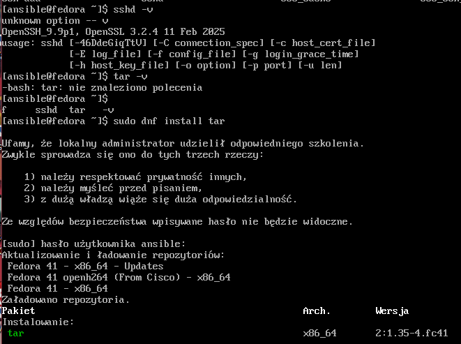

2. utworzenie migawki maszyny

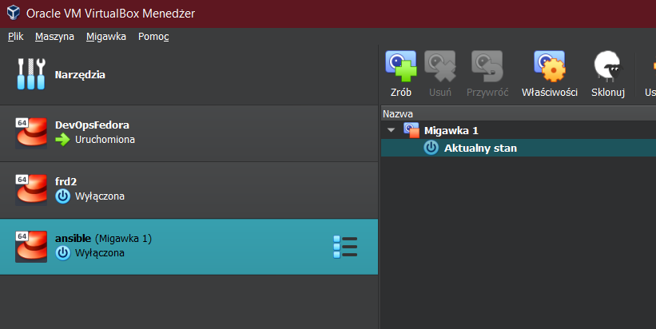

3. wymiana kluczy ssh
- sprawdzenie adresu ip na ansible-target

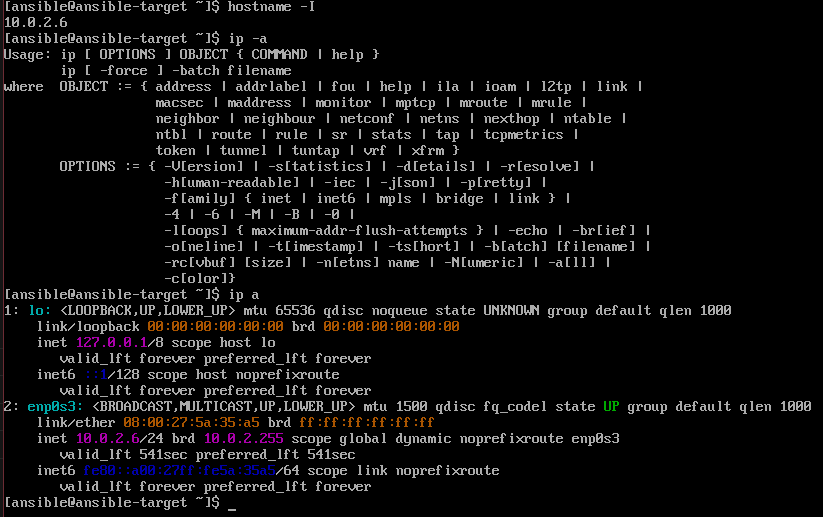
- wymiana kluczy przy użyciu polecenia `ssh-copy-id`

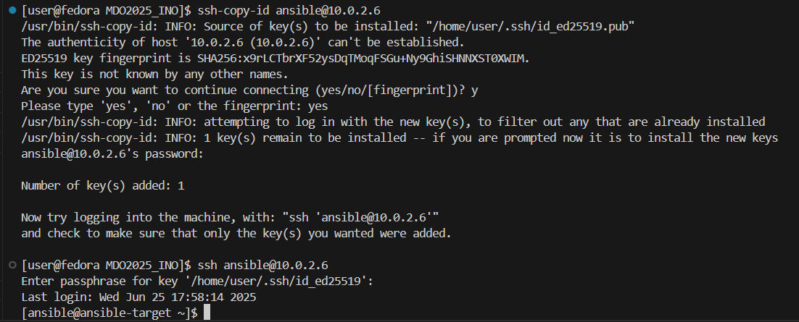

## Inwentaryzacja

1. Umożliwnienie połączenia po nazwach
poprzez edycje pliku hosts na obu maszynach. co umożliwia wykonanie polecenia `ping ansible-target` 

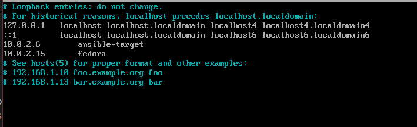

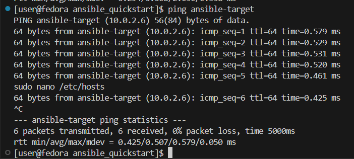

2. Utworznie pliku inwentaryzacji

umieszczenie maszyny głownej w sekcji [Orchestrators] i maszyny docelowej jako [Endpoints]

[plik inwentaryzacji](ansible_quickstart/inventory.ini)

3. wysłanie ping do wszystkich maszyn

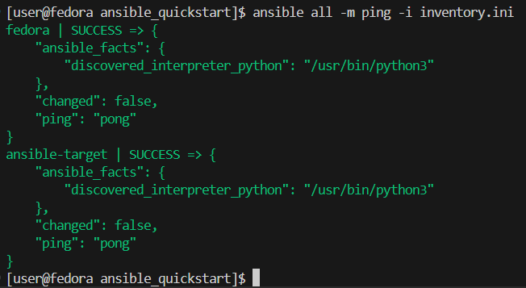

## Testowy playbook
1. pierwsze uruchomienie `ansible-playbook -i inventory.ini playbook.yaml`

pingowanie kończy się sukcesem, a wysłanie pliku inwentaryzacji zminia stan na maszynie docelowej. aktualizacjia pakietów failuje, z powodu braku odpowiednich uprawnień
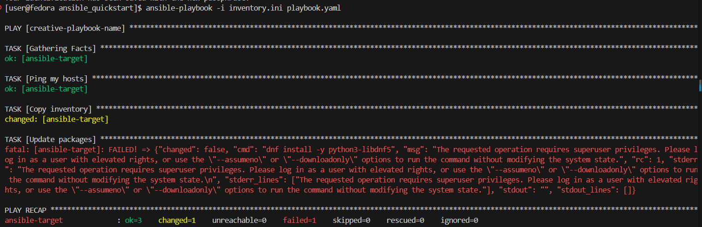

2. uruchomienie z uprawnieniami

dodanie uprawnień do playbooka

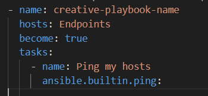

dodanie flagi `--ask-become-pass`. ansible prosi o podanie hasła do wykonania playbooków na docelowych maszynach

kopiowanie inwentara nie zmienia stanu ponieważ plik już istnieje. aktualizacjia pakietów tym razem przechodzi. restartowana jest usługa `sshd`, ale failuje przy restarcie `rngd` 

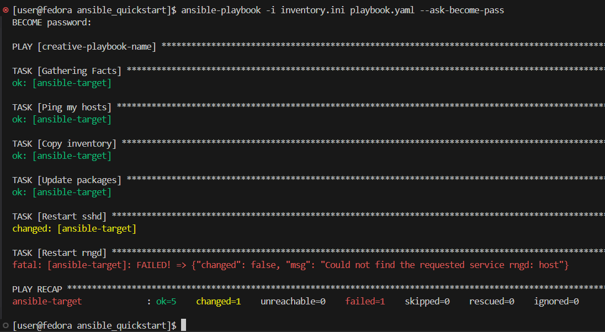

na maszynie docelowej nie ma usługi rngd

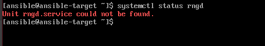

3. ponowne wykonanie playbooka, ale z odłączoną maszyną docelową

brak połączenia uniemożliwia wykonanie playbooka

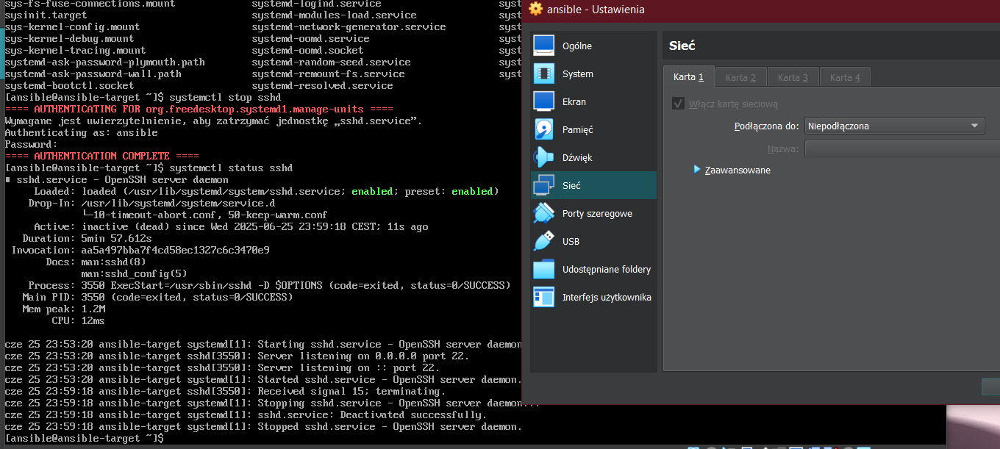

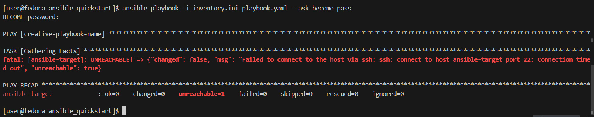

## playbook uruchamiający kontener z serverem freeciv na kontenerze w Endpointach

po wykonaniiu polecenia `ansible-galaxy init deploy-freeciv` utworzył się szkielet roli ansible-galaxy, archiwum z aplikacją umieszczono w podfolderze `/files`, podobnie jak dockerfile zawierający zależności wymagane do uruchomienia aplikacji, logika roli zapisana jest w pliku `main.yaml` w podfolderze `/tasks`. pozwala to znacznie uprościć ostateczny playbook

[playbook](ansible_quickstart/pb-freeciv-server.yaml)

playbook wykonuje role zamiast taska, którego logika jest zawarta w innym miejscu

[role](ansible_quickstart/deploy-freeciv/tasks/main.yml)

rola wykonuje kroki:

* zapewnia istnieje działającej usługi docker, w razie potrzeby ją instaluje

* tworzy folder roboczy

* kopiuje i rozpakowuje artefakt oraz dockerfile, który zawiera wszystkie zależności i kopiuje aplikacje

* tworzy obraz i kontener na podstawie przesłanego dockerfile'a

* zwraca logi z kontenera w celu weryfikacji poprawnego działania aplikacji

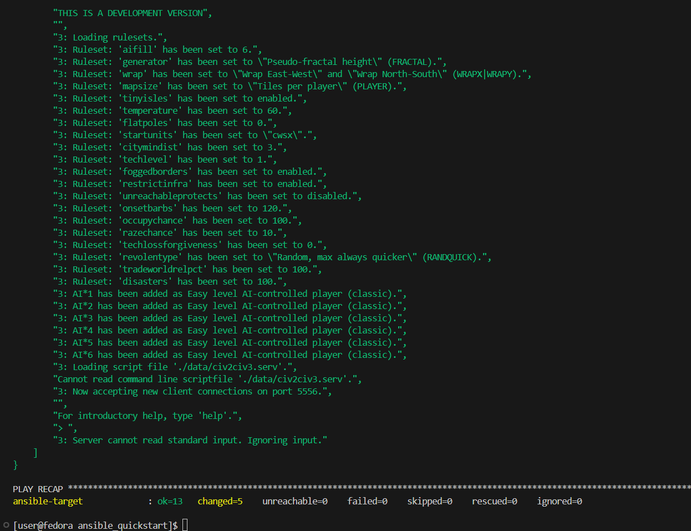

wyświetlone logi potwierdzają poprawne działanie aplikacji

# Pliki odpowiedzi dla wdrożeń nienadzorowanych
1. Pobieranie pliku odpowiedzi `/root/anaconda-ks.cfg`

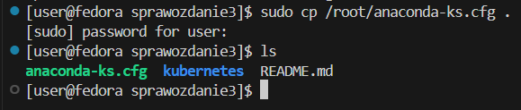

2. Zamieszczenie artefaktu z jenkins na osobnym serwerze (dropbox)

sprawdzenie działania czy usługa działa w terminalu

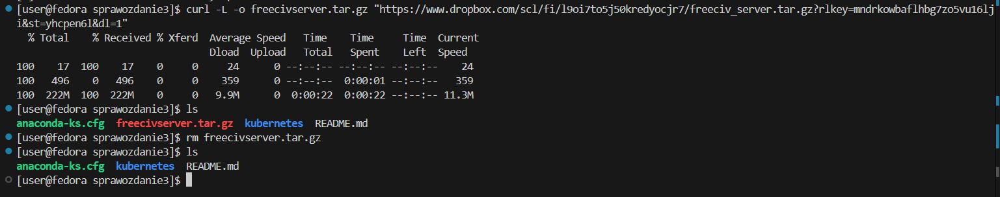

3. Edycja pliku i wysłanie go do repozytorium

[plik cfg](/anaconda-ks.cfg)

4. Nienadzorowana instalacja systemu

ustawienie pliku kickstart przy pomocy skracacza linków tinyurl

`inst.ks=[adres]`

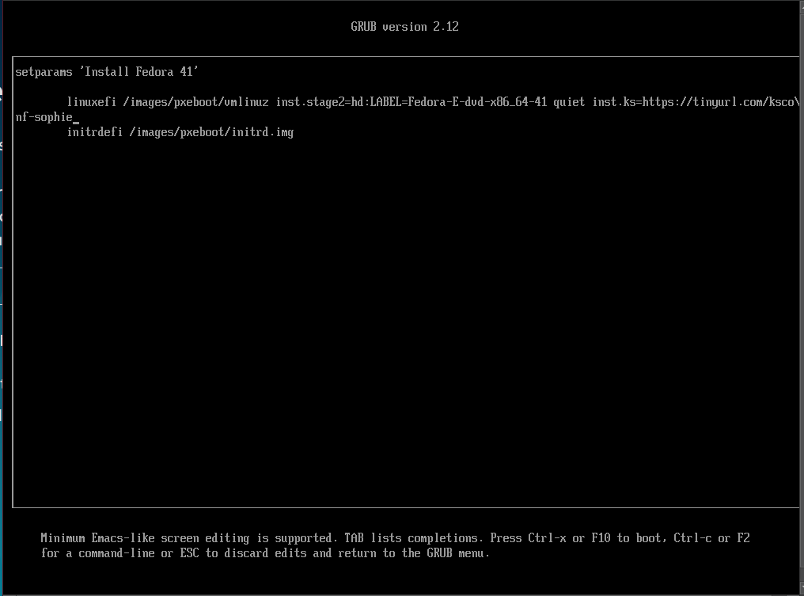

5. uruchomienie aplikacji przy pierwszym starcie systemu

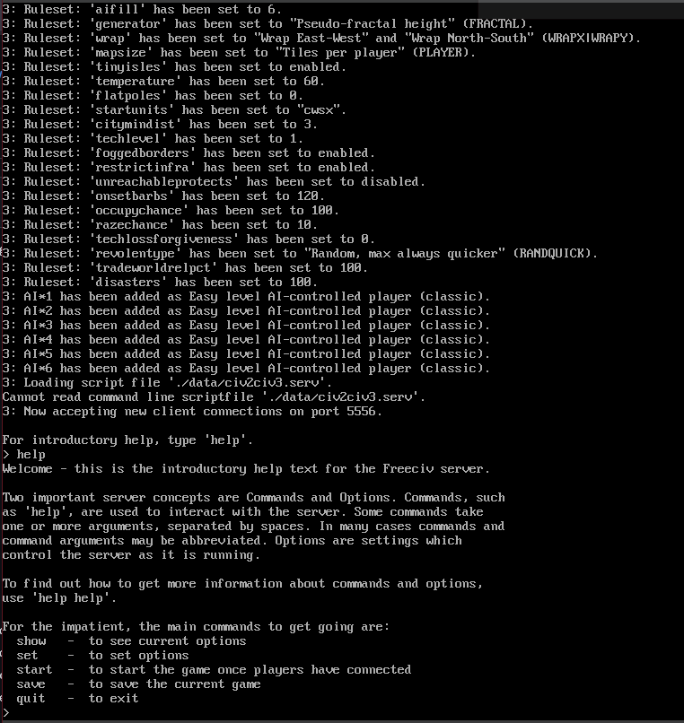

# Kubernetes