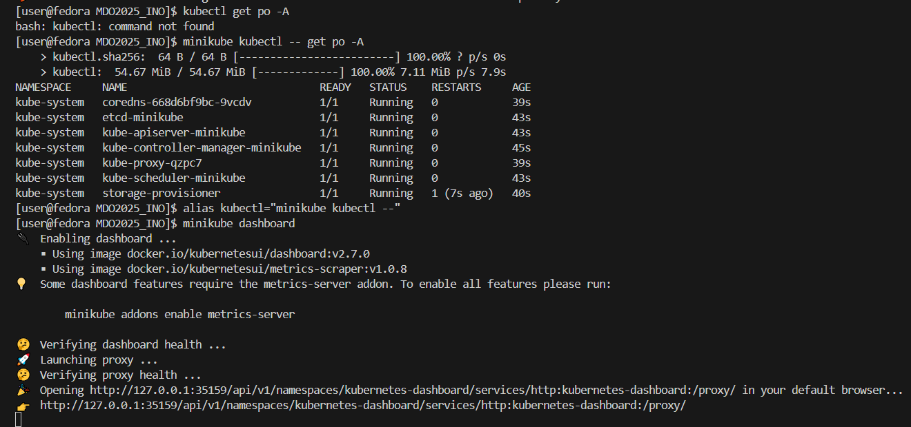
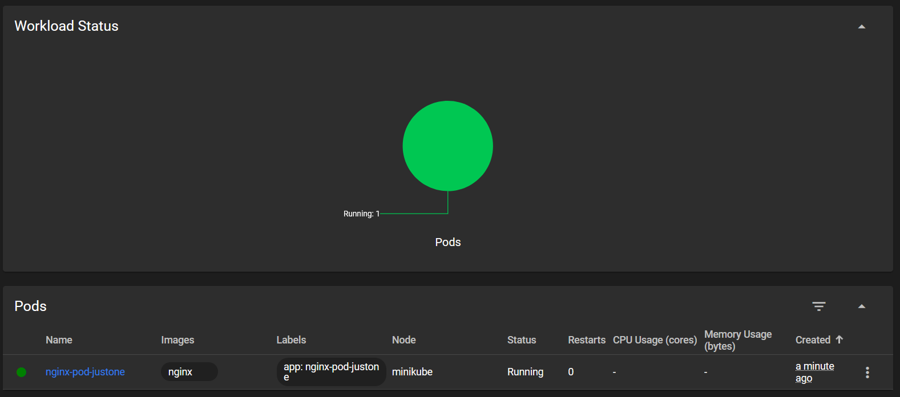
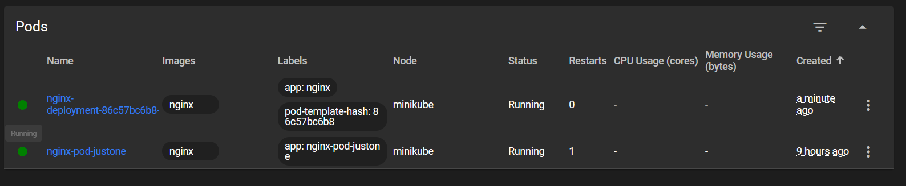
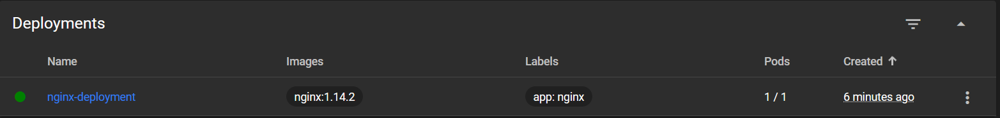
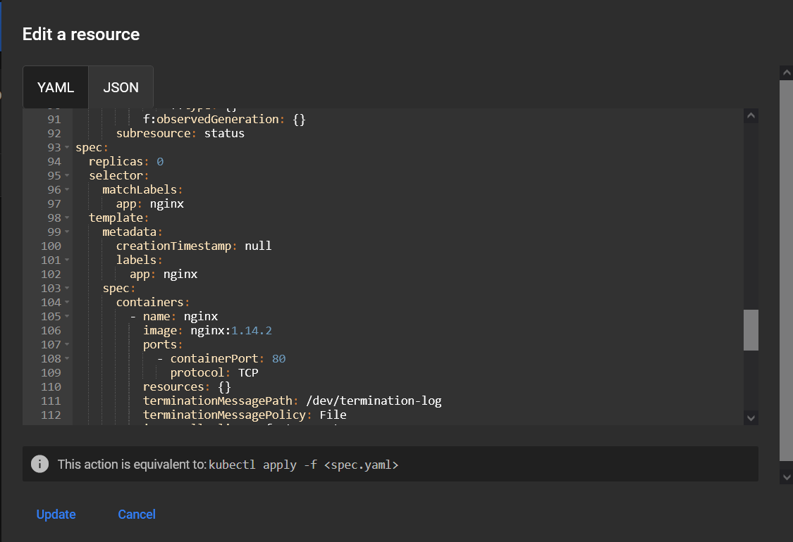

# Ansible

## Przygotowanie

1. Zapewnienie serwera OpenSSH i programu tar


2. utworzenie migawki maszyny


3. wymiana kluczy ssh
- sprawdzenie adresu ip na ansible-target


- wymiana kluczy przy użyciu polecenia `ssh-copy-id`


## Inwentaryzacja

1. Umożliwnienie połączenia po nazwach
poprzez edycje pliku hosts na obu maszynach. co umożliwia wykonanie polecenia `ping ansible-target` 


2. Utworznie pliku inwentaryzacji

umieszczenie maszyny głownej w sekcji [Orchestrators] i maszyny docelowej jako [Endpoints]

[plik inwentaryzacji](ansible_quickstart/inventory.ini)

3. wysłanie ping do wszystkich maszyn


## Testowy playbook
1. pierwsze uruchomienie `ansible-playbook -i inventory.ini playbook.yaml`

pingowanie kończy się sukcesem, a wysłanie pliku inwentaryzacji zminia stan na maszynie docelowej. aktualizacjia pakietów failuje, z powodu braku odpowiednich uprawnień


2. uruchomienie z uprawnieniami

dodanie uprawnień do playbooka


dodanie flagi `--ask-become-pass`. ansible prosi o podanie hasła do wykonania playbooków na docelowych maszynach

kopiowanie inwentara nie zmienia stanu ponieważ plik już istnieje. aktualizacjia pakietów tym razem przechodzi. restartowana jest usługa `sshd`, ale failuje przy restarcie `rngd` 


na maszynie docelowej nie ma usługi rngd


3. ponowne wykonanie playbooka, ale z odłączoną maszyną docelową

brak połączenia uniemożliwia wykonanie playbooka


## playbook uruchamiający kontener z serverem freeciv na kontenerze w Endpointach

po wykonaniiu polecenia `ansible-galaxy init deploy-freeciv` utworzył się szkielet roli ansible-galaxy, archiwum z aplikacją umieszczono w podfolderze `/files`, podobnie jak dockerfile zawierający zależności wymagane do uruchomienia aplikacji, logika roli zapisana jest w pliku `main.yaml` w podfolderze `/tasks`. pozwala to znacznie uprościć ostateczny playbook

[playbook](ansible_quickstart/pb-freeciv-server.yaml)

playbook wykonuje role zamiast taska, którego logika jest zawarta w innym miejscu

[role](ansible_quickstart/deploy-freeciv/tasks/main.yml)

rola wykonuje kroki:

* zapewnia istnieje działającej usługi docker, w razie potrzeby ją instaluje

* tworzy folder roboczy

* kopiuje i rozpakowuje artefakt oraz dockerfile, który zawiera wszystkie zależności i kopiuje aplikacje

* tworzy obraz i kontener na podstawie przesłanego dockerfile'a

* zwraca logi z kontenera w celu weryfikacji poprawnego działania aplikacji


wyświetlone logi potwierdzają poprawne działanie aplikacji

# Pliki odpowiedzi dla wdrożeń nienadzorowanych
1. Pobieranie pliku odpowiedzi `/root/anaconda-ks.cfg`


2. Zamieszczenie artefaktu z jenkins na osobnym serwerze (dropbox)

sprawdzenie działania czy usługa działa w terminalu


3. Edycja pliku i wysłanie go do repozytorium

[plik cfg](/anaconda-ks.cfg)

4. Nienadzorowana instalacja systemu

ustawienie pliku kickstart przy pomocy skracacza linków tinyurl

`inst.ks=[adres]`


5. uruchomienie aplikacji przy pierwszym starcie systemu


# Kubernetes

1. uruchomienie minicube dashboard

po zainstalowaniu minicube i zresetowaniu usługi dockera, możliwe było otworzenie dashboarda używając polecenia `minicube start` oraz `minicube dashboard`





2. Analiza posiadanego kontenera

Aplikacja mojego projektu nie udostępnia wygodnego interefsu, komunikowanie się z nią za pomocą portu. serwer free-civ komunikuje się wyłącznie ze specjalną aplikacją klienta. dalsze kroki wykonywane będą na obrazie `nginx`

3. uruchominie oprogramowania

uruchomienie jednopodowego wdrożenia "nginx-pod-justone" przy pomocy polcenia:

`minikube kubectl run -- nginx-pod-justone --image=nginx --port=80 --labels app=nginx-pod-justone`

oraz sprawdzenie działania przy pomocy `minikube kubectl -- get pods`


potwierdznie działania w dashboardzie



* wyprowadzenie portu poleneniem

`kubectl port-forward pod/ngnix-pod-justone 8081:80`


port 8080 jest zajęty na tej maszynie, zamiast tego wyprowadzono port 8081


weryfikacja działania aplikacji


4. Plik Wdrożenia

W celu zachowania architektury wdrożenia wpostaci kodu, stosuje się pliki yaml które opisują wdrożenie. w tym projekcie wykożystano plik:

[nginx-deployment](kubernetes/nginx-deployment.yaml)

wdrożenie wdrażano przy pomocy `kubectl apply`


powstał nowy pod



przydzielony do nowego wdrożenia


następnie zmieniono wartość klucza `replicas` na 4 w pliku wdrożniowycm


i ponownie wykonano `apply`

informacja zwrotna jest inna. Zamiast "deployment created" wyświetla się "unchanged" (zapomniałem zpisać edycji w pliku wdrożeniowym, więc apply wykonany na starym .yaml) i "confiured"


powstały 3 nowe pody


a wdrożenie wdrożyło zmiany


---

5.  wyeksportowanie wdrożenia jako 

użycie polecenia `expose deployment --type=NodePort --port=80 --target-port=80`, udostępnia port 80 podów wewnętrzych na własym porcie 80 


utworzony serwis widnieje w dashboardzie


forwadowanie portu 80 serwisu na port lokalny 8082 


jeden z podów obsługuje użytkownika przy pomocy serwisu


---

### kubernetes (2)

1. przygotowanie obrazów

do wykonania zajęc wykożystano 3 warianty nginx

* wersja starsza: 1.13.0

* wersja nowsza: 1.14.2

* wersja failująca: [na podstawie dockerfile](kubernetes/dockerfile)

2. Zmiany w deploymencie

zamiany we wdrożeniach wykonywano w dashboardzie

* bazowy deployment


* zwiększenie liczby podów do 8


* zminiejszenie liczby podów do 1




* zmniejszenie liczby podów do 0




* zwiększenie liczby podów do 4


* zastosowanie starszej wersji


* zastosowanie nowej wersji


* zastosowanie failującej wersji


* rollout

`rollout history` informuje o 3 rewizjach o numerach 2,3,4 


`rollout undo` wraca do ostatniego działającego wdrożenia


3. Kontrola wdrożenia

[skrypt](kubernetes/deploy-timer.sh) wdraża wdrożenie na podstawie pliku wdrożenia wdrażanego w poprzednich zajęciach, a następnie czeka 60 sekund lub do momentu gdy wdrożenie będzie aktywne, oraz zwraca komunikat o tym co wydarzyło się pierwiej


4. Strategie wdrożenia

Do testowania strategi wykożystatno [plik wdrożeniowy](kubernetes/nginx-deploy-strategy.yaml), który jest kopią poprzednio wykożystywaneo, ale z inną nazwą wdrożenia i wzbogacony o strategie

* Recreate - gwarantuje to że pody są tworzone ponownie. w dashboardzie liczba podów spada do 0, a następnie zapełnia się do 4


* Rolling update - domyślna strategia. pody zastępowane są w czasie

    * Max unavailable = 3 - maksymalna liczba niedostępnyh podów na raz, w tym wypadku 3 (można podać warotsć w procentach)
    * Max surge = 30%      - maksymalna liczba podów istniejąca w jednym czasie ponad docelową, w tym wypadku 30% (można również podać liczbę naturalną)
    * W moim przypadku zaobserwowano pozostanie 4 podów, spadek do 2 i ponowne osiągnięcie 4 z wdrożonym wdrożeniem


* Canary Development workload
polega na zastosowaniu jednego serwisu, do obsługi kilku różnych wdrożeń, np w celu przetetowania nowej wersji aplikacji. wymaga utworznia serwisu z polem etykietą zgodną ze wszytkimi etykietami wdrożenień które ma obierać

```yaml
apiVersion: v1
kind: Service
metadata:
  name: nginx-service-canary
spec:
  selector:
    app: nginx-strategy
  ports:
    - protocol: TCP
      port: 8084
      targetPort: 80
```

w celu przetestowania działania, utworzono [osobne wdrożenie](kubernetes/nginx-deploy-canary.yaml) o innej nazwie (`nginx-deployment-canary`) i z dwiemia replikami, ale ze zgodną etykietą.


w dashboardzie można zauważyć że serwis operuje na 6 podach o nazwach `nginx-deployment-canary` oraz `nginx-deployment-strategy`