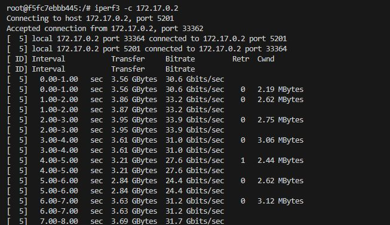

# Sprawozdanie nr 1
Rafał Malik ITE gr.05  
415448

---

## Laboratorium nr 1

### 1. Instalacja gita i obsługa kluczy SSH

```bash
sudo dnf install git
sudo dnf install openssh-clients 
sudo dnf install openssh-server
```

Sprawdzamy wersję zainstalowanego oprogramowania:


---

### 2. Klonowanie repozytorium przedmiotowego

```bash
git clone https://github.com/InzynieriaOprogramowaniaAGH/MDO2025_INO.git
```

Następnie zajmujemy się od razu utworzeniem kluczy i ustawieniem naszych danych do logowania:


Tworzą nam się w ten sposób 2 klucze, w tym 1 z hasłem. Kopiujemy ich zawartość i dodajemy do profilu na GitHubie:

```bash
cat key_file.pub
cat keu_file_pass.pub
```


---

### 3. Teraz jesteśmy gotowi, aby sklonować repozytorium za pomocą klucza SSH

```bash
git clone git@github.com:InzynieriaOprogramowaniaAGH/MDO2025_INO.git
```


---

### 4. i 5. Przechodzimy na naszą gałąź tworząc przy tym nasz unikalny folder z numerem indeksu


---

### 6. Tworzymy git hook-a

Z racji iż jesteśmy połączeni przez VSCode Remote SSH możemy w łatwy sposób modyfikować pliki. Tworzymy git hook:

```bash
code commit-msg
```


Od razu testujemy również jego działanie w obu przypadkach. Najpierw jednak przenosimy ten plik do `.git/hooks`:


Ustawiamy również 2FA na naszym GitHubie:


---

## Laboratorium nr 2

---

### 1. 2. oraz 3. Zaczynamy od instalacji Dockera i pobrania obrazów

```bash
sudo dnf install docker
```


---

### 4. Następnie uruchamiamy Busybox a zaraz potem wybrane przeze mnie Ubuntu. Sprawdzamy przy tym wersję Busybox:

```bash
sudo docker run -it busybox
sudo docker run -it --name ubuntu-container ubuntu bash
```


---

### 5. Jak widać wyżej oba kontenery działają. Updatujemy Ubuntu i wychodzimy:


---

### 6. Teraz czas na utworzenie Dockerfile

Jego zadaniem będzie budowa, update oraz klonowanie repozytorium. Próbowałem tutaj w pewnym momencie klonować przez klucz, ale nie za bardzo to wychodziło.


Dockerfile w trakcie budowy:


Oraz po:


Czas na sprawdzenie czy git istnieje w stworzonym kontenerze oraz czy udało się sklonować repozytorium:


---

### 7. Sprawdzamy aktywnie działające kontenery i je usuwamy:


To samo robimy z obrazami:


---

## Laboratorium nr 3

---

### 1. Build i test

Klonuję wybrane przez siebie repozytorium node-js:

```bash
git clone https://github.com/devenes/node-js-dummy-test.git
```


---

Instalujemy dodatkowo potrzebne npm (przy stawianiu kontenerów również będziemy musieli o tym pamiętać):


---

Instalujemy zależności:


---

Odpalamy testy:


---

Pamiętamy o tym, żeby zainstalować npm. Uruchamiamy kontener oraz klonujemy repozytorium wewnątrz niego:


---

Odpalamy testy:


---

### 2. Tworzymy Dockerfile

Dockerfile.build będzie odpowiedzialny za klonowanie oraz instalację zależności za pomocą npm:


---

Dockerfile.tests będzie odpowiedzialny za testy:


---

### Budujemy obrazy:


---

### Tworzymy voluminy:


---

Po raz kolejny klonujemy, ale pamiętamy o błędach i npm jest już zainstalowany na szczęście:


---

## Laboratorium nr 4 
### Tworzymy voluminy:


---

### Korzystamy z nich do Dockerfile:


---

### Sprawdzamy oba adresy IP i łączymy jeden z drugim:


---

Poniżej oba screeny z testowania połączenia:




---

Łączymy je przez sieć:


---

### Pullujemy obraz Jenkinsa i uruchamiamy go lokalnie z port forwardingiem:


