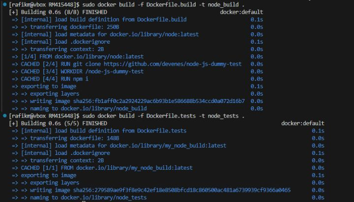
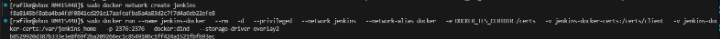
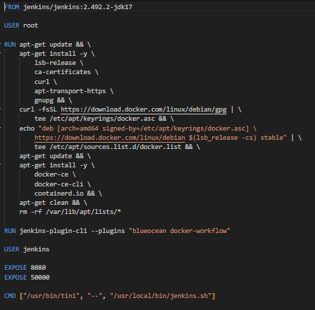
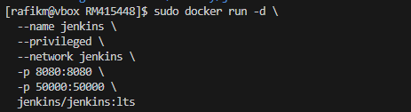
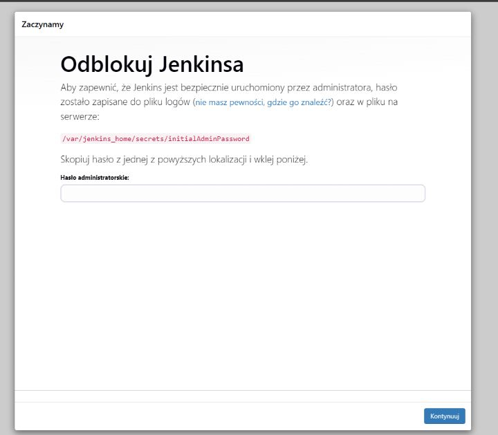
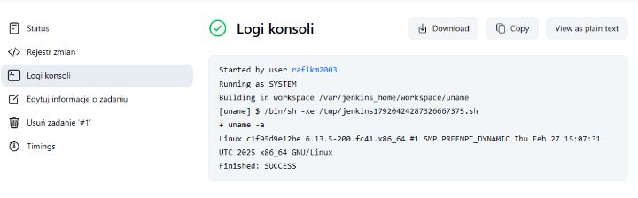
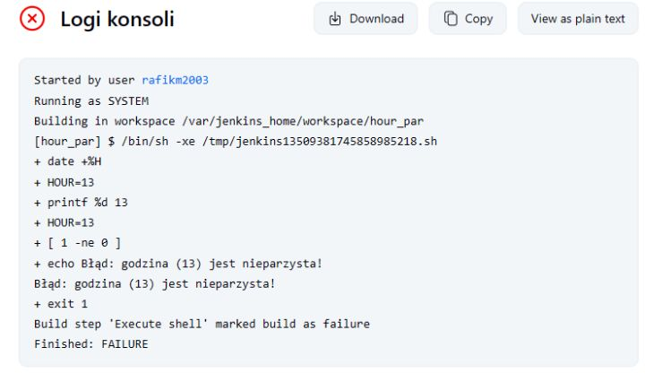
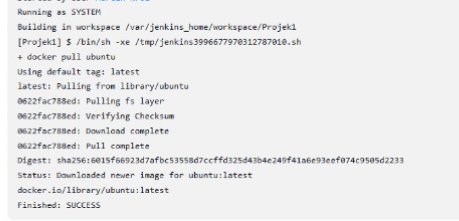
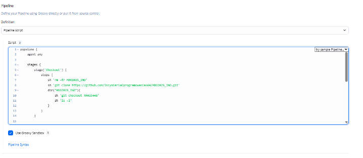
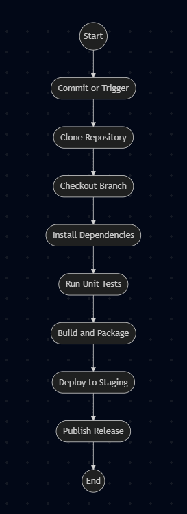

# Sprawozdanie nr 2

---

### Budujemy Dockerfile-e z poprzedniej części

---

### Tworzymy sieć którą zepniemy ze sobą kontenery

---

### Tworzymy dockerfile Jenkinsa

---

### Docker run z port forwardingiem aby widzieć stronę

---

### Uruchamiamy Jenkinsa korzystając z hasła w logach

---

### Przygotowuję potrzebne przykładowe projekty

Wypisujący użytkownika:

---

Wypisujący błąd w zależności od parzystości godziny:

---

Pobierający obraz ubuntu:

---

### Tworzymy nasz własny pipeline

W tym celu skorzystamy z tego samego repozytorium co wcześniej: node-js dummy test.

     pipeline {
        agent any

        stages {
            stage('Checkout') {
                steps {
                    sh 'rm -fr MDO2025_INO'
                    sh 'git clone https://github.com/InzynieriaOprogramowaniaAGH/MDO2025_INO.git'
                    dir("MDO2025_INO"){
                        sh 'git checkout MK416388'
                        sh 'ls -l'  
                    }
                }
            }

            stage('Build') {
                steps {
                    dir('MDO2025_INO/ITE/GCL04/MK416388/Sprawozdanie1') {
                        sh 'docker rmi -f dummy-builder || true'
                        sh 'docker builder prune --force --all'
                        sh 'docker build -t my_node_build -f Dockerfile.build .'
                }
            }
            
            stage('Test') {
                steps {
                    dir('MDO2025_INO/ITE/GCL04/MK416388/Sprawozdanie1') {
                        sh 'docker build -t my_node_test -f Dockerfile.test .'
                }
            }
        }
    }

---

### Diagram

---

### Bardziej rozbudowany pipeline zgodnie z diagramem

        pipeline {
        agent any

        environment {
            APP_DIR = 'MDO2025_INO/ITE/GCL05/RM415448/Sprawozdanie1'
            APP_VERSION = '1.0'
            NODE_TAG = '23-alpine'
            BUILD_IMAGE = "my_node_build:${NODE_TAG}"
            TEST_IMAGE = "my_node_test:v${APP_VERSION}"
            DEPLOY_IMAGE = "my_node_deploy:v${APP_VERSION}"
        }

        stages {
            stage('Prepare') {
                steps {
                    sh '''
                        rm -fr MDO2025_INO
                        git clone https://github.com/InzynieriaOprogramowaniaAGH/MDO2025_INO.git
                        cd MDO2025_INO
                        git checkout RM415448
                    '''
                }
            }
            stage('Logs') {
                steps {
                    dir(env.APP_DIR) {
                        sh 'mkdir -p logs'
                    }
                }
            }
            stage('Build') {
                steps {
                    dir(env.APP_DIR) {
                        sh "docker build -t ${BUILD_IMAGE} -f Dockerfile.build . > logs/build.log 2>&1 || (cat logs/build.log && false)"
                    }
                }
            }
            stage('Tests') {
                steps {
                    dir(env.APP_DIR) {
                        sh "docker build -t ${TEST_IMAGE} -f Dockerfile.test . > logs/test.log 2>&1 || (cat logs/test.log && false)"
                    }
                }
            }
            stage('Deploy') {
                steps {
                    sh 'docker network create my_network || true'
                    dir(env.APP_DIR) {
                        sh """
                            docker build -t ${DEPLOY_IMAGE} -f Dockerfile.deploy .
                            docker rm -f app || true
                            docker run -d -p 3000:3000 --name app --network my_network ${DEPLOY_IMAGE}
                        """
                    }
                    sleep(10)
                }
            }
            stage('Test Deployment') {
                steps {
                    dir(env.APP_DIR) {
                        sh '''
                            docker run --network my_network --rm curlimages/curl curl -v http://app:3000
                        '''
                    }
                }
            }
            stage('Publish') {
                steps {
                    dir(env.APP_DIR) {
                        sh """
                            mkdir -p artifacts_${APP_VERSION}
                            tar -cvf artifacts_${APP_VERSION}.tar logs/*.log
                        """
                        archiveArtifacts artifacts: "artifacts_${APP_VERSION}.tar"
                    }
                }
            }
        }

        post {
            always {
                sh """
                    docker rmi ${BUILD_IMAGE} ${TEST_IMAGE} ${DEPLOY_IMAGE} || true
                    docker system prune --all --volumes --force || true
                """
            }
        }
    }

---

### Easy pipeline

**ETAP 1 – Prepare**

Repozytorium jest klonowane z GitHuba. Następuje przełączenie na gałąź MK416388. Wszystkie dotychczasowe katalogi są czyszczone (rm -fr).

**ETAP 2 – Logs**

Tworzony jest katalog logs, w którym zapisywane będą logi budowania i testowania. Umożliwia to późniejszą analizę ewentualnych błędów.

**ETAP 3 – Build**

Budowany jest obraz Dockera my_node_build na podstawie Dockerfile.build. Logi budowania przekierowywane są do pliku logs/build.log. W przypadku błędu pipeline kończy się po pokazaniu logu.

**ETAP 4 – Tests**

Budowany jest obraz testowy my_node_test na podstawie Dockerfile.test. Logi z budowania testów trafiają do logs/test.log.

**ETAP 5 – Deploy**

Tworzona (lub wznawiana) jest sieć my_network. Budowany jest obraz my_node_deploy. Usuwany jest ewentualny poprzedni kontener app. Uruchamiany jest nowy kontener na porcie 3000 w tej sieci. Pipeline czeka chwilę (sleep(10)).

**ETAP 6 – Test Deployment**

Tworzony jest tymczasowy kontener curlimages/curl, który wykonuje żądanie HTTP pod adres http://app:3000.

**ETAP 7 – Publish**

Tworzony jest katalog artifacts_1.0. Do archiwum artifacts_1.0.tar zbierane są logi z budowania i testów. Plik publikowany jest jako artefakt pipeline.

**Post – Sprzątanie**

Po zakończeniu działania pipeline’u usuwane są wszystkie tymczasowe obrazy i zalegające dane Dockera.
