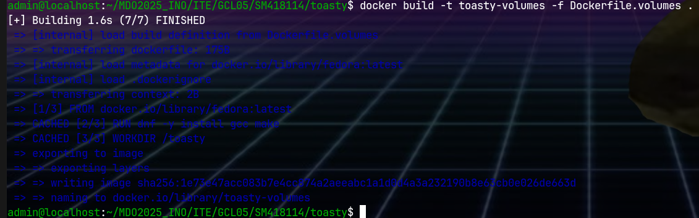

# Zajęcia 01

## Git hook

Użyłem hooka prepare-commit-msg, który jest uruchamiany przed wykananiem commita.
Plik tmp z opisem commita jest podawany do hooka jako pierwszy argument.
Jeśli skrypt zakończy się błędem, commit nie jest tworzony.
```bash
#!/usr/bin/sh

MSG=$(cat $1)

if ! [[ $MSG == SM418114* ]]; then
  echo "Commit message should contain SM418114! Aborting."
  exit -1
fi
```

# Zajęcia 2

```bash
sudo dnf install docker
```
## Instalacja
```bash
sudo docker pull hello-world
sudo docker pull busybox
sudo docker pull fedora
sudo docker pull mysql
```


Użytkownik został dodany do grupy `docker`, aby nie musieć używać `sudo`
```bash
sudo groupadd docker
sudo usermod -aG docker $USER
```

## Kontener busybox


## Kontener fedora
Uruchomienie kontenera `fedora`

`pid 1` w kontenerze

Procesy dockera na hoście


## Własny kontener z Dockefile

Zawartość `Dockerfile`
```Dockerfile
FROM fedora
RUN dnf -y install git
WORKDIR /app
RUN git clone https://github.com/InzynieriaOprogramowaniaAGH/MDO2025_INO.git
CMD ["git", "-h"]
```
Zbudowanie

Uruchomienie interaktywne


## Listowanie i czyszczenie kontenerów
Pokozanie uruchomionych kontenerów

Czyszczenie


# Zajęcia 3

## Wybór oprobramowania
Wybrane repozytorium to `toasty`, biblioteka do testów jednostkowych w języku C.
`Makefile` projektu zawiera `make build`, budujący statyczną bibliotekę `.a`
i `make test`, testujący testowanie za pomocą samej siebie.

## Kontener build i test
Zawartość `Dockerfile.build`

```Dockerfile
FROM fedora
RUN dnf -y install git gcc make
RUN git clone https://github.com/badzianga/toasty
WORKDIR /toasty
RUN make
```

Zawartość `Dockerfile.test`

```Dockerfile
FROM toasty
WORKDIR /toasty
CMD [ "make", "test" ]
```
Budowanie

Uruchomienie


# Zajęcia 4

## Woluminy
Tworzenie woluminów `vol 1` i `vol 2`


Klonowanie repozytorium na wolumin wejściowy


Zawartość `Dockerfile.volumes`
```Dockerfile
FROM fedora
RUN dnf -y install gcc make
WORKDIR /toasty
CMD [ "make" ]
```

Zbudowanie i uruchomienie



## Łączność

Uruchomienie iperf3


Połączenie z drugiego kontenera


Stworzenie sieci mostkowanej, powtórzenie połączenie z nazwami kontenetrów zamiast adresów IP.


Stworzenie woluminów dla klienta i serwera


Zbudowanie kontenerów
```Dockerfile.klient
FROM networkstatic/iperf3
CMD "iperf3 -c ipserwer >> /log/klient.log 2>&1"
```

```Dockerfile.serwer
FROM networkstatic/iperf3
CMD "iperf3 -c ipserwer >> /log/klient.log 2>&1"
```


## Jenkins

Stworzenie sieci i uruchomienie kontenetów
```bash
docker network create leeroy
docker run --name jenkins-docker --rm -d --privileged --network leeroy --network-alias docker --env DOCKER_TLS_CERTDIR="" -p 2376:2376 docker:dind
docker run --name jenkins   --rm --detach   --network leeroy   --env DOCKER_HOST=tcp://docker:2376   --env DOCKER_TLS_VERIFY=0   -p 8080:8080 -p 50000:50000   -v jenkins-data:/var/jenkins_home   jenkins/jenkins:lts-jdk11
```

Po przekierowaniu portu 8080, i zalogowaniu, uzyskano taki ekran:

