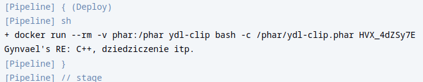
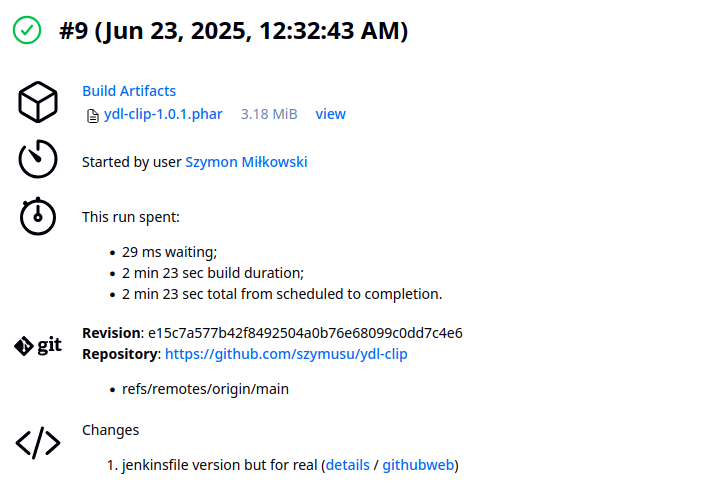
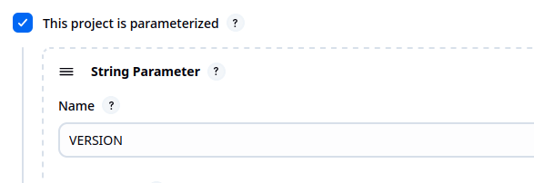
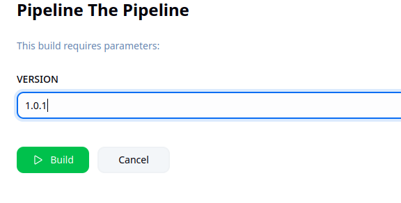
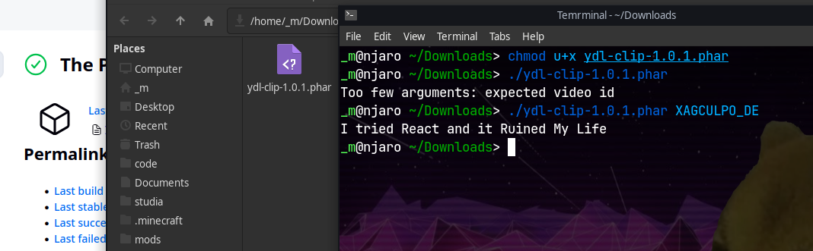

# Pipeline, Jenkins, izolacja etapów


Zmieniłem mój projekt do wdrażania i testowania na własny projekt `ydl-clip`.
Jest to narzędzie (do użycia jako polecenie lub biblioteka) do pobierania
fragmentów video z youtube. Dostępny [tutaj](https://github.com/szymusu/ydl-clip)

Projekt jest zrobiony w `PHP`, używa menedżera zależności `composer`
i używa `yt-dlp` i `ffmpeg` do pobierania i przycinania filmów.

Projekt posiada testy jednostkowe `phpunit` oraz możliwość zbudowania
wykonywalnego archiwum `phar`, pakując cały kod i zależności
(oprócz `yt-dlp` i `ffmpeg`, które muszą być dostępne w systemie).

Obraz `ydl-clip`:
```Dockerfile
FROM fedora
RUN dnf -y install git composer ffmpeg yt-dlp
# force clone
ARG NO_CACHE=1
RUN git clone https://github.com/szymusu/ydl-clip

WORKDIR /ydl-clip
RUN composer install
```

Cache dockera sprawia, że `git clone` nie zawsze się wykona, więc gdy repozytorium
ma świeże zmiany, nie zostaną one zaciągnięte.
Aby to obejść, zastosowałem byle jaki argument, który się zmienia (`NO_CACHE`)
przed wykonaniem `clone`.
Istnieje też opcja `docker build --no-cache [...]`, jednak wtedy cały kontener
buduje się od nowa, razem z zależnościami z `dnf`, co zajmuje dużo czasu.

Obraz `ydl-clip-test`:
```Dockerfile
FROM ydl-clip
WORKDIR /ydl-clip
CMD [ "composer", "test" ]
```

Uruchomienie kontenera testującego zwraca sukces


## Przygotowanie Jenkins

Użyta została sieć `leeroy` i kontener Docker in Docker z poprzednich zajęć

Kontener DinD:
```shell
docker run \
    --name jenkins-docker \
    --rm --detach \
    --privileged \
    --network leeroy \
    --network-alias docker \
    --env DOCKER_TLS_CERTDIR=/certs \
    --volume jenkins-docker-certs:/certs/client \
    --volume jenkins-data-certs:/var/jenkins_home \
    --publish 2376:2376 \
    docker:dind \
    --storage-driver overlay2
```

Oraz zbudowany obraz Blueocean na podstawie:

```Dockerfile
FROM jenkins/jenkins:2.505-jdk17
USER root
RUN apt-get update && apt-get install -y lsb-release ca-certificates curl && \
    install -m 0755 -d /etc/apt/keyrings && \
    curl -fsSL https://download.docker.com/linux/debian/gpg -o /etc/apt/keyrings/docker.asc && \
    chmod a+r /etc/apt/keyrings/docker.asc && \
    echo "deb [arch=$(dpkg --print-architecture) signed-by=/etc/apt/keyrings/docker.asc] \
    https://download.docker.com/linux/debian $(. /etc/os-release && echo \"$VERSION_CODENAME\") stable" \
    | tee /etc/apt/sources.list.d/docker.list > /dev/null && \
    apt-get update && apt-get install -y docker-ce-cli && \
    apt-get clean && rm -rf /var/lib/apt/lists/*
USER jenkins
RUN jenkins-plugin-cli --plugins "blueocean docker-workflow"
```

Został uruchomiony:


### Czym jest Blueocean?
Z [dokumentacji](https://www.jenkins.io/doc/book/blueocean/):
> Blue Ocean as it stands provides easy-to-use Pipeline visualization. It was intended to be a rethink of the Jenkins user experience, designed from the ground up for Jenkins Pipeline. Blue Ocean was intended to reduce clutter and increases clarity for all users.

Innymi słowy, jest to usprawniony, łatwiejszy w użyciu webowy interfejs do Jenkinsa.


Mając te dwa kontenery uruchomione, oraz przekazany port `8080` (np w VSCode),
Można zalogować się do Jenkins w przeglądarce.

Jednorazowe pierwotne hasło znajduje się w `/var/jenkins_home/secrets/initialAdminPassword`

Można je odczytać tak:
```shell
docker exec jenkins-blueocean cat /var/jenkins_home/secrets/initialAdminPassword
```

Po przejściu przez instalację wtyczek i utworzenie konta administratora,


## Zadanie wstępne: uruchomienie

- Projekt, który wyświetla `uname`


- Projekt, który zwraca błąd w nieparzystą godzinę
```shell
h=`date +"%H"`
isodd=`expr $h % 2`
exit $isodd
```


- Projekt, który pobiera obraz `ubuntu`


## Zadanie wstępne: obiekt typu pipeline

Utworony został pipeline `pipeline1` ze skryptem:
```groovy
pipeline {
    agent any

    stages {
        stage('Clone') {
            steps {
                sh 'if [ ! -d MDO2025_INO ]; then git clone -b SM418114 --single-branch https://github.com/InzynieriaOprogramowaniaAGH/MDO2025_INO; fi'
            }
        }
        stage('Pull') {
            steps {
                sh 'cd MDO2025_INO && git pull'
            }
        }
        stage('Build') {
            steps {
                sh 'docker build -t ydl-clip -f ./MDO2025_INO/ITE/GCL05/SM418114/ydl-clip/Dockerfile.build .'
            }
        }
        stage('Test') {
            steps {
                sh 'docker build -t ydl-clip-test -f ./MDO2025_INO/ITE/GCL05/SM418114/ydl-clip/Dockerfile.test .'
                sh 'docker run --rm -t ydl-clip-test'
            }
        }
    }
}
```

Build został uruchomiony 2 razy

Fragmenty z `Console Output`:


---


Jak widać, za drugim razem dzięki cache, pipeline wykonał się szybciej,
bo nie musiał pobierać zależności.


## Kompletny pipeline

Kompletny pipeline składa się z 8 etapów:

```groovy
stage('Clean') {
    steps {
        sh 'docker system prune -f --volumes'
    }
}
```

Etap `Clean` usuwa nieużywane kontenery, obrazy i woluminy dockera, aby
uniknąć problemów z konfliktami nazw.
---

```groovy
stage('Clone') {
    steps {
        sh 'if [ ! -d MDO2025_INO ]; then git clone -b SM418114 --single-branch https://github.com/InzynieriaOprogramowaniaAGH/MDO2025_INO; fi'
    }
}
```

Etap `Clone` sprawdza, czy katalog z repozytorium istnieje. Jeżeli nie, klonuje
odpowiednią gałąź.
---

```groovy
stage('Pull') {
    steps {
        sh 'cd MDO2025_INO && git pull'
    }
}
```

Etap `Pull` zaciąga zmiany z repozytorium.

---

```groovy
stage('Dependencies') {
    steps {
        sh 'docker build -t ydl-clip -f ./MDO2025_INO/ITE/GCL05/SM418114/ydl-clip/Dockerfile.run .'
    }
}
```

Etap `Dependencies` buduje obraz `ydl-clip`, zawierający zależności wymagane do uruchomienia.

`Dockerfile.run`:
```Dockerfile
FROM fedora
RUN dnf -y install php-cli ffmpeg yt-dlp
```
---


```groovy
stage('Build') {
    steps {
        sh 'docker build --no-cache -t ydl-clip-build -f ./MDO2025_INO/ITE/GCL05/SM418114/ydl-clip/Dockerfile.build .'
        sh 'docker volume create phar'
        sh 'docker build -t ydl-clip-phar -f ./MDO2025_INO/ITE/GCL05/SM418114/ydl-clip/Dockerfile.phar .'
        sh 'docker run --name phar --rm -t -v phar:/ydl-clip/build/ ydl-clip-phar'
    }
}
```

Etap `Build` buduje obrazy `ydl-clip-build` i `ydl-clip-phar`
i uruchamia `phar`, który pakuje projekt w archiwum. Zbudowane archiwum zapisywane
jest w woluminie.

`Dockerfile.build`:
```Dockerfile
FROM ydl-clip

RUN dnf -y install git composer
RUN git clone https://github.com/szymusu/ydl-clip

WORKDIR /ydl-clip
RUN composer install
```

`Dockerfile.phar`:
```Dockerfile
FROM ydl-clip-build
WORKDIR /ydl-clip
RUN composer global require humbug/box

CMD [ "composer", "build" ]
```
---

```groovy
stage('Test') {
    steps {
        sh 'docker build -t ydl-clip-test -f ./MDO2025_INO/ITE/GCL05/SM418114/ydl-clip/Dockerfile.test .'
        sh 'docker run --rm -t ydl-clip-test'
    }
}
```

Etap `Test` buduje obraz i uruchamia `ydl-clip-test` - kontener przeprowadzający
testy jednostkowe.

`Dockerfile.test`:
```Dockerfile
FROM ydl-clip-build
WORKDIR /ydl-clip
CMD [ "composer", "test" ]
```
---

```groovy
stage('Deploy') {
    steps {
        sh 'docker run --rm -v phar:/phar ydl-clip bash -c "/phar/ydl-clip.phar HVX_4dZSy7E"'
    }
}
```

Etap `Deploy` uruchamia zbudowane archiwum w podstawowym kontenerze.
Argumentem do programu jest ID istniejącego video, co powierzchownie sprawdza
jego działanie.

---

```groovy
stage('Publish') {
    steps {
        script {
            def version = params.VERSION
            sh 'docker run --name publish-phar -v phar:/phar ydl-clip'
            sh "docker cp publish-phar:/phar/ydl-clip.phar ./ydl-clip-${version}.phar"
            sh 'docker rm publish-phar'
            archiveArtifacts artifacts: "ydl-clip-${version}.phar", allowEmptyArchive: false
        }
    }
}
```

Etap `Publish` uruchamia byle jaki kontener z podpiętym woluminem `phar`.
Plik jest kopiowany, zapisywany z dopiskiem wersji z parametru i
dodawany do artefaktów.



### Wersjonowanie

Do pipeline został dodany parametr:


Należy go wpisać podczas uruchamiania build:



### Działanie

Artefakt został pobrany z panelu Jeknins i jak widać działa jak należy
