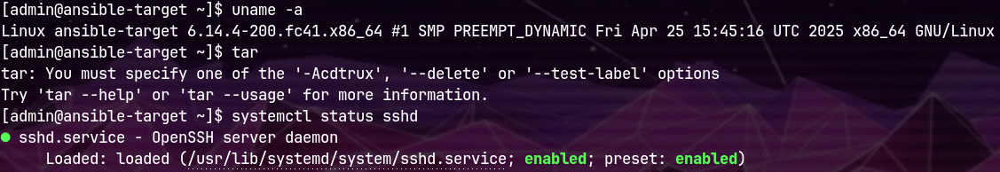
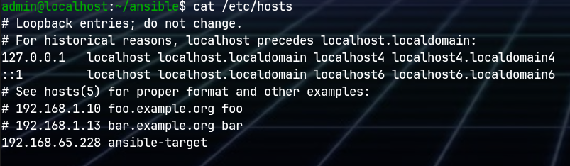
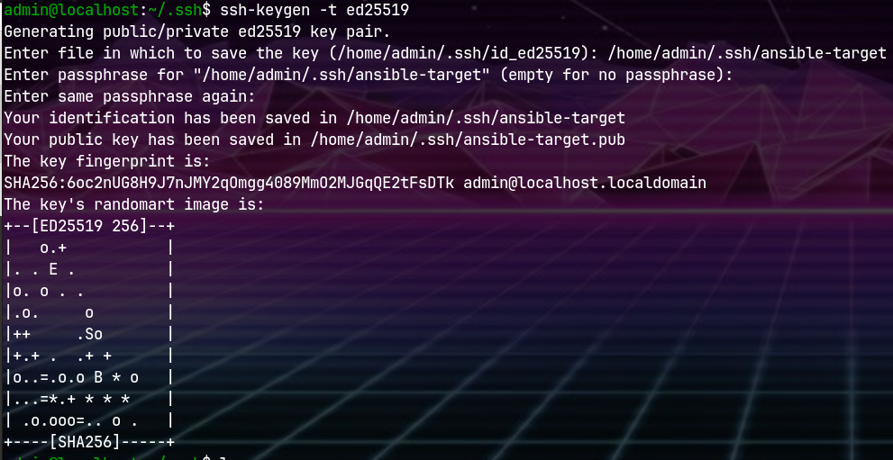
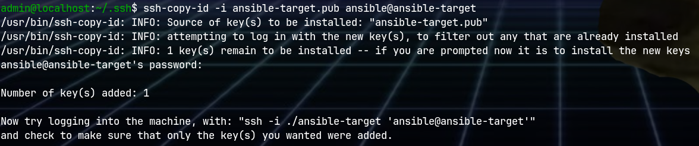
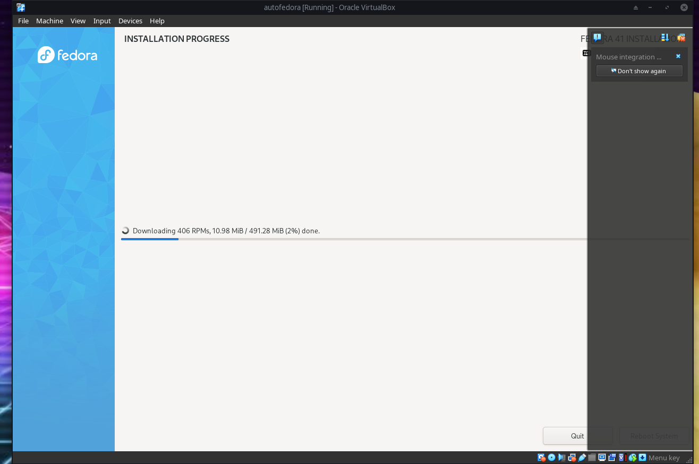

# Zajęcia 8

## Instalacja

Utworzona została druga maszyna wirtualna z systemem Fedora 41



Na pierwszej maszynie zostało zainstalowane ansible
```shell
pipx install --include-deps ansible
```


## Łączność

Dodano maszynę 2 do `/etc/hosts` w maszynie 1 pod nazwą `ansible-target`



Wygenerowano parę kluczy ssh i przesłano klucz pubilczny na maszynę 2
```shell
ssh-keygen -t ed25519
ssh-copy-id -i ansible-target.pub ansible@ansible-target
```




Dodano do configu ssh
```
Host ansible-target
HostName ansible-target
User ansible
IdentityFile ~/.ssh/ansible-target
```


Zmieniono hostname maszyny 1 na `fedora-server`

```shell
sudo hostnamectl set-hostname --static fedora-server
```

i dodano do loopback w `/etc/hosts`

```
127.0.0.1   localhost localhost.localdomain localhost4 localhost4.localdomain4 fedora-server
```

Łączność została zweryfikowana przez `ping`


## Inventory

Został stworzony plik inwentaryzacji `inventory.ini`

```
[Endpoints]
ansible-target

[Orchestrators]
fedora-server
```

Wysłano żądanie `ping` do wszystkich maszyn

```shell
ansible Endpoints -m ping -i inventory.ini
```


## Playbook

Zawartość pliku `playbook-ping.yaml`

```yaml
- name: Test1
  hosts: Endpoints
  tasks:
   - name: Pingowańsko
     ansible.builtin.ping:
```

Wykonanie playbooka
```shell
ansible-playbook -i inventory.ini playbook-ping.yaml
```


Instalacja brakującego rngd
```shell
sudo dnf install rng-tools
```

Zawartość `playbook2.yaml`

```yaml
- name: Plejbuk2
  hosts: Endpoints
  become: yes
  tasks:
   - name: Pingowańsko
     ansible.builtin.ping:

   - name: Kopiuj inventory
     ansible.builtin.copy:
       src: ./inventory.ini
       dest: ~/inventory.ini

   - name: Update
     ansible.builtin.dnf:
       name: '*'
       state: latest
       update_cache: yes

   - name: Restart sshd
     ansible.builtin.systemd:
       name: 'sshd'
       state: restarted

   - name: Restart rngd
     ansible.builtin.systemd:
       name: 'rngd'
       state: restarted
```

```shell
ansible-playbook -i inventory.ini playbook2.yaml
```

Przy pierwszym wykonaniu pojawił się błąd brakującego pakietu pythona 


Należało zainstalować `python3-libdnf5` na targecie 
```shell
sudo dnf install python3-libdnf5
```

Następnie aby instalować paikiety, trzeba dodać użytkownika `ansible` do `sudoers` oraz podać flagę `--ask-become-pass`

```shell
sudo usermod -aG wheel ansible
```

```shell
ansible-playbook -i inventory.ini playbook2.yaml --ask-become-pass
```


Przy wyłączonym serwerze ssh ansible zgłasza błąd `Connection refused` na porcie 22
```shell
sudo systemctl stop sshd
```


Przy wyłączonym interfejsie sieciowym ansible zgłasza błąd `Connection timed out` na porcie 22
```shell
sudo ip link set enp0s3 down
```


## Zarządzanie stworzonym artefaktem

Artefakt i `Dockerfile` z zależnościami skopiowałem do katalogu `ansible` na głównej maszynie.

Utworzony został nowy playbook `deploy.yaml`
```yaml
- name: Deploy
  hosts: Endpoints
  become: yes

  tasks:
   
   - name: Copy Dockerfile
     ansible.builtin.copy:
       src: ./Dockerfile
       dest: ./Dockerfile
   
   - name: Copy phar
     ansible.builtin.copy:
       src: ./ydl-clip.phar
       dest: ./ydl-clip.phar

   - name: Update
     ansible.builtin.dnf:
       name: '*'
       state: latest
       update_cache: yes

   - name: Install docker
     ansible.builtin.dnf:
       name:
         - 'docker'
         - 'python3-requests'
       state: present
       update_cache: yes

   - name: Enable docker
     service:
       name: docker
       state: started

   - name: Build image
     community.docker.docker_image:
       name: ydl-clip
       build:
         path: .
       source: build

   - name: Create container
     community.docker.docker_container:
        name: run
        image: ydl-clip
        state: started
        command: sleep infinity
    
   - name: Copy phar
     ansible.builtin.command:
       cmd: "docker cp ./ydl-clip.phar run:/"
    
   - name: Make executable
     community.docker.docker_container_exec:
       container: run
       command: "chmod u+x /ydl-clip.phar"
    
   - name: Run phar
     community.docker.docker_container_exec:
       container: run
       command: "/ydl-clip.phar oKzVBgHqsis"
```

Playbook:
- kopiuje Dockerfile i archiwum na maszynę target
- instaluje dockera, razem z wymaganym `python3-requests`
- uruchamia usługę dockera
- buduje obraz na podstawie Dockerfile
- uruchamia kontener
- kopiuje artefakt na ów kontener
- dopisuje uprawnienia do wyoknania dla pliku
- uruchamia artefakt

Fragment wyniku działania widać na zrzucie


### Rola galaxy
Utworzono rolę `deploy`
```shell
ansible-galaxy init deploy
```

Plik `deploy/defaults/main.yml`
```yaml
---
# defaults file for deploy
container: run
image: ydl-clip
phar: ydl-clip.phar
```


Plik `deploy/tasks/main.yml`
```yaml
---
# tasks file for deploy

- name: Copy Dockerfile
  ansible.builtin.copy:
    src: ./Dockerfile
    dest: ./Dockerfile

- name: Copy phar
  ansible.builtin.copy:
    src: ./{{ phar }}
    dest: ./{{ phar }}

- name: Update
  ansible.builtin.dnf:
    name: '*'
    state: latest
    update_cache: yes

- name: Install docker
  ansible.builtin.dnf:
    name:
      - 'docker'
      - 'python3-requests'
    state: present
    update_cache: yes

- name: Enable docker
  service:
    name: docker
    state: started

- name: Build image
  community.docker.docker_image:
    name: "{{ image }}"
    build:
      path: .
    source: build

- name: Create container
  community.docker.docker_container:
    name: "{{ container }}"
    image: "{{ image }}"
    state: started
    command: sleep infinity

- name: Copy phar
  ansible.builtin.command:
    cmd: "docker cp ./{{ phar }} {{ container }}:/"

- name: Make executable
  community.docker.docker_container_exec:
    container: "{{ container }}"
    command: "chmod u+x /{{ phar }}"

- name: Run phar
  community.docker.docker_container_exec:
    container: "{{ container }}"
    command: "/{{ phar }} oKzVBgHqsis"
```

Plik `run_deploy.yaml`
```yaml
- name: Deploy Galaxy
  hosts: Endpoints
  become: yes

  roles:
    - role: deploy
```

Po uruchomieniu wykonuje się tak samo, jak poprzednia wersja.


# Pliki odpowiedzi dla wdrożeń nienadzorowanych

## Plik ks

Utowrzona została nowa maszyna, z systemem Fedora 41.

Po instalacji pobrano z maszyny plik `/root/anaconda-ks.cfg`,
dodając `url` i `repo` oraz zmieniając `hostname` na `autofedora`

```
# Generated by Anaconda 41.35
# Generated by pykickstart v3.58
#version=DEVEL

# Keyboard layouts
keyboard --vckeymap=pl --xlayouts='pl'
# System language
lang en_US.UTF-8

url --mirrorlist=http://mirrors.fedoraproject.org/mirrorlist?repo=fedora-41&arch=x86_64
repo --name=update --mirrorlist=http://mirrors.fedoraproject.org/mirrorlist?repo=updates-released-f41&arch=x86_64

%packages
@^custom-environment

%end

# Run the Setup Agent on first boot
firstboot --enable

# Generated using Blivet version 3.11.0
ignoredisk --only-use=sda
autopart
# Partition clearing information
clearpart --all

# System timezonew
timezone Europe/Warsaw --utc

#Root password
rootpw --lock
user --groups=wheel --name=admin --password=$y$j9T$1P3gs8j4342Ncjzkdg6fRsp2$DzDEPnIDg/zE2i7FrbvVfbup3.xH5wdSJ7WsrE44o5/ --iscrypted --gecos="admin"

network --hostname=autofedora
```

[Plik](anaconda-ks.cfg) został dodany na mój branch w przedmiotowym repozytorium i aby skrócić link,
skorzystałem z firmowego serwera VPS :), dodając przekierowanie w nginx.

Dzięki czemu jest dostępny pod adresem [https://sekowapp.ovh/fedora.cfg](https://sekowapp.ovh/fedora.cfg)

## Instalacja

Nową maszynę uruchomiono ponownie, z podpiętym obrazem instalatora.

Podczas uruchomienia, po pojawieniu się GRUBa i naciśnięciu `E` do opcji rozruchu zostało dopisane
```
inst.ks=https://sekowapp.ovh/fedora.cfg
```


Po uruchomieniu `F10`, instalacja przebiegła automatycznie



Po instalacji nastąpił reboot, gdzie można już się zalogować do systemu


## Instalacja swojego projektu

Do `anaconda-ks.cfg` zostało dopisane

```
repo --name=rpmfusion-free --mirrorlist=https://mirrors.rpmfusion.org/mirrorlist?repo=free-fedora-41&arch=x86_64
repo --name=rpmfusion-nonfree --mirrorlist=https://mirrors.rpmfusion.org/mirrorlist?repo=nonfree-fedora-41&arch=x86_64
```
Przed `%packages`, aby mieć dostęp do paczki `ffmpeg`.

```
wget
ffmpeg
yt-dlp
php-cli
```
W sekcji `%packages`

Oraz
```shell
wget -O /usr/local/bin/ydl-clip https://softwarevilla.pl/static/ydl-clip.phar
chmod a+x /usr/local/bin/ydl-clip
```
W sekcji `%post`


Instalacja przebiegła tak samo jak wcześniej.

Po instalacji maszyna uruchomiła się ponownie (trzeba było ręczenie usunąć dysk z instalatorem)
z działającym programem `ydl-clip`


# Wdrażanie na zarządzalne kontenery: Kubernetes (1)

## Instalacja

Instalacja i uruchomienie `minikube start`


Aby kubernetes się uruchomił, trzeba było ustawić conajmniej 2 rdzenie maszynie wirtualnej


Dodano alias w `.bashrc`, aby skrócić polecenie `kubectl`
```shell
alias kubectl="minikube kubectl --"
```

Uruchomił się kontener


Następnie uruchomiono dashboard
```shell
minikube dashboard
```


Panel jest dostępny z maszyny, co widać poleceniem `curl` na powyższy link,
Jednak wejście tam z przeglądarki skutkuje błędem połączenia.

Należało przekierować porty między maszyną a hostem.


## Uruchamianie oprogramowania

Jako obraz wybrany został `nginx`. Pojedynczy pod uruchomiłem: 

```shell
minikube kubectl run -- nginx --image=nginx --port=80 --labels app=nginx
```


Po czym pojawił się on w panelu


Z podem nie można się jeszcze połączyć z systemu hosta.
Najpierw trzeba przekierować port z poda do maszyny wirtualnej
```shell
kubectl port-forward pod/nginx 18888:80
```

A następnie przekierowac port z maszyny do głównego systemu


Teraz strona startowa nginx jest dostępna z przeglądarki


## Przekucie wdrożenia manualnego w plik wdrożenia (wprowadzenie)

Zawartość pliku `onepod.yaml`
```yaml
apiVersion: apps/v1
kind: Deployment
metadata:
  name: nginx-onepod
  labels:
    app: nginx
spec:
  selector:
    matchLabels:
      app: nginx
  template:
    metadata:
      labels:
        app: nginx
    spec:
      containers:
        - name: nginx
          image: nginx
          ports:
            - containerPort: 80
```

Deployment został wdrożony poleceniem
```shell
kubectl apply -f onepod.yaml
```


Do pliku deploymentu w sekcji `spec` została dodana linijka `replicas: 5`

Co po wdrożeniu dało efekt 5 podów


(onepod to chyba jednak nie za dobra nazwa :)

Następnym krokiem było wyeksponowanie wdrożenia jakos serwis

```shell
kubectl expose deployment nginx-onepod --type=NodePort --port=80 --target-port=80 --name=nginx-notonepod-service
```

Oraz przekazanie portu do maszyny

```shell
kubectl port-forward service/nginx-notonepod-service 18888:80
```


Port `18888` był już przekierowany z maszyny do hosta, więc po tym kroku można było wejść na działający serwis w przeglądarce.


# Wdrażanie na zarządzalne kontenery: Kubernetes (2)

## Przygotowanie nowego obrazu

Utworzyłem customową stronę startową nginx, zawierającą numer wersji nginx

```html
<!DOCTYPE html>
<html lang="pl">
<head>
  <meta charset="UTF-8">
  <title>Nginx Modified</title>
</head>
<body>
  <h1>Nginx wersja: 1.27.5</h1>
</body>
</html>
```
```html
<!DOCTYPE html>
<html lang="pl">
<head>
  <meta charset="UTF-8">
  <title>Nginx Modified</title>
</head>
<body>
  <h1>Nginx wersja: 1.28</h1>
</body>
</html>
```

Zbudowane zostały obrazy na podstawie nginx wersji 1.27.5 i 1.28 zawierające tę stronę startową:

```dockerfile
FROM nginx:1.28
COPY 1.28.html /usr/share/nginx/html/index.html
```
```dockerfile
FROM nginx:1.27.5
COPY 1.27.5.html /usr/share/nginx/html/index.html
```

Oraz obraz z komendą `false`, aby zakończył się błędem
```dockerfile
FROM nginx:1.28
COPY 1.28.html /usr/share/nginx/html/index.html
CMD ["false"]
```

```shell
docker build -t nginx-custom:1.27.5 -f 1.27.5.Dockerfile .
docker build -t nginx-custom:1.28 -f 1.28.Dockerfile .
docker build -t nginx-custom-broken:1.28 -f 1.28.broken.Dockerfile .
```

Uruchomienie kontenerów dało pożądany efekt

Wersje prawidłowe serwowały moją stronę
```shell
docker run --rm -it -p 18888:80 nginx-custom:1.27.5
```


```shell
docker run --rm -it -p 18888:80 nginx-custom:1.28
```


A wersja nieprawidłowa zakończyła się kodem błędu
```shell
docker run --rm -it -p 18888:80 nginx-custom-broken:1.28
```


## Zmiany w deploymencie

Na początek zbudowane obrazy zostały załadowane do kubernetesa poleceniem `minikube image load`


Na podstawie poprzedniego wdrożenia został utworzony plik `nginx-custom.yaml`
```yaml
apiVersion: apps/v1
kind: Deployment
metadata:
  name: nginx-custom-deploy
  labels:
    app: nginx-custom
spec:
  replicas: 5
  selector:
    matchLabels:
      app: nginx-custom
  template:
    metadata:
      labels:
        app: nginx-custom
    spec:
      containers:
        - name: nginx-custom
          image: nginx-custom:1.27.5
          ports:
            - containerPort: 80
```

Wdrożenie zostało uruchomione

```shell
kubectl apply -f nginx-custom.yaml
```


Zwiększenie replik do 8
```yaml
replicas: 8
```
Po zaaplikowaniu:


Zmniejszenie replik do 1
```yaml
replicas: 1
```
Po zaaplikowaniu:


Zmniejszenie replik do 0
```yaml
replicas: 0
```


Ponowne zwiększenie do 4
```yaml
replicas: 4
```


Zastosowanie nowej wersji
```yaml
image: nginx-custom:1.28
```


Zastosowanie starszej wersji
```yaml
image: nginx-custom:1.27.5
```


Zastosowanie wadliwej wersji
Zastosowanie starszej wersji
```yaml
image: nginx-custom-broken:1.28
```


Historia wdrożeń
```shell
kubectl rollout history deployment.apps/nginx-custom-deploy
```


Rollback wadliwej wersji
```shell
kubectl rollout undo deployment.apps/nginx-custom-deploy
```


Po rollbacku praca wdrożenia wróciła do normy,
a w historii `revision 3` zniknęło i pojawiło się `revision 5`,
co sugeruje, że wersja `3` została użyta ponownie, a jej numer zmieniony na `5`

## Kontrola wdrożenia

Szczegóły rewizji można sprawdzać poleceniem
```shell
kubectl rollout history deployment.apps/nginx-custom-deploy --revision=<numer>
```

Sprawdzając wszystkie od `1` do `5`


Widzimy, że `1` i `3` nie istnieją, co pokrywa się z wcześniejszą listą.

Można też zauważyć, że zmiany liczby replik nie skutkują zmianą w rewizji.
Tu jedynie widać zmiany obrazów dla podów.

Zmiany, które widać:
- rewizja `2` to zmiana z obrazu `nginx-custom:1.27.5` na `nginx-custom:1.28`
- rewizja `4` to zmiana z obrazu `nginx-custom:1.27.5` na `nginx-custom-broken:1.28`
- rewizja `5` to zmiana z obrazu `nginx-custom-broken:1.28` na `nginx-custom:1.27.5`

Rewizja `5` używa tego samego obrazu, co wcześniej `1` i `3`, więc zostały one usunięte.

### Skrypt oczekujący na wdrożenie

Zawartość `wait.sh`:
```shell
#!/bin/sh

NAME="${1:-nginx-custom-deploy}"
TIMEOUT="${2:-60s}"

echo "Waiting for deployment ${NAME} to finish in ${TIMEOUT}"
minikube kubectl -- wait --for=condition=available  --timeout=${TIMEOUT} deployment/${NAME}
if [ $? -ne 0 ]; then
        echo "Timed out: ${TIMEOUT}"
        exit 1
fi
echo "Deployment ${NAME} available"
```

Wykonanie skryptu
```shell
./wait.sh
# bądź podając argumenty
./wait.sh nginx-custom-deploy 60s
```
Na działającym już wdrożeniu od razu zwraca informację o gotowości


Zmieniając liczbę podów na `32` i uruchamiając skrypt, po chwili czekania, dostajemy pozytywną odpowiedź


Zmieniając znów liczbę podów na `64` i uruchamiając skrypt z timeoutem `5s`, widzimy, że wdrożenie nie zdążyło się zrobić w tym czasie


## Strategie wdrożenia

We wszystkich przypadkach zastosowano `replicas: 4`

Do pliku wdrożenia w sekcji `spec` zostało dodane `strategy` z odpowiednimi parametrami.

### Recreate

```yaml
strategy:
  type: Recreate
```
Po zastosowaniu liczba podów spadła do 0 i dopiero po tym wzrosła spowrotem do 4.

### Rolling Update

```yaml
strategy:
  type: RollingUpdate
  rollingUpdate:
    maxUnavailable: 2
    maxSurge: 50%
```

Liczba podów spadła do 2, potem wzrosła do 5, i wróciła do 4.


### Canary Deployment

Utworzony został nowy plik wdrożenia `nginx-custom-canary.yaml`:

```yaml
apiVersion: apps/v1
kind: Deployment
metadata:
  name: nginx-custom-deploy-canary
  labels:
    app: nginx-custom
spec:
  replicas: 2
  selector:
    matchLabels:
      app: nginx-custom
  template:
    metadata:
      labels:
        app: nginx-custom
    spec:
      containers:
        - name: nginx-custom
          image: nginx-custom:1.27.5
          ports:
            - containerPort: 80
```


Oraz serwis
```yaml
apiVersion: v1
kind: Service
metadata:
  name: nginx-service
spec:
  type: NodePort
  selector:
    app: nginx-custom
  ports:
    - port: 80
      targetPort: 80
      nodePort: 30000
```


Co skutkuje działającym serwisem


I podami: 4 stare i 2 canary


