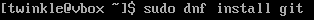
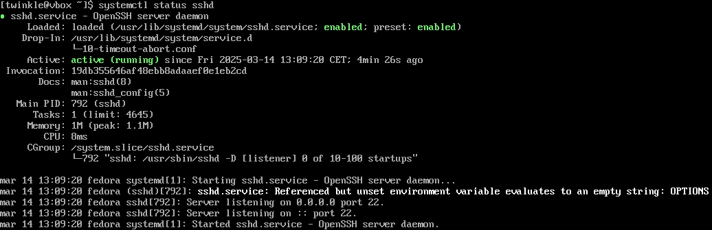
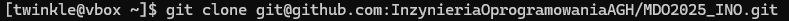
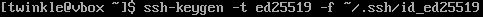
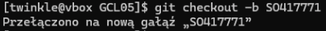
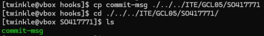
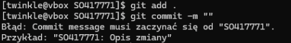

# Zajęcia 01

---
1. Zainstalowano klienta Git i obsługę kluczy SSH.



2. Sklonowano repozytorium za pomocą HTTPS i personal access token.


3. Utworzono dwa klucze SSH, inne niż RSA, w tym co najmniej jeden zabezpieczony hasłem. Skonfigurowano klucz SSH jako metodę dostępu do GitHuba. Sklonowano repozytorium z wykorzystaniem protokołu SSH oraz skonfigurowano 2FA.
- ***ECDSA***

**ECDSA** to algorytm oparty na krzywych eliptycznych, który oferuje dobrą wydajność i bezpieczeństwo przy krótkich kluczach, ale jest mniej powszechny niż ED25519.

- ***ED25519***

**ED25519** to nowoczesny i bezpieczny algorytm, który zapewnia wyższą odporność na ataki i jest rekomendowany do używania w SSH ze względu na swoją szybkość i efektywność.

4. Przełączono się na gałąź main, a następnie na grupową gałąź GCL05, gdzie utworzono gałąź o nazwie SO417771 


5. Praca na nowej gałęzi

- W katalogu właściwym dla grupy utworzono nowy katalog, także o nazwie SO417771.

- Napisano Git hooka, czyli skrypt weryfikujący, że każdy mój "commit message" zaczyna się od "SO417771"

### Treść Git hooka
```sh

#!/usr/bin/sh

EXPECTED_PREFIX="SO417771"

COMMIT_MSG_FILE=$1
COMMIT_MSG=$(head -n 1 "$COMMIT_MSG_FILE")

if [[ ! $COMMIT_MSG =~ ^$EXPECTED_PREFIX ]]; then
    echo "Błąd: Commit message musi zaczynać się od \"$EXPECTED_PREFIX\"."
    echo "Przykład: \"$EXPECTED_PREFIX: Opis zmiany\""
    exit 1
fi

exit 0

```

- Dodadano ten skrypt do stworzonego wcześniej katalogu.

- Skopiowanao go we właściwe miejsce, tak by uruchamiał się za każdym razem przy commit'cie.


### Test napisanego Git hooka
 Test potwierdza poprawność napisanego Git hooka



# Zajęcia 02