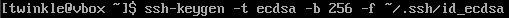
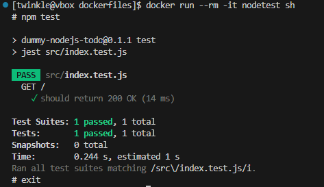

# Zajęcia 01

---
1. Zainstalowano klienta Git i obsługę kluczy SSH.


2. Sklonowano repozytorium za pomocą HTTPS i personal access token.


3. Utworzono dwa klucze SSH, inne niż RSA, w tym co najmniej jeden zabezpieczony hasłem. Skonfigurowano klucz SSH jako metodę dostępu do GitHuba. Sklonowano repozytorium z wykorzystaniem protokołu SSH oraz skonfigurowano 2FA.

- ***ECDSA***



**ECDSA** to algorytm oparty na krzywych eliptycznych, który oferuje dobrą wydajność i bezpieczeństwo przy krótkich kluczach, ale jest mniej powszechny niż ED25519.

- ***ED25519***


**ED25519** to nowoczesny i bezpieczny algorytm, który zapewnia wyższą odporność na ataki i jest rekomendowany do używania w SSH ze względu na swoją szybkość i efektywność.

4. Przełączono się na gałąź main, a następnie na grupową gałąź GCL05, gdzie utworzono gałąź o nazwie SO417771


5. Praca na nowej gałęzi

- W katalogu właściwym dla grupy utworzono nowy katalog, także o nazwie SO417771.

- Napisano Git hooka, czyli skrypt weryfikujący, że każdy mój "commit message" zaczyna się od "SO417771"

### Treść Git hooka
```sh

#!/usr/bin/sh

EXPECTED_PREFIX="SO417771"

COMMIT_MSG_FILE=$1
COMMIT_MSG=$(head -n 1 "$COMMIT_MSG_FILE")

if [[ ! $COMMIT_MSG =~ ^$EXPECTED_PREFIX ]]; then
    echo "Błąd: Commit message musi zaczynać się od \"$EXPECTED_PREFIX\"."
    echo "Przykład: \"$EXPECTED_PREFIX: Opis zmiany\""
    exit 1
fi

exit 0

```

- Dodadano ten skrypt do stworzonego wcześniej katalogu.

- Skopiowanao go we właściwe miejsce, tak by uruchamiał się za każdym razem przy commit'cie.


### Test napisanego Git hooka

 Test potwierdza poprawność napisanego Git hooka


# Zajęcia 02

---

1. Zainstalowano Docker w systemie linuksowym, po czym stworzono konto na Docker Hub

2. Pobrano obrazy hello-world, busybox, ubuntu, fedora, mysql


3. Uruchomiono kontener z obrazu busybox


Podłączono się do kontenera interaktywnie i wywołaano numer wersji


Na obrazie widoczny jest numer wersji kontenera busybox. Jest to wersja ***v1.37.0***, która pojawia się zaraz po wywołaniu komendy `busybox --help`.


3. Uruchomiono "system w kontenerze" (czyli kontener z obrazu fedora)


4. Stworzono własny plik ***Dockerfile*** bazujący na fedorze klonujący nasze repo.

### Treść Dockerfile
```sh

FROM fedora:latest

RUN dnf -y update && dnf install -y git && dnf clean all

WORKDIR /workspace

RUN git clone https://github.com/InzynieriaOprogramowaniaAGH/MDO2025_INO.git

CMD ["/bin/bash"]

```

5. Następnie go zbudowano oraz uruchomiono, aby zweryfikować że jest tam ściągnięte nasze repozytorium.


6. Pokazano uruchomione kontenery, które następnie usunięto:


7. Wyszczono obrazy:


# Zajęcia 03

---

## Node

1. Sklonowano repozytorium `node-js-dummy-test` z GitHub przy użyciu komendy `git clone`. Następnie zainstalowano wymagane zależności Node.js za pomocą dnf, w tym nodejs, nodejs-libs, oraz dokumentację i dodatkowe pakiety. Proces zakończył się pomyślnie, przygotowując środowisko do dalszych działań.


2. Po sklonowaniu repozytorium, uruchomiono komendę npm install w celu zainstalowania wymaganych zależności JavaScript.


3. W trzecim kroku uruchomiono serwer aplikacji za pomocą komendy `npm run start`, który zaczął nasłuchiwać na porcie 3000. Następnie przeprowadzono testy jednostkowe za pomocą komendy `npm run test`, która uruchomiła test index.test.js. Test przeszedł pomyślnie, a wynik wskazał na poprawne działanie aplikacji. Wszystkie testy zakończyły się sukcesem.


### Tworzenie dwóch plików Dockerfile automatyzujących kroki powyżej

4. - Kontener pierwszy ma przeprowadzać wszystkie kroki aż do builda. Zbudowano go za pomocą komendy `docker build -t nodebld -f ./Dockerfile.nodebld .`. Kontener został nazwany nodebld i zawierał wszystkie wymagane zależności oraz kroki do zbudowania aplikacji.


***Dockerfile.nodebld***
```sh
FROM node

RUN git clone https://github.com/devenes/node-js-dummy-test

WORKDIR /node-js-dummy-test

RUN npm i 
```

- Obraz o nazwie nodebld został pomyślnie utworzony:


- Uruchomiono kontener nodebld za pomocą komendy `docker run --rm -it nodebld sh`, aby uzyskać interaktywny dostęp do środka kontenera. Po wejściu do kontenera, wylistowano zawartość katalogu, co ujawnia strukturę aplikacji, w tym pliki takie jak Dockerfile, package.json, src, node_modules, oraz inne zasoby aplikacji. Kontener jest gotowy do uruchomienia testów.


5. - Zbudowano drugi kontener Docker za pomocą komendy `docker build -t nodetest -f ./Dockerfile.nodetest .`. Ten kontener jest przeznaczony do uruchamiania testów, nie przeprowadzając procesu builda, który był wykonany wcześniej w pierwszym kontenerze.


***Dockerfile.nodetest***
```sh
FROM nodebld
RUN npm test
```
- Uruchomiono drugi kontener nodetest za pomocą komendy `docker run --rm -it nodetest sh`. Po wejściu do kontenera, uruchomiono testy za pomocą npm test, które przebiegły pomyślnie. 



- W kontenerze działa nasza aplikacja, a także przeprowadziliśmy testy jednostkowe, co potwierdziło, że środowisko jest poprawnie skonfigurowane i działa zgodnie z oczekiwaniami.

---

## Irssi

1. W pierwszym kroku sklonowano repozytorium irssi z GitHub za pomocą komendy `git clone https://github.com/irssi/irssi.git`.


2. Po sklonowaniu repozytorium, użyto komendy `meson Build` do konfiguracji procesu budowy aplikacji irssi za pomocą narzędzia Meson. Proces wykazał, że wszystkie wymagane zależności, takie jak glib2 i pkg-config, są obecne i w odpowiednich wersjach.


Przed tym jednak doinstalowywano na bieżąco wszystkie wymagane zależności przed ponownym uruchomieniem procesu konfiguracji z użyciem komendy meson Build. Wymagało to zainstalowania kilku pakietów, takich jak:


Po zainstalowaniu tych zależności, komenda `meson Build` została ponownie uruchomiona, co pozwoliło kontynuować konfigurację aplikacji.

3. W tym kroku, po zainstalowaniu wymaganych zależności, uruchomiono komendę `ninja -C Build`, aby przeprowadzić proces budowy aplikacji irssi. Kompilacja przebiegła pomyślnie, choć pojawiły się ostrzeżenia dotyczące potencjalnych problemów z typami danych w niektórych plikach źródłowych (np. memcpy i różnice w rozmiarze tablic). Te ostrzeżenia nie uniemożliwiły jednak zakończenia procesu kompilacji, który zakończył się sukcesem.


4. Po zbudowaniu aplikacji, uruchomiono testy przy użyciu komendy `meson test`. Wszystkie testy zakończyły się sukcesem, a wyniki wskazują, że wszystkie podtesty przeszły pomyślnie. Testy obejmowały różne aspekty aplikacji irssi, takie jak formaty, IRC, kanały, i inne. Kompletne logi testów zostały zapisane w pliku testlog.txt.


### Tworzenie dwóch plików Dockerfile automatyzujących kroki powyżej

5. - W tym kroku zbudowano kontener Docker dla aplikacji irssi za pomocą komendy `docker build -t irssibld -f ./Dockerfile.irssibld .`. Proces budowy kontenera obejmował pobranie obrazu bazowego fedora, zainstalowanie wymaganych zależności (takich jak git, gcc, glib2-devel, ncurses-devel, perl-Ext* i utf8proc), oraz sklonowanie repozytorium irssi. Na końcu kontener został zapisany z nazwą irssibld i jest gotowy do uruchomienia.


***Dockerfile.irssibld***
```sh
FROM fedora:latest

RUN dnf --assumeyes install git meson gcc glib2-devel ncurses-devel perl-Ext* utf8proc*
RUN git clone https://github.com/irssi/irssi
WORKDIR /irssi/
RUN meson Build
```

- Uruchomiono kontener irssibld za pomocą komendy `docker run --rm -it irssibld sh`. Po wejściu do kontenera, wylistowano jego zawartość, która obejmuje pliki i katalogi związane z aplikacją irssi, takie jak meson.build, src, tests, scripts oraz inne pliki konfiguracyjne i źródłowe. Kontener jest gotowy do przeprowadzenia testów.


6. - W tym kroku zbudowano drugi kontener Docker o nazwie irssitest, korzystając z pliku Dockerfile.irssitest za pomocą komendy `docker build -t irssitest -f ./Dockerfile.irssitest .`. Kontener ten bazuje na wcześniej zbudowanym obrazie irssibld i przeprowadza testy aplikacji.


***Dockerfile.irssitest***
```sh
FROM irssibuild
WORKDIR /irssi/Build
RUN ninja test
```
- Uruchomiono kontener irssitest za pomocą komendy `docker run --rm -it irssitest sh`. Wszystkie testy zakończyły się sukcesem, a szczegółowe wyniki wskazują, że każdy test przeszedł pomyślnie. Kontener działa poprawnie i aplikacja irssi została przetestowana pomyślnie.


- W kontenerze irssitest pracuje aplikacja irssi z wszystkimi jej zależnościami i plikami konfiguracyjnymi.