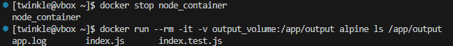
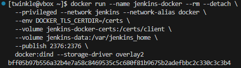
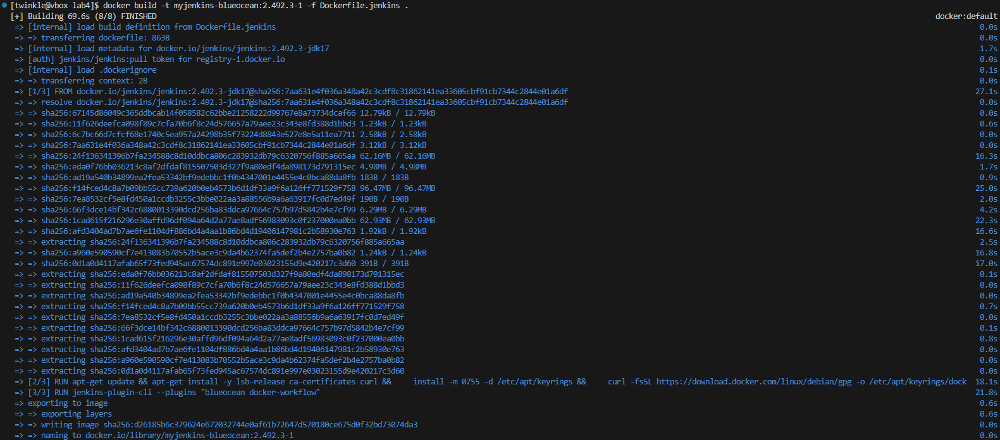
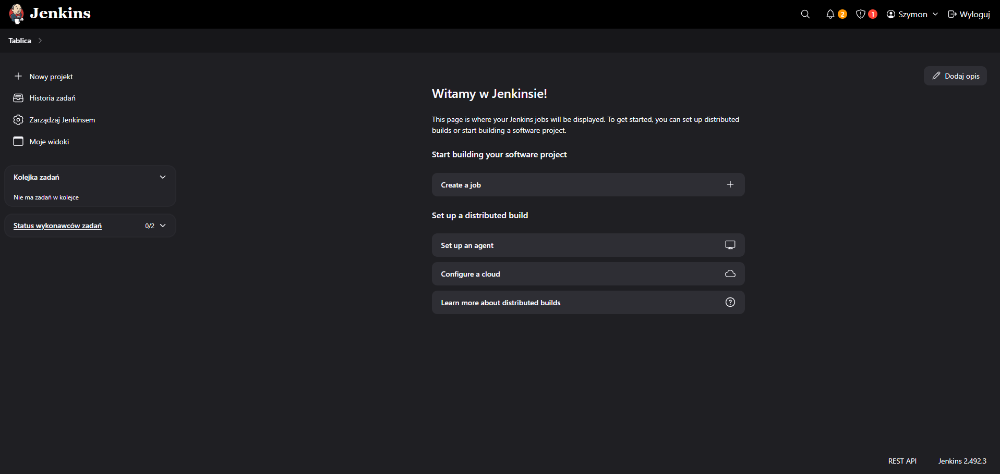

# Zajęcia 01

---
1. Zainstalowano klienta Git i obsługę kluczy SSH.


2. Sklonowano repozytorium za pomocą HTTPS i personal access token.


3. Utworzono dwa klucze SSH, inne niż RSA, w tym co najmniej jeden zabezpieczony hasłem. Skonfigurowano klucz SSH jako metodę dostępu do GitHuba. Sklonowano repozytorium z wykorzystaniem protokołu SSH oraz skonfigurowano 2FA.

- ***ECDSA***


**ECDSA** to algorytm oparty na krzywych eliptycznych, który oferuje dobrą wydajność i bezpieczeństwo przy krótkich kluczach, ale jest mniej powszechny niż ED25519.

- ***ED25519***


**ED25519** to nowoczesny i bezpieczny algorytm, który zapewnia wyższą odporność na ataki i jest rekomendowany do używania w SSH ze względu na swoją szybkość i efektywność.

4. Przełączono się na gałąź main, a następnie na grupową gałąź GCL05, gdzie utworzono gałąź o nazwie SO417771


5. Praca na nowej gałęzi

- W katalogu właściwym dla grupy utworzono nowy katalog, także o nazwie SO417771.

- Napisano Git hooka, czyli skrypt weryfikujący, że każdy mój "commit message" zaczyna się od "SO417771"

***Treść Git hooka***
```sh

#!/usr/bin/sh

EXPECTED_PREFIX="SO417771"

COMMIT_MSG_FILE=$1
COMMIT_MSG=$(head -n 1 "$COMMIT_MSG_FILE")

if [[ ! $COMMIT_MSG =~ ^$EXPECTED_PREFIX ]]; then
    echo "Błąd: Commit message musi zaczynać się od \"$EXPECTED_PREFIX\"."
    echo "Przykład: \"$EXPECTED_PREFIX: Opis zmiany\""
    exit 1
fi

exit 0

```

- Dodadano ten skrypt do stworzonego wcześniej katalogu.

- Skopiowanao go we właściwe miejsce, tak by uruchamiał się za każdym razem przy commit'cie.


### Test napisanego Git hooka


- Test potwierdza poprawność napisanego Git hooka

# Zajęcia 02

---

1. Zainstalowano Docker w systemie linuksowym, po czym stworzono konto na Docker Hub

2. Pobrano obrazy hello-world, busybox, ubuntu, fedora, mysql


3. Uruchomiono kontener z obrazu busybox


Podłączono się do kontenera interaktywnie i wywołaano numer wersji


Na obrazie widoczny jest numer wersji kontenera busybox. Jest to wersja ***v1.37.0***, która pojawia się zaraz po wywołaniu komendy `busybox --help`.


3. Uruchomiono "system w kontenerze" (czyli kontener z obrazu fedora)


4. Stworzono własny plik ***Dockerfile*** bazujący na fedorze klonujący nasze repo.

***Treść Dockerfile***
```sh

FROM fedora:latest

RUN dnf -y update && dnf install -y git && dnf clean all

WORKDIR /workspace

RUN git clone https://github.com/InzynieriaOprogramowaniaAGH/MDO2025_INO.git

CMD ["/bin/bash"]

```

5. Następnie go zbudowano oraz uruchomiono, aby zweryfikować że jest tam ściągnięte nasze repozytorium.


6. Pokazano uruchomione kontenery, które następnie usunięto:


7. Wyszczono obrazy:


# Zajęcia 03

---

## Node

1. Sklonowano repozytorium `node-js-dummy-test` z GitHub przy użyciu komendy `git clone`. Następnie zainstalowano wymagane zależności Node.js za pomocą dnf, w tym nodejs, nodejs-libs, oraz dokumentację i dodatkowe pakiety. Proces zakończył się pomyślnie, przygotowując środowisko do dalszych działań.


2. Po sklonowaniu repozytorium, uruchomiono komendę npm install w celu zainstalowania wymaganych zależności JavaScript.


3. W trzecim kroku uruchomiono serwer aplikacji za pomocą komendy `npm run start`, który zaczął nasłuchiwać na porcie 3000. Następnie przeprowadzono testy jednostkowe za pomocą komendy `npm run test`, która uruchomiła test index.test.js. Test przeszedł pomyślnie, a wynik wskazał na poprawne działanie aplikacji. Wszystkie testy zakończyły się sukcesem.


### Tworzenie dwóch plików Dockerfile automatyzujących kroki powyżej

4. Kontener pierwszy ma przeprowadzać wszystkie kroki aż do builda. Zbudowano go za pomocą komendy `docker build -t nodebld -f ./Dockerfile.nodebld .`. Kontener został nazwany nodebld i zawierał wszystkie wymagane zależności oraz kroki do zbudowania aplikacji.


***Dockerfile.nodebld***
```sh
FROM node

RUN git clone https://github.com/devenes/node-js-dummy-test

WORKDIR /node-js-dummy-test

RUN npm i 
```

- Obraz o nazwie nodebld został pomyślnie utworzony:


- Uruchomiono kontener nodebld za pomocą komendy `docker run --rm -it nodebld sh`, aby uzyskać interaktywny dostęp do środka kontenera. Po wejściu do kontenera, wylistowano zawartość katalogu, co ujawnia strukturę aplikacji, w tym pliki takie jak Dockerfile, package.json, src, node_modules, oraz inne zasoby aplikacji. Kontener jest gotowy do uruchomienia testów.


5. Zbudowano drugi kontener Docker za pomocą komendy `docker build -t nodetest -f ./Dockerfile.nodetest .`. Ten kontener jest przeznaczony do uruchamiania testów, nie przeprowadzając procesu builda, który był wykonany wcześniej w pierwszym kontenerze.


***Dockerfile.nodetest***
```sh
FROM nodebld
RUN npm test
```
- Uruchomiono drugi kontener nodetest za pomocą komendy `docker run --rm -it nodetest sh`. Po wejściu do kontenera, uruchomiono testy za pomocą npm test, które przebiegły pomyślnie. 


- W kontenerze działa nasza aplikacja, a także przeprowadziliśmy testy jednostkowe, co potwierdziło, że środowisko jest poprawnie skonfigurowane i działa zgodnie z oczekiwaniami.

---

## Irssi

1. W pierwszym kroku sklonowano repozytorium irssi z GitHub za pomocą komendy `git clone https://github.com/irssi/irssi.git`.


2. Po sklonowaniu repozytorium, użyto komendy `meson Build` do konfiguracji procesu budowy aplikacji irssi za pomocą narzędzia Meson. Proces wykazał, że wszystkie wymagane zależności, takie jak glib2 i pkg-config, są obecne i w odpowiednich wersjach.


Przed tym jednak doinstalowywano na bieżąco wszystkie wymagane zależności przed ponownym uruchomieniem procesu konfiguracji z użyciem komendy meson Build. Wymagało to zainstalowania kilku pakietów, takich jak:


Po zainstalowaniu tych zależności, komenda `meson Build` została ponownie uruchomiona, co pozwoliło kontynuować konfigurację aplikacji.

3. W tym kroku, po zainstalowaniu wymaganych zależności, uruchomiono komendę `ninja -C Build`, aby przeprowadzić proces budowy aplikacji irssi. Kompilacja przebiegła pomyślnie, choć pojawiły się ostrzeżenia dotyczące potencjalnych problemów z typami danych w niektórych plikach źródłowych (np. memcpy i różnice w rozmiarze tablic). Te ostrzeżenia nie uniemożliwiły jednak zakończenia procesu kompilacji, który zakończył się sukcesem.


4. Po zbudowaniu aplikacji, uruchomiono testy przy użyciu komendy `meson test`. Wszystkie testy zakończyły się sukcesem, a wyniki wskazują, że wszystkie podtesty przeszły pomyślnie. Testy obejmowały różne aspekty aplikacji irssi, takie jak formaty, IRC, kanały, i inne. Kompletne logi testów zostały zapisane w pliku testlog.txt.


### Tworzenie dwóch plików Dockerfile automatyzujących kroki powyżej

5. W tym kroku zbudowano kontener Docker dla aplikacji irssi za pomocą komendy `docker build -t irssibld -f ./Dockerfile.irssibld .`. Proces budowy kontenera obejmował pobranie obrazu bazowego fedora, zainstalowanie wymaganych zależności (takich jak git, gcc, glib2-devel, ncurses-devel, perl-Ext* i utf8proc), oraz sklonowanie repozytorium irssi. Na końcu kontener został zapisany z nazwą irssibld i jest gotowy do uruchomienia.


***Dockerfile.irssibld***
```sh
FROM fedora:latest

RUN dnf --assumeyes install git meson gcc glib2-devel ncurses-devel perl-Ext* utf8proc*
RUN git clone https://github.com/irssi/irssi
WORKDIR /irssi/
RUN meson Build
```

- Uruchomiono kontener irssibld za pomocą komendy `docker run --rm -it irssibld sh`. Po wejściu do kontenera, wylistowano jego zawartość, która obejmuje pliki i katalogi związane z aplikacją irssi, takie jak meson.build, src, tests, scripts oraz inne pliki konfiguracyjne i źródłowe. Kontener jest gotowy do przeprowadzenia testów.


6. W tym kroku zbudowano drugi kontener Docker o nazwie irssitest, korzystając z pliku Dockerfile.irssitest za pomocą komendy `docker build -t irssitest -f ./Dockerfile.irssitest .`. Kontener ten bazuje na wcześniej zbudowanym obrazie irssibld i przeprowadza testy aplikacji.


***Dockerfile.irssitest***
```sh
FROM irssibuild
WORKDIR /irssi/Build
RUN ninja test
```
- Uruchomiono kontener irssitest za pomocą komendy `docker run --rm -it irssitest sh`. Wszystkie testy zakończyły się sukcesem, a szczegółowe wyniki wskazują, że każdy test przeszedł pomyślnie. Kontener działa poprawnie i aplikacja irssi została przetestowana pomyślnie.


- W kontenerze irssitest pracuje aplikacja irssi z wszystkimi jej zależnościami i plikami konfiguracyjnymi.


# Zajęcia 04

---

## Zachowywanie stanu

1. Woluminy `input_volume` i `output_volume` zostały utworzone.


2. W kontenerze o nazwie `node_container` zostały zamontowane woluminy `input_volume` i `output_volume` do odpowiednich katalogów /app/input oraz /app/output. Następnie zaktualizowano system i zainstalowano wymagane pakiety.


3. Repozytorium node-js-dummy-test zostało sklonowane na wolumin wejściowy przy użyciu polecenia git clone w kontenerze. Dokładny proces wyglądał następująco:


- Klonowanie repozytorium: Repozytorium zostało sklonowane z adresu https://github.com/devenes/node-js-dummy-test.git za pomocą komendy git clone.
- Przeniesienie repozytorium do kontenera: Po sklonowaniu repozytorium do lokalnego katalogu, pliki zostały przeniesione do kontenera za pomocą polecenia: `docker cp node-js-dummy-test/ node_container:/app/input`
- Dzięki temu zawartość repozytorium trafiła do katalogu /app/input w kontenerze, który jest zamontowany na woluminie input_volume.

4. Po sklonowaniu repozytorium i skopiowaniu go do kontenera, zawartość katalogu /app/input w kontenerze została zweryfikowana. W katalogu tym znajdują się pliki i foldery, takie jak Dockerfile, LICENSE, README.md, package.json, package-lock.json, a także foldery public, src, views i readme. Wszystkie te pliki pochodzą z repozytorium, które zostało sklonowane na wolumin wejściowy.


5. Po skopiowaniu repozytorium do kontenera, zainstalowano wymagane pakiety przy pomocy polecenia `npm install`.


6. Po zainstalowaniu wszystkich wymaganych pakietów, uruchomiono testy aplikacji za pomocą komendy npm test. Wszystkie testy zakończyły się pomyślnie.


7. Po uruchomieniu aplikacji i zapisaniu logów w pliku app.log, pliki zostały zapisane na woluminie wyjściowym, co zapewnia ich dostępność po wyłączeniu kontenera. Proces ten wyglądał następująco:
- Po uruchomieniu aplikacji za pomocą komendy node src/index.js, logi zostały zapisane w pliku app.log, który trafił do katalogu /app/output w kontenerze.
- Zawartość repozytorium (w tym pliki index.js oraz index.test.js) została skopiowana z katalogu /app/input/src/ do katalogu /app/output za pomocą komendy cp -r. Dzięki temu wszystkie pliki, w tym logi aplikacji, zostały zapisane na woluminie wyjściowym i będą dostępne po wyłączeniu kontenera.


8. Po zatrzymaniu kontenera node_container za pomocą komendy docker stop, został uruchomiony nowy kontener na obrazie alpine. W kontenerze tym, przy zamontowanym woluminie output_volume, zweryfikowano, że pliki zapisane wcześniej na woluminie (w tym app.log, index.js, i index.test.js) są nadal dostępne. Dzięki temu możliwe było potwierdzenie, że zapisane pliki pozostały dostępne po wyłączeniu kontenera.



9. W tej części, repozytorium node-js-dummy-test zostało sklonowane bezpośrednio wewnątrz kontenera, w katalogu /app/input/repo/. Klonowanie odbyło się w katalogu /app/input/repo/, co oznacza, że pliki repozytorium trafiły bezpośrednio na wolumin wejściowy.


10. Aby wykonać te kroki za pomocą docker build i pliku Dockerfile, można użyć opcji `RUN --mount` w celu pracy z woluminami podczas procesu budowania obrazu. Dzięki tej opcji możemy przeprowadzić operację klonowania repozytorium bez konieczności uruchamiania kontenera i manualnego używania Gita w środku kontenera.

- Można dodać w pliku Dockerfile instrukcję RUN z opcją --mount, aby zamontować wolumin wejściowy i wykonać komendę git clone wewnątrz procesu budowania.
- Wolumin wejściowy będzie dostępny podczas budowania obrazu, dzięki czemu repozytorium zostanie sklonowane bezpośrednio na ten wolumin.

***Przykład użycia RUN --mount w Dockerfile***
```sh
FROM node:16

RUN --mount=type=volume,source=input_volume,target=/app/input \
    git clone https://github.com/devenes/node-js-dummy-test.git /app/input/repo

WORKDIR /app/input/repo
RUN npm install

COPY . /app/output/repo
```

- Użycie `RUN --mount` w Dockerfile jest doskonałym rozwiązaniem, jeśli chcemy zautomatyzować proces klonowania repozytorium oraz instalacji zależności w trakcie budowania obrazu, bez konieczności ręcznego klonowania repozytorium wewnątrz kontenera.

---

## Eksponowanie portu

1. Został uruchomiony kontener z serwerem iperf3 za pomocą polecenia docker run. Obraz networkstatic/iperf3 został pobrany z repozytorium, a kontener został uruchomiony w tle na porcie 5201. W wyniku polecenia docker ps widoczny jest status kontenera.


2. Został uzyskany adres IP kontenera iperf-server za pomocą polecenia `docker inspect z opcją grep IP`. Adres IP kontenera to 172.17.0.2, co umożliwi późniejsze połączenie się z serwerem iperf3 z innych kontenerów lub urządzeń w sieci.


3. Został uruchomiony drugi kontener, który połączył się z serwerem iperf3, używając adresu IP 172.17.0.2 i portu 5201. Polecenie docker run uruchomiło klienta iperf3, który rozpoczął pomiar przepustowości. Z wyników można odczytać, że transfer danych wynosił średnio 50-51 Gbit/s.


4. Została utworzona dedykowana sieć mostkowa o nazwie `bridge-network` za pomocą polecenia `docker network create`. Użyto sterownika `bridge`, co umożliwia połączenie kontenerów w tej samej sieci.


5. Został zatrzymany i usunięty poprzedni kontener iperf-server, a następnie utworzony nowy kontener serwera iperf3, tym razem podłączony do sieci mostkowej bridge-network. Został również uruchomiony klient iperf3 w tym samym mostku sieciowym, który połączył się z serwerem i przeprowadził test przepustowości. Wyniki pokazały transfer danych na poziomie około 45-46 Gbit/s.


6. Został uruchomiony kontener klienta iperf3, który połączył się z serwerem iperf3 działającym w kontenerze, używając adresu IP 172.18.0.2 (w tej samej sieci mostkowej bridge-network). Jednak w tym przypadku połączenie zostało nawiązane z hosta, a nie z innego kontenera. Test przepustowości wykazał transfer danych na poziomie 55.1 Gbit/s.


7. Został uzyskany adres IP kontenera iperf-server za pomocą polecenia `docker inspect`. Adres IP przypisany do kontenera to 172.18.0.2, co potwierdza, że serwer iperf3 działa w tej samej sieci mostkowej (bridge-network), do której został podłączony klient.


8. Zostały wyświetlone logi kontenera iperf-server, które pokazują dwa testy przepustowości:


- Pierwszy test – połączenie z kontenera o adresie IP 172.18.0.3, transfer danych na poziomie 44-46 Gbit/s.
- Drugi test – połączenie z hosta (adres IP 172.18.0.1), z zakończeniem transferu na poziomie 55.1 Gbit/s.

- Logi te potwierdzają prawidłowe działanie zarówno serwera, jak i klienta iperf3, oraz umożliwiają analizę przepustowości między kontenerami i hostem.

---

## Instancja Jenkins

1. W pierwszym kroku wykonano polecenie do utworzenia dedykowanej sieci Docker o nazwie jenkins. Następnie wykonano polecenie pobrania obrazu docker:dind. 


2. Uruchomiono kontener Docker z obrazem docker:dind:



3. Zbudowano obraz na podstawie pliku Dockerfile.jenkins: `docker build -t myjenkins-blueocean:2.492.3-1 -f Dockerfile.jenkins .`



4. Uruchomiono kontener myjenkins-blueocean:2.492.3-1 z ustawieniami:


5. Na liście widoczne są dwa kontenery:


***Dockerfile.jenkins***
```sh
FROM jenkins/jenkins:2.492.3-jdk17
USER root
RUN apt-get update && apt-get install -y lsb-release ca-certificates curl && \
    install -m 0755 -d /etc/apt/keyrings && \
    curl -fsSL https://download.docker.com/linux/debian/gpg -o /etc/apt/keyrings/docker.asc && \
    chmod a+r /etc/apt/keyrings/docker.asc && \
    echo "deb [arch=$(dpkg --print-architecture) signed-by=/etc/apt/keyrings/docker.asc] \
    https://download.docker.com/linux/debian $(. /etc/os-release && echo \"$VERSION_CODENAME\") stable" \
    | tee /etc/apt/sources.list.d/docker.list > /dev/null && \
    apt-get update && apt-get install -y docker-ce-cli && \
    apt-get clean && rm -rf /var/lib/apt/lists/*
USER jenkins
RUN jenkins-plugin-cli --plugins "blueocean docker-workflow"
```

6. Uruchomiono jenkins w przeglądarce, a naastępnie utworzono konta admina


