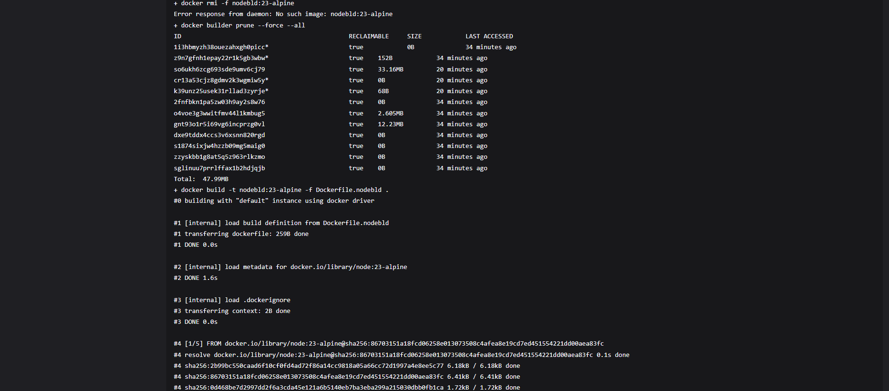
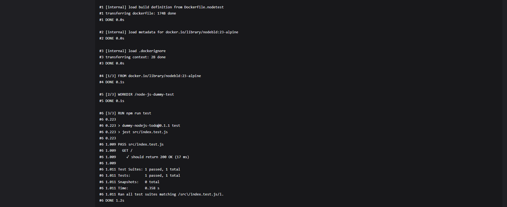

# Zajęcia 05

---

## Przygotowanie ~ Instancja Jenkins

1. Wykonano polecenie do utworzenia dedykowanej sieci Docker o nazwie jenkins. Następnie wykonano polecenie pobrania obrazu docker:dind. 


2. Uruchomiono kontener Docker z obrazem docker:dind:


3. Zbudowano obraz na podstawie pliku Dockerfile.jenkins: `docker build -t myjenkins-blueocean:2.492.3-1 -f Dockerfile.jenkins .`


4. Uruchomiono kontener myjenkins-blueocean:2.492.3-1 z ustawieniami:


5. Na liście widoczne są dwa kontenery:


***Dockerfile.jenkins***
```sh
FROM jenkins/jenkins:2.492.3-jdk17
USER root
RUN apt-get update && apt-get install -y lsb-release ca-certificates curl && \
    install -m 0755 -d /etc/apt/keyrings && \
    curl -fsSL https://download.docker.com/linux/debian/gpg -o /etc/apt/keyrings/docker.asc && \
    chmod a+r /etc/apt/keyrings/docker.asc && \
    echo "deb [arch=$(dpkg --print-architecture) signed-by=/etc/apt/keyrings/docker.asc] \
    https://download.docker.com/linux/debian $(. /etc/os-release && echo \"$VERSION_CODENAME\") stable" \
    | tee /etc/apt/sources.list.d/docker.list > /dev/null && \
    apt-get update && apt-get install -y docker-ce-cli && \
    apt-get clean && rm -rf /var/lib/apt/lists/*
USER jenkins
RUN jenkins-plugin-cli --plugins "blueocean docker-workflow"
```

6. Uruchomiono jenkins w przeglądarce, a naastępnie utworzono konta admina


---

## Zadania wstępne

### Projekt, który wyświetla `uname`


### Projekt, projekt, który zwraca błąd, gdy... godzina jest nieparzysta

```sh
#!/bin/bash

HOUR=$(date +%H)
HOUR=$((10#$HOUR))  

if [ $((HOUR % 2)) -ne 0 ]; then
    echo "Błąd: Godzina ($HOUR) jest nieparzysta."
    exit 1
else
    echo "OK: Godzina ($HOUR) jest parzysta."
    exit 0
fi
```

Godzina nieparzysta - błąd


Godzina parzysta - brak błędu


### Pobierz w projekcie obraz kontenera `ubuntu` (stosując `docker pull`)


### Obiekt typu pipeline

Treść pipeline

```sh

pipeline {
    agent any

    stages {
        stage('Clone repo') {
            steps {
                sh 'rm -fr MDO2025_INO'
                sh 'git clone https://github.com/InzynieriaOprogramowaniaAGH/MDO2025_INO.git'
                dir('MDO2025_INO') {
                    sh 'git checkout SO417771'
                }
            }
        }

        stage('Build Image') {
            steps {
                dir('MDO2025_INO/ITE/GCL05/SO417771/Sprawozdanie2/lab6-7') {
                    sh '''
                        docker rmi -f nodebld:23-alpine || true
                        docker builder prune --force --all || true
                        docker build -t nodebld:23-alpine -f Dockerfile.nodebld .
                    '''
                }
            }
        }

        stage('Test Image') {
            steps {
                dir('MDO2025_INO/ITE/GCL05/SO417771/Sprawozdanie2/lab6-7') {
                    sh 'docker build -t node-test -f Dockerfile.nodetest .'
                }
            }
        }
    }
}

```

**Clone repo:**
Klonuje repozytorium z GitHuba i przechodzi na gałąź SO417771.

**Build Image:**
Usuwa stary obraz nodebld:23-alpine, czyści pamięć podręczną Dockera, a następnie buduje nowy obraz z pliku Dockerfile.nodebld.

**Test Image:**
Buduje obraz node-test na podstawie pliku Dockerfile.nodetest, przygotowując środowisko do testów.

Całość ma na celu zbudowanie obrazów i przygotowanie środowiska do uruchomienia testów.

***Pierwsze uruchomienie***

Console output








***Drugie uruchomienie***


# Zajęcia 06-07

---

## Opis node-js-dummy-test

Repozytorium node-js-dummy-test to prosty projekt oparty na Node.js, zaprojektowany do testowania procesów CI/CD. Zawiera pliki Dockerfile, które umożliwiają szybkie skonfigurowanie środowiska, zbudowanie obrazu Docker oraz uruchomienie testów jednostkowych. Projekt działa w lekkim środowisku Node.js, idealnym do zastosowań CI/CD. Proces CI/CD obejmuje klonowanie repozytorium, budowanie obrazu, uruchamianie testów wewnątrz kontenera, wdrożenie aplikacji w kontenerze Docker, testowanie jej działania przy użyciu `curl` oraz archiwizowanie logów. Wszystko to odbywa się automatycznie, co zapewnia pełną integrację z systemem kontroli wersji oraz procesem ciągłego dostarczania. Projekt jest również dobrym przykładem integracji Dockera w CI, z możliwością wyboru między Docker-in-Docker a natywnym wykorzystaniem Dockera przez socket.

## Diagram UML


## Pełny pipeline

```sh
pipeline {
    agent any

    environment {
        WORK_DIR = 'MDO2025_INO/ITE/GCL05/SO417771/Sprawozdanie2/lab6-7'
        VERSION_TAG = "1.0"
        NODE_TAG = '23-alpine'
        BUILD_IMAGE = "nodebld:${NODE_TAG}"
        TEST_IMAGE = "nodetest:v${VERSION_TAG}"
        DEPLOY_IMAGE = "nodedeploy:v${VERSION_TAG}"
    }

    stages {
        stage('Prepare') {
            steps {
                sh '''
                    rm -rf MDO2025_INO
                    git clone https://github.com/InzynieriaOprogramowaniaAGH/MDO2025_INO.git
                    cd MDO2025_INO
                    git checkout SO417771
                '''
            }
        }

        stage('Logs') {
            steps {
                dir(env.WORK_DIR) {
                    sh 'mkdir -p logs'
                }
            }
        }

        stage('Build') {
            steps {
                dir(env.WORK_DIR) {
                    sh "docker build -t ${BUILD_IMAGE} -f Dockerfile.nodebld . > logs/build.log 2>&1 || (cat logs/build.log && false)"
                }
            }
        }

        stage('Tests') {
            steps {
                dir(env.WORK_DIR) {
                    sh "docker build -t ${TEST_IMAGE} -f Dockerfile.nodetest . > logs/test.log 2>&1 || (cat logs/test.log && false)"
                }
            }
        }

        stage('Deploy') {
            steps {
                sh 'docker network create my_network || true'
                dir(env.WORK_DIR) {
                    sh """
                        docker build -t ${DEPLOY_IMAGE} -f Dockerfile.nodedeploy .
                        docker rm -f app || true
                        docker run -d -p 3000:3000 --name app --network my_network ${DEPLOY_IMAGE}
                    """
                }
            }
        }

        stage('Test Deployment') {
            steps {
                dir(env.WORK_DIR) {
                    sh '''
                        docker run --network my_network --rm curlimages/curl curl -v http://app:3000
                    '''
                }
            }
        }

        stage('Publish') {
            steps {
                dir(env.WORK_DIR) {
                    sh '''
                        mkdir -p artifacts_${VERSION_TAG}
                        tar -cvf artifacts_${VERSION_TAG}.tar logs/*.log
                    '''
                    archiveArtifacts artifacts: "artifacts_${VERSION_TAG}.tar"
                }
            }
        }
    }

    post {
        always {
            sh """
                docker rmi ${BUILD_IMAGE} ${TEST_IMAGE} ${DEPLOY_IMAGE} || true
                docker system prune --all --volumes --force || true
            """
        }
    }
}
```

## Opis poszczególnych stage'y pipeline'a

### Zmienne środowiskowe w pipeline'u ułatwiają konfigurację i zarządzanie:

`WORK_DIR` Ścieżka do katalogu z projektem

`VERSION_TAG` Numer wersji aplikacji

`NODE_TAG` Wersja obrazu Node.js

`BUILD_IMAGE`, `TEST_IMAGE`, `DEPLOY_IMAGE`: Tagowanie obrazów Docker dla budowania, testowania i wdrożenia aplikacji, z wersją bazującą na `VERSION_TAG`.

### Prepare
W tym etapie repozytorium jest klonowane z GitHub i przełączane na odpowiednią gałąź (`SO417771`). Usuwany jest wcześniej sklonowany folder repo, a następnie następuje jego ponowne pobranie:

```sh
rm -rf MDO2025_INO
git clone https://github.com/InzynieriaOprogramowaniaAGH/MDO2025_INO.git
cd MDO2025_INO
git checkout SO417771
```
Celem jest przygotowanie repozytorium do dalszych etapów.

### Logs
W tym etapie tworzony jest katalog logs w katalogu roboczym, jeśli jeszcze nie istnieje. Logi z różnych etapów pipeline’a będą zapisywane w tym katalogu:

```sh
sh 'mkdir -p logs'
```
Zapewnienie struktury do przechowywania logów, co ułatwia późniejszą analizę.

### Build
Ten etap odpowiada za budowanie obrazu Docker na podstawie pliku `Dockerfile.nodebld`. Obraz jest tagowany jako `nodebld:23-alpine`. Logi z procesu budowy są zapisywane w pliku `build.log`:

```sh
docker build -t ${BUILD_IMAGE} -f Dockerfile.nodebld . > logs/build.log 2>&1 || (cat logs/build.log && false)
```
Jeśli build się nie powiedzie, logi z procesu zostaną wyświetlone w konsoli Jenkins.

### Tests
W tym etapie tworzony jest obraz testowy na podstawie `Dockerfile.nodetest`, a następnie uruchamiane są testy w kontenerze. Logi są zapisywane w `test.log`. Jeśli testy się nie powiodą, logi będą wyświetlone w konsoli Jenkins:

```sh
docker build -t ${TEST_IMAGE} -f Dockerfile.nodetest . > logs/test.log 2>&1 || (cat logs/test.log && false)
```
Ten etap sprawdza poprawność aplikacji, uruchamiając testy w kontenerze.

### Deploy
W tym etapie tworzony jest obraz produkcyjny z pliku `Dockerfile.nodedeploy`, a następnie kontener jest uruchamiany w sieci Docker (`my_network`). Kontener jest mapowany na port `3000`:

```sh
docker network create my_network || true
docker build -t ${DEPLOY_IMAGE} -f Dockerfile.nodedeploy .
docker rm -f app || true
docker run -d -p 3000:3000 --name app --network my_network ${DEPLOY_IMAGE}
```
Jeśli kontener o nazwie `app` istnieje, zostanie usunięty przed uruchomieniem nowego. Następnie uruchomiony jest nowy kontener, który udostępnia aplikację na porcie 3000.

### Test Deployment
W tym etapie testowana jest aplikacja uruchomiona w kontenerze. Za pomocą narzędzia `curl` sprawdzane jest, czy aplikacja działa poprawnie w sieci Docker:

```sh
docker run --network my_network --rm curlimages/curl curl -v http://app:3000
```
Jeśli aplikacja działa poprawnie, test przechodzi, a jeśli nie – proces zostaje zatrzymany.

### Publish
W tym etapie wszystkie logi z procesu budowania i testowania są pakowane do archiwum (`tar`) i archiwizowane jako artefakty Jenkinsa:

```sh
mkdir -p artifacts_${VERSION_TAG}
tar -cvf artifacts_${VERSION_TAG}.tar logs/*.log
archiveArtifacts artifacts: "artifacts_${VERSION_TAG}.tar"
```

### Post-actions (Cleaning)
Na koniec, w sekcji `post { always { ... } }`, wszystkie obrazy Docker (`nodebld`, `nodetest`, `nodedeploy`) są usuwane, aby zwolnić zasoby systemowe. Dodatkowo system Docker jest oczyszczany z niepotrzebnych danych:

```sh
docker rmi ${BUILD_IMAGE} ${TEST_IMAGE} ${DEPLOY_IMAGE} || true
docker system prune --all --volumes --force || true
```
To pomaga utrzymać porządek na maszynie wykonawczej i zapobiega gromadzeniu się niepotrzebnych danych.

## Przygotowanie Pipeline'a w Jenkins przy użyciu SCM


Aby uruchomić Pipeline za pomocą SCM, stworzyłem nowy projekt Pipeline w Jenkinsie. Następnie wybrałem opcję "Pipeline script from SCM", żeby uruchomić Pipeline bezpośrednio z repozytorium.

## Wyniki uruchomienia


Wszystko przebiegło pomyślnie.

## Console output oraz logi


***build.log***

Zawartość pliku znajduje się w [plik.txt](lab6-7/build.log).

***test.log***

Zawartość pliku znajduje się w [plik.txt](lab6-7/test.log).

## Podsumowanie

Pipeline jest dobrze zaplanowany i wykonuje pełny cykl CI/CD: od klonowania repo, przez budowanie i testowanie obrazów Docker, aż po wdrożenie, testowanie aplikacji, publikację logów i czyszczenie środowiska. Wszystko odbywa się w sposób zautomatyzowany, z wykorzystaniem standardowych narzędzi takich jak Docker i Git.