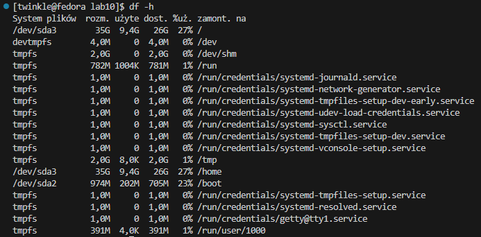

# Zajęcia 08

---

## Automatyzacja i zdalne wykonywanie poleceń za pomocą Ansible

Celem laboratorium jest zautomatyzowanie obsługi środowiska wielomaszynowego za pomocą Ansible. W ramach zadania skonfigurowano przynajmniej dwie maszyny wirtualne z dostępem SSH bez hasła, stworzono inwentarz systemów oraz przygotowano playbooki do wykonywania podstawowych operacji administracyjnych, takich jak pingowanie maszyn, aktualizacja pakietów, zarządzanie kontenerami Docker czy przesyłanie i uruchamianie aplikacji. Wszystkie te operacje zostały zawarte w rolach Ansible, co pozwala na ich automatyczne i wielokrotne uruchamianie, eliminując potrzebę ręcznego zarządzania maszynami i procesami wdrożeniowymi.

## Instalacja zarządcy Ansible

***Utworzenie nowej maszyny wirtualnej***

W VirtualBox utworzono maszynę z minimalnym zestawem oprogramowania, korzystając z tego samego systemu operacyjnego, co wcześniej używana maszyna. Dodatkowo zainstalowano programy 'tar' i 'sshd', a także ustawiono hostname na 'ansible-target' oraz użytkownika na 'ansible'.


Instalacja programu tar i OpenSSH


Dodatkowo wykonano migawkę maszyny oraz jej eksport.


***Instalacja Ansible***

Na głównej maszynie zainstalowano oprogramowanie Ansible.


Wymieniono klucze SSH pomiędzy użytkownikami na maszynach, aby logowanie przez ssh nie wymagało wpisywania hasła.

```sh
ssh-keygen -f ~/.ssh/id_rsa_ansible
```

Powyższa komenda na głównej maszynie generuje klucz ssh.


```sh
sudo nano /etc/hosts
```

Powyższa komenda otworzy plik hosts do którego zostanie dodany adres IP hosta ansible-target wraz z dopiskiem jego nazwy.


```sh
ssh-copy-id -i ~/.ssh/id_rsa_ansible.pub ansible@ansible-target
```

Powyższa komenda kopiuje klucz ssh na maszynę ansible-target. Podczas przesyłania klucza ssh wymagane jest podanie hasła.


```sh
ssh ansible@ansible-target
```

Powyższa komenda łączy się po ssh z maszyną ansible-target. Pokazuje to tym samym, że nastąpiła poprawna wymiana kluczy i podawanie hasła nie jest wymagane.


## Inwentaryzacja

Zmieniono nazwe maszyny


Wprowadzono nazwy DNS maszyn stosując 'etc/hosts' na obu maszynach.


Dzięki temu możliwe jest wywoływanie komputerów za pomocą nazw zamiast używania tylko adresów IP. Łączność została zweryfikowana poprzez wzajemne wykonanie polecenia 'ping'.


Stworzono plik inwentaryzacji 'inventory.yaml' z sekcjami 'Orchestrators' oraz 'Endpoints'

```sh
Orchestrators:
  hosts:
    fedora:
      ansible_user: twinkle
      ansible_connection: local

Endpoints:
  hosts:
    ansible-target:
      ansible_user: ansible
```

Wysłano żądanie 'ping' do wszystkich maszyn w celu przetestowania łączności.


## Zdalne wywołanie procedur

Utworzenie pliku playbook.yml

```sh
- name: Playbook
  hosts: all
  gather_facts: yes
  tasks:
    - name: Ping do wszystkich maszyn
      ansible.builtin.ping:

- name: Skopiuj plik inventory.yaml na Endpoints
  hosts: Endpoints
  gather_facts: yes
  tasks:
    - name: Skopiuj plik inwentaryzacji
      ansible.builtin.copy:
        src: ./inventory.yaml
        dest: /tmp/inventory.yaml
```

`name` -> definiuje nazwę operacji.

`hosts` -> określa, na jakich hostach operacja ma zostać wykonana.

`gather_facts` -> opcja, która umożliwia pobranie informacji o systemie (np. OS, RAM, CPU).

`task` -> sekcja, w której definiuje się konkretne zadanie do wykonania.

Pierwsze uruchomienie playbooka

```sh
ansible-playbook -i inventory.yaml playbook.yml
```


Drugie uruchomienie playbooka


Aktualizacja pakietów w systemie oraz restart usług

```sh
sudo dnf install rngd
```

Powyższa komenda została wykonana na maszynie ansible-target w celu zainstalowania narzędzia rngd.


```sh
- name: Playbook
  hosts: all
  gather_facts: yes
  tasks:
    - name: Ping do wszystkich maszyn
      ansible.builtin.ping:

- name: Skopiuj plik inventory.yaml na Endpoints
  hosts: Endpoints
  gather_facts: yes
  tasks:
    - name: Skopiuj plik inwentaryzacji
      ansible.builtin.copy:
        src: ./inventory.yaml
        dest: /tmp/inventory.yaml

- name: Aktualizacja systemu + restart usług
  hosts: Endpoints
  become: true
  tasks:
    - name: Aktualizacja pakietów
      ansible.builtin.package:
        name: "*"
        state: latest

    - name: Restart usługi sshd
      ansible.builtin.service:
        name: sshd
        state: restarted

    - name: Restart usługi rngd
      ansible.builtin.service:
        name: rngd
        state: restarted
```        

```sh
ansible-playbook -i inventory.yaml playbook.yml --ask-become-pass
```

Opcja --ask-become-pass spowoduje, że system poprosi o hasło roota. Po jego wprowadzeniu playbook zostanie uruchomiony. Playbook zakończył się pełnym powodzeniem.


Wykonanie operacji na maszynie, która ma wyłączony serwer SSH.

```sh
sudo systemctl stop sshd
```


Ansible nie udało się nawiązać połączenia SSH. Host został oznaczony jako unreachable w sekcji PLAY RECAP, a zadania dla tej maszyny nie zostały wykonane.


```sh
sudo systemctl start sshd
```


## Zarządzanie stworzonym artefaktem

Utworzenie szkieletu roli


Komenda ta stworzy szkielet roli deploy-container w bieżącym katalogu. Po jej wykonaniu zostanie wygenerowana standardowa struktura katalogów i plików.

Najpierw dodano obraz do repozytorium na Docker Hub.


*Uruchomienie playbooka, który:*
1. Instaluje Dockera na maszynie,
2. Pobiera opublikowany obraz z Docker Hub,
3. Uruchamia kontener z pobranego obrazu,
4. Zatrzymuje kontener,
5. Usuwa kontener po zakończeniu.

```sh
---
- name: Deploy Docker container on endpoints
  hosts: Endpoints
  become: yes
  tasks:

    - name: Install Docker
      package:
        name: docker
        state: present

    - name: Ensure Docker service is running
      systemd:
        name: docker
        state: started
        enabled: yes


    - name: Pull the Docker image from Docker Hub
      docker_image:
        name: szyocie2/node-app
        source: pull


    - name: Run the Docker container
      docker_container:
        name: node-app
        image: szyocie2/node-app:latest
        state: started
        restart_policy: unless-stopped
        ports:
          - "3000:3000"


    - name: Wait for the container to be ready
      wait_for:
        host: localhost
        port: 3000
        delay: 5
        timeout: 30

    - name: Verify that the application is running
      uri:
        url: http://localhost:3000
        method: GET
        status_code: 200


    - name: Stop and remove the container
      docker_container:
        name: node-app
        state: absent
```

Uruchomienie playbooka

```sh
ansible-playbook -i inventory.yaml playbook_deploy.yml --ask-become-pass
```

Powyższa komenda uruchamia playbook. Opcja -i wskazuje plik inventory.yaml. Opcja --ask-become-pass spowoduje, że system poprosi o hasło roota.


Ponowne uruchomienie, ale tym razem playbooki są zgodne z architekturą ansible-galaxy

deploy-docker.yml

```sh
- name: Deploy Docker container on endpoints
  hosts: Endpoints
  become: yes
  vars:
    docker_image_name: "szyocie2/node-app"
    docker_image_tag: "latest"
    docker_container_name: "node-app"
    host_port: "3000"
    container_port: "3000"
  roles:
    - deploy-container
```

tasks/main.yml

```sh
---
- name: Install Docker
  package:
    name: docker
    state: present

- name: Ensure Docker service is running
  systemd:
    name: docker
    state: started
    enabled: yes

- name: Pull the Docker image from Docker Hub
  docker_image:
    name: "{{ docker_image_name }}"
    source: pull

- name: Run the Docker container
  docker_container:
    name: "{{ docker_container_name }}"
    image: "{{ docker_image_name }}:{{ docker_image_tag }}"
    state: started
    restart_policy: unless-stopped
    ports:
      - "{{ host_port }}:{{ container_port }}"

- name: Wait for the container to be ready
  wait_for:
    host: localhost
    port: "{{ container_port }}"
    delay: 5
    timeout: 30

- name: Verify that the application is running
  uri:
    url: http://localhost:{{ container_port }}
    method: GET
    status_code: 200

- name: Stop and remove the container
  docker_container:
    name: "{{ docker_container_name }}"
    state: absent
```

defaults/main.yml

```sh
defaults/main.yml:
docker_image_name: "szyocie2/node-app"
docker_image_tag: "latest"
docker_container_name: "node-app"
host_port: "3000"
container_port: "3000"
```


# Zajęcia 09

---

## Pliki odpowiedzi dla wdrożeń nienadzorowanych

Celem laboratorium było zdobycie praktycznych umiejętności w automatyzacji instalacji systemu operacyjnego przy pomocy plików Kickstart w systemie Fedora. Podczas zajęć opracowano i zmodyfikowano plik odpowiedzi, który umożliwia przeprowadzenie nienadzorowanej instalacji systemu, obejmując konfigurację użytkowników, repozytoriów, partycjonowania dysku oraz automatyczne uruchomienie kontenera Docker. Laboratorium pozwoliło na zdobycie doświadczenia w tworzeniu i modyfikowaniu plików Kickstart, dodawaniu nowych funkcjonalności oraz testowaniu instalacji z różnych źródeł, zarówno lokalnych, jak i zdalnych.

Skopiowanie pliku odpowiedzi na głownej maszynie oraz Nadanie uprawnień do odczytu pliku odpowiedzi - `sudo chmod +777 anaconda-ks.cfg`


Edycja pliku odpowiedzi:

1. Dodanie wymaganych repozytoriów. Pierwsze repozytorium to główne repozytorium Fedory 41, które zawiera pakiety podstawowe. Drugie repozytorium to repozytorium aktualizacji, które oferuje najnowsze poprawki bezpieczeństwa oraz poprawki błędów dla Fedory 41.

```sh
url --mirrorlist=http://mirrors.fedoraproject.org/mirrorlist?repo=fedora-41&arch=x86_64
repo --name=updates --mirrorlist=http://mirrors.fedoraproject.org/mirrorlist?repo=updates-released-f41&arch=x86_64
```

2. Założenie czystego dysku i formatowanie go w całości:
– `--all`: usuwa wszystkie istniejące partycje na wszystkich dyskach.
– `--initlabel`: tworzy nową etykietę dysku.

```sh
clearpart --all --initlabel
```

3. Ustawienie `hostname`

```sh
network --hostname=fedora3
```

4. Cały plik `anaconda-ks.cfg` po modyfikacjach:

```sh
# Generated by Anaconda 41.35
# Generated by pykickstart v3.58
#version=DEVEL

# Keyboard layouts
keyboard --vckeymap=pl --xlayouts='pl'
# System language
lang pl_PL.UTF-8

# Network information
network --hostname=fedora3

url --mirrorlist=http://mirrors.fedoraproject.org/mirrorlist?repo=fedora-41&arch=x86_64
repo --name=updates --mirrorlist=http://mirrors.fedoraproject.org/mirrorlist?repo=updates-released-f41&arch=x86_64

%packages
@^custom-environment

%end

# Run the Setup Agent on first boot
firstboot --enable

# Generated using Blivet version 3.11.0
ignoredisk --only-use=sda
autopart
# Partition clearing information
clearpart --all --initlabel

# System timezone
timezone Europe/Warsaw --utc

# Root password
rootpw --iscrypted --allow-ssh $y$j9T$oNEvQnjmOFvMploCGg5QT6nn$q0hte1P56IoqbH6M/PFXp1MISfqHTwXXmCjY7NGSdl0
user --groups=wheel --name=twinkle --password=$y$j9T$oPCXPgnqH9SVzdLxXnDxGzyb$/5EdMRBjFYL17FVU.KwmDs8vDHfgjeoLGEnNuviDah3 --iscrypted --gecos="twinkle"
```

## Przeprowadzenie instalacji

Po wrzuceniu pliku odpowiedzi na swoją gałąź w repozytorium przedmiotowym, uruchomiono nową maszynę wirtualną z płyty ISO. Następnie, po naciśnięciu klawisza 'e' na ekranie GRUB, dokonano wpisu, który wskazuje na użycie pliku 'kickstart'.


Przebieg instalacji:


Instalacja przebiegła poprawnie:


## Rozszerzenie pliku odpowiedzi

1. Pakiety:

- Została dodana sekcja pakietów, w której poza grupą `custom-environment` dodano pakiety: `wget`, `curl` i `docker`.

```sh
%packages
@^custom-environment
wget
curl
docker
%end
```

2. Skrypty po instalacji (post-installation actions):

Wykonuje skrypty po instalacji:

- Ustawia i uruchamia Docker (`systemctl enable docker` oraz `systemctl start docker`).

- Dodaje użytkownika `szyocie2` do grupy `docker`.

- Pobiera kontener Node.js i uruchamia go jako usługę systemd (`node-app.service`).

- Otwiera port 3000 w zaporze i restartuje zaporę (`firewall-cmd --add-port=3000/tcp`).

```sh
%post --log=/root/post-install.log --interpreter=/bin/bash
echo "==> Setting up Docker..."
systemctl enable docker
systemctl start docker
usermod -aG docker szyocie2

echo "==> Deploying Node.js container..."
docker pull szyocie2/node-app:latest

cat <<EOF > /etc/systemd/system/node-app.service
[Unit]
Description=Node.js Application Container
Requires=docker.service
After=docker.service

[Service]
Restart=always
ExecStart=/usr/bin/docker run --rm -p 3000:3000 --name node-app szyocie2/node-app:latest
ExecStop=/usr/bin/docker stop node-app

[Install]
WantedBy=multi-user.target
EOF

systemctl enable node-app.service
firewall-cmd --add-port=3000/tcp --permanent
firewall-cmd --reload

echo "==> Node.js app deployment complete."
%end
```

3. Reboot:

- Po zakończeniu instalacji systemu, komputer zostanie zrestartowany.

4. Cały plik `anaconda-ks2.cfg` po rozszerzeniach:

```sh
# Generated by Anaconda 41.35
# Generated by pykickstart v3.58
#version=DEVEL

# Keyboard layouts
keyboard --vckeymap=pl --xlayouts='pl'
# System language
lang pl_PL.UTF-8

# Disk configuration
ignoredisk --only-use=sda
autopart
clearpart --all --initlabel

# System timezone
timezone Europe/Warsaw --utc

# Network information
network --hostname=fedora3

# Repositories
url --mirrorlist=http://mirrors.fedoraproject.org/mirrorlist?repo=fedora-41&arch=x86_64
repo --name=updates --mirrorlist=http://mirrors.fedoraproject.org/mirrorlist?repo=updates-released-f41&arch=x86_64

# Users
rootpw --iscrypted --allow-ssh $y$j9T$oNEvQnjmOFvMploCGg5QT6nn$q0hte1P56IoqbH6M/PFXp1MISfqHTwXXmCjY7NGSdl0
user --groups=wheel --name=twinkle --password=$y$j9T$oPCXPgnqH9SVzdLxXnDxGzyb$/5EdMRBjFYL17FVU.KwmDs8vDHfgjeoLGEnNuviDah3 --iscrypted --gecos="twinkle"

%packages
@^custom-environment
wget
curl
docker

%end

# Run the Setup Agent on first boot
firstboot --enable

%post --log=/root/post-install.log --interpreter=/bin/bash

echo "==> Setting up Docker..."
systemctl enable docker
systemctl start docker
usermod -aG docker szyocie2

echo "==> Deploying Node.js container..."
docker pull szyocie2/node-app:latest

cat <<EOF > /etc/systemd/system/node-app.service
[Unit]
Description=Node.js Application Container
Requires=docker.service
After=docker.service

[Service]
Restart=always
ExecStart=/usr/bin/docker run --rm -p 3000:3000 --name node-app szyocie2/node-app:latest
ExecStop=/usr/bin/docker stop node-app

[Install]
WantedBy=multi-user.target
EOF

systemctl enable node-app.service
firewall-cmd --add-port=3000/tcp --permanent
firewall-cmd --reload

echo "==> Node.js app deployment complete."
%end

reboot
```


Weryfikacja działania:


# Zajęcia 10

---

## Wdrażanie na zarządzalne kontenery: Kubernetes (1)

Celem laboratorium było zdobycie praktycznych umiejętności w zakresie wdrażania aplikacji na Kubernetesie przy użyciu Minikube. Podczas ćwiczeń zainstalowano i skonfigurowano lokalny klaster, przygotowano plik konfiguracyjny do wdrożenia, uruchomiono aplikację w kontenerach oraz przeprowadzono ekspozycję usług i testowanie komunikacji z aplikacją. Laboratorium umożliwiło nabycie doświadczenia w zarządzaniu zasobami Kubernetes oraz automatyzacji procesu wdrażania aplikacji kontenerowych.

Instalacja minikube

```sh
curl -LO https://storage.googleapis.com/minikube/releases/latest/minikube-latest.x86_64.rpm
sudo rpm -Uvh minikube-latest.x86_64.rpm
```

Powyższe komendy instalują Minikube na systemie opartym na RPM.


Uruchomienie Kubernesta


Utworzenie aliasa oraz wyświetlenie listy wszystkich węzłów w klastrze Kubernetesa.

```sh
alias minikubectl='minikube kubectl --'
minikubectl get nodes
```


Wyświetlenie stanu lokalnego klastra Kubernetesa uruchomionego przez Minikube.


```sh
df -h
```

Powyższe polecenie wyświetli dostępne miejsce na dysku. W moim przypadku wynosi ono około 26 GB, co oznacza, że wymaganie dotyczące wolnego miejsca na dysku zostało spełnione.



Uruchomienie Dashboard

```sh
minikube dashboard --url
```


Na tej stronie zapoznano się z funkcjalnościami Kubernetesa.

## Analiza posiadanego kontenera

Wybrałem aplikację 'node-js-dummy-test', nad którą pracuję od początku zajęć. Uruchomiono aplikacje w konenerze:

```sh
docker run --name node-app -p 3000:3000 -dit szyocie2/node-app:latest
```

Powyższa komenda uruchomi kontener o nazwie `node-app` na bazie obrazu `szyocie2/node-app:latest` oraz przekieruje port 3000 kontenera na port 3000 maszyny wirtualnej.


## Uruchomienie oprogramowania

Uruchomienie aplikacji w kontenerze na stosie Kubernetesa

```sh
minikubectl run node-app-pod --image=szyocie2/node-app:latest --port=3000 --labels app=node-app-pod
```

oraz przedstawienie działania poda

```sh
minikubectl get pods
```


Wyprowadzenie portu celem eksponowania funkcjonalności

```sh
minikubectl port-forward pod/node-app-pod 3000:3000
```

Powyższa komenda eksportuje port `3000` poda na lokalnym porcie `3000`.


## Przekucie wdrożenia manualnego w plik wdrożenia

`deploy.yaml`

```sh
apiVersion: apps/v1
kind: Deployment
metadata:
  name: node-deployment
  labels:
    app: node
    environment: production

spec:
  replicas: 4
  selector:
    matchLabels:
      app: node-app
  template:
    metadata:
      labels:
        app: node-app
    spec:
      restartPolicy: Always
      containers:
      - name: node-app-container
        image: szyocie2/node-app:latest
        ports:
          - containerPort: 3000
            protocol: TCP
        env:
          - name: NODE_ENV
            value: "production"
        resources:
          requests:
            memory: "64Mi"
            cpu: "250m"
          limits:
            memory: "128Mi"
            cpu: "500m"

```

Plik YAML tworzy Deployment w Kubernetesie, który uruchamia 4 repliki kontenerów aplikacji Node.js. Kontenery korzystają z obrazu `szyocie2/node-app:latest`, nasłuchują na porcie `3000`, ustawiają zmienną środowiskową `NODE_ENV` na production, oraz mają określone limity i wymagania zasobów (64Mi RAM, 250m CPU dla requests, 128Mi RAM, 500m CPU dla limits). Kontenery będą zawsze restartowane w razie awarii.

Uruchomienie

```sh
minikubectl apply -f deploy.yaml
```

Powyższa komenda wdraża zasoby zdefiniowane w pliku deploy.yaml do klastra Kubernetes.


Zbadanie stanu:

```sh
minikubectl rollout status deployment/node-deployment
```

Wyeksponowanie wdrożenia jako serwis:

```sh
minikubectl expose deployment node-deployment --type=NodePort --port=3000
```

Powyższa komenda tworzy usługę w Kubernetes, która udostępnia Deployment na zewnątrz klastra przez port `3000`. Użycie opcji `--type=NodePort` pozwala na dostęp do aplikacji spoza klastra za pośrednictwem portu węzła.


Przekierowanie portu do serwisu:

```sh
minikubectl port-forward service/node-deployment 8080:3000
```

Komenda ta eksportuje port serwisu `3000` na lokalnym porcie `8080`.


# Zajęcia 11

---

## ...