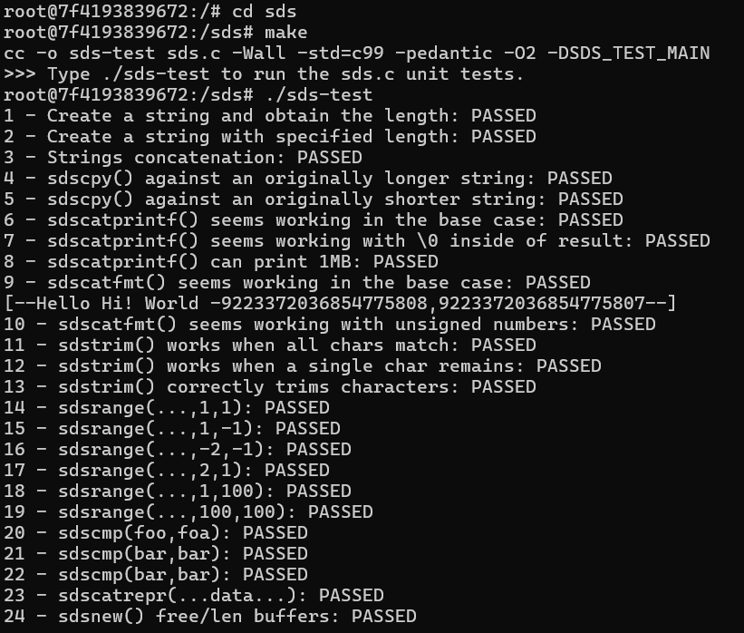
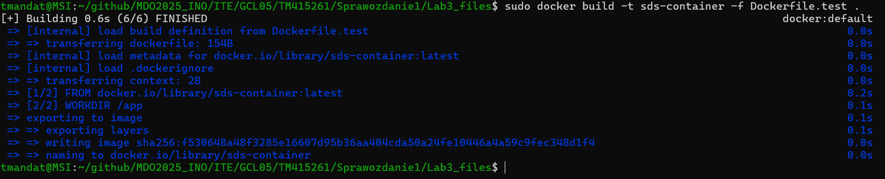

# Sprawozdanie 1
#### Tomasz Mandat ITE gr. 05

<br>

## Laboratorium nr 1

**1. Instalacja klienta Git i obługi kluczy SSH**

Instalację przeprowadziłem następującymi poleceniami:

```bash
sudo dnf install git

sudo dnf install openssh-clients openssh-server
```

Aby sprawdzić poprawność instalacji, sprawdziłem wersję Gita oraz OpenSSH


<br>

**2. Klonowanie repozytorium za pomocą HTTPS**


<br>

**3. Tworzenie kluczy SSH**

Wygenerowałem dwa klucze SSH (inne niż RSA), w tym jeden zabezpieczony hasłem

* Klucz nr 1


* Klucz nr 2


Następnie dodałem uruchomiłem proces agenta SSH i dodałem do niego klucz prywatny.


<br>

**4. Konfiguracja klucza SSH jako metody dostępu do GitHuba**

W tym celu skopiowałem klucz publiczny, wyświetlając go poleceniem:

```bash
cat key.pub
```

Następnie należało na GitHubie kliknąć w swój profil, a następnie przejść do **Settings > SSH and GPG keys > New SSH key** i dodać wcześniej skopiowany klucz SSH.


<br>

**5. Klonowanie repozytorium z wykorzystaniem protokołu SSH**


<br>

**6. Konfiguracja 2FA**

W celu skonfigurowania **2FA** należało na GitHubie kliknąć w swój profil, a następnie przejść do **Settings > Password and authentication** i dodać weryfikację logowania dwuetapową.


<br>

**7. Przełączenie na gałąź main, potem na gałąź swojej grupy**

Po przełączeniu się na gałąź main, a potem na gałąź mojej grupy, utworzyłem gałąź o nazwie "inicjały & nr indeksu" (w moim przypadku TM415261)


<br>

**8. Praca na nowej gałęzi**

* W katalogu właściwym dla grupy utworzyłem nowy katalog, także o nazwie "inicjały & nr indeksu" (TM415261)


* Utworzenie Git-hooka - jego zadanie to weryfikacja, że każdy mój commit message zaczyna się od "inicjały & nr indeksu"

&emsp;&emsp;&emsp;Treść Git-hooka:


* Dodanie skryptu do utworzonego wcześniej katalogu

&emsp;&emsp;&emsp;Skopiowałem go we właściwe miejsce, tak aby uruchamiał się za każdym razem, gdy robię commita


&emsp;&emsp;&emsp;Weryfikacja działania:


<br>

## Laboratorium nr 2

**1. Instalacja Dockera**

Instalacja odbyła się poleceniem:

```bash
sudo dnf install docker
```


<br>

**2. Rejestracja w DockerHub**


<br>

**3. Pobieranie obrazów (`hello-world, busy-box, ubuntu, mysql`)**
```bash
sudo docker pull hello-world

sudo docker pull busybox

sudo docker pull ubuntu

sudo docker pull mysql
```
<br>


<br>

**4. Uruchomienie kontenera z obrazu `busybox`**

Kontener uruchomiłem poleceniem:

```bash
sudo docker run -it busybox
```

Efekt uruchomienia kontenera oraz podłączenie się do kontenera interaktywnie i wywołanie numeru wersji:


<br>

**5. Uruchomienie "systemu w kontenerze"**

W moim przypadku był to kontener z obrazu `ubuntu`.

Uruchomienie odbyło sie poleceniem:

```bash
sudo docker run -it --name ubuntu-container ubuntu bash
```

* `PID1` w kontenerze i procesy dockera na hoście:


* Aktualizacja pakietów:


* Wyjście:


**6. Tworzenie własnego `Dockerfile`**

Na początku utworzyłem plik `Dockerfile`:

```bash
nano Dockerfile
```

Treść `Dockerfile`:


Powyższy `Dockerfile` jest odpowiedzialny za sklonowanie repozytorium.

Budowa obrazu na podstawie `Dockerfile`:


Weryfikacja, że obraz ma `git`-a:


Uruchomienie kontenera w trybie interaktywnym i weryfikacja sklonowania repozytorium:


<br>

**7. Przedstawienie uruchomionych kontenerów, a następnie ich czyszczenie**

Aby sprawdzić uruchomione kontenery, użyłem polecenia:

```bash
sudo docker ps -a
```


Czyszczenie kontenerów:

```bash
sudo docker container prune
```


Weryfikacja działania:


<br>

**8. Czyszczenie obrazów**

Wyczyszczenie obrazów wykonałem poleceniem:

```bash
sudo docker rmi -f $(sudo docker images -aq)
```


<br>

**9. Dodanie stworzonego pliku `Dockerfile` do folderu `Sprawozdanie1` w repozytorium**


<br>

## Laboratorium nr 3

Wybrane przeze mnie repozytorium to **sds (Simple Dynamic Strings)**.
* Dysponuje ono otwartą licencją
* Zawiera plik `Makefile`
* Zawiera zdefiniowane testy, jako "target" `Makefile`

Klonowanie repozytorium:
``` bash
git clone https://github.com/antirez/sds.git
```


Uruchomienie programu:


Program przeszedł pomyślnie wszystkie testy.


### Przeprowadzenie buildu w kontenerze

**1. Proces został przeprowadzony w kontenerze `ubuntu`**

* Pobranie i uruchomienie kontenera:


* Instalacja wymaganych zależności:


* Klonowanie repozytorium:


* Uruchomienie programu (wszystkie testy przebiegły pomyślnie):


<br>

**2. Pliki Dockerfile automatyzujące powyższe kroki**

Plik `Dockerfile` (build):


Plik `Dockerfile.test` (testy):


Budowanie obrazu na podstawie `Dockerfile`:


Budowanie obrazu na podstawie `Dockerfile.test`:


Uruchomienie testów:

Wszystkie testy zakończyły się powodzeniem.

<br>

### Docker Compose

Plik `docker-compose.yml`:


Konieczne było doinstalowanie potrzebnego pakietu:
``` bash
sudo yum install docker-compose
```


Efekt uruchomienia:


